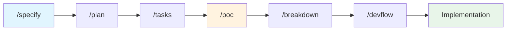

# Claude Code Development Workflow

A systematic approach to software development from specifications to implementation using Claude Code slash commands.

## 📋 Overview

This workflow provides a structured methodology for analyzing requirements, validating concepts, planning implementation, and managing development through a series of purpose-built slash commands.



## 🎯 Core Philosophy

- **Documentation-Driven**: All decisions tracked and justified
- **Research-Backed**: Web search for best practices and patterns
- **Iterative Validation**: POC before heavy investment
- **Minimal Complexity**: Focus on core value, exclude non-essentials
- **Actionable Output**: Every document ready for immediate use

## 📚 Command Reference

### 1️⃣ `/specify` - Requirements Analysis

**Purpose:** Transform documentation into structured specifications

**Inputs:**

- Any markdown/text files in `docs/` folder
- Supporting documentation and notes

**Outputs:**

- `docs/specs/<component>/spec.md` for each identified component

**What it does:**

- Discovers and analyzes all documentation
- Extracts functional and non-functional requirements
- Identifies system components and boundaries
- Creates structured specifications with:
  - Executive summary
  - Functional requirements (user stories, use cases)
  - Non-functional requirements (performance, security)
  - Acceptance criteria
  - Dependencies and assumptions

**When to use:**

- Project kickoff
- New feature analysis
- Requirement changes
- Documentation consolidation

**Example workflow:**

```bash
# Place docs in docs/ folder
docs/
  ├── product-requirements.md
  ├── user-research.txt
  └── technical-notes.md

# Run command
/specify

# Result
docs/specs/
  ├── authentication/spec.md
  ├── user-management/spec.md
  └── data-processing/spec.md
```

---

### 2️⃣ `/plan` - Technical Planning

**Purpose:** Create research-backed implementation plans

**Inputs:**

- `docs/specs/*/spec.md` files
- Supporting documentation

**Outputs:**

- `docs/specs/<component>/plan.md` for each component

**What it does:**

- Researches technology best practices via web search
- Recommends technology stack with rationale
- Provides 2-3 alternative approaches
- Designs system architecture with diagrams
- Defines:
  - Data models and API specifications
  - Security and performance strategies
  - Development environment setup
  - Risk assessment and mitigation
  - Phased implementation roadmap

**When to use:**

- After specifications complete
- Technology decision needed
- Architecture design phase
- Risk assessment required

**Key features:**

- Research citations for all recommendations
- Concrete metrics and SLOs
- Trade-off analysis
- Timeline with realistic estimates

---

### 3️⃣ `/tasks` - Task Breakdown

**Purpose:** Generate SMART, estimable task breakdowns

**Inputs:**

- `docs/specs/*/spec.md`
- `docs/specs/*/plan.md`

**Outputs:**

- `docs/specs/<component>/tasks.md` with detailed task lists

**What it does:**

- Creates actionable tasks following SMART criteria
- Estimates effort using story points/hours
- Maps task dependencies and critical path
- Assigns priorities (P0/P1/P2) and roles
- Defines:
  - Sprint structure and milestones
  - Testing tasks and quality gates
  - Risk mitigation strategies
  - Team composition needs
  - CSV export format for PM tools

**When to use:**

- Before development starts
- Sprint planning
- Resource allocation
- Timeline estimation

**Task format:**

```markdown
**[COMP-001] Setup Development Environment**
- Description: Configure local dev with Docker
- Acceptance: 
  - [ ] All devs can run app locally
  - [ ] CI pipeline validates setup
- Effort: 3 story points (2-3 days)
- Owner: DevOps
- Dependencies: None
- Priority: P0 (Blocker)
```

---

### 4️⃣ `/poc` - Proof of Concept

**Purpose:** Design minimal POC to validate core system innovation

**Inputs:**

- All documentation in `docs/`
- Interactive clarification questions

**Outputs:**

- `docs/poc/README.md` - Overview and setup
- `docs/poc/core-concept.md` - Concept definition
- `docs/poc/architecture.md` - Simplified architecture
- `docs/poc/implementation-guide.md` - Build guide

**What it does:**

- **Asks clarifying questions** about core concept
- Identifies differentiating innovation
- Designs minimal validation approach
- Excludes non-essential complexity:
  - ❌ Authentication/authorization
  - ❌ Production database
  - ❌ Scaling concerns
  - ❌ UI/UX (CLI only)
  - ❌ Comprehensive logging/metrics
- Creates 2-week implementation plan
- Defines clear success criteria

**When to use:**

- High-risk/novel concepts
- Before major investment
- Technical feasibility questions
- Algorithm validation needed

**Philosophy:**

- Prove ONE thing works
- Backend-focused
- Hardcode everything
- Local execution only
- Fast iteration (days, not weeks)

---

### 5️⃣ `/breakdown` - Technical Implementation Guide

**Purpose:** Create detailed technical breakdowns for developers

**Inputs:**

- All specs, plans, and tasks
- Component-specific focus (optional arguments)

**Outputs:**

- `docs/breakdown/<component>/breakdown.md` per component
- `docs/breakdown/README.md` index

**What it does:**

- Creates Mermaid architecture diagrams
- Defines API contracts and interfaces
- Specifies event schemas and data models
- Details testing strategies (unit, integration, e2e)
- Provides:
  - Technology stack with rationale
  - Design patterns to use
  - Configuration examples
  - Infrastructure requirements
  - Monitoring and alerting setup
  - Security implementation
  - Development workflow
  - Implementation checklist

**When to use:**

- Before coding begins
- New team member onboarding
- API contract definition
- Architecture reviews

**Key sections:**

```yaml
Quick Reference: Complexity, risk, dependencies
System Context: Integration points, data flow
Architecture Design: Component structure, modules
Interface Contracts: APIs, events, data models
Implementation Details: Stack, patterns, config
Testing Strategy: Unit/integration/e2e plans
Operational Concerns: Infra, monitoring, security
```

---

### 6️⃣ `/devflow` - System Roadmap

**Purpose:** Create unified cross-component development roadmap

**Inputs:**

- All component documentation
- Specs, plans, and tasks

**Outputs:**

- `docs/roadmap.md` - System-wide roadmap

**What it does:**

- Maps cross-component dependencies
- Identifies system-wide critical path
- Creates visual timeline
- Highlights resource conflicts
- Provides:
  - Executive summary
  - Phase breakdown with milestones
  - Integration timeline
  - Risk dashboard
  - Success metrics
  - Resource allocation

**When to use:**

- Program management
- Stakeholder communication
- Cross-team coordination
- Timeline planning

**Key sections:**

- Executive summary for leadership
- Visual timeline with phases
- Component roadmaps with links
- Dependency map
- Resource allocation table

---

### 7️⃣ `/commit` - Git Workflow Manager

**Purpose:** Organize changes into semantic commits with PR documentation

**Inputs:**

- Git working directory changes
- Staged/unstaged files

**Outputs:**

- Conventional commits
- `TEMP_DOCS/PR_MESSAGE.md` - Comprehensive PR description

**What it does:**

- Groups files by logical change type
- Creates conventional commit messages
- Pushes changes to remote
- Generates detailed PR description with:
  - Purpose and changes summary
  - Technical details
  - Testing checklist
  - Screenshots/demo section
  - Review notes

**When to use:**

- Ready to commit code changes
- Creating pull requests
- Maintaining clean git history

**Commit types:**

- `feat`: New feature
- `fix`: Bug fix
- `docs`: Documentation
- `refactor`: Code restructuring
- `test`: Testing updates
- `chore`: Maintenance

---

## 📊 Analysis & Assessment Tools

### 🔍 `/strategic-intelligence` - Comprehensive Strategic Assessment & Market Intelligence

**Purpose:** Gather strategic intelligence through comprehensive system assessment and market analysis to inform technical and business decisions

**Inputs:**

- All documentation in `docs/` folder
- System architecture and codebase
- Market domain information

**Outputs:**

- `docs/strategic-intelligence.md` - Comprehensive strategic intelligence report

**What it does:**

- **Strategic Assessment (Internal Focus):**
  - Evaluates current system capabilities against industry standards
  - Identifies gaps in development, security, operations
  - Assesses documentation and process maturity
  - Benchmarks organizational capabilities against best practices

- **Market Intelligence (External Focus):**
  - Analyzes market dynamics, size, growth trends, and segments
  - Conducts comprehensive competitive landscape analysis
  - Researches customer intelligence and pain points
  - Studies business models, pricing strategies, and market positioning
  - Identifies market opportunities, threats, and competitive dynamics

- **Strategic Integration:**
  - Integrates internal capabilities with external market dynamics
  - Prioritizes strategic initiatives by impact and opportunity
  - Balances capability building with market positioning
  - Creates strategic implementation roadmap
  - Provides strategic ROI projections and success metrics

**When to use:**

- Project kickoffs and strategic planning
- Quarterly business reviews
- Before major technology decisions
- Competitive positioning analysis
- Market entry or expansion planning
- Technical debt assessment
- Stakeholder reporting

**Key sections:**

```yaml
Executive Summary: Strategic position + market intelligence scores
Current State Analysis: Capability assessment + market position
Strategic Intelligence Analysis: Benchmarking + competitive intelligence
Strategic Analysis: Capability gaps + market opportunities
Strategic Recommendations: Phased strategic initiatives with ROI
Implementation Roadmap: Strategic timeline with success metrics
```

---

## 📁 Generated Folder Structure

```txt
docs/
├── specs/
│   ├── component-a/
│   │   ├── spec.md      # Requirements (/specify)
│   │   ├── plan.md      # Implementation plan (/plan)
│   │   └── tasks.md     # Task breakdown (/tasks)
│   └── component-b/
│       ├── spec.md
│       ├── plan.md
│       └── tasks.md
├── poc/
│   ├── README.md        # POC overview (/poc)
│   ├── core-concept.md  # Core concept definition
│   ├── architecture.md  # Simplified architecture
│   └── implementation-guide.md
├── breakdown/
│   ├── README.md        # Component index
│   ├── component-a/
│   │   └── breakdown.md # Technical details (/breakdown)
│   └── component-b/
│       └── breakdown.md
├── strategic-intelligence.md  # Strategic assessment & market intelligence (/strategic-intelligence)
└── roadmap.md           # System-wide roadmap (/devflow)

TEMP_DOCS/
└── PR_MESSAGE.md        # PR description (/commit)
```

## 🎯 Usage Patterns

### Pattern 1: Full Workflow (New Project)

**Scenario:** Starting a new project from scratch

```bash
# Step 1: Analyze requirements
/specify

# Step 2: Create technical plans
/plan

# Step 3: Break down into tasks
/tasks

# Step 4: Validate core concept
/poc

# Step 5: Detail implementation
/breakdown

# Step 6: Create system roadmap
/devflow

# Step 7: Start implementation
# ... development work ...

# Step 8: Commit changes
/commit
```

**Timeline:** Days 1-3 for documentation, then development

---

### Pattern 2: POC-First Approach

**Scenario:** High-risk project needing early validation

```bash
# Step 1: Quick requirements analysis
/specify

# Step 2: Immediate POC validation
/poc

# Step 3: If POC successful, full planning
/plan
/tasks
/breakdown
/devflow
```

**Timeline:** POC within 1 week, then full planning

---

### Pattern 3: Iterative Component Development

**Scenario:** Adding features to existing system

```bash
# Step 1: Specify new component
/specify

# Step 2: Plan integration
/plan

# Step 3: Create tasks
/tasks

# Step 4: Optional POC for risky features
/poc  # if needed

# Step 5: Implementation details
/breakdown

# Step 6: Update system roadmap
/devflow
```

**Timeline:** Per-component iteration cycle

---

### Pattern 4: Strategic Assessment

**Scenario:** Quarterly review or strategic planning

```bash
# Step 1: Strategic intelligence gathering
/strategic-intelligence  # Strategic assessment + market intelligence

# Step 2: Update plans based on strategic insights
/plan     # Update technical strategy
/tasks    # Adjust priorities and timeline
/devflow  # Update roadmap
```

**Timeline:** 1-2 days for comprehensive assessment

---

### Pattern 5: Documentation Update

**Scenario:** Requirements or technology changed

```bash
# Step 1: Update affected components
/specify  # Re-run for updated requirements
/plan     # Re-run for technology changes
/tasks    # Re-run for timeline updates

# Step 2: Update system view
/devflow
```

**Timeline:** Few hours for documentation sync

---

## 💡 Best Practices

### Command Execution Order

1. **Always start with `/specify`**
   - Foundation for all subsequent work
   - Ensures shared understanding
   - Creates component boundaries

2. **Consider `/poc` early**
   - Run after `/specify` or `/plan`
   - Especially for novel/risky features
   - Fail fast on wrong assumptions

3. **Use `/breakdown` before coding**
   - Developers' implementation guide
   - Prevents rework and confusion
   - Ensures consistency

4. **Keep `/devflow` updated**
   - Re-run after major changes
   - Use for stakeholder updates
   - Track progress weekly

### When to Re-run Commands

| Command | Re-run When... |
|---------|---------------|
| `/specify` | Requirements change, new docs added |
| `/plan` | Technology choices need revision, architecture changes |
| `/tasks` | Timeline shifts, team changes, priorities update |
| `/poc` | Core assumptions need validation, pivot required |
| `/breakdown` | Implementation approach changes, new patterns adopted |
| `/devflow` | Component updates, integration changes, milestone reviews |
| `/strategic-intelligence` | Quarterly reviews, competitive changes, strategic planning |
| `/commit` | Code ready for PR, feature complete |

### Quality Gates

**After `/specify`:**

- [ ] All components identified
- [ ] Requirements are SMART
- [ ] Acceptance criteria defined
- [ ] Stakeholders aligned

**After `/plan`:**

- [ ] Technology choices justified
- [ ] Risks identified with mitigation
- [ ] Timeline realistic
- [ ] Architecture diagrams clear

**After `/tasks`:**

- [ ] All tasks have estimates
- [ ] Dependencies mapped
- [ ] Resources allocated
- [ ] Sprint structure defined

**After `/poc`:**

- [ ] Core concept validated
- [ ] Technical feasibility proven
- [ ] Performance acceptable
- [ ] Ready for full implementation

**After `/breakdown`:**

- [ ] API contracts defined
- [ ] Testing strategy complete
- [ ] Security considered
- [ ] Monitoring planned

**After `/devflow`:**

- [ ] Critical path identified
- [ ] Resource conflicts resolved
- [ ] Timeline realistic
- [ ] Stakeholders informed

**After `/strategic-intelligence`:**

- [ ] Strategic capabilities and market position assessed
- [ ] Competitive positioning and market intelligence gathered
- [ ] Strategic ROI projections realistic
- [ ] Strategic recommendations prioritized
- [ ] Strategic success metrics defined

---

## 🚀 Quick Start Guide

### First Time Setup

1. **Organize your documentation:**

```bash
mkdir -p docs
# Add your requirements, notes, research to docs/
```

2. **Run the workflow:**

```bash
/specify    # Generate specifications
/poc        # Validate core concept (optional but recommended)
/plan       # Create implementation plans
/tasks      # Break down into actionable tasks
/breakdown  # Detail technical implementation
/devflow    # Create system roadmap
```

3. **Start development:**

- Use `docs/breakdown/` as implementation guide
- Track tasks from `docs/specs/*/tasks.md`
- Reference `docs/roadmap.md` for timeline

4. **Commit your work:**

```bash
/commit     # Create semantic commits and PR
```

### Quick Commands

```bash
# Full workflow in sequence
/specify && /poc && /plan && /tasks && /breakdown && /devflow

# Strategic intelligence workflow
/strategic-intelligence && /plan && /tasks && /devflow

# Update all documentation
/specify && /plan && /tasks && /devflow

# Just planning and tasks
/plan && /tasks

# Just system overview
/devflow

# Quarterly strategic review
/strategic-intelligence
```

---

## ❓ Decision Guide

### Should I run `/poc`?

**Yes, if:**

- ✅ Novel or unproven technology
- ✅ Complex algorithm needs validation
- ✅ High technical risk
- ✅ Uncertain about feasibility
- ✅ Major architectural decision

**No, if:**

- ❌ Well-understood CRUD application
- ❌ Similar to previous projects
- ❌ Low technical risk
- ❌ Straightforward implementation

### When to use `/breakdown`?

**Essential for:**

- Complex distributed systems
- Multiple developers working in parallel
- API-first development
- Microservices architecture
- Third-party integrations

**Optional for:**

- Simple CRUD applications
- Solo developer projects
- Well-documented frameworks
- Prototypes and MVPs

### How often to run `/devflow`?

**Frequency:**

- ✅ Weekly for active projects
- ✅ After component completion
- ✅ Before stakeholder meetings
- ✅ When timeline changes
- ✅ During sprint planning

**Skip if:**

- ❌ Solo project with clear scope
- ❌ No external stakeholders
- ❌ Single component system

### When to run `/strategic-intelligence`?

**Essential for:**

- ✅ Project kickoffs and strategic planning
- ✅ Quarterly strategic reviews
- ✅ Before major strategic decisions
- ✅ Competitive threat analysis
- ✅ Market entry or expansion
- ✅ Strategic capability assessment
- ✅ Executive and stakeholder reporting

**Frequency:**

- ✅ Quarterly for strategic projects
- ✅ Before major releases or initiatives
- ✅ When competitive landscape changes
- ✅ During annual strategic planning cycles
- ✅ When market dynamics shift

**Skip if:**

- ❌ Early prototype stage
- ❌ Well-understood market with stable competition
- ❌ Internal tools with no strategic market considerations
- ❌ Purely tactical implementation tasks

---

## 📊 Success Metrics

Track these metrics to measure workflow effectiveness:

### Process Metrics

- **Documentation Time:** Specify → Implementation start
- **POC Success Rate:** % of POCs that validate successfully
- **Estimation Accuracy:** Planned vs actual timeline
- **Rework Reduction:** Less refactoring needed

### Quality Metrics

- **Requirement Clarity:** Fewer requirement changes
- **Technical Debt:** Lower complexity over time
- **Test Coverage:** Higher due to planned testing
- **Bug Rate:** Fewer production issues

### Team Metrics

- **Onboarding Time:** New developers productive faster
- **Communication:** Fewer clarification meetings
- **Alignment:** Team understands system better
- **Velocity:** More predictable sprint outcomes

---

## 🔧 Troubleshooting

### Common Issues

**Issue:** `/specify` creates too many components  
**Solution:** Review and merge related components, re-run with clearer component boundaries

**Issue:** `/plan` recommendations don't match constraints  
**Solution:** Add constraint documentation to `docs/`, re-run command

**Issue:** `/tasks` estimates seem off  
**Solution:** Review velocity data, adjust based on team capacity, re-estimate

**Issue:** `/poc` asks unclear questions  
**Solution:** Provide more context in initial documentation, be specific about core concept

**Issue:** `/breakdown` too detailed for simple component  
**Solution:** Use for complex components only, simpler components can skip this

**Issue:** `/devflow` shows unrealistic timeline  
**Solution:** Review individual component plans, adjust scope or resources

**Issue:** `/commit` groups changes incorrectly  
**Solution:** Stage files manually before running, provide clearer change context

---

## 🔗 Related Resources

### Documentation Standards

- [Conventional Commits](https://www.conventionalcommits.org/)
- [SMART Criteria](https://en.wikipedia.org/wiki/SMART_criteria)
- [C4 Model](https://c4model.com/) for architecture diagrams

### Project Management

- [Agile Principles](https://agilemanifesto.org/)
- [Scrum Guide](https://scrumguides.org/)
- [Kanban Method](https://www.atlassian.com/agile/kanban)

### Technical Practices

- [12 Factor App](https://12factor.net/)
- [Microservices Patterns](https://microservices.io/patterns/)
- [API Design Guidelines](https://github.com/microsoft/api-guidelines)

### POC Best Practices

- [Proof of Concept Guide](https://www.atlassian.com/agile/project-management/poc)
- [Technical Spike](https://www.scaledagileframework.com/spikes/)

---

## 📝 Contributing

To improve this workflow:

1. **Document pain points:** What doesn't work well?
2. **Suggest enhancements:** What's missing?
3. **Share examples:** What worked great?
4. **Iterate commands:** Improve based on feedback

---

## 📜 License

These workflow commands and documentation are provided as-is for use in software development projects.

---

## 🙏 Acknowledgments

Designed to be compatible with various AI coding agents that utilize slash commands.

Inspired by industry best practices in:

- Software specification
- Technical planning
- Agile development
- DevOps practices
- Documentation standards
