# Command Reference & Workflow Guide

Complete reference for all sage-dev commands with workflow visualizations and usage patterns.

**Version:** 2.6
**Last Updated:** 2025-11-16

---

## What's New in v2.6

- **MCP Server Integration**: Pattern extraction, research caching, and progressive loading
- **Semi-Auto Mode**: Component-level confirmations for 3-5× speedup
- **Token Optimization**: 60-80% reduction through context-aware pattern loading
- **Resume Support**: Batch validation and session recovery
- **Velocity Tracking**: Automated estimation with confidence-driven buffers

---

## Table of Contents

- [Cross-Platform Skills Alternative](#cross-platform-skills-alternative)
- [Part 1: Command Reference](#part-1-command-reference)
- [Part 2: Workflow Visualization](#part-2-workflow-visualization)
- [Part 3: Integration & Patterns](#part-3-integration--patterns)

---

# Cross-Platform Skills Alternative

## 🎯 Universal Skills - Use Sage-Dev Anywhere

Before diving into slash commands, know that Sage-Dev is now available as **portable Claude Skills** that work across **all LLM platforms** - Claude, ChatGPT, Gemini, and more.

### Skills vs Slash Commands

| Aspect | **Universal Skills** | **Slash Commands** |
|--------|---------------------|-------------------|
| **Platform Support** | Claude, ChatGPT, Gemini, all LLMs | Claude Code CLI only |
| **Activation** | Auto-discovery (mention keywords) | Manual invocation (`/sage.specify`) |
| **Learning Curve** | Zero - natural language | Must memorize 37 commands |
| **Use Case** | Domain expertise, quality enforcement | Workflow orchestration, automation |
| **Installation** | Upload ZIP files (2 minutes) | Run `./sage-setup.sh` |
| **Portability** | Works everywhere | Claude Code only |

### Available Skills (8 Total)

| Skill | Size | Auto-Activates When You Mention... |
|-------|------|-----------------------------------|
| **Sage Python Quality Suite** | 16 KB | `python`, `typing`, `pytest`, `*.py` |
| **Sage Security Guard** | 13 KB | `security`, `secrets`, `api keys` |
| **Sage Research Intelligence** | 13 KB | `research`, `market analysis` |
| **Sage Specification Engine** | 69 KB | `specification`, `requirements` |
| **Sage Implementation Planner** | 8 KB | `plan`, `planning`, `tasks` |
| **Sage Documentation Generator** | 14 KB | `documentation`, `SOP`, `docstring` |
| **Sage Context Optimizer** | 5 KB | `context`, `compression` |
| **Sage Ticket Manager** | 24 KB | `ticket`, `validation`, `sync` |

### Quick Install

```bash
# Generate Skills
./sage-skillify.sh

# For Claude: Upload skills/*.zip to capabilities panel
# For ChatGPT: Upload skills/*.zip per conversation
# For Gemini: Upload skills/*.zip per conversation
```

### When to Use Skills vs Slash Commands

**Use Skills when:**
- Working in ChatGPT, Gemini, or other LLMs
- Want automatic expertise without memorizing commands
- Need domain-specific guidance (Python quality, security, research)
- Prefer natural language over command syntax

**Use Slash Commands when:**
- Working in Claude Code CLI
- Need explicit workflow orchestration (`/sage.stream`, `/sage.implement`)
- Want ticket automation and batch processing
- Require git integration and CI/CD

### Skills Equivalent Commands

Skills consolidate multiple slash commands:

| Skill | Equivalent Slash Commands |
|-------|--------------------------|
| **Sage Research Intelligence** | `/sage.intel`, `/sage.enhance` |
| **Sage Specification Engine** | `/sage.specify`, `/sage.breakdown`, `/sage.blueprint` |
| **Sage Implementation Planner** | `/sage.plan`, `/sage.tasks` |
| **Sage Documentation Generator** | `/sage.update-doc`, `/sage.gen-sop`, `/sage.docify`, `/sage.save-plan` |
| **Sage Context Optimizer** | `/sage.compact-context`, `/sage.offload-research` |
| **Sage Ticket Manager** | `/sage.validate`, `/sage.sync`, `/sage.migrate`, `/sage.estimate`, `/sage.repair` |

**For detailed Skills installation and usage, see [SKILLS_GUIDE.md](../docs/SKILLS_GUIDE.md)**

---

# Part 1: Command Reference

Quick reference for command syntax, parameters, and usage.

## Initialization (New in v2.5)

### `/sage.init`

**Purpose:** One-time repository initialization with codebase analysis and pattern extraction

**Prerequisites:**

- None (run once per repository)

**Usage:**

```bash
/sage.init
```

**Outputs:**

- `.sage/agent/examples/<language>/` - Extracted code patterns by category
- `.sage/agent/system/architecture.md` - Baseline architecture documentation
- `.sage/agent/system/tech-stack.md` - Technology stack analysis
- `.sage/agent/system/patterns.md` - Code pattern documentation
- `docs/features/` - Directory for feature requests
- `docs/research/` - Directory for research outputs
- `.sage/config.json` - Updated with initialization status

**When to Use:**

- First time setting up sage-dev in a repository
- Before using context engineering workflow
- One-time setup for pattern extraction

**⚠️ Note:** Automatically recommends `/sage.workflow` as next step

---

### `/sage.init-feature`

**Purpose:** Create structured feature request documents

**Prerequisites:**

- None (can run without `/sage.init`, but recommended after)

**Usage:**

```bash
/sage.init-feature user-authentication
/sage.init-feature <feature-name>  # Must be kebab-case
```

**Outputs:**

- `docs/features/<feature-name>.md` - Structured feature request with:
  - Feature Description
  - User Stories
  - Technical Considerations
  - Success Criteria
  - Repository Pattern References

**When to Use:**

- Starting a new feature
- Before research phase (`/sage.intel`)
- Creating feature documentation for context engineering workflow

**⚠️ Note:** Automatically recommends `/sage.intel` as next step

---

## Workflow Selection

### `/sage.workflow`

**Purpose:** Choose between Traditional, Ticket-Based, or Context Engineering workflows

**Prerequisites:**

- None (recommended after `/sage.init` if using context engineering)

**Usage:**

```bash
/sage.workflow
```

**Outputs:**

- Creates `.sage/sage.workflow-mode` file (TRADITIONAL or TICKET_BASED)
- Recommendation with rationale

**When to Use:**

- After `/sage.init` for workflow selection
- When switching workflow approaches
- When unsure which workflow to use

---

## Research & Enhancement

### `/sage.enhance`

**Purpose:** Research-driven system enhancement analysis

**Prerequisites:**

- Existing project with README or docs

**Usage:**

```bash
/sage.enhance
```

**Outputs:**

- `.docs/ENHANCEMENT_ANALYSIS.md`
- Competitive analysis, feature gaps, improvement opportunities

**When to Use:**

- Planning new features
- Competitive positioning
- Strategic planning phase

---

### `/sage.intel`

**Purpose:** Comprehensive system assessment and market analysis

**Prerequisites:**

- Existing project documentation

**Usage:**

```bash
/sage.intel
```

**Outputs:**

- `.docs/STRATEGIC_INTELLIGENCE.md`
- Technical assessment, market analysis, strategic recommendations

**When to Use:**

- Major project decisions
- Technical debt assessment
- Strategic roadmap planning

---

## Planning & Specification

### `/sage.specify`

**Purpose:** Generate structured specifications from docs folder

**Prerequisites:**

- `docs/` folder with component documentation

**Usage:**

```bash
/sage.specify
```

**Outputs:**

- `docs/specs/<component>/spec.md` files
- Structured specifications for each component

**When to Use:**

- Converting documentation to specifications
- Defining component requirements
- Before implementation planning

---

### `/sage.plan`

**Purpose:** Generate implementation plans from specifications

**Prerequisites:**

- `docs/specs/*/spec.md` files exist
- Specifications completed

**Usage:**

```bash
/sage.plan
```

**Outputs:**

- `docs/specs/<component>/sage.implementation_plan.md` files
- Research-backed implementation strategies

**When to Use:**

- After specifications complete
- Before breaking down into tasks
- Planning implementation approach

---

### `/sage.tasks`

**Purpose:** Generate SMART task breakdowns from plans

**Prerequisites:**

- Implementation plans exist
- Specifications exist

**Usage:**

```bash
/sage.tasks
```

**Outputs:**

- `docs/specs/<component>/sage.tasks.md` files
- Granular, actionable task lists

**When to Use:**

- After implementation plans complete
- Before starting implementation
- Creating sprint/iteration plans

---

### `/sage.breakdown`

**Purpose:** Generate technical breakdowns with architecture diagrams

**Prerequisites:**

- Component specifications exist

**Usage:**

```bash
/sage.breakdown                    # All components
/sage.breakdown component1         # Specific component
/sage.breakdown comp1 comp2        # Multiple components
```

**Outputs:**

- `docs/specs/<component>/sage.breakdown.md` files
- Architecture diagrams, interfaces, testing strategies

**When to Use:**

- Planning complex components
- Defining system architecture
- Technical design reviews

---

### `/sage.poc`

**Purpose:** Generate minimal POC documentation for quick validation

**Prerequisites:**

- Concept or hypothesis to validate

**Usage:**

```bash
/sage.poc
```

**Outputs:**

- `.docs/POC_<concept>.md`
- Minimal validation plan

**When to Use:**

- Quick concept validation
- Throwaway prototypes
- Risk reduction experiments

---

## Workflow Management

### `/sage.progress`

**Purpose:** Analyze project progress across all phases

**Prerequisites:**

- Existing project with documentation

**Usage:**

```bash
/sage.progress
```

**Outputs:**

- `PROGRESS_REPORT.md`
- Completion metrics, phase status, blockers

**When to Use:**

- After `/sage.implement` iterations
- Before `/sage.commit`
- Status reporting
- Sprint reviews

---

## Ticket-Based Workflow

### `/sage.migrate`

**Purpose:** Convert Traditional workflow to Ticket-Based

**Prerequisites:**

- Traditional workflow project
- `docs/specs/*/sage.tasks.md` files exist

**Usage:**

```bash
/sage.migrate
```

**Outputs:**

- `.sage/tickets/index.json`
- `.sage/tickets/TICKET-*.md` files
- `.sage/sage.workflow-mode` set to TICKET_BASED

**When to Use:**

- Switching from Traditional to Ticket-Based workflow
- Automating task tracking
- Enabling `/sage.stream`

**⚠️ Checkpoint Created:** Yes (use `/sage.rollback` if migration fails)

---

### `/sage.sync`

**Purpose:** Sync ticket system with GitHub issues

**Prerequisites:**

- Ticket-Based workflow mode
- GitHub repository configured
- `.sage/tickets/` directory exists

**Usage:**

```bash
/sage.sync
```

**Outputs:**

- Updated `.sage/tickets/index.json`
- GitHub issues created/updated
- Bidirectional sync

**When to Use:**

- After ticket completion
- Syncing with team
- Before sprint planning

---

### `/sage.implement`

**Purpose:** Implement a single ticket with isolated context

**Prerequisites:**

- Ticket-Based workflow mode
- Ticket exists in .sage/tickets/index.json
- Ticket status = UNPROCESSED

**Usage:**

```bash
/sage.implement TICKET-001
```

**Outputs:**

- Code implementation
- Tests created and run
- Ticket marked COMPLETED or DEFERRED
- Updated `.sage/tickets/index.json`

**When to Use:**

- Manual ticket implementation
- Single-ticket focus
- Before automation via `/sage.stream`

**⚠️ Checkpoint Created:** Yes (use `/sage.rollback` if implementation fails)

---

### `/sage.stream`

**Purpose:** Automated cycle processing unprocessed tickets

**Prerequisites:**

- Ticket-Based workflow mode
- Unprocessed tickets exist
- Clean git state

**Execution Modes:**

```bash
/sage.stream                              # Interactive mode (default, sequential)
/sage.stream --interactive                # Explicit interactive (sequential)
/sage.stream --semi-auto                  # Semi-automated (component-level automation)
/sage.stream --component-auto             # Alias for --semi-auto
/sage.stream --auto                       # Fully automated (CI/CD, sequential)
/sage.stream --auto --parallel=3          # Fully automated with 3 parallel workers
/sage.stream --auto --parallel=auto       # Fully automated with auto-detected workers
/sage.stream --dry-run                    # Preview only
```

**Semi-Auto Mode:**

- Component-level automation with batch processing
- Groups tickets by prefix (AUTH-*, UI-*, API-*)
- Processes all tickets within a component automatically
- Pauses between components for review
- **Performance**: ~3-5× faster than interactive
- **Confirmation Points**: Component start, component push, component continue
- **Best for**: Organized ticket queues with clear component boundaries
- **Resume support**: Preserves batches on pause

**Parallel Mode:**

- Only available with `--auto` mode
- Processes multiple independent tickets concurrently
- Auto-detects optimal worker count (CPU/2, capped 1-8) with `--parallel=auto`
- Specify exact worker count with `--parallel=N` (e.g., `--parallel=3`)
- Analyzes dependencies to batch independent tickets
- Serializes commits to avoid conflicts
- **Performance**: ~2-3× faster for large ticket queues
- **Token usage**: N× higher (concurrent API calls)
- **Best for**: 20+ independent tickets

**Interactive Mode Confirmation Points:**

1. Start cycle confirmation
2. Before each ticket (yes/no/skip)
3. After implementation (yes/no/defer)
4. Before commit (optional diff review)
5. Before push to GitHub
6. Continue to next ticket (yes/no/pause)

**Semi-Auto Mode Confirmation Points:**

1. Start component (yes/no/skip) - once per component
2. Push component changes (yes/no/later) - once per component
3. Continue to next component (yes/continue/pause) - between components

**Outputs:**

- All tickets processed
- Code implemented and tested
- Commits created
- Changes pushed to GitHub (if confirmed)
- Updated `.sage/tickets/index.json`

**When to Use:**

- Batch ticket processing
- Automated development cycles
- CI/CD integration (--auto mode)

**⚠️ Checkpoint Created:** Yes (use `/sage.rollback` if cycle fails)

---

### `/sage.estimate`

**Purpose:** Add time estimates and calculate velocity metrics

**Prerequisites:**

- Ticket-Based workflow mode
- Ticket system exists (`.sage/tickets/index.json`)

**Usage:**

```bash
/sage.estimate
```

**Outputs:**

- Enhanced `.sage/tickets/index.json` with:
  - `estimated_hours` for all tickets
  - `created` and `updated` timestamps
  - `state_history` array tracking state transitions
- `reports/estimation-report.md` (detailed analysis)
- `.sage/velocity-metrics.json` (velocity analytics)
- `.sage/burndown-data.json` (burndown chart data)

**Estimation Methodology:**

- **Base Estimates:** Epic (40h), Story (16h), Task (4h), Subtask (2h)
- **Priority Multipliers:** P0 (1.5x), P1 (1.2x), P2 (1.0x), P3 (0.8x), P4 (0.5x)
- **Velocity Tracking:** Uses historical data from `.sage/sage.stream-velocity.log`

**When to Use:**

- Before sprint planning
- After `/sage.stream` cycles (to update projections)
- When estimating project completion date
- For burndown chart visualization

**Reports Generated:**

- Project overview (tickets, completion %, estimated work)
- Velocity metrics (avg time/ticket, tickets/day)
- Timeline projections (working days, calendar days, ETA)
- Ticket breakdown by type

---

## Safety & Recovery

### `/sage.rollback`

**Purpose:** Restore system state after failed operations

**Prerequisites:**

- Checkpoint exists (`.sage/checkpoint.json`)
- Created by destructive command

**Rollback Modes:**

```bash
/sage.rollback                     # Interactive with confirmation
/sage.rollback --force             # Skip confirmation
/sage.rollback --tickets-only      # Restore only ticket system
/sage.rollback --git-only          # Restore only git state
```

**Restores:**

- Git working directory (via stash)
- `.sage/tickets/index.json`
- Ticket markdown files
- Task progress files
- `.sage/sage.workflow-mode`

**When to Use:**

- After `/sage.stream` failure
- After `/sage.implement` error
- After `/sage.migrate` failure
- Recovering from corrupted state

**⚠️ Archives Used Checkpoint:** Yes (check `.sage/checkpoints-archive/`)

---

## Context Engineering

### `/sage.update-doc`

**Purpose:** Create or update agent-readable documentation

**Prerequisites:**

- `.sage/agent/` directory structure (auto-initialized)

**Usage:**

```bash
/sage.update-doc task "Feature Name"
/sage.update-doc system "Architecture"
/sage.update-doc sop "Deployment Process"
```

**Outputs:**

- `.sage/agent/sage.tasks/<feature-name>.md`
- `.sage/agent/system/<component-name>.md`
- `.sage/agent/sops/<procedure-name>.md`
- Auto-updated `.sage/agent/README.md` index

**When to Use:**

- After implementing a feature
- Documenting system architecture
- Creating Standard Operating Procedures

---

### `/sage.docify`

**Purpose:** Generate component documentation from source code

**Prerequisites:**

- Source code files or directories to document

**Usage:**

```bash
/sage.docify src/auth/
/sage.docify commands/sage.stream.md
```

**Outputs:**

- `.sage/agent/system/<component-name>.md`
- Auto-updated index

**When to Use:**

- Documenting code components
- Creating system documentation
- Architecture analysis

---

### `/sage.gen-sop`

**Purpose:** Generate Standard Operating Procedures

**Prerequisites:**

- None (works with or without context)

**Usage:**

```bash
/sage.gen-sop "Deployment Process"              # From template
/sage.gen-sop "Fixing Test Failures" --from-context  # Extract from conversation
```

**Outputs:**

- `.sage/agent/sops/<procedure-name>.md`
- Auto-updated index

**When to Use:**

- After error correction workflows
- Documenting recurring tasks
- Capturing tribal knowledge

---

### `/sage.save-plan`

**Purpose:** Save implementation plans from conversation

**Prerequisites:**

- Active planning discussion in conversation

**Usage:**

```bash
/sage.save-plan "Parallel Execution Feature"
```

**Outputs:**

- `.sage/agent/sage.tasks/<feature-name>-plan.md`
- Auto-updated index

**When to Use:**

- After planning discussions
- Preserving implementation decisions
- Before starting implementation

---

### `/update-index`

**Purpose:** Regenerate `.sage/agent/README.md` index

**Prerequisites:**

- `.sage/agent/` directory with documentation files

**Usage:**

```bash
/update-index
```

**Outputs:**

- Updated `.sage/agent/README.md` with:
  - Recently updated files (last 10)
  - Categorized links (tasks, system, SOPs)
  - Navigation structure

**When to Use:**

- Auto-triggered after doc commands
- Manual refresh of index
- Verifying documentation coverage

---

### `/sage.compact-context`

**Purpose:** Compress conversation state to reduce token usage

**Prerequisites:**

- Active conversation with context to compress

**Usage:**

```bash
/sage.compact-context              # Normal compression
/sage.compact-context --aggressive # Aggressive compression (may lose detail)
```

**Outputs:**

- Compressed conversation summary
- 30%+ token reduction
- Preserved critical context

**When to Use:**

- Long conversations
- Before major operations
- Context budget management

---

### `/sage.offload-research`

**Purpose:** Delegate extended research to sub-agent

**Prerequisites:**

- Research topic or question

**Usage:**

```bash
/sage.offload-research "Best practices for caching"
/sage.offload-research "Performance optimization" .sage/agent/research/perf.md
```

**Outputs:**

- `.sage/agent/research/<topic>.md` (or specified file)
- Research summary with findings
- Main conversation preserved

**When to Use:**

- Extended research tasks
- Background investigation
- Preserving main conversation focus

---

## Delivery

### `/sage.commit`

**Purpose:** Create semantic commits and push changes

**Prerequisites:**

- Clean implementation (tests pass)
- Changes staged or unstaged

**Usage:**

```bash
/sage.commit
```

**Outputs:**

- Semantic commit created
- Changes pushed to remote
- PR description generated (if new branch)

**When to Use:**

- After implementation complete
- After `/sage.progress` check
- Delivering work

**⚠️ Git Operations:**

- Creates commits
- Pushes to remote
- May create pull requests

---

## Command Flags Summary

| Command | Flags | Default |
|---------|-------|---------|
| `/sage.stream` | `--interactive`, `--semi-auto`, `--auto`, `--dry-run`, `--parallel=N\|auto` | `--interactive` (sequential) |
| `/sage.rollback` | `--force`, `--tickets-only`, `--git-only` | Interactive |
| `/sage.breakdown` | `[component-names...]` | All components |
| `/sage.compact-context` | `--aggressive` | Normal mode |
| `/sage.gen-sop` | `--from-context` | Template mode |

**Note:** `--parallel` requires `--auto` mode. Usage: `/sage.stream --auto --parallel=3` or `/sage.stream --auto --parallel=auto`

---

## Workflow Mode Requirements

| Command | Traditional | Ticket-Based |
|---------|-------------|--------------|
| `/sage.init` | ✅ | ✅ |
| `/sage.init-feature` | ✅ | ✅ |
| `/sage.workflow` | ✅ | ✅ |
| `/sage.enhance` | ✅ | ✅ |
| `/sage.intel` | ✅ | ✅ |
| `/sage.specify` | ✅ | ⚠️ Optional |
| `/sage.plan` | ✅ | ⚠️ Optional |
| `/sage.tasks` | ✅ | ⚠️ Optional |
| `/sage.breakdown` | ✅ | ⚠️ Optional |
| `/sage.poc` | ✅ | ✅ |
| `/sage.progress` | ✅ | ✅ |
| `/sage.migrate` | ✅ Required | ❌ N/A |
| `/sage.implement` | ❌ N/A | ✅ Required |
| `/sage.stream` | ❌ N/A | ✅ Required |
| `/sage.estimate` | ❌ N/A | ✅ Required |
| `/sage.sync` | ❌ N/A | ✅ Required |
| `/sage.rollback` | ✅ | ✅ |
| `/sage.commit` | ✅ | ✅ |
| `/sage.update-doc` | ✅ | ✅ |
| `/sage.docify` | ✅ | ✅ |
| `/sage.gen-sop` | ✅ | ✅ |
| `/sage.save-plan` | ✅ | ✅ |
| `/update-index` | ✅ | ✅ |
| `/sage.compact-context` | ✅ | ✅ |
| `/sage.offload-research` | ✅ | ✅ |

**Legend:**

- ✅ Supported
- ⚠️ Optional (workflow-agnostic)
- ❌ Not applicable
- Required: Validates workflow mode before execution

---

## Safety Features

### Checkpoint-Protected Commands

These commands create checkpoints before destructive operations:

- `/sage.stream` - Before cycle start
- `/sage.implement` - Before ticket implementation
- `/sage.migrate` - Before migration

**Rollback available:** Run `/sage.rollback` if operation fails

### Confirmation-Protected Commands

These commands require confirmation in interactive mode:

- `/sage.stream` - 6 confirmation points
- `/sage.commit` - Commit and push confirmations
- `/sage.rollback` - Restore confirmation

---

## File Locations

### System Files

- `.sage/sage.workflow-mode` - Current workflow mode (TRADITIONAL or TICKET_BASED)
- `.sage/checkpoint.json` - Active checkpoint metadata
- `.sage/checkpoint-*` - Checkpoint backup files
- `.sage/checkpoints-archive/` - Archived checkpoints
- `.sage/sage.rollback.log` - Rollback event log
- `.sage/sage.stream-velocity.log` - Velocity tracking data
- `.sage/velocity-metrics.json` - Calculated velocity metrics
- `.sage/burndown-data.json` - Burndown chart data
- `.sage/batches/` - Component batch files (semi-auto mode)
- `.sage/agent/` - Agent documentation directory
- `.sage/agent/README.md` - Documentation index

### Documentation

- `docs/` - Component documentation
- `docs/specs/` - Component specifications
- `docs/specs/*/spec.md` - Specification files
- `docs/specs/*/sage.implementation_plan.md` - Implementation plans
- `docs/specs/*/sage.tasks.md` - Task breakdowns
- `docs/specs/*/sage.breakdown.md` - Technical breakdowns

### Tickets

- `.sage/tickets/index.json` - Ticket system index
- `.sage/tickets/TICKET-*.md` - Individual ticket files

### Reports

- `.docs/` - Developer-local analysis and reports
- `PROGRESS_REPORT.md` - Generated by `/sage.progress`
- `reports/estimation-report.md` - Generated by `/sage.estimate`

---

## Quick Decision Guide

**Need to choose workflow?**
→ `/sage.workflow`

**Starting new feature?**
→ Traditional: `/sage.specify` → `/sage.plan` → `/sage.tasks`
→ Ticket-Based: `/sage.migrate` → `/sage.estimate` → `/sage.stream`

**Want automation?**
→ Switch to Ticket-Based with `/sage.migrate`
→ Use `/sage.stream --auto` for CI/CD

**Need sprint planning?**
→ `/sage.estimate` for velocity and ETA

**Command failed?**
→ `/sage.rollback` to restore state

**Need status update?**
→ `/sage.progress`

**Ready to deliver?**
→ `/sage.progress` → `/sage.commit`

**Need competitive analysis?**
→ `/sage.enhance` or `/sage.intel`

---

## Error Handling

### Workflow Mode Mismatch

```plaintext
ERROR: /sage.implement requires TICKET_BASED workflow mode
Current mode: TRADITIONAL

To use ticket-based implementation:
  1. Run /sage.migrate to convert to ticket system
  2. Or run /sage.workflow to reconfigure
```

**Solution:** Run `/sage.migrate` or `/sage.workflow`

### Missing Prerequisites

```plaintext
ERROR: No tasks.md files found
Cannot migrate to ticket system without tasks

Next steps:
  1. Run /sage.specify to generate specifications
  2. Run /sage.plan to create implementation plans
  3. Run /sage.tasks to generate task breakdowns
  4. Retry /sage.migrate
```

**Solution:** Follow prerequisite command chain

### Checkpoint Not Found

```plaintext
ERROR: No checkpoint found
Nothing to rollback
```

**Solution:** No rollback needed, or checkpoint already used

---

## Performance Tips

1. **Use `/sage.stream --dry-run`** to preview before automation
2. **Create checkpoints manually** before risky operations
3. **Run `/sage.progress`** frequently to track completion
4. **Use `/sage.sync`** to keep team in sync
5. **Archive old tickets** to reduce index.json size
6. **Run `/sage.estimate`** after completing tickets to update velocity

---

# Part 2: Workflow Visualization

Visual representations of workflows, command relationships, and process flows.

## 🎫 Ticket-Based Workflow

```mermaid
graph TB
    Start[📁 Documentation] --> Specify["/sage.specify<br/>Generate Specs + Epic Tickets"]

    Specify --> Plan["/sage.plan<br/>Architecture + Ticket Dependencies"]
    Plan --> Tasks["/sage.tasks<br/>Generate Story Tickets"]
    Tasks --> Breakdown["/sage.breakdown<br/>Implementation Details"]

    Breakdown --> Choice{Existing<br/>Project?}
    Choice -->|Yes| Migrate["/sage.migrate<br/>Convert to Ticket System"]
    Choice -->|No| Ready[Tickets Ready]
    Migrate --> Ready

    Ready --> Estimate["/sage.estimate<br/>Add Time Estimates + Velocity"]
    Estimate --> Cycle["/sage.stream<br/>Automated Execution Loop"]
    Cycle --> SelectTicket[Select UNPROCESSED Ticket]
    SelectTicket --> SubAgent["/sage.implement (sub-agent)<br/>Ticket Clearance Methodology"]

    SubAgent --> TestPass{Tests<br/>Pass?}
    TestPass -->|No| Debug[Debug & Fix]
    Debug --> SubAgent
    TestPass -->|Yes| UserConfirm{User<br/>Confirms?}
    UserConfirm -->|No| Defer[DEFER Ticket]
    UserConfirm -->|Yes| Complete[Mark COMPLETED]

    Complete --> UpdateEstimate["/sage.estimate<br/>Update Velocity"]
    UpdateEstimate --> Progress["/sage.progress<br/>Ticket State Report"]
    Progress --> CommitCmd["/sage.commit<br/>+ Ticket IDs"]
    CommitCmd --> Sync["/sage.sync<br/>Push to GitHub"]

    Sync --> MoreTickets{More<br/>UNPROCESSED?}
    MoreTickets -->|Yes| SelectTicket
    MoreTickets -->|No| Report[Deferred Ticket Report]
    Defer --> SelectTicket

    Report --> Done[✅ Cycle Complete]

    style Specify fill:#e1f5fe
    style Plan fill:#e8eaf6
    style Tasks fill:#fce4ec
    style Migrate fill:#fff3e0
    style Estimate fill:#e0f2f1
    style Cycle fill:#f3e5f5
    style SubAgent fill:#e3f2fd
    style Progress fill:#e8eaf6
    style CommitCmd fill:#fff9c4
    style Sync fill:#c8e6c9
    style Done fill:#4caf50
```



---

## 🔄 Traditional Workflow

```mermaid
graph TB
    Start[📁 Documentation] --> Specify["/sage.specify<br/>Requirements Analysis"]

    Specify --> POC{Need<br/>Validation?}
    POC -->|Yes| POCGen["/sage.poc<br/>Proof of Concept"]
    POC -->|No| Plan
    POCGen -->|Validated ✓| Plan["/sage.plan<br/>Technical Planning"]
    POCGen -->|Failed ✗| Revise[Revise Approach]
    Revise --> Specify

    Plan --> Tasks["/sage.tasks<br/>Task Breakdown"]
    Tasks --> Breakdown["/sage.breakdown<br/>Implementation Details"]

    Breakdown --> Dev[👨‍💻 Manual Development]

    Start -.-> Assessment["/sage.intel<br/>Strategic Assessment"]
    Assessment -.-> Specify
    Assessment -.-> Plan

    Dev --> Progress["/sage.progress<br/>Status Analysis"]
    Progress --> Commit["/sage.commit<br/>Git Workflow"]
    Commit --> PR[📤 Pull Request]

    style POCGen fill:#fff3e0
    style Specify fill:#e1f5fe
    style Dev fill:#e8f5e9
    style Plan fill:#e8eaf6
    style Tasks fill:#fce4ec
    style Breakdown fill:#f1f8e9
    style Progress fill:#e8eaf6
    style Commit fill:#fff9c4
    style Assessment fill:#ffe0f0
```



---

## Command Dependencies


---

## Ticket Lifecycle


---

## Workflow Phases Timeline


---

## Quality Gates


---

## Automated Execution Flow

```mermaid
sequenceDiagram
    participant User
    participant Estimate as /sage.estimate
    participant Devstream as /sage.stream
    participant Implement as /sage.implement (sub-agent)
    participant Progress as /sage.progress
    participant Commit as /sage.commit
    participant Sync as /sage.sync

    User->>Estimate: Calculate velocity & ETA
    Estimate-->>User: Project timeline + estimates

    User->>Devstream: Start automation
    loop Until UNPROCESSED queue empty
        Devstream->>Devstream: Select next ticket
        Devstream->>Implement: Spawn sub-agent
        Implement->>Implement: ANALYZE → IMPLEMENT → TEST
        Implement->>User: Request confirmation
        User->>Implement: Confirm or Reject
        alt Confirmed
            Implement->>Implement: Mark COMPLETED + timestamp
        else Rejected
            Implement->>Implement: Mark DEFERRED + reason
        end
        Implement->>Devstream: Return outcome + duration
        Devstream->>Progress: Update report
        Devstream->>Commit: Create commits with ticket IDs
        Devstream->>Sync: Push to GitHub
    end
    Devstream->>Estimate: Update velocity metrics
    Estimate-->>User: Updated ETA
    Devstream->>User: Cycle complete + Deferred report
```



---

# Part 3: Integration & Patterns

Advanced usage patterns, integrations, and best practices.

## Common Workflow Patterns

### Traditional Workflow

```bash
# 1. Choose workflow
/sage.workflow
# Select TRADITIONAL

# 2. Research and plan
/sage.enhance                      # Optional: competitive analysis
/sage.specify                      # Generate specs from docs
/sage.plan                         # Create implementation plans
/sage.tasks                        # Break down into tasks
/sage.breakdown component-name     # Optional: architecture diagrams

# 3. Implement manually
# ... write code, tests ...

# 4. Verify and deliver
/sage.progress                     # Check completion status
/sage.commit                       # Commit and push
```

### Ticket-Based Workflow

```bash
# 1. Choose workflow
/sage.workflow
# Select TICKET_BASED

# 2. Migrate to tickets (if coming from Traditional)
/sage.migrate

# 3. Estimation and planning
/sage.estimate                     # Add time estimates, calculate velocity

# 4. Automated implementation
/sage.stream                    # Interactive mode (default)
# Or:
/sage.stream --auto             # Fully automated
/sage.stream --dry-run          # Preview only

# 5. Update projections
/sage.estimate                     # Recalculate velocity, update ETA

# 6. Sync and deliver
/sage.sync                 # Sync with GitHub
/sage.progress                     # Check status
/sage.commit                       # Deliver
```

### Recovery Workflow

```bash
# If command fails:
/sage.rollback                     # Restore state

# Review failure
cat .sage/sage.rollback.log

# Fix issue and retry
/sage.stream                    # Or original command
```

### Sprint Planning Workflow

```bash
# Before sprint
/sage.estimate                     # Get velocity and capacity
cat reports/estimation-report.md

# Review burndown data
cat .sage/burndown-data.json

# Check velocity metrics
cat .sage/velocity-metrics.json

# During sprint
/sage.stream --interactive      # Execute tickets
/sage.progress                     # Daily standup status

# After sprint
/sage.estimate                     # Update velocity
# Review completed vs planned
```

---

## Ticket Hierarchy

```plaintext
Epic (AUTH-001)         [/sage.specify creates]
  ├─ Story (AUTH-002)   [/sage.tasks creates]
  │   ├─ Subtask AUTH-003
  │   └─ Subtask AUTH-004
  ├─ Story (AUTH-005)
  └─ Story (AUTH-006)
      └─ Subtask AUTH-007
```

---

## Command Sequence Examples

### New Project with Tickets

```bash
/sage.specify              # Creates epic tickets
/sage.plan                 # Adds dependencies to epics
/sage.tasks                # Creates story tickets
/sage.breakdown            # Adds implementation details
/sage.estimate             # Adds time estimates + velocity setup
/sage.stream            # Automated execution starts
# ... tickets processed automatically ...
/sage.estimate             # Update velocity after completion
# Final: All COMPLETED or DEFERRED
```

### Existing Project Migration

```bash
/sage.migrate      # Convert docs/git → tickets
/sage.estimate             # Add estimates and baseline velocity
/sage.sync         # Push to GitHub
/sage.stream            # Start processing
```

### Manual Ticket Processing

```bash
/sage.implement AUTH-001   # Work on specific ticket
/sage.progress             # Check status
/sage.commit               # Commit with #AUTH-001
/sage.estimate             # Update velocity
/sage.sync         # Sync updates
```

---

## Decision Flow: When to Run Each Command

```mermaid
graph TD
    Start{Starting Point} --> NewProject{New Project?}
    NewProject -->|Yes| AllDocs[Run All Commands]
    NewProject -->|No| Update{What Changed?}

    Update -->|Requirements| Specify["/sage.specify → /sage.plan → /sage.tasks → /sage.estimate"]
    Update -->|Technology| Plan["/sage.plan → /sage.tasks → /sage.breakdown"]
    Update -->|Timeline| Tasks["/sage.tasks → /sage.estimate"]
    Update -->|Market/Strategy| Assessment["/sage.intel → /sage.plan"]
    Update -->|Implementation Ready| Implement["/sage.stream"]
    Update -->|Check Status| Progress["/sage.progress"]
    Update -->|Code Ready| Commit["/sage.commit"]

    AllDocs --> Risk{High Risk?}
    Risk -->|Yes| POCFirst["/sage.intel → /sage.specify → /sage.poc → /sage.plan → /sage.tasks → /sage.estimate → /sage.stream"]
    Risk -->|No| Standard["/sage.intel → /sage.specify → /sage.plan → /sage.tasks → /sage.estimate → /sage.stream"]

    style Specify fill:#e1f5fe
    style Plan fill:#e8eaf6
    style Tasks fill:#fce4ec
    style Implement fill:#e3f2fd
    style Commit fill:#fff9c4
    style POCFirst fill:#fff3e0
    style Assessment fill:#ffe0f0
```



---

## Iterative Development Loop


---

## External Tool Integration


---

## Troubleshooting Flow


---

## Sprint Integration


---

## Quick Reference Cheat Sheet

| Scenario | Commands to Run | Skip |
|----------|----------------|------|
| **New Project** | `/sage.intel` → `/sage.specify` → `/sage.poc` → `/sage.plan` → `/sage.tasks` → `/sage.estimate` → `/sage.stream` → `/sage.progress` | None |
| **High Risk Feature** | `/sage.intel` → `/sage.specify` → `/sage.poc` → `/sage.plan` → `/sage.tasks` → `/sage.estimate` → `/sage.stream` | `/sage.breakdown` (unless complex) |
| **Simple Feature** | `/sage.specify` → `/sage.plan` → `/sage.tasks` → `/sage.stream` → `/sage.progress` | `/sage.intel`, `/sage.poc`, `/sage.breakdown`, `/sage.estimate` |
| **Sprint Planning** | `/sage.estimate` → Review reports | Others |
| **Strategic Planning** | `/sage.intel` → `/sage.plan` | Others |
| **Requirement Change** | `/sage.specify` → `/sage.estimate` | Others |
| **Timeline Update** | `/sage.estimate` | Others |
| **Status Check** | `/sage.progress` | All others |
| **Code Complete** | `/sage.commit` | All others |

---

## Success Criteria

### How to Know You're Done


---

## Getting Help

- **Detailed docs:** See `commands/<command-name>.md`
- **Workflow Guide:** See `commands/SAGE.WORKFLOW_GUIDE.md`

---

**End of Command Reference & Workflow Guide**
