# Claude Code Development Workflow

A systematic approach to software development from specifications to implementation using Claude Code slash commands.

---

## 🚀 Quick Installation

**Install all commands directly into Claude Code:**

```bash
cd /path/to/sage-dev
./install-sage-commands.sh
```

Once installed, type `/` in Claude Code to see all 20 commands!

📖 **See [INSTALLATION.md](INSTALLATION.md) for detailed installation guide and integration options.**

---

## 📋 Overview

This workflow provides a structured methodology for analyzing requirements, validating concepts, planning implementation, and managing development through a series of purpose-built slash commands.

**IMPORTANT:** Start with `/sage.workflow` to choose between Traditional (manual) or Ticket-Based (automated) workflows.


## 🎯 Core Philosophy

- **Documentation-Driven**: All decisions tracked and justified
- **Research-Backed**: Web search for best practices and patterns
- **Iterative Validation**: POC before heavy investment
- **Minimal Complexity**: Focus on core value, exclude non-essentials
- **Actionable Output**: Every document ready for immediate use

---

## 🔀 Workflow Selection (START HERE)

### `/sage.workflow` - Choose Your Development Workflow

**Purpose:** Interactive tool that recommends Traditional vs Ticket-Based workflow based on your project context

**When to use:** FIRST command for new projects, or when switching workflows

**What it does:**

- Analyzes current project state
- Asks clarifying questions about preferences
- Recommends optimal workflow with rationale
- Sets workflow mode to prevent accidental mixing
- Validates prerequisites before starting

**Decision Matrix:**

| Factor | Traditional Workflow | Ticket-Based Workflow |
|--------|---------------------|----------------------|
| **Control** | Manual, step-by-step | Automated execution |
| **Commits** | You decide when | AI commits automatically |
| **Review** | Review at each step | Review after ticket completion |
| **Speed** | Slower, deliberate | Faster, hands-off |
| **Best For** | Production, teams, learning | Solo, experimental, fast iteration |
| **Comfort Level** | Prefer control | Trust automation |

**Workflow Comparison:**

```mermaid
graph TD
    Start{New Project} --> Selector["/sage.workflow"]
    Selector --> Questions["Questions:<br/>1. Manual or Automated?<br/>2. Production or Experimental?<br/>3. Team or Solo?"]
    Questions --> Decision{Recommendation}

    Decision -->|Manual Control| Traditional["Traditional Workflow<br/>/sage.specify → /sage.plan → /sage.tasks →<br/>/sage.breakdown → /sage.blueprint →<br/>/sage.implement → /sage.commit"]
    Decision -->|Automation| Ticket["Ticket-Based Workflow<br/>/sage.specify → /sage.plan → /sage.tasks →<br/>/sage.migrate → /sage.stream"]

    Traditional --> Review["Review at each step"]
    Ticket --> Automated["Automated with confirmations"]

    style Selector fill:#e1f5fe
    style Traditional fill:#fff9c4
    style Ticket fill:#c8e6c9
```



**Example workflow:**

```bash
# First time on project
/sage.workflow

# Answer questions:
# 1. New project or existing? NEW
# 2. Manual or automated? AUTOMATED
# 3. Comfortable with AI commits? YES
# 4. Experimental or production? EXPERIMENTAL

# Result: TICKET_BASED workflow recommended
# Mode saved to: .sage/sage.workflow-mode

# Then follow recommended commands
/sage.specify
/sage.plan
/sage.tasks
/sage.migrate
/sage.stream  # Hands-off automation begins
```

**Key features:**

- Prevents workflow confusion
- Validates prerequisites
- Detects workflow conflicts
- Provides clear next steps
- Safe to rerun anytime

---

## 🧬 Context Engineering Workflow (NEW in v2.5)

Research-driven feature development with comprehensive context assembly and complete traceability.

### Overview

The Context Engineering workflow integrates principles from [coleam00/context-engineering-intro](https://github.com/coleam00/context-engineering-intro) to provide:

- **Complete Traceability**: Feature → Research → Spec → Plan → Implementation chain
- **Research-Backed Decisions**: Every technical choice supported by research
- **Pattern-Driven Development**: Automatic code pattern extraction and reuse
- **Comprehensive Context**: All relevant documentation loaded before implementation

### Workflow Diagram


### Step-by-Step Guide

#### 1. `/sage.init` - Initialize Repository (Once Per Repo)

**Purpose:** Extract code patterns and generate baseline documentation

**What it does:**
- Analyzes codebase for patterns
- Extracts examples to `.sage/agent/examples/`
- Generates system documentation (architecture.md, tech-stack.md, patterns.md)
- Creates `docs/features/` and `docs/research/` directories

**Example:**
```bash
/sage.init

# Output:
# - .sage/agent/examples/python/ (47 patterns extracted)
# - .sage/agent/system/architecture.md
# - .sage/agent/system/tech-stack.md
# - .sage/agent/system/patterns.md
# - docs/features/ (created)
# - docs/research/ (created)
```

#### 2. `/sage.workflow` - Choose Development Approach

Select your workflow (Traditional, Ticket-Based, or Context Engineering)

#### 3. `/sage.init-feature` - Create Feature Request

**Purpose:** Structure initial feature documentation

**What it does:**
- Creates `docs/features/<feature-name>.md`
- Captures user stories and use cases
- Links to repository patterns
- Identifies technical considerations

**Example:**
```bash
/sage.init-feature user-authentication

# Creates: docs/features/user-authentication.md
# Includes: Feature description, user stories, technical considerations
```

#### 4. `/sage.intel` - Research & Enhancement

**Purpose:** Comprehensive research on the feature

**What it does:**
- **Feature-Focused Mode** (NEW): Prioritizes feature requests
- Researches best practices and competitive solutions
- Analyzes security and performance patterns
- Recommends technology stack
- Outputs to `docs/research/<feature-name>-intel.md`

**Example:**
```bash
/sage.intel

# Discovers: docs/features/user-authentication.md
# Researches: OAuth2, JWT, session-based auth patterns
# Analyzes: Security best practices, performance patterns
# Creates: docs/research/user-authentication-intel.md
```

#### 5. `/sage.specify` - Generate Specifications

**Purpose:** Create formal specifications from research

**What it does:**
- **Priority-Based Discovery** (NEW):
  1. Priority 1: `docs/research/` (research outputs)
  2. Priority 2: `docs/features/` (feature requests)
  3. Priority 3: Other `docs/` files
- Generates specifications with research citations
- Creates traceability links

**Example:**
```bash
/sage.specify

# Reads: docs/research/user-authentication-intel.md
# Reads: docs/features/user-authentication.md
# Creates: docs/specs/authentication/spec.md (with research citations)
```

#### 6. `/sage.plan` - Create Implementation Plan

**Purpose:** Generate PRP-format implementation blueprint

**What it does:**
- **Product Requirements Prompt (PRP) Format** (NEW)
- Assembles context from 6 priority levels:
  1. Specifications
  2. Research outputs
  3. Feature requests
  4. Code examples (from `/sage.init`)
  5. System documentation
  6. Project standards (CLAUDE.md)
- Creates unified blueprint with complete traceability

**Example:**
```bash
/sage.plan

# Context Assembly:
# ✓ Specifications
# ✓ Research (user-authentication-intel.md)
# ✓ Features (user-authentication.md)
# ✓ Code Patterns (.sage/agent/examples/python/auth/)
# ✓ System Docs (architecture.md, tech-stack.md)
# ✓ Standards (CLAUDE.md)
#
# Creates: docs/specs/authentication/plan.md (PRP format)
```

#### 7. `/sage.tasks` - Break Down Tasks

Same as traditional workflow - generates SMART tasks

#### 8. `/sage.implement` - Execute with Context Assembly

**Purpose:** Implementation with comprehensive context loading

**What it does:**
- **Context Assembly Engine** (NEW): Loads all 6 priority levels
- Feature requests, research, specs, plans
- Code patterns from repository
- System documentation
- Implements with full context awareness

**Example:**
```bash
/sage.implement AUTH-001

# Context Assembly:
# ✓ Ticket: AUTH-001
# ✓ Component: authentication
# ✓ Spec: docs/specs/authentication/spec.md
# ✓ Plan: docs/specs/authentication/plan.md (PRP format)
# ✓ Research: docs/research/user-authentication-intel.md
# ✓ Features: docs/features/user-authentication.md
# ✓ Code Patterns: .sage/agent/examples/python/auth/
# ✓ System Architecture: .sage/agent/system/architecture.md
# ✓ Project Standards: CLAUDE.md
#
# Ready for implementation with full context
```

### Complete Example Workflow

```bash
# One-time initialization
/sage.init                    # Extract patterns, generate baseline docs

# Choose workflow
/sage.workflow                # Select Context Engineering approach

# Feature development cycle
/sage.init-feature user-authentication
/sage.intel                   # Research best practices
/sage.specify                 # Generate research-backed spec
/sage.plan                    # Create PRP-format plan
/sage.tasks                   # Break down tasks
/sage.implement               # Execute with full context

# Repeat for additional features
/sage.init-feature payment-integration
/sage.intel
/sage.specify
/sage.plan
/sage.tasks
/sage.implement
```

### Key Benefits

1. **Research-Driven**: All decisions backed by comprehensive research
2. **Complete Traceability**: Clear chain from feature idea to implementation
3. **Pattern Reuse**: Automatic extraction and application of code patterns
4. **Context-Rich**: Implementation has ALL relevant information
5. **Maintains Structure**: Works within sage-dev's command framework

### Directory Structure

```
docs/
├── features/              # Feature requests (from /sage.init-feature)
│   ├── user-authentication.md
│   └── payment-integration.md
├── research/              # Research outputs (from /sage.intel)
│   ├── user-authentication-intel.md
│   └── payment-integration-intel.md
└── specs/                 # Specifications (from /sage.specify)
    ├── authentication/
    │   ├── spec.md        # Research-backed specification
    │   ├── plan.md        # PRP-format implementation plan
    │   └── tasks.md
    └── payment/
        ├── spec.md
        ├── plan.md
        └── tasks.md

.sage/agent/
├── examples/              # Code patterns (from /sage.init)
│   └── python/
│       ├── auth/
│       ├── api/
│       └── testing/
└── system/                # Baseline docs (from /sage.init)
    ├── architecture.md
    ├── tech-stack.md
    └── patterns.md
```

### When to Use Context Engineering Workflow

**Best for:**
- ✅ New features requiring research
- ✅ Complex technical decisions
- ✅ Projects needing strong documentation
- ✅ Teams valuing traceability
- ✅ Research-backed development approach

**Optional for:**
- Small, well-understood features
- Simple CRUD operations
- Maintenance tasks
- Quick prototypes

---

## 📚 Command Reference

### 🔍 `/sage.enhance` - System Enhancement Research

**Purpose:** Research-driven system enhancement analysis to identify opportunities for improved features, performance, and competitive differentiation

**Inputs:**

- All documentation in `docs/` folder
- Existing system design and architecture notes
- Project context and domain information

**Outputs:**

- `docs/sage.enhancement.md` - Comprehensive enhancement analysis and recommendations

**What it does:**

- Analyzes current system design and capabilities
- Researches enhancement opportunities across four key areas:
  - **Feature Enhancement**: Advanced capabilities, AI/ML integration, API opportunities
  - **Performance Optimization**: Caching strategies, scalability patterns, monitoring approaches
  - **Technology Innovation**: Emerging tech, modern architecture patterns, developer experience improvements
  - **Competitive Differentiation**: Unique value propositions, underserved use cases, competitive advantages
- Prioritizes recommendations by impact, feasibility, and strategic alignment
- Creates phased implementation blueprint with success metrics
- Provides research-backed rationale for all enhancement suggestions

**When to use:**

- After initial system design but before formal specification
- When seeking to make project more competitive and valuable
- Before major development phases to identify optimization opportunities
- To bridge gap between concept and detailed implementation planning

**Key features:**

- Research citations for all enhancement recommendations
- Impact/effort analysis for prioritization
- Integration with existing workflow commands
- Focus on tactical system improvements vs strategic positioning

**Example workflow:**

```bash
# After initial system design
docs/
  ├── system-overview.md
  ├── initial-architecture.md
  └── project-notes.md

# Run enhancement research
/sage.enhance

# Result
docs/sage.enhancement.md  # Comprehensive enhancement recommendations

# Continue with specification
/sage.specify
```

---

### 1️⃣ `/sage.specify` - Requirements Analysis

**Purpose:** Transform documentation into structured specifications

**Inputs:**

- Any markdown/text files in `docs/` folder
- Supporting documentation and notes

**Outputs:**

- `docs/specs/<component>/spec.md` for each identified component

**What it does:**

- Discovers and analyzes all documentation
- Extracts functional and non-functional requirements
- Identifies system components and boundaries
- Creates structured specifications with:
  - Executive summary
  - Functional requirements (user stories, use cases)
  - Non-functional requirements (performance, security)
  - Acceptance criteria
  - Dependencies and assumptions

**When to use:**

- Project kickoff
- New feature analysis
- Requirement changes
- Documentation consolidation

**Example workflow:**

```bash
# Place docs in docs/ folder
docs/
  ├── product-requirements.md
  ├── user-research.txt
  └── technical-notes.md

# Run command
/sage.specify

# Result
docs/specs/
  ├── authentication/spec.md
  ├── user-management/spec.md
  └── data-processing/spec.md
```

---

### 2️⃣ `/sage.plan` - Technical Planning

**Purpose:** Create research-backed implementation plans

**Inputs:**

- `docs/specs/*/spec.md` files
- Supporting documentation

**Outputs:**

- `docs/specs/<component>/sage.plan.md` for each component

**What it does:**

- Researches technology best practices via web search
- Recommends technology stack with rationale
- Provides 2-3 alternative approaches
- Designs system architecture with diagrams
- Defines:
  - Data models and API specifications
  - Security and performance strategies
  - Development environment setup
  - Risk assessment and mitigation
  - Phased implementation blueprint

**When to use:**

- After specifications complete
- Technology decision needed
- Architecture design phase
- Risk assessment required

**Key features:**

- Research citations for all recommendations
- Concrete metrics and SLOs
- Trade-off analysis
- Timeline with realistic estimates

---

### 3️⃣ `/sage.tasks` - Task Breakdown

**Purpose:** Generate SMART, estimable task breakdowns

**Inputs:**

- `docs/specs/*/spec.md`
- `docs/specs/*/sage.plan.md`

**Outputs:**

- `docs/specs/<component>/sage.tasks.md` with detailed task lists

**What it does:**

- Creates actionable tasks following SMART criteria
- Estimates effort using story points/hours
- Maps task dependencies and critical path
- Assigns priorities (P0/P1/P2) and roles
- Defines:
  - Sprint structure and milestones
  - Testing tasks and quality gates
  - Risk mitigation strategies
  - Team composition needs
  - CSV export format for PM tools

**When to use:**

- Before development starts
- Sprint planning
- Resource allocation
- Timeline estimation

**Task format:**

```markdown
**[COMP-001] Setup Development Environment**
- Description: Configure local dev with Docker
- Acceptance: 
  - [ ] All devs can run app locally
  - [ ] CI pipeline validates setup
- Effort: 3 story points (2-3 days)
- Owner: DevOps
- Dependencies: None
- Priority: P0 (Blocker)
```

---

### 4️⃣ `/sage.poc` - Proof of Concept

**Purpose:** Design minimal POC to validate core system innovation

**Inputs:**

- All documentation in `docs/`
- Interactive clarification questions

**Outputs:**

- `docs/sage.poc/README.md` - Overview and setup
- `docs/sage.poc/core-concept.md` - Concept definition
- `docs/sage.poc/architecture.md` - Simplified architecture
- `docs/sage.poc/sage.implementation-guide.md` - Build guide

**What it does:**

- **Asks clarifying questions** about core concept
- Identifies differentiating innovation
- Designs minimal validation approach
- Excludes non-essential complexity:
  - ❌ Authentication/authorization
  - ❌ Production database
  - ❌ Scaling concerns
  - ❌ UI/UX (CLI only)
  - ❌ Comprehensive logging/metrics
- Creates 2-week implementation plan
- Defines clear success criteria

**When to use:**

- High-risk/novel concepts
- Before major investment
- Technical feasibility questions
- Algorithm validation needed

**Philosophy:**

- Prove ONE thing works
- Backend-focused
- Hardcode everything
- Local execution only
- Fast iteration (days, not weeks)

---

### 5️⃣ `/sage.breakdown` - Technical Implementation Guide

**Purpose:** Create detailed technical breakdowns for developers

**Inputs:**

- All specs, plans, and tasks
- Component-specific focus (optional arguments)

**Outputs:**

- `docs/sage.breakdown/<component>/sage.breakdown.md` per component
- `docs/sage.breakdown/README.md` index

**What it does:**

- Creates Mermaid architecture diagrams
- Defines API contracts and interfaces
- Specifies event schemas and data models
- Details testing strategies (unit, integration, e2e)
- Provides:
  - Technology stack with rationale
  - Design patterns to use
  - Configuration examples
  - Infrastructure requirements
  - Monitoring and alerting setup
  - Security implementation
  - Development workflow
  - Implementation checklist

**When to use:**

- Before coding begins
- New team member onboarding
- API contract definition
- Architecture reviews

**Key sections:**

```yaml
Quick Reference: Complexity, risk, dependencies
System Context: Integration points, data flow
Architecture Design: Component structure, modules
Interface Contracts: APIs, events, data models
Implementation Details: Stack, patterns, config
Testing Strategy: Unit/integration/e2e plans
Operational Concerns: Infra, monitoring, security
```

---

### 6️⃣ `/sage.blueprint` - System Blueprint

**Purpose:** Create unified cross-component development blueprint

**Inputs:**

- All component documentation
- Specs, plans, and tasks

**Outputs:**

- `docs/sage.blueprint.md` - System-wide blueprint

**What it does:**

- Maps cross-component dependencies
- Identifies system-wide critical path
- Creates visual timeline
- Highlights resource conflicts
- Provides:
  - Executive summary
  - Phase breakdown with milestones
  - Integration timeline
  - Risk dashboard
  - Success metrics
  - Resource allocation

**When to use:**

- Program management
- Stakeholder communication
- Cross-team coordination
- Timeline planning

**Key sections:**

- Executive summary for leadership
- Visual timeline with phases
- Component blueprints with links
- Dependency map
- Resource allocation table

---

### 7️⃣ `/sage.implement` - Phased Implementation

**Purpose:** Execute phased system implementation with automatic progress tracking and test validation

**Inputs:**

- `docs/sage.blueprint.md` - Phase structure and status
- `docs/specs/*/sage.tasks.md` - Task breakdown and progress
- `docs/sage.breakdown/*/sage.breakdown.md` - Implementation specifications
- Current git branch and repository state

**Outputs:**

- Implemented code files following breakdown specifications
- Updated `tasks.md` files with progress tracking
- Comprehensive test suite for implemented functionality
- Feature branch ready for review

**What it does:**

- Automatically detects next phase or accepts user-specified phase
- Creates/manages feature branches with `feature/[phase-name]` naming
- Implements code based on breakdown specifications
- Updates task progress with checkboxes and status labels
- Creates and runs tests as success criteria
- Handles errors with automatic fixes and manual intervention
- Supports resumption from interrupted progress
- Validates phase completion before proceeding

**When to use:**

- After blueprint creation (`/sage.blueprint`)
- Starting implementation of a new phase
- Resuming interrupted implementation
- Before creating commits (`/sage.commit`)

**Key features:**

- Smart phase detection from blueprint
- Real-time progress tracking in task files
- Test-driven completion validation
- Automatic error recovery
- Branch management with user confirmation
- Dependency validation and missing file detection

---

### 8️⃣ `/sage.progress` - Project Progress Analysis

**Purpose:** Analyze project progress across documentation, phases, and codebase

**Inputs:**

- `docs/sage.blueprint.md` - Phase structure and status
- `docs/specs/*/sage.tasks.md` - Task completion tracking
- `docs/specs/*/spec.md` - Component definitions
- `docs/sage.breakdown/*/sage.breakdown.md` - Implementation expectations
- Git repository state - Branches, commits, merges

**Outputs:**

- `.docs/PROGRESS_REPORT.md` - Comprehensive progress report

**What it does:**

- Analyzes phase completion from blueprint
- Calculates task completion percentages
- Tracks implementation status via git
- Identifies blockers and dependencies
- Provides velocity metrics and trends
- Generates actionable recommendations
- Reports on:
  - Overall project completion
  - Per-phase progress
  - Per-component status
  - Active implementation work
  - Stalled or blocked tasks
  - Next recommended actions

**When to use:**

- Daily/weekly status checks
- Before sprint planning
- For stakeholder updates
- After completing implementations
- To identify blockers and priorities

**Key features:**

- Multi-source data analysis (docs + git + code)
- Visual progress indicators
- Automatic blocker detection
- Velocity and trend analysis
- Executive and developer views
- Actionable next steps

---

### 9️⃣ `/sage.commit` - Git Workflow Manager

**Purpose:** Organize changes into semantic commits with PR documentation

**Inputs:**

- Git working directory changes
- Staged/unstaged files

**Outputs:**

- Conventional commits
- `.docs/PR_DESCRIPTION.md` - Comprehensive PR description

**What it does:**

- Groups files by logical change type
- Creates conventional commit messages
- Pushes changes to remote
- Generates detailed PR description with:
  - Purpose and changes summary
  - Technical details
  - Testing checklist
  - Screenshots/demo section
  - Review notes

**When to use:**

- Ready to commit code changes
- Creating pull requests
- Maintaining clean git history

**Commit types:**

- `feat`: New feature
- `fix`: Bug fix
- `docs`: Documentation
- `refactor`: Code restructuring
- `test`: Testing updates
- `chore`: Maintenance

---

## 📊 Analysis & Assessment Tools

### 🔍 `/sage.intel` - Comprehensive Strategic Assessment & Market Intelligence

**Purpose:** Gather strategic intelligence through comprehensive system assessment and market analysis to inform technical and business decisions

**Inputs:**

- All documentation in `docs/` folder
- System architecture and codebase
- Market domain information

**Outputs:**

- `docs/sage.intel.md` - Comprehensive strategic intelligence report

**What it does:**

- **Strategic Assessment (Internal Focus):**
  - Evaluates current system capabilities against industry standards
  - Identifies gaps in development, security, operations
  - Assesses documentation and process maturity
  - Benchmarks organizational capabilities against best practices

- **Market Intelligence (External Focus):**
  - Analyzes market dynamics, size, growth trends, and segments
  - Conducts comprehensive competitive landscape analysis
  - Researches customer intelligence and pain points
  - Studies business models, pricing strategies, and market positioning
  - Identifies market opportunities, threats, and competitive dynamics

- **Strategic Integration:**
  - Integrates internal capabilities with external market dynamics
  - Prioritizes strategic initiatives by impact and opportunity
  - Balances capability building with market positioning
  - Creates strategic implementation blueprint
  - Provides strategic ROI projections and success metrics

**When to use:**

- Project kickoffs and strategic planning
- Quarterly business reviews
- Before major technology decisions
- Competitive positioning analysis
- Market entry or expansion planning
- Technical debt assessment
- Stakeholder reporting

**Key sections:**

```yaml
Executive Summary: Strategic position + market intelligence scores
Current State Analysis: Capability assessment + market position
Strategic Intelligence Analysis: Benchmarking + competitive intelligence
Strategic Analysis: Capability gaps + market opportunities
Strategic Recommendations: Phased strategic initiatives with ROI
Implementation Blueprint: Strategic timeline with success metrics
```

---

## 📁 Generated Folder Structure

```plaintext
docs/
├── enhancement.md       # System enhancement research (/sage.enhance)
├── specs/
│   ├── component-a/
│   │   ├── spec.md      # Requirements (/sage.specify)
│   │   ├── plan.md      # Implementation plan (/sage.plan)
│   │   └── tasks.md     # Task breakdown (/sage.tasks)
│   └── component-b/
│       ├── spec.md
│       ├── plan.md
│       └── tasks.md
├── poc/
│   ├── README.md        # POC overview (/sage.poc)
│   ├── core-concept.md  # Core concept definition
│   ├── architecture.md  # Simplified architecture
│   └── implementation-guide.md
├── breakdown/
│   ├── README.md        # Component index
│   ├── component-a/
│   │   └── breakdown.md # Technical details (/sage.breakdown)
│   └── component-b/
│       └── breakdown.md
├── intel.md  # Strategic assessment & market intelligence (/sage.intel)
└── blueprint.md           # System-wide blueprint (/sage.blueprint)

.docs/
├── PROGRESS_REPORT.md   # Progress analysis (/sage.progress)
└── PR_DESCRIPTION.md    # PR description (/sage.commit)
```

## 🎯 Usage Patterns

### Pattern 1: Full Workflow (New Project)

**Scenario:** Starting a new project from scratch

```bash
# Step 1: Research enhancement opportunities
/sage.enhance

# Step 2: Analyze requirements (incorporating enhancements)
/sage.specify

# Step 3: Create technical plans
/sage.plan

# Step 4: Break down into tasks
/sage.tasks

# Step 5: Validate core concept
/sage.poc

# Step 6: Detail implementation
/sage.breakdown

# Step 7: Create system blueprint
/sage.blueprint

# Step 8: Execute phased implementation
/sage.implement

# Step 9: Check progress
/sage.progress

# Step 10: Commit changes
/sage.commit
```

**Timeline:** Days 1-4 for documentation, then development

---

### Pattern 2: POC-First Approach

**Scenario:** High-risk project needing early validation

```bash
# Step 1: Quick requirements analysis
/sage.specify

# Step 2: Immediate POC validation
/sage.poc

# Step 3: If POC successful, full planning
/sage.plan
/sage.tasks
/sage.breakdown
/sage.blueprint

# Step 4: Execute implementation
/sage.implement
```

**Timeline:** POC within 1 week, then full planning

---

### Pattern 3: Enhancement-Driven Development

**Scenario:** Improving existing system with new capabilities

```bash
# Step 1: Research enhancement opportunities
/sage.enhance

# Step 2: Specify enhanced components
/sage.specify

# Step 3: Plan integration
/sage.plan

# Step 4: Create tasks
/sage.tasks

# Step 5: Optional POC for risky enhancements
/sage.poc  # if needed

# Step 6: Implementation details
/sage.breakdown

# Step 7: Update system blueprint
/sage.blueprint

# Step 8: Execute implementation
/sage.implement
```

**Timeline:** Enhancement cycle with competitive improvements

---

### Pattern 4: Iterative Component Development

**Scenario:** Adding features to existing system

```bash
# Step 1: Specify new component
/sage.specify

# Step 2: Plan integration
/sage.plan

# Step 3: Create tasks
/sage.tasks

# Step 4: Optional POC for risky features
/sage.poc  # if needed

# Step 5: Implementation details
/sage.breakdown

# Step 6: Update system blueprint
/sage.blueprint

# Step 7: Execute implementation
/sage.implement
```

**Timeline:** Per-component iteration cycle

---

### Pattern 5: Strategic Assessment

**Scenario:** Quarterly review or strategic planning

```bash
# Step 1: Strategic intelligence gathering
/sage.intel  # Strategic assessment + market intelligence

# Step 2: Update plans based on strategic insights
/sage.plan     # Update technical strategy
/sage.tasks    # Adjust priorities and timeline
/sage.blueprint  # Update blueprint
```

**Timeline:** 1-2 days for comprehensive assessment

---

### Pattern 6: Documentation Update

**Scenario:** Requirements or technology changed

```bash
# Step 1: Update affected components
/sage.specify  # Re-run for updated requirements
/sage.plan     # Re-run for technology changes
/sage.tasks    # Re-run for timeline updates

# Step 2: Update system view
/sage.blueprint
```

**Timeline:** Few hours for documentation sync

---

## 💡 Best Practices

### Command Execution Order

1. **Start with `/sage.enhance` for new projects**
   - Research enhancement opportunities early
   - Identify competitive advantages before specification
   - Bridge gap between concept and formal requirements

2. **Always run `/sage.specify` after enhancement research**
   - Foundation for all subsequent work
   - Incorporates enhancement insights into requirements
   - Creates component boundaries

3. **Consider `/sage.poc` early**
   - Run after `/sage.specify` or `/sage.plan`
   - Especially for novel/risky features or enhancements
   - Fail fast on wrong assumptions

4. **Use `/sage.breakdown` before coding**
   - Developers' implementation guide
   - Prevents rework and confusion
   - Ensures consistency

5. **Keep `/sage.blueprint` updated**
   - Re-run after major changes
   - Use for stakeholder updates
   - Track progress weekly

### When to Re-run Commands

| Command | Re-run When... |
|---------|---------------|
| `/sage.enhance` | New enhancement opportunities identified, competitive landscape changes |
| `/sage.specify` | Requirements change, new docs added, enhancement research complete |
| `/sage.plan` | Technology choices need revision, architecture changes |
| `/sage.tasks` | Timeline shifts, team changes, priorities update |
| `/sage.poc` | Core assumptions need validation, pivot required |
| `/sage.breakdown` | Implementation approach changes, new patterns adopted |
| `/sage.blueprint` | Component updates, integration changes, milestone reviews |
| `/sage.implement` | Ready to start implementation, phase completion, resuming work |
| `/sage.progress` | Daily/weekly check-ins, status updates, blocker identification |
| `/sage.intel` | Quarterly reviews, competitive changes, strategic planning |
| `/sage.commit` | Code ready for PR, feature complete |

### Quality Gates

**After `/sage.enhance`:**

- [ ] Enhancement opportunities identified across all categories
- [ ] Research citations support all recommendations
- [ ] Impact/effort analysis completed for prioritization
- [ ] Enhancement blueprint aligns with project goals

**After `/sage.specify`:**

- [ ] All components identified
- [ ] Requirements are SMART
- [ ] Acceptance criteria defined
- [ ] Stakeholders aligned
- [ ] Enhancement insights incorporated

**After `/sage.plan`:**

- [ ] Technology choices justified
- [ ] Risks identified with mitigation
- [ ] Timeline realistic
- [ ] Architecture diagrams clear

**After `/sage.tasks`:**

- [ ] All tasks have estimates
- [ ] Dependencies mapped
- [ ] Resources allocated
- [ ] Sprint structure defined

**After `/sage.poc`:**

- [ ] Core concept validated
- [ ] Technical feasibility proven
- [ ] Performance acceptable
- [ ] Ready for full implementation

**After `/sage.breakdown`:**

- [ ] API contracts defined
- [ ] Testing strategy complete
- [ ] Security considered
- [ ] Monitoring planned

**After `/sage.blueprint`:**

- [ ] Critical path identified
- [ ] Resource conflicts resolved
- [ ] Timeline realistic
- [ ] Stakeholders informed

**After `/sage.implement`:**

- [ ] Phase implemented according to breakdown specifications
- [ ] All phase tasks marked as completed
- [ ] Comprehensive tests created and passing
- [ ] Code follows existing patterns and conventions
- [ ] Feature branch ready for review
- [ ] Progress tracking updated in task files

**After `/sage.progress`:**

- [ ] Overall project completion percentage calculated
- [ ] Phase and component status identified
- [ ] Blockers and dependencies highlighted
- [ ] Next actions clearly recommended
- [ ] Progress report generated in .docs/

**After `/sage.intel`:**

- [ ] Strategic capabilities and market position assessed
- [ ] Competitive positioning and market intelligence gathered
- [ ] Strategic ROI projections realistic
- [ ] Strategic recommendations prioritized
- [ ] Strategic success metrics defined

---

## 🚀 Quick Start Guide

### First Time Setup

1. **Organize your documentation:**

```bash
mkdir -p docs
# Add your requirements, notes, research to docs/
```

2. **Run the workflow:**

```bash
/sage.enhance    # Research enhancement opportunities (for new projects)
/sage.specify    # Generate specifications
/sage.poc        # Validate core concept (optional but recommended)
/sage.plan       # Create implementation plans
/sage.tasks      # Break down into actionable tasks
/sage.breakdown  # Detail technical implementation
/sage.blueprint    # Create system blueprint
/sage.implement  # Execute phased implementation
```

3. **Start development:**

- Use `docs/sage.breakdown/` as implementation guide
- Track tasks from `docs/specs/*/sage.tasks.md`
- Reference `docs/sage.blueprint.md` for timeline

4. **Commit your work:**

```bash
/sage.commit     # Create semantic commits and PR
```

### Quick Commands

```bash
# Full workflow in sequence (new projects)
/sage.enhance && /sage.specify && /sage.poc && /sage.plan && /sage.tasks && /sage.breakdown && /sage.blueprint && /sage.implement && /sage.progress

# Enhancement-driven development
/sage.enhance && /sage.specify && /sage.plan && /sage.tasks && /sage.blueprint && /sage.implement && /sage.progress

# Strategic intelligence workflow
/sage.intel && /sage.plan && /sage.tasks && /sage.blueprint && /sage.implement && /sage.progress

# Update all documentation
/sage.specify && /sage.plan && /sage.tasks && /sage.blueprint

# Just planning and tasks
/sage.plan && /sage.tasks

# Just system overview
/sage.blueprint

# Check project progress
/sage.progress

# Enhancement research only
/sage.enhance

# Quarterly strategic review
/sage.intel
```

---

## ❓ Decision Guide

### Should I run `/sage.enhance`?

**Yes, if:**

- ✅ Starting a new project from initial design
- ✅ Want to make system more competitive and valuable
- ✅ Need to research enhancement opportunities before specification
- ✅ Seeking to differentiate from existing solutions
- ✅ Want to optimize for performance and user value early

**No, if:**

- ❌ Working on well-defined maintenance tasks
- ❌ Simple CRUD application with clear requirements
- ❌ Following existing architectural patterns exactly
- ❌ No competitive differentiation needed

### Should I run `/sage.poc`?

**Yes, if:**

- ✅ Novel or unproven technology
- ✅ Complex algorithm needs validation
- ✅ High technical risk
- ✅ Uncertain about feasibility
- ✅ Major architectural decision

**No, if:**

- ❌ Well-understood CRUD application
- ❌ Similar to previous projects
- ❌ Low technical risk
- ❌ Straightforward implementation

### When to use `/sage.breakdown`?

**Essential for:**

- Complex distributed systems
- Multiple developers working in parallel
- API-first development
- Microservices architecture
- Third-party integrations

**Optional for:**

- Simple CRUD applications
- Solo developer projects
- Well-documented frameworks
- Prototypes and MVPs

### How often to run `/sage.blueprint`?

**Frequency:**

- ✅ Weekly for active projects
- ✅ After component completion
- ✅ Before stakeholder meetings
- ✅ When timeline changes
- ✅ During sprint planning

**Skip if:**

- ❌ Solo project with clear scope
- ❌ No external stakeholders
- ❌ Single component system

### When to run `/sage.intel`?

**Essential for:**

- ✅ Project kickoffs and strategic planning
- ✅ Quarterly strategic reviews
- ✅ Before major strategic decisions
- ✅ Competitive threat analysis
- ✅ Market entry or expansion
- ✅ Strategic capability assessment
- ✅ Executive and stakeholder reporting

**Frequency:**

- ✅ Quarterly for strategic projects
- ✅ Before major releases or initiatives
- ✅ When competitive landscape changes
- ✅ During annual strategic planning cycles
- ✅ When market dynamics shift

**Skip if:**

- ❌ Early prototype stage
- ❌ Well-understood market with stable competition
- ❌ Internal tools with no strategic market considerations
- ❌ Purely tactical implementation tasks

---

## 📊 Success Metrics

Track these metrics to measure workflow effectiveness:

### Process Metrics

- **Documentation Time:** Specify → Implementation start
- **POC Success Rate:** % of POCs that validate successfully
- **Estimation Accuracy:** Planned vs actual timeline
- **Rework Reduction:** Less refactoring needed

### Quality Metrics

- **Requirement Clarity:** Fewer requirement changes
- **Technical Debt:** Lower complexity over time
- **Test Coverage:** Higher due to planned testing
- **Bug Rate:** Fewer production issues

### Team Metrics

- **Onboarding Time:** New developers productive faster
- **Communication:** Fewer clarification meetings
- **Alignment:** Team understands system better
- **Velocity:** More predictable sprint outcomes

---

## 🎫 Enhanced Ticket System (Advanced)

The ticket-based workflow now includes advanced validation, sub-task processing, and component-level checkpointing for robust automated development.

### Ticket Types & Validation Types

Every ticket has TWO types that determine how it's implemented and validated:

#### Ticket Types (What Kind of Work)

| Type | Purpose | When to Use | Example |
|------|---------|-------------|---------|
| **implementation** | Build new features from scratch | New components, APIs, UI pages | "Build User Authentication System" |
| **enhancement** | Improve existing features | Performance optimizations, UX improvements | "Add OAuth2 support to existing auth" |
| **bugfix** | Fix defects in existing code | Production bugs, test failures | "Fix memory leak in session cleanup" |
| **refactor** | Improve code quality without changing behavior | Code cleanup, architecture improvements | "Migrate auth module to TypeScript" |

#### Validation Types (How to Validate)

| Type | Purpose | Auto-Fix | Best For | Example |
|------|---------|----------|----------|---------|
| **stateflow** | Stateful behavior chains & UI cascades | ✓ | Auth flows, state management | Login → Dashboard → UI updates |
| **content** | Field data, calculations, displayed values | ✓ | Percentages, counters, statistics | Completion % calculation |
| **interactive** | Buttons, links, forms, event handlers | ✓ | User interactions, form submissions | "Add Project Creation Button" |
| **integration** | External APIs, third-party services | ✗ | GitHub integration, external APIs | "Implement GitHub Issue Sync" |
| **generic** | Standard implementation (default) | ✓ | General features, mixed requirements | "Implement User Profile Page" |

### Sub-Task Processing

Tickets can contain fine-grained **tasks** arrays for atomic execution and validation:

```json
{
  "id": "AUTH-001",
  "title": "Implement Authentication System",
  "type": "implementation",
  "validation_type": "stateflow",
  "tasks": [
    {
      "id": "TASK-001-1",
      "type": "interactive",
      "description": "Implement login button handler",
      "status": "UNPROCESSED",
      "validation_script": "npm test -- LoginButton.test",
      "auto_fix": true,
      "max_retries": 3
    },
    {
      "id": "TASK-001-2",
      "type": "stateflow",
      "description": "Validate auth state cascade",
      "status": "UNPROCESSED",
      "validation_script": "npm test -- AuthFlow.test",
      "auto_fix": true,
      "max_retries": 3
    }
  ]
}
```

**Sub-Task Processing Flow:**

```
1. SELECT_NEXT_TASK (status: UNPROCESSED)
2. IMPLEMENT_TASK
3. RUN_VALIDATION_SCRIPT
4. If validation fails → AUTO_FIX_LOOP (max 3 attempts)
5. If still failing → DEFER_TASK (continue to next)
6. If passes → COMMIT_TASK (atomic commit)
7. MARK_TASK_COMPLETE
8. Repeat until all tasks complete
```

### Component-Level Checkpointing

Tickets can group related work into **components** for selective rollback:

```json
{
  "id": "AUTH-001",
  "components": [
    {
      "name": "AuthModule",
      "description": "Core authentication logic",
      "checkpoint_id": "abc123def",
      "status": "COMPLETED",
      "tasks": ["TASK-001-1", "TASK-001-2"]
    },
    {
      "name": "AuthUI",
      "description": "Authentication UI components",
      "checkpoint_id": "",
      "status": "UNPROCESSED",
      "tasks": ["TASK-001-3", "TASK-001-4"]
    }
  ]
}
```

**Component Processing (Interactive Mode):**

```
1. PROCESS_COMPONENT_A
2. Execute all tasks for component
3. CREATE_COMPONENT_CHECKPOINT (git commit with file tracking)
4. REQUEST_USER_CONFIRMATION
5. User reviews → Accept/Rollback/Quit
6. If rollback → RESTORE_COMPONENT_CHECKPOINT
7. If accept → MARK_COMPONENT_COMPLETE
8. Proceed to next component
```

### Auto-Fix Loop

When validation scripts fail, the system automatically attempts fixes (max 3 attempts):

```
VALIDATION_FAILED
  ↓
Attempt 1 → Analyze error → Generate fix → Apply → Validate
  ↓ (still failing)
Attempt 2 → Alternative fix → Apply → Validate
  ↓ (still failing)
Attempt 3 → Final fix attempt → Apply → Validate
  ↓ (still failing)
DEFER_TASK (with categorized reason)
```

**Defer Reasons:**

- `missing_dependencies` - Required files/modules not found
- `persistent_test_failure` - Tests fail after 3 fix attempts
- `validation_script_error` - Validation command itself failed
- `external_blocker` - External service unavailable
- `user_rejected` - Component rejected in interactive mode

### Validation Commands

#### `/sage.validate` - System Integrity Check

Validates ticket system before destructive operations:

```bash
/sage.validate

# Checks:
# ✓ Valid JSON schema
# ✓ No duplicate IDs
# ✓ All required fields present
# ✓ Ticket type values valid (implementation/sage.enhancement/bugfix/refactor)
# ✓ Validation type values valid (stateflow/content/interactive/integration/generic)
# ✓ Sub-task schema valid
# ✓ Validation scripts well-formed
# ✓ Component checkpoints valid
# ✓ Dependencies valid
# ✓ No circular dependencies
```

#### `/sage.quality` - Quality Scoring

Scores ticket system quality (0-100):

```bash
/quality --command=tickets

# Ticket System Quality (100 points):
# - Sub-tasks have descriptions (10 pts)
# - Validation scripts exist for non-generic types (10 pts)
# - Auto-fix enabled appropriately (10 pts)
# - Component groupings logical (5 pts)
# - Validation types match content (15 pts)
```

#### `/sage.repair` - Automatic Fixes

Repairs common ticket system issues:

```bash
/sage.repair

# Repairs:
# ✓ Deduplicate ticket IDs
# ✓ Fix invalid states
# ✓ Fix missing required fields (including validation_type)
# ✓ Fix invalid ticket types
# ✓ Fix invalid validation types (defaults to 'generic')
# ✓ Fix sub-task schema
# ✓ Clean orphaned component checkpoints
```

### Component Rollback

Granular rollback at component level (not just entire tickets):

```bash
# Rollback specific component only
/rollback --component=AuthUI

# Rollback entire ticket
/rollback --ticket=AUTH-001

# Full system rollback
/rollback
```

**Use Case:**

```bash
# Ticket AUTH-001 has two components: AuthModule ✓, AuthUI ✗
# AuthModule works perfectly, but AuthUI has bugs

# Rollback only AuthUI
/rollback --component=AuthUI

# Result:
# - AuthModule preserved (still COMPLETED)
# - AuthUI reverted to UNPROCESSED
# - Files modified by AuthUI restored from checkpoint
# - AuthUI tasks reset

# Re-implement AuthUI with fixes
/sage.stream --ticket=AUTH-001 --component=AuthUI
```

### Enhanced /sage.migrate Command

Generates enhanced ticket schema with validation types, sub-tasks, and components:

**Validation Type Detection (Automatic):**

```bash
# Analyzes task descriptions for keywords:
# "auth|login|state|flow|cascade" → validation_type: stateflow
# "percentage|calculation|counter|total" → validation_type: content
# "button|click|form|link|handler" → validation_type: interactive
# "github|api|integration|external" → validation_type: integration
# Otherwise → validation_type: generic
```

**Sub-Task Generation:**

```bash
# Reads docs/specs/component/sage.tasks.md
# Each task becomes a sub-task with:
# - Unique ID (TASK-XXX-N)
# - Validation type (inherited or specific)
# - Validation script (auto-generated based on project type)
# - Auto-fix enabled (true for stateflow/content/interactive)
# - Max retries: 3
```

**Component Grouping Strategy:**

```bash
# Groups tasks by logical components from breakdown or spec structure
# Example: Auth ticket → AuthModule + AuthUI components
```

### Enhanced /sage.stream Command

Processes tickets with sub-task execution, validation, and auto-fix:

**New Execution Flow:**

```
1. Load ticket
2. Check for sub-tasks array
3. If sub-tasks exist:
   3a. For each sub-task (status: UNPROCESSED):
       - Spawn sub-agent to implement
       - Run validation script
       - If fails → AUTO_FIX_LOOP (max 3 attempts)
       - If passes → COMMIT (atomic)
       - Update sub-task status to COMPLETED
       - Continue to next sub-task
   3b. If all sub-tasks complete → Ticket COMPLETED
   3c. If some deferred → Ticket IN_PROGRESS (manual intervention)
4. Else: Standard ticket processing (spawn single sub-agent)
```

**Interactive Component Confirmation:**

```bash
/sage.stream  # Default: Interactive mode

# After completing each component:
# ================================================
# Component: AuthModule
# Status: COMPLETED
# Files modified: 3
# Tests passed: ✓
# ================================================
#
# Options:
#   [c] Continue to next component
#   [r] Rollback this component
#   [q] Quit (save checkpoint)
#
# Your choice: _
```

### Best Practices

**1. Choose Appropriate Validation Type:**

✅ **Good:**

```yaml
# Auth flow with UI cascades
validation_type: stateflow
```

❌ **Bad:**

```yaml
# Auth flow with UI cascades
validation_type: generic  # Too generic, misses cascade validation
```

**2. Break Down Complex Tickets:**

✅ **Good:**

```json
{
  "tasks": [
    {"id": "TASK-1", "description": "Login button"},
    {"id": "TASK-2", "description": "Logout button"},
    {"id": "TASK-3", "description": "Auth state cascade"}
  ]
}
```

❌ **Bad:**

```json
{
  "tasks": [
    {"id": "TASK-1", "description": "All auth functionality"}
  ]
}
```

**3. Enable Auto-Fix for Appropriate Types:**

✅ **Enable auto-fix:**

- `stateflow` - UI cascade fixes
- `content` - Calculation corrections
- `interactive` - Handler wiring fixes

❌ **Disable auto-fix:**

- Security-sensitive code
- Production data migrations
- External API integrations (manual review)

**4. Use Component Grouping Wisely:**

✅ **Good grouping:**

```json
"components": [
  {"name": "AuthLogic", "tasks": ["TASK-1", "TASK-2"]},
  {"name": "AuthUI", "tasks": ["TASK-3", "TASK-4"]}
]
```

❌ **Bad grouping:**

```json
"components": [
  {"name": "Everything", "tasks": ["TASK-1", "TASK-2", "TASK-3", "TASK-4"]}
]
```

### Reference Documentation

For detailed information about the enhanced ticket system:

- **Ticket Types & Validation**: `commands/TICKET_TYPES.md`
- **Validation Framework**: `commands/VALIDATION_FRAMEWORK.md`
- **Specialized Validators**: `commands/VALIDATORS.md`
- **Command Details**:
  - `/sage.migrate` - `commands/sage.migrate.md` (Step 6: Enhance Tickets with Validation Configuration)
  - `/sage.stream` - `commands/sage.stream.md` (Steps 3b-3c: Sub-task Processing)
  - `/sage.validate` - `commands/sage.validate.md` (Steps 11-15: Enhanced Schema Validation)
  - `/sage.quality` - `commands/quality.md` (Section 3a: Validate Ticket System Quality)
  - `/sage.repair` - `commands/sage.repair.md` (Steps 9a-9d: Enhanced Schema Repairs)
  - `/sage.rollback` - `commands/rollback.md` (Component-Level Checkpointing)

---

## 🔧 Troubleshooting

### Common Issues

**Issue:** `/sage.specify` creates too many components  
**Solution:** Review and merge related components, re-run with clearer component boundaries

**Issue:** `/sage.plan` recommendations don't match constraints  
**Solution:** Add constraint documentation to `docs/`, re-run command

**Issue:** `/sage.tasks` estimates seem off  
**Solution:** Review velocity data, adjust based on team capacity, re-estimate

**Issue:** `/sage.poc` asks unclear questions  
**Solution:** Provide more context in initial documentation, be specific about core concept

**Issue:** `/sage.breakdown` too detailed for simple component  
**Solution:** Use for complex components only, simpler components can skip this

**Issue:** `/sage.blueprint` shows unrealistic timeline
**Solution:** Review individual component plans, adjust scope or resources

**Issue:** `/sage.commit` groups changes incorrectly  
**Solution:** Stage files manually before running, provide clearer change context

---

## 🔄 Workflow Transitions & Migration Guide

### When to Switch Workflows

**From Traditional to Ticket-Based:**

You should migrate when:

- ✅ Manual implementation becomes tedious
- ✅ You trust AI-driven automation
- ✅ Ready to trade control for speed
- ✅ Working solo or with AI-first team
- ✅ Project is experimental/non-critical

**From Ticket-Based to Traditional:**

You should switch back when:

- ⚠️ Need more control over each step
- ⚠️ Working with team requiring reviews
- ⚠️ Project becomes production-critical
- ⚠️ Automation quality doesn't meet standards

### Migration Decision Tree

```mermaid
graph TD
    Start{Current Workflow?} --> Trad[Traditional Workflow]
    Start --> Tick[Ticket-Based Workflow]
    Start --> None[No Workflow Set]

    None --> Question1{Want Automation?}
    Question1 -->|Yes| SetTicket["/sage.workflow<br/>Choose TICKET_BASED"]
    Question1 -->|No| SetTrad["/sage.workflow<br/>Choose TRADITIONAL"]

    Trad --> HasTasks{Has tasks.md<br/>files?}
    HasTasks -->|Yes| ReadyMigrate["✅ Ready to Migrate<br/>/sage.migrate"]
    HasTasks -->|No| NeedTasks["Run first:<br/>/sage.specify → /sage.plan → /sage.tasks"]
    NeedTasks --> ReadyMigrate

    ReadyMigrate --> PostMigrate["Ticket system created<br/>.sage/tickets/index.json<br/>.sage/tickets/*.md"]
    PostMigrate --> UseDevstream["/sage.stream<br/>Automated development"]

    Tick --> WantManual{Want Manual<br/>Control?}
    WantManual -->|Yes| BackToTrad["/sage.workflow<br/>Choose TRADITIONAL"]
    WantManual -->|No| KeepTicket["Continue with<br/>/sage.stream"]

    BackToTrad --> ManualImpl["Manual /sage.implement<br/>Manual /sage.commit"]

    style ReadyMigrate fill:#c8e6c9
    style UseDevstream fill:#c8e6c9
    style NeedTasks fill:#fff9c4
    style BackToTrad fill:#ffccbc
```



### Hybrid Workflow (Advanced)

You can combine both workflows for maximum flexibility:

**Scenario 1: Traditional Planning, Ticket Execution**

```bash
# Phase 1: Traditional planning (manual control)
/sage.workflow  # Choose TRADITIONAL
/sage.specify
/sage.plan
/sage.tasks
/sage.breakdown  # Optional: detailed architecture

# Phase 2: Switch to automation
/sage.migrate    # Convert tasks to tickets
/sage.workflow  # Switch to TICKET_BASED
/sage.stream          # Automated implementation
```

**Scenario 2: Ticket Automation with Manual Review**

```bash
# Setup ticket automation
/sage.workflow  # Choose TICKET_BASED
/sage.specify → /sage.plan → /sage.tasks → /sage.migrate

# Run automation in interactive mode (default)
/sage.stream  # Review at each checkpoint

# Or preview first
/sage.stream --dry-run  # See what would happen
/sage.stream            # Execute with confirmations
```

**Scenario 3: Mixed Manual and Automated**

```bash
# Automated for most tickets
/sage.stream  # Process bulk tickets

# Manual for critical/complex tickets
/sage.implement TICKET-042  # Single ticket, full control
# ... review code, run tests manually ...
/sage.commit
```

### Migration Checklist

#### Before Running `/sage.migrate`

- [ ] ✅ All specifications complete (`docs/specs/*/spec.md`)
- [ ] ✅ All implementation plans exist (`docs/specs/*/sage.plan.md`)
- [ ] ✅ All task breakdowns created (`docs/specs/*/sage.tasks.md`)
- [ ] ✅ Tasks follow SMART criteria (Specific, Measurable, Achievable, Relevant, Time-bound)
- [ ] ✅ Clean git state (commit or stash changes)
- [ ] ✅ Understand automation implications (AI will commit code)
- [ ] ✅ Backup created (automatic via rollback mechanism)

#### After Migration

- [ ] ✅ Verify `.sage/tickets/index.json` created
- [ ] ✅ Verify ticket markdown files in `.sage/tickets/`
- [ ] ✅ Check `.sage/sage.workflow-mode` set to TICKET_BASED
- [ ] ✅ Review ticket priorities and estimates
- [ ] ✅ Sync with GitHub if using `/sage.sync`

#### First `/sage.stream` Run

- [ ] ✅ Start with `--dry-run` to preview
- [ ] ✅ Use interactive mode (default) first time
- [ ] ✅ Review confirmation points (6 checkpoints)
- [ ] ✅ Monitor ticket progress
- [ ] ✅ Check rollback available if needed (`/sage.rollback`)

### Common Transition Scenarios

#### Scenario A: New Project, Automation from Start

```bash
/sage.workflow     # Choose TICKET_BASED
/sage.specify
/sage.plan
/sage.tasks
/sage.migrate       # Convert to tickets immediately
/sage.stream --dry-run   # Preview automation
/sage.stream             # Execute with confirmations
```

**Timeline:** Day 1 - Automation ready
**Best For:** Solo developers, experimental projects, fast prototyping

#### Scenario B: Existing Project, Gradual Migration

```bash
# Already have docs/specs/*/sage.tasks.md from traditional workflow

/sage.workflow     # Choose TICKET_BASED
/sage.migrate       # Convert existing tasks
/sage.stream --dry-run   # Preview first
/sage.stream             # Start automation

# Can switch back anytime
/sage.workflow     # Choose TRADITIONAL if needed
```

**Timeline:** Migration in minutes
**Best For:** Projects with complete task breakdowns, ready to accelerate

#### Scenario C: Traditional Workflow, Manual Control

```bash
/sage.workflow     # Choose TRADITIONAL
/sage.specify
/sage.plan
/sage.tasks
/sage.breakdown             # Optional detailed design

# Implement manually, component by component
# ... write code, tests manually ...
/sage.progress              # Check completion
/sage.commit                # Manual commits
```

**Timeline:** Days to weeks (depends on scope)
**Best For:** Production systems, team projects, learning projects

#### Scenario D: Ticket Automation with Review Gates

```bash
/sage.workflow     # Choose TICKET_BASED
/sage.specify → /sage.plan → /sage.tasks → /sage.migrate

# Use interactive mode for control
/sage.stream  # Default: 6 confirmation checkpoints
# 1. Start cycle
# 2. Before each ticket
# 3. After implementation
# 4. Before commit (optional diff review)
# 5. Before push
# 6. Continue/pause/stop

# Review code at each checkpoint
# Can defer tickets for manual review
```

**Timeline:** Faster than manual, safer than full auto
**Best For:** Solo developers wanting automation with oversight

### Transition Warning Signs

**Switch to Traditional if:**

- 🚨 Automation quality declining
- 🚨 Tests failing frequently
- 🚨 Need detailed code review at each step
- 🚨 Team collaboration requires manual coordination
- 🚨 Production criticality increased

**Switch to Ticket-Based if:**

- 🚀 Manual work feels repetitive
- 🚀 Confident in specifications and tests
- 🚀 Want faster iteration
- 🚀 Working alone or with AI-first team
- 🚀 Project is experimental/low-risk

### Rollback from Failed Migration

If `/sage.migrate` fails or produces unexpected results:

```bash
/rollback  # Restore pre-migration state

# Fix issues in task files
# Re-run migration when ready
/sage.migrate
```

Checkpoint includes:

- Git working directory
- .sage/tickets/index.json (if existed)
- All task files
- Workflow mode

### Workflow Mode Reference

**Check current mode:**

```bash
cat .sage/sage.workflow-mode  # Shows TRADITIONAL or TICKET_BASED
```

**Switch mode:**

```bash
/sage.workflow  # Interactive questionnaire
# Or manually:
echo "TRADITIONAL" > .sage/sage.workflow-mode
echo "TICKET_BASED" > .sage/sage.workflow-mode
```

**Mode validation:**

- `/sage.implement` - Requires TICKET_BASED mode
- `/sage.stream` - Requires TICKET_BASED mode
- `/sage.migrate` - Sets mode to TICKET_BASED
- Other commands - Workflow agnostic

---

## 🔗 Related Resources

### Documentation Standards

- [Conventional Commits](https://www.conventionalcommits.org/)
- [SMART Criteria](https://en.wikipedia.org/wiki/SMART_criteria)
- [C4 Model](https://c4model.com/) for architecture diagrams

### Project Management

- [Agile Principles](https://agilemanifesto.org/)
- [Scrum Guide](https://scrumguides.org/)
- [Kanban Method](https://www.atlassian.com/agile/kanban)

### Technical Practices

- [12 Factor App](https://12factor.net/)
- [Microservices Patterns](https://microservices.io/patterns/)
- [API Design Guidelines](https://github.com/microsoft/api-guidelines)

### POC Best Practices

- [Proof of Concept Guide](https://www.atlassian.com/agile/project-management/sage.poc)
- [Technical Spike](https://www.scaledagileframework.com/spikes/)

---

## 📝 Contributing

To improve this workflow:

1. **Document pain points:** What doesn't work well?
2. **Suggest enhancements:** What's missing?
3. **Share examples:** What worked great?
4. **Iterate commands:** Improve based on feedback

---

## 📜 License

These workflow commands and documentation are provided as-is for use in software development projects.

---

## 🙏 Acknowledgments

Designed to be compatible with various AI coding agents that utilize slash commands.

Inspired by industry best practices in:

- Software specification
- Technical planning
- Agile development
- DevOps practices
- Documentation standards
