# Command Reference & Workflow Guide

Complete reference for all sage-dev commands with workflow visualizations and usage patterns.

**Last Updated:** 2025-10-03

---

## Table of Contents

- [Part 1: Command Reference](#part-1-command-reference)
- [Part 2: Workflow Visualization](#part-2-workflow-visualization)
- [Part 3: Integration & Patterns](#part-3-integration--patterns)

---

# Part 1: Command Reference

Quick reference for command syntax, parameters, and usage.

## Workflow Selection

### `/workflow`

**Purpose:** Choose between Traditional and Ticket-Based workflows

**Prerequisites:**

- None (run first)

**Usage:**

```bash
/workflow
```

**Outputs:**

- Creates `.sage/workflow-mode` file (TRADITIONAL or TICKET_BASED)
- Recommendation with rationale

**When to Use:**

- First command to run on new project
- When switching workflow approaches
- When unsure which workflow to use

---

## Research & Enhancement

### `/enhance`

**Purpose:** Research-driven system enhancement analysis

**Prerequisites:**

- Existing project with README or docs

**Usage:**

```bash
/enhance
```

**Outputs:**

- `.docs/ENHANCEMENT_ANALYSIS.md`
- Competitive analysis, feature gaps, improvement opportunities

**When to Use:**

- Planning new features
- Competitive positioning
- Strategic planning phase

---

### `/intel`

**Purpose:** Comprehensive system assessment and market analysis

**Prerequisites:**

- Existing project documentation

**Usage:**

```bash
/intel
```

**Outputs:**

- `.docs/STRATEGIC_INTELLIGENCE.md`
- Technical assessment, market analysis, strategic recommendations

**When to Use:**

- Major project decisions
- Technical debt assessment
- Strategic roadmap planning

---

## Planning & Specification

### `/specify`

**Purpose:** Generate structured specifications from docs folder

**Prerequisites:**

- `docs/` folder with component documentation

**Usage:**

```bash
/specify
```

**Outputs:**

- `docs/specs/<component>/spec.md` files
- Structured specifications for each component

**When to Use:**

- Converting documentation to specifications
- Defining component requirements
- Before implementation planning

---

### `/plan`

**Purpose:** Generate implementation plans from specifications

**Prerequisites:**

- `docs/specs/*/spec.md` files exist
- Specifications completed

**Usage:**

```bash
/plan
```

**Outputs:**

- `docs/specs/<component>/implementation_plan.md` files
- Research-backed implementation strategies

**When to Use:**

- After specifications complete
- Before breaking down into tasks
- Planning implementation approach

---

### `/tasks`

**Purpose:** Generate SMART task breakdowns from plans

**Prerequisites:**

- Implementation plans exist
- Specifications exist

**Usage:**

```bash
/tasks
```

**Outputs:**

- `docs/specs/<component>/tasks.md` files
- Granular, actionable task lists

**When to Use:**

- After implementation plans complete
- Before starting implementation
- Creating sprint/iteration plans

---

### `/breakdown`

**Purpose:** Generate technical breakdowns with architecture diagrams

**Prerequisites:**

- Component specifications exist

**Usage:**

```bash
/breakdown                    # All components
/breakdown component1         # Specific component
/breakdown comp1 comp2        # Multiple components
```

**Outputs:**

- `docs/specs/<component>/breakdown.md` files
- Architecture diagrams, interfaces, testing strategies

**When to Use:**

- Planning complex components
- Defining system architecture
- Technical design reviews

---

### `/poc`

**Purpose:** Generate minimal POC documentation for quick validation

**Prerequisites:**

- Concept or hypothesis to validate

**Usage:**

```bash
/poc
```

**Outputs:**

- `.docs/POC_<concept>.md`
- Minimal validation plan

**When to Use:**

- Quick concept validation
- Throwaway prototypes
- Risk reduction experiments

---

## Workflow Management

### `/progress`

**Purpose:** Analyze project progress across all phases

**Prerequisites:**

- Existing project with documentation

**Usage:**

```bash
/progress
```

**Outputs:**

- `PROGRESS_REPORT.md`
- Completion metrics, phase status, blockers

**When to Use:**

- After `/implement` iterations
- Before `/commit`
- Status reporting
- Sprint reviews

---

## Ticket-Based Workflow

### `/migrate`

**Purpose:** Convert Traditional workflow to Ticket-Based

**Prerequisites:**

- Traditional workflow project
- `docs/specs/*/tasks.md` files exist

**Usage:**

```bash
/migrate
```

**Outputs:**

- `.sage/tickets/index.json`
- `.sage/tickets/TICKET-*.md` files
- `.sage/workflow-mode` set to TICKET_BASED

**When to Use:**

- Switching from Traditional to Ticket-Based workflow
- Automating task tracking
- Enabling `/stream`

**⚠️ Checkpoint Created:** Yes (use `/rollback` if migration fails)

---

### `/sync`

**Purpose:** Sync ticket system with GitHub issues

**Prerequisites:**

- Ticket-Based workflow mode
- GitHub repository configured
- `.sage/tickets/` directory exists

**Usage:**

```bash
/sync
```

**Outputs:**

- Updated `.sage/tickets/index.json`
- GitHub issues created/updated
- Bidirectional sync

**When to Use:**

- After ticket completion
- Syncing with team
- Before sprint planning

---

### `/implement`

**Purpose:** Implement a single ticket with isolated context

**Prerequisites:**

- Ticket-Based workflow mode
- Ticket exists in .sage/tickets/index.json
- Ticket status = UNPROCESSED

**Usage:**

```bash
/implement TICKET-001
```

**Outputs:**

- Code implementation
- Tests created and run
- Ticket marked COMPLETED or DEFERRED
- Updated `.sage/tickets/index.json`

**When to Use:**

- Manual ticket implementation
- Single-ticket focus
- Before automation via `/stream`

**⚠️ Checkpoint Created:** Yes (use `/rollback` if implementation fails)

---

### `/stream`

**Purpose:** Automated cycle processing unprocessed tickets

**Prerequisites:**

- Ticket-Based workflow mode
- Unprocessed tickets exist
- Clean git state

**Execution Modes:**

```bash
/stream                    # Interactive mode (default)
/stream --interactive      # Explicit interactive
/stream --auto             # Fully automated (CI/CD)
/stream --dry-run          # Preview only
```

**Interactive Confirmation Points:**

1. Start cycle confirmation
2. Before each ticket (yes/no/skip)
3. After implementation (yes/no/defer)
4. Before commit (optional diff review)
5. Before push to GitHub
6. Continue to next ticket (yes/no/pause)

**Outputs:**

- All tickets processed
- Code implemented and tested
- Commits created
- Changes pushed to GitHub (if confirmed)
- Updated `.sage/tickets/index.json`

**When to Use:**

- Batch ticket processing
- Automated development cycles
- CI/CD integration (--auto mode)

**⚠️ Checkpoint Created:** Yes (use `/rollback` if cycle fails)

---

### `/estimate`

**Purpose:** Add time estimates and calculate velocity metrics

**Prerequisites:**

- Ticket-Based workflow mode
- Ticket system exists (`.sage/tickets/index.json`)

**Usage:**

```bash
/estimate
```

**Outputs:**

- Enhanced `.sage/tickets/index.json` with:
  - `estimated_hours` for all tickets
  - `created` and `updated` timestamps
  - `state_history` array tracking state transitions
- `reports/estimation-report.md` (detailed analysis)
- `.sage/velocity-metrics.json` (velocity analytics)
- `.sage/burndown-data.json` (burndown chart data)

**Estimation Methodology:**

- **Base Estimates:** Epic (40h), Story (16h), Task (4h), Subtask (2h)
- **Priority Multipliers:** P0 (1.5x), P1 (1.2x), P2 (1.0x), P3 (0.8x), P4 (0.5x)
- **Velocity Tracking:** Uses historical data from `.sage/stream-velocity.log`

**When to Use:**

- Before sprint planning
- After `/stream` cycles (to update projections)
- When estimating project completion date
- For burndown chart visualization

**Reports Generated:**

- Project overview (tickets, completion %, estimated work)
- Velocity metrics (avg time/ticket, tickets/day)
- Timeline projections (working days, calendar days, ETA)
- Ticket breakdown by type

---

## Safety & Recovery

### `/rollback`

**Purpose:** Restore system state after failed operations

**Prerequisites:**

- Checkpoint exists (`.sage/checkpoint.json`)
- Created by destructive command

**Rollback Modes:**

```bash
/rollback                     # Interactive with confirmation
/rollback --force             # Skip confirmation
/rollback --tickets-only      # Restore only ticket system
/rollback --git-only          # Restore only git state
```

**Restores:**

- Git working directory (via stash)
- `.sage/tickets/index.json`
- Ticket markdown files
- Task progress files
- `.sage/workflow-mode`

**When to Use:**

- After `/stream` failure
- After `/implement` error
- After `/migrate` failure
- Recovering from corrupted state

**⚠️ Archives Used Checkpoint:** Yes (check `.sage/checkpoints-archive/`)

---

## Delivery

### `/commit`

**Purpose:** Create semantic commits and push changes

**Prerequisites:**

- Clean implementation (tests pass)
- Changes staged or unstaged

**Usage:**

```bash
/commit
```

**Outputs:**

- Semantic commit created
- Changes pushed to remote
- PR description generated (if new branch)

**When to Use:**

- After implementation complete
- After `/progress` check
- Delivering work

**⚠️ Git Operations:**

- Creates commits
- Pushes to remote
- May create pull requests

---

## Command Flags Summary

| Command | Flags | Default |
|---------|-------|---------|
| `/stream` | `--interactive`, `--auto`, `--dry-run` | `--interactive` |
| `/rollback` | `--force`, `--tickets-only`, `--git-only` | Interactive |
| `/breakdown` | `[component-names...]` | All components |

---

## Workflow Mode Requirements

| Command | Traditional | Ticket-Based |
|---------|-------------|--------------|
| `/workflow` | ✅ | ✅ |
| `/enhance` | ✅ | ✅ |
| `/intel` | ✅ | ✅ |
| `/specify` | ✅ | ⚠️ Optional |
| `/plan` | ✅ | ⚠️ Optional |
| `/tasks` | ✅ | ⚠️ Optional |
| `/breakdown` | ✅ | ⚠️ Optional |
| `/poc` | ✅ | ✅ |
| `/progress` | ✅ | ✅ |
| `/migrate` | ✅ Required | ❌ N/A |
| `/implement` | ❌ N/A | ✅ Required |
| `/stream` | ❌ N/A | ✅ Required |
| `/estimate` | ❌ N/A | ✅ Required |
| `/sync` | ❌ N/A | ✅ Required |
| `/rollback` | ✅ | ✅ |
| `/commit` | ✅ | ✅ |

**Legend:**

- ✅ Supported
- ⚠️ Optional (workflow-agnostic)
- ❌ Not applicable
- Required: Validates workflow mode before execution

---

## Safety Features

### Checkpoint-Protected Commands

These commands create checkpoints before destructive operations:

- `/stream` - Before cycle start
- `/implement` - Before ticket implementation
- `/migrate` - Before migration

**Rollback available:** Run `/rollback` if operation fails

### Confirmation-Protected Commands

These commands require confirmation in interactive mode:

- `/stream` - 6 confirmation points
- `/commit` - Commit and push confirmations
- `/rollback` - Restore confirmation

---

## File Locations

### System Files

- `.sage/workflow-mode` - Current workflow mode (TRADITIONAL or TICKET_BASED)
- `.sage/checkpoint.json` - Active checkpoint metadata
- `.sage/checkpoint-*` - Checkpoint backup files
- `.sage/checkpoints-archive/` - Archived checkpoints
- `.sage/rollback.log` - Rollback event log
- `.sage/stream-velocity.log` - Velocity tracking data
- `.sage/velocity-metrics.json` - Calculated velocity metrics
- `.sage/burndown-data.json` - Burndown chart data

### Documentation

- `docs/` - Component documentation
- `docs/specs/` - Component specifications
- `docs/specs/*/spec.md` - Specification files
- `docs/specs/*/implementation_plan.md` - Implementation plans
- `docs/specs/*/tasks.md` - Task breakdowns
- `docs/specs/*/breakdown.md` - Technical breakdowns

### Tickets

- `.sage/tickets/index.json` - Ticket system index
- `.sage/tickets/TICKET-*.md` - Individual ticket files

### Reports

- `.docs/` - Developer-local analysis and reports
- `PROGRESS_REPORT.md` - Generated by `/progress`
- `reports/estimation-report.md` - Generated by `/estimate`

---

## Quick Decision Guide

**Need to choose workflow?**
→ `/workflow`

**Starting new feature?**
→ Traditional: `/specify` → `/plan` → `/tasks`
→ Ticket-Based: `/migrate` → `/estimate` → `/stream`

**Want automation?**
→ Switch to Ticket-Based with `/migrate`
→ Use `/stream --auto` for CI/CD

**Need sprint planning?**
→ `/estimate` for velocity and ETA

**Command failed?**
→ `/rollback` to restore state

**Need status update?**
→ `/progress`

**Ready to deliver?**
→ `/progress` → `/commit`

**Need competitive analysis?**
→ `/enhance` or `/intel`

---

## Error Handling

### Workflow Mode Mismatch

```text
ERROR: /implement requires TICKET_BASED workflow mode
Current mode: TRADITIONAL

To use ticket-based implementation:
  1. Run /migrate to convert to ticket system
  2. Or run /workflow to reconfigure
```

**Solution:** Run `/migrate` or `/workflow`

### Missing Prerequisites

```text
ERROR: No tasks.md files found
Cannot migrate to ticket system without tasks

Next steps:
  1. Run /specify to generate specifications
  2. Run /plan to create implementation plans
  3. Run /tasks to generate task breakdowns
  4. Retry /migrate
```

**Solution:** Follow prerequisite command chain

### Checkpoint Not Found

```text
ERROR: No checkpoint found
Nothing to rollback
```

**Solution:** No rollback needed, or checkpoint already used

---

## Performance Tips

1. **Use `/stream --dry-run`** to preview before automation
2. **Create checkpoints manually** before risky operations
3. **Run `/progress`** frequently to track completion
4. **Use `/sync`** to keep team in sync
5. **Archive old tickets** to reduce index.json size
6. **Run `/estimate`** after completing tickets to update velocity

---

# Part 2: Workflow Visualization

Visual representations of workflows, command relationships, and process flows.

## 🎫 Ticket-Based Workflow

```mermaid
graph TB
    Start[📁 Documentation] --> Specify["/specify<br/>Generate Specs + Epic Tickets"]

    Specify --> Plan["/plan<br/>Architecture + Ticket Dependencies"]
    Plan --> Tasks["/tasks<br/>Generate Story Tickets"]
    Tasks --> Breakdown["/breakdown<br/>Implementation Details"]

    Breakdown --> Choice{Existing<br/>Project?}
    Choice -->|Yes| Migrate["/migrate<br/>Convert to Ticket System"]
    Choice -->|No| Ready[Tickets Ready]
    Migrate --> Ready

    Ready --> Estimate["/estimate<br/>Add Time Estimates + Velocity"]
    Estimate --> Cycle["/stream<br/>Automated Execution Loop"]
    Cycle --> SelectTicket[Select UNPROCESSED Ticket]
    SelectTicket --> SubAgent["/implement (sub-agent)<br/>Ticket Clearance Methodology"]

    SubAgent --> TestPass{Tests<br/>Pass?}
    TestPass -->|No| Debug[Debug & Fix]
    Debug --> SubAgent
    TestPass -->|Yes| UserConfirm{User<br/>Confirms?}
    UserConfirm -->|No| Defer[DEFER Ticket]
    UserConfirm -->|Yes| Complete[Mark COMPLETED]

    Complete --> UpdateEstimate["/estimate<br/>Update Velocity"]
    UpdateEstimate --> Progress["/progress<br/>Ticket State Report"]
    Progress --> CommitCmd["/commit<br/>+ Ticket IDs"]
    CommitCmd --> Sync["/sync<br/>Push to GitHub"]

    Sync --> MoreTickets{More<br/>UNPROCESSED?}
    MoreTickets -->|Yes| SelectTicket
    MoreTickets -->|No| Report[Deferred Ticket Report]
    Defer --> SelectTicket

    Report --> Done[✅ Cycle Complete]

    style Specify fill:#e1f5fe
    style Plan fill:#e8eaf6
    style Tasks fill:#fce4ec
    style Migrate fill:#fff3e0
    style Estimate fill:#e0f2f1
    style Cycle fill:#f3e5f5
    style SubAgent fill:#e3f2fd
    style Progress fill:#e8eaf6
    style CommitCmd fill:#fff9c4
    style Sync fill:#c8e6c9
    style Done fill:#4caf50
```



---

## 🔄 Traditional Workflow

```mermaid
graph TB
    Start[📁 Documentation] --> Specify["/specify<br/>Requirements Analysis"]

    Specify --> POC{Need<br/>Validation?}
    POC -->|Yes| POCGen["/poc<br/>Proof of Concept"]
    POC -->|No| Plan
    POCGen -->|Validated ✓| Plan["/plan<br/>Technical Planning"]
    POCGen -->|Failed ✗| Revise[Revise Approach]
    Revise --> Specify

    Plan --> Tasks["/tasks<br/>Task Breakdown"]
    Tasks --> Breakdown["/breakdown<br/>Implementation Details"]

    Breakdown --> Dev[👨‍💻 Manual Development]

    Start -.-> Assessment["/intel<br/>Strategic Assessment"]
    Assessment -.-> Specify
    Assessment -.-> Plan

    Dev --> Progress["/progress<br/>Status Analysis"]
    Progress --> Commit["/commit<br/>Git Workflow"]
    Commit --> PR[📤 Pull Request]

    style POCGen fill:#fff3e0
    style Specify fill:#e1f5fe
    style Dev fill:#e8f5e9
    style Plan fill:#e8eaf6
    style Tasks fill:#fce4ec
    style Breakdown fill:#f1f8e9
    style Progress fill:#e8eaf6
    style Commit fill:#fff9c4
    style Assessment fill:#ffe0f0
```



---

## Command Dependencies


---

## Ticket Lifecycle


---

## Workflow Phases Timeline


---

## Quality Gates


---

## Automated Execution Flow

```mermaid
sequenceDiagram
    participant User
    participant Estimate as /estimate
    participant Devstream as /stream
    participant Implement as /implement (sub-agent)
    participant Progress as /progress
    participant Commit as /commit
    participant Sync as /sync

    User->>Estimate: Calculate velocity & ETA
    Estimate-->>User: Project timeline + estimates

    User->>Devstream: Start automation
    loop Until UNPROCESSED queue empty
        Devstream->>Devstream: Select next ticket
        Devstream->>Implement: Spawn sub-agent
        Implement->>Implement: ANALYZE → IMPLEMENT → TEST
        Implement->>User: Request confirmation
        User->>Implement: Confirm or Reject
        alt Confirmed
            Implement->>Implement: Mark COMPLETED + timestamp
        else Rejected
            Implement->>Implement: Mark DEFERRED + reason
        end
        Implement->>Devstream: Return outcome + duration
        Devstream->>Progress: Update report
        Devstream->>Commit: Create commits with ticket IDs
        Devstream->>Sync: Push to GitHub
    end
    Devstream->>Estimate: Update velocity metrics
    Estimate-->>User: Updated ETA
    Devstream->>User: Cycle complete + Deferred report
```



---

# Part 3: Integration & Patterns

Advanced usage patterns, integrations, and best practices.

## Common Workflow Patterns

### Traditional Workflow

```bash
# 1. Choose workflow
/workflow
# Select TRADITIONAL

# 2. Research and plan
/enhance                      # Optional: competitive analysis
/specify                      # Generate specs from docs
/plan                         # Create implementation plans
/tasks                        # Break down into tasks
/breakdown component-name     # Optional: architecture diagrams

# 3. Implement manually
# ... write code, tests ...

# 4. Verify and deliver
/progress                     # Check completion status
/commit                       # Commit and push
```

### Ticket-Based Workflow

```bash
# 1. Choose workflow
/workflow
# Select TICKET_BASED

# 2. Migrate to tickets (if coming from Traditional)
/migrate

# 3. Estimation and planning
/estimate                     # Add time estimates, calculate velocity

# 4. Automated implementation
/stream                    # Interactive mode (default)
# Or:
/stream --auto             # Fully automated
/stream --dry-run          # Preview only

# 5. Update projections
/estimate                     # Recalculate velocity, update ETA

# 6. Sync and deliver
/sync                 # Sync with GitHub
/progress                     # Check status
/commit                       # Deliver
```

### Recovery Workflow

```bash
# If command fails:
/rollback                     # Restore state

# Review failure
cat .sage/rollback.log

# Fix issue and retry
/stream                    # Or original command
```

### Sprint Planning Workflow

```bash
# Before sprint
/estimate                     # Get velocity and capacity
cat reports/estimation-report.md

# Review burndown data
cat .sage/burndown-data.json

# Check velocity metrics
cat .sage/velocity-metrics.json

# During sprint
/stream --interactive      # Execute tickets
/progress                     # Daily standup status

# After sprint
/estimate                     # Update velocity
# Review completed vs planned
```

---

## Ticket Hierarchy

```text
Epic (AUTH-001)         [/specify creates]
  ├─ Story (AUTH-002)   [/tasks creates]
  │   ├─ Subtask AUTH-003
  │   └─ Subtask AUTH-004
  ├─ Story (AUTH-005)
  └─ Story (AUTH-006)
      └─ Subtask AUTH-007
```

---

## Command Sequence Examples

### New Project with Tickets

```bash
/specify              # Creates epic tickets
/plan                 # Adds dependencies to epics
/tasks                # Creates story tickets
/breakdown            # Adds implementation details
/estimate             # Adds time estimates + velocity setup
/stream            # Automated execution starts
# ... tickets processed automatically ...
/estimate             # Update velocity after completion
# Final: All COMPLETED or DEFERRED
```

### Existing Project Migration

```bash
/migrate      # Convert docs/git → tickets
/estimate             # Add estimates and baseline velocity
/sync         # Push to GitHub
/stream            # Start processing
```

### Manual Ticket Processing

```bash
/implement AUTH-001   # Work on specific ticket
/progress             # Check status
/commit               # Commit with #AUTH-001
/estimate             # Update velocity
/sync         # Sync updates
```

---

## Decision Flow: When to Run Each Command

```mermaid
graph TD
    Start{Starting Point} --> NewProject{New Project?}
    NewProject -->|Yes| AllDocs[Run All Commands]
    NewProject -->|No| Update{What Changed?}

    Update -->|Requirements| Specify["/specify → /plan → /tasks → /estimate"]
    Update -->|Technology| Plan["/plan → /tasks → /breakdown"]
    Update -->|Timeline| Tasks["/tasks → /estimate"]
    Update -->|Market/Strategy| Assessment["/intel → /plan"]
    Update -->|Implementation Ready| Implement["/stream"]
    Update -->|Check Status| Progress["/progress"]
    Update -->|Code Ready| Commit["/commit"]

    AllDocs --> Risk{High Risk?}
    Risk -->|Yes| POCFirst["/intel → /specify → /poc → /plan → /tasks → /estimate → /stream"]
    Risk -->|No| Standard["/intel → /specify → /plan → /tasks → /estimate → /stream"]

    style Specify fill:#e1f5fe
    style Plan fill:#e8eaf6
    style Tasks fill:#fce4ec
    style Implement fill:#e3f2fd
    style Commit fill:#fff9c4
    style POCFirst fill:#fff3e0
    style Assessment fill:#ffe0f0
```



---

## Iterative Development Loop


---

## External Tool Integration


---

## Troubleshooting Flow


---

## Sprint Integration


---

## Quick Reference Cheat Sheet

| Scenario | Commands to Run | Skip |
|----------|----------------|------|
| **New Project** | `/intel` → `/specify` → `/poc` → `/plan` → `/tasks` → `/estimate` → `/stream` → `/progress` | None |
| **High Risk Feature** | `/intel` → `/specify` → `/poc` → `/plan` → `/tasks` → `/estimate` → `/stream` | `/breakdown` (unless complex) |
| **Simple Feature** | `/specify` → `/plan` → `/tasks` → `/stream` → `/progress` | `/intel`, `/poc`, `/breakdown`, `/estimate` |
| **Sprint Planning** | `/estimate` → Review reports | Others |
| **Strategic Planning** | `/intel` → `/plan` | Others |
| **Requirement Change** | `/specify` → `/estimate` | Others |
| **Timeline Update** | `/estimate` | Others |
| **Status Check** | `/progress` | All others |
| **Code Complete** | `/commit` | All others |

---

## Success Criteria

### How to Know You're Done

```mermaid
stateDiagram-v2
    [*] --> Assessment

    Assessment --> Documentation: /intel
    Documentation --> Validated: /specify + /poc
    Validated --> Planned: /plan
    Planned --> TasksReady: /tasks
    TasksReady --> Estimated: /estimate
    Estimated --> Development: /stream

    Development --> CodeComplete: Features Done
    CodeComplete --> Committed: /commit
    Committed --> [*]: PR Merged

    note right of Assessment
        ✓ Strategic capabilities assessed
        ✓ Market intelligence gathered
        ✓ Competitive positioning analyzed
    end note

    note right of Validated
        ✓ Requirements clear
        ✓ Core concept proven
    end note

    note right of Planned
        ✓ Architecture defined
        ✓ Tech stack chosen
        ✓ Risks mitigated
        ✓ Market alignment confirmed
    end note

    note right of TasksReady
        ✓ Tasks estimated
        ✓ Dependencies mapped
        ✓ Sprint planned
    end note

    note right of Estimated
        ✓ Time estimates added
        ✓ Velocity baseline set
        ✓ ETA calculated
        ✓ Burndown data ready
    end note

    note right of Development
        ✓ Code implemented
        ✓ Tests created and passing
        ✓ Progress tracking updated
        ✓ Velocity recorded
    end note
```



---

## Getting Help

- **Detailed docs:** See `commands/<command-name>.md`
- **Workflow Guide:** See `commands/SAGE_DEV_WORKFLOW.md`

---

**End of Command Reference & Workflow Guide**
