# Development Workflow Visualization

## 🔄 Complete Workflow Diagram

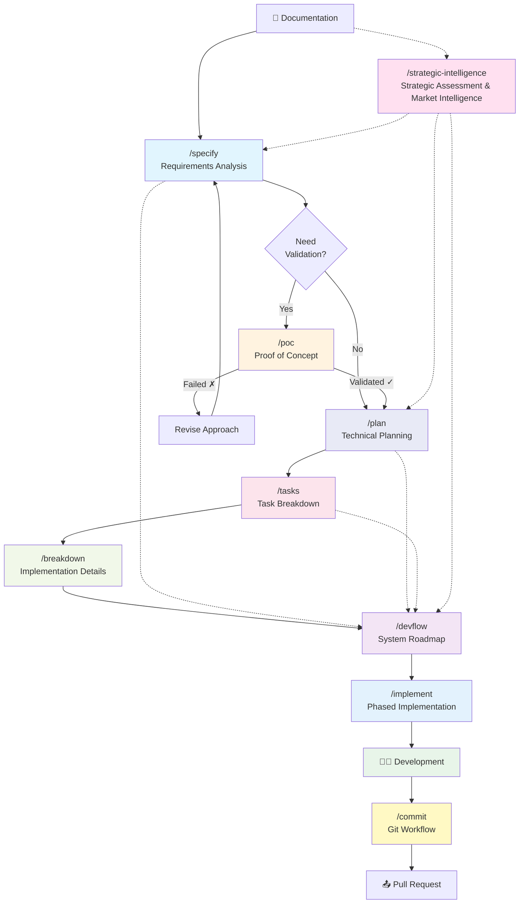

## 📊 Workflow Phases

### Phase 1: Discovery & Analysis

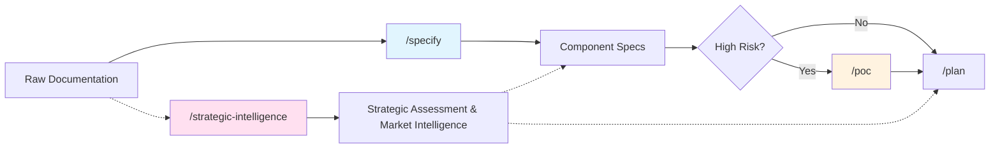

**Duration:** 1-3 days (+ 1-2 days for strategic intelligence)
**Output:** Clear understanding of requirements, components, and strategic position

---

### Phase 2: Planning & Estimation

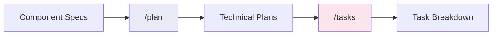

**Duration:** 2-5 days  
**Output:** Detailed technical plans and actionable tasks

---

### Phase 3: Implementation Preparation

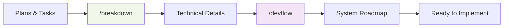

**Duration:** 1-3 days
**Output:** Complete implementation guides and timeline

---

### Phase 4: Phased Implementation

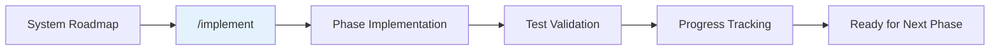

**Duration:** Varies by phase complexity
**Output:** Working code with comprehensive tests and updated progress tracking

---

### Phase 5: Development & Delivery

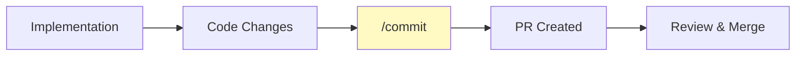

**Duration:** Varies by project  
**Output:** Clean commits and comprehensive PRs

---

## 🎯 Decision Flow

### When to Run Each Command

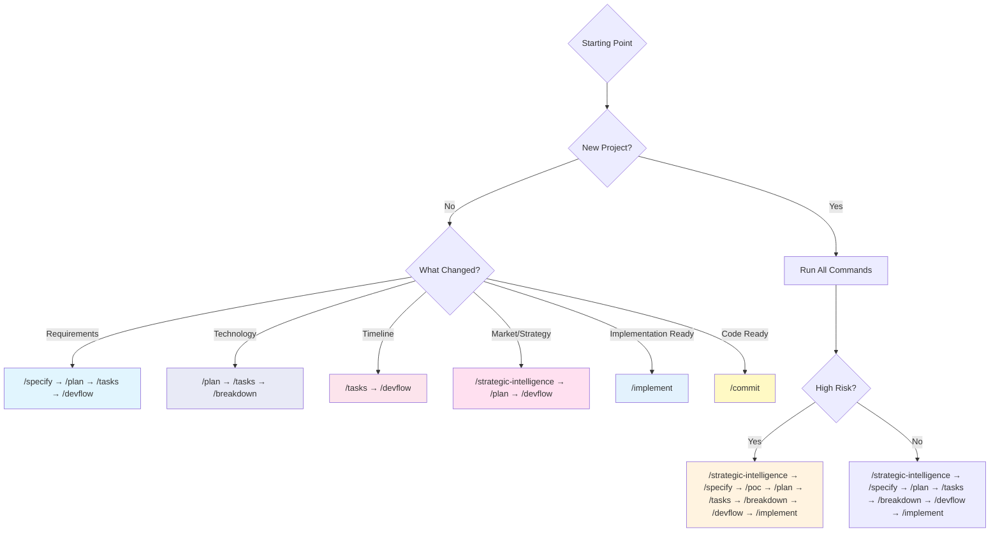

---

## 📈 Timeline Visualization

### Typical Project Timeline

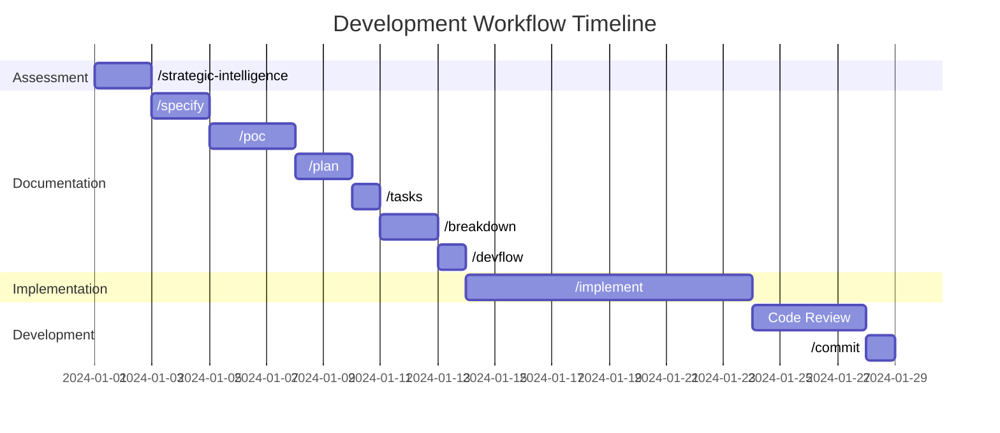

---

## 🔀 Usage Patterns

### Pattern 1: Full Workflow with Assessment

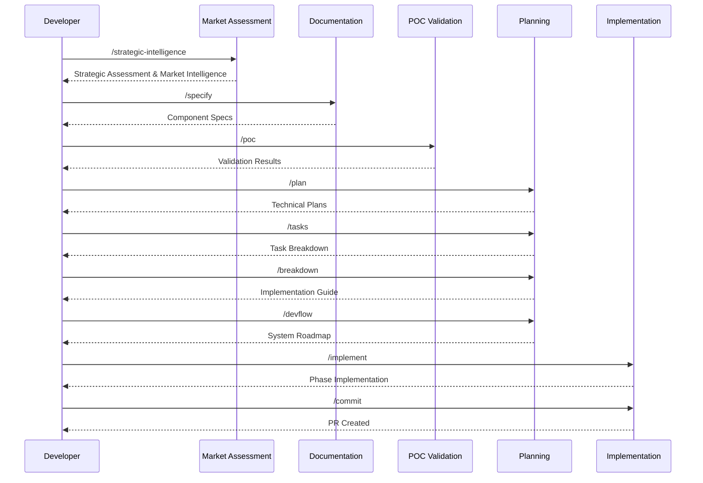

---

### Pattern 2: Quick Feature Addition

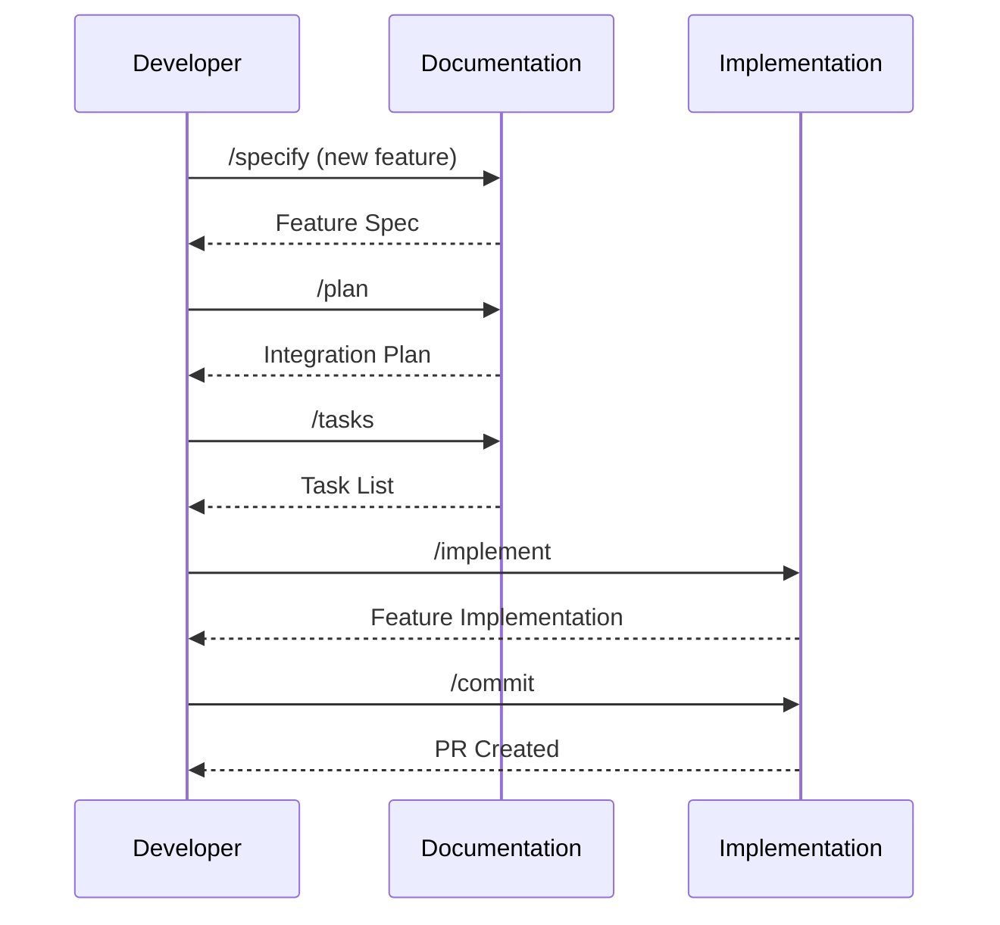

---

### Pattern 3: Strategic Review

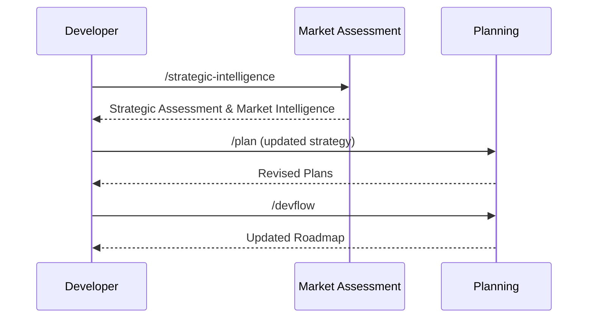

---

### Pattern 4: Documentation Update

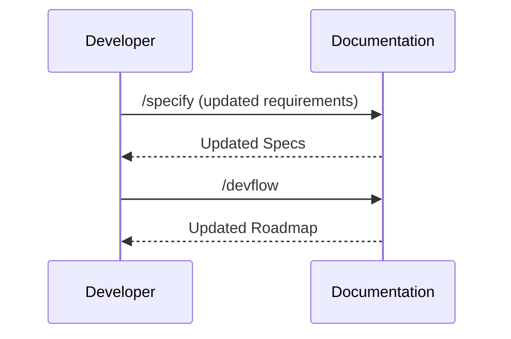

---

## 🎨 Component Relationships

### How Commands Build on Each Other

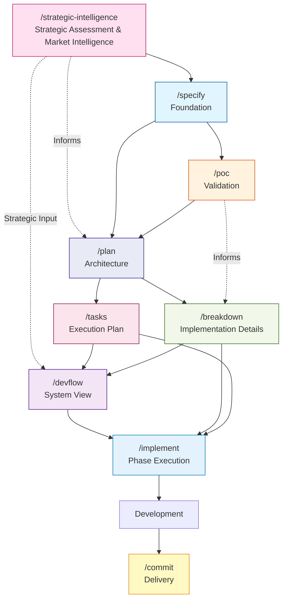

---

## 📋 Command Dependencies

### What Each Command Needs

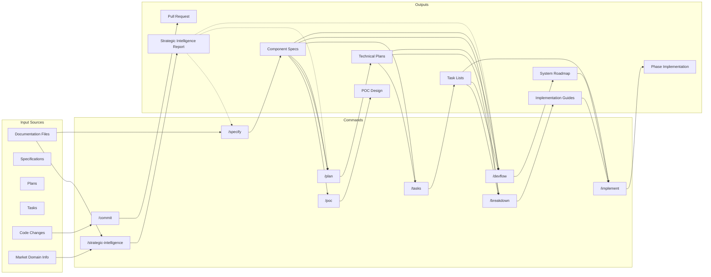

---

## 🚦 Quality Gates

### Validation Checkpoints

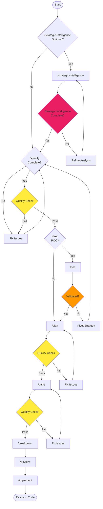

---

## 🔄 Iterative Development

### Continuous Improvement Loop

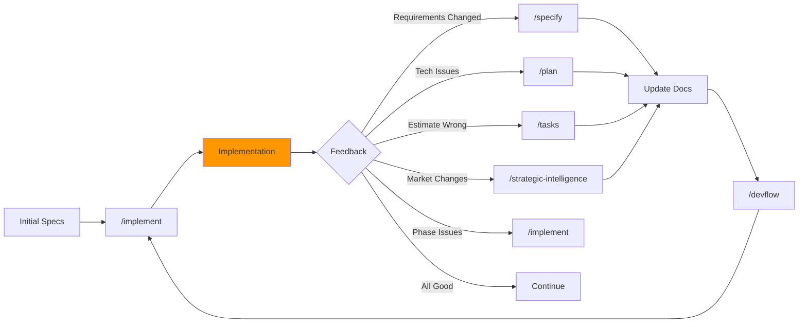

---

## 📊 Metrics Dashboard

### Track Progress Through Workflow

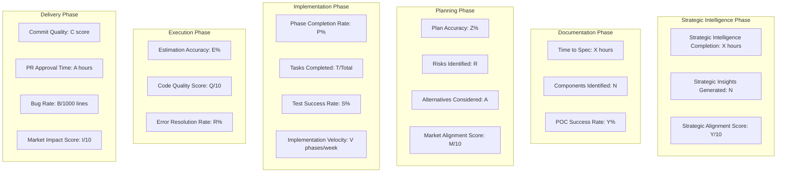

---

## 🎯 Success Criteria

### How to Know You're Done

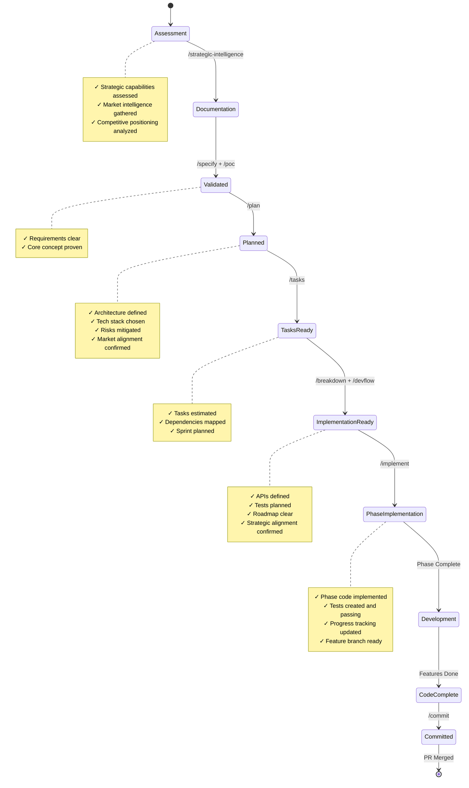

---

## 🔧 Troubleshooting Flow

### When Things Go Wrong

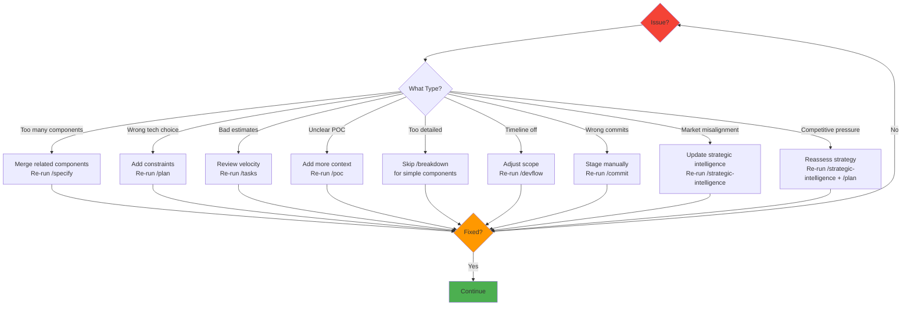

---

## 📅 Sprint Integration

### How Workflow Maps to Sprints

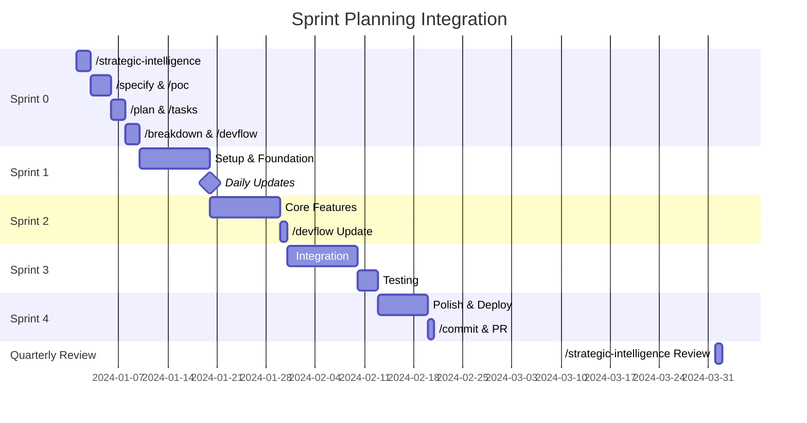

---

## 🎓 Learning Path

### Workflow Mastery Journey

```mermaid
journey
    title Workflow Mastery Journey
    section Beginner
      Run /specify: 3: Developer
      Understand specs: 4: Developer
      Run /plan: 3: Developer
    section Intermediate
      Run /poc for validation: 5: Developer
      Use /tasks for planning: 4: Developer
      Run /breakdown: 4: Developer
    section Advanced
      Customize workflows: 5: Developer
      Integrate with tools: 5: Developer
      Optimize process: 5: Developer
      Mentor others: 5: Developer
```

---

## 🔗 Integration Points

### External Tool Connections

```mermaid
graph TB
    subgraph "Claude Code Workflow"
        Specify["/specify"]
        Plan["/plan"]
        Tasks["/tasks"]
        Breakdown["/breakdown"]
        DevFlow["/devflow"]
        Commit["/commit"]
    end
    
    subgraph "External Tools"
        Jira[Jira/Linear]
        Confluence[Confluence/Notion]
        GitHub[GitHub/GitLab]
        Slack[Slack/Teams]
    end
    
    Tasks -->|CSV Export| Jira
    Breakdown -->|API Docs| Confluence
    DevFlow -->|Roadmap| Confluence
    Commit -->|PR| GitHub
    DevFlow -->|Updates| Slack
    
    style Jira fill:#0052cc
    style Confluence fill:#172b4d
    style GitHub fill:#24292e
    style Slack fill:#4a154b
```

---

## 📖 Quick Reference Card

### Command Cheat Sheet

| Scenario | Commands to Run | Skip |
|----------|----------------|------|
| **New Project** | `/strategic-intelligence` → `/specify` → `/poc` → `/plan` → `/tasks` → `/breakdown` → `/devflow` → `/implement` | None |
| **High Risk Feature** | `/strategic-intelligence` → `/specify` → `/poc` → `/plan` → `/tasks` → `/implement` | `/breakdown` (unless complex) |
| **Simple Feature** | `/specify` → `/plan` → `/tasks` → `/implement` | `/strategic-intelligence`, `/poc`, `/breakdown` |
| **Strategic Planning** | `/strategic-intelligence` → `/plan` → `/devflow` | Others |
| **Requirement Change** | `/specify` → `/devflow` | Others |
| **Tech Stack Change** | `/plan` → `/tasks` → `/breakdown` | `/specify` |
| **Strategic Change** | `/strategic-intelligence` → `/plan` → `/devflow` | Others |
| **Timeline Update** | `/tasks` → `/devflow` | Others |
| **Implementation Ready** | `/implement` | Others |
| **Before Coding** | `/breakdown` | Others |
| **Quarterly Review** | `/strategic-intelligence` | All others |
| **Code Complete** | `/commit` | All others |

---

## 🎉 Success Stories

### Workflow in Action

```mermaid
graph LR
    A[📝 Day 1<br/>Strategic position unclear] --> B["/strategic-intelligence"]
    B --> C[✓ Strategic assessment & market intelligence]

    C --> D[📝 Day 2<br/>Requirements unclear] --> E["/specify"]
    E --> F[✓ Clear component boundaries]

    F --> G[📝 Day 3<br/>High risk approach] --> H["/poc"]
    H --> I[✓ Concept validated]

    I --> J[📝 Day 4<br/>Need architecture] --> K["/plan"]
    K --> L[✓ Tech stack & strategy aligned]

    L --> M[📝 Day 5<br/>Need estimates] --> N["/tasks"]
    N --> O[✓ Sprint planned]

    O --> P[📝 Week 2<br/>Start coding] --> Q["/breakdown"]
    Q --> R[✓ APIs defined]

    R --> S[📝 Week 4<br/>Track progress] --> T["/devflow"]
    T --> U[✓ On schedule & market-aligned]

    U --> V[📝 Week 5<br/>Start implementation] --> W["/implement"]
    W --> X[✓ Phased implementation complete]

    X --> Y[📝 Week 6<br/>Feature complete] --> Z["/commit"]
    Z --> AA[✓ Clean PR with strategic impact]

    style C fill:#4caf50
    style F fill:#4caf50
    style I fill:#4caf50
    style L fill:#4caf50
    style O fill:#4caf50
    style R fill:#4caf50
    style U fill:#4caf50
    style X fill:#4caf50
    style AA fill:#4caf50
```
