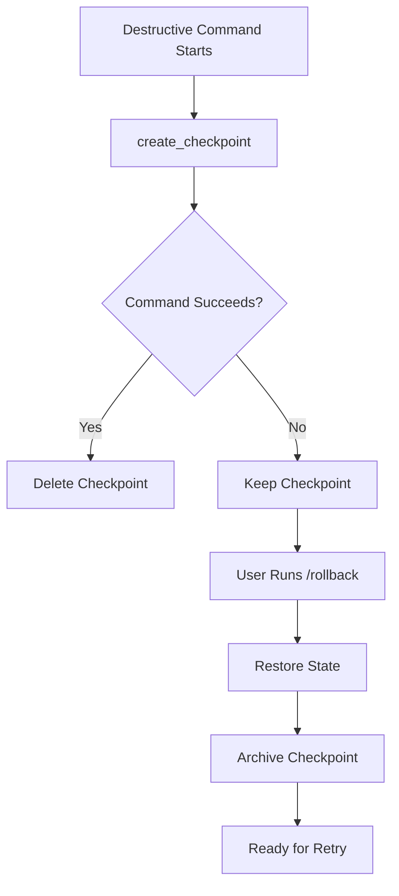

## Role

Safety engineer providing checkpoint/restore functionality for destructive operations.

## Purpose

Enable safe recovery from failed operations by:
- Creating checkpoints before destructive operations
- Restoring state after failures
- Preserving work-in-progress during rollback
- Maintaining audit trail of rollback events
- Supporting manual and automatic rollback

## Execution

### 1. Check for Checkpoint

```bash
# Parse arguments
COMPONENT_ONLY=""
ROLLBACK_MODE="full"  # full | component | ticket

for arg in "$@"; do
  case $arg in
    --component=*)
      COMPONENT_ONLY="${arg#*=}"
      ROLLBACK_MODE="component"
      ;;
    --ticket=*)
      TICKET_ONLY="${arg#*=}"
      ROLLBACK_MODE="ticket"
      ;;
  esac
done

# Verify checkpoint exists
if [ ! -f .sage/checkpoint.json ]; then
  echo "ERROR: No checkpoint found"
  echo "Nothing to rollback"
  exit 1
fi

# Load checkpoint metadata
cat .sage/checkpoint.json
```

### 2. Display Checkpoint Info

```bash
# Show what will be restored
CHECKPOINT_DATA=$(cat .sage/checkpoint.json)
CHECKPOINT_ID=$(echo $CHECKPOINT_DATA | jq -r '.checkpoint_id')
COMMAND=$(echo $CHECKPOINT_DATA | jq -r '.command')
TIMESTAMP=$(echo $CHECKPOINT_DATA | jq -r '.timestamp')
REASON=$(echo $CHECKPOINT_DATA | jq -r '.reason // "manual"')

echo "================================================"
echo "ROLLBACK INFORMATION"
echo "================================================"
echo "Command: $COMMAND"
echo "Created: $TIMESTAMP"
echo "Reason: $REASON"
echo "Mode: $ROLLBACK_MODE"
echo ""

if [ "$ROLLBACK_MODE" = "component" ]; then
  echo "Component-specific rollback: $COMPONENT_ONLY"
  echo ""
  echo "This will restore:"
  echo "  - Component checkpoint: $COMPONENT_ONLY"
  echo "  - Files modified by component"
  echo ""
  echo "Note: Only restores specified component, not entire ticket"
elif [ "$ROLLBACK_MODE" = "ticket" ]; then
  echo "Ticket-specific rollback: $TICKET_ONLY"
  echo ""
  echo "This will restore:"
  echo "  - Ticket checkpoint: $TICKET_ONLY"
  echo "  - All components in ticket"
  echo "  - Files modified by ticket"
elif [ "$ROLLBACK_MODE" = "full" ]; then
  echo "Full system rollback"
  echo ""
  echo "This will restore:"
  echo "  - Git working directory"
  echo "  - .sage/.sage/tickets/index.json (if exists)"
  echo "  - Task progress files"
  echo "  - .sage/workflow-mode"
fi

echo ""
echo "WARNING: Changes since checkpoint will be LOST"
echo "================================================"
```

### 3. Confirm Rollback

```bash
# Interactive confirmation (skip with --force)
if [ "$1" != "--force" ]; then
  read -p "Proceed with rollback? (yes/no): " CONFIRM
  if [ "$CONFIRM" != "yes" ]; then
    echo "Rollback cancelled"
    exit 0
  fi
fi
```

### 4. Restore Git State (Mode-Specific)

```bash
if [ "$ROLLBACK_MODE" = "component" ]; then
  # Component-level restoration
  echo "Restoring component: $COMPONENT_ONLY..."

  # Find component checkpoint in ticket system
  COMPONENT_CHECKPOINT=$(jq -r --arg comp "$COMPONENT_ONLY" '
    .tickets[] |
    select(.components != null) |
    .components[] |
    select(.name == $comp) |
    .checkpoint_id
  ' .sage/.sage/tickets/index.json | head -1)

  if [ -z "$COMPONENT_CHECKPOINT" ]; then
    echo "ERROR: Component checkpoint not found for: $COMPONENT_ONLY"
    exit 1
  fi

  # Restore from component-specific git commit
  echo "Component checkpoint ID: $COMPONENT_CHECKPOINT"

  # Extract files modified by component from checkpoint metadata
  COMPONENT_FILES=$(jq -r --arg comp "$COMPONENT_ONLY" '
    .component_checkpoints[$comp].files[]?
  ' .sage/checkpoint.json 2>/dev/null)

  if [ -n "$COMPONENT_FILES" ]; then
    echo "Restoring files for component $COMPONENT_ONLY:"
    echo "$COMPONENT_FILES" | while read file; do
      echo "  - $file"
      git checkout $COMPONENT_CHECKPOINT -- "$file" 2>/dev/null || true
    done
    echo "✓ Component files restored"
  else
    echo "⚠ No file list found, attempting full component restore from checkpoint"
    git checkout $COMPONENT_CHECKPOINT 2>&1
  fi

elif [ "$ROLLBACK_MODE" = "ticket" ]; then
  # Ticket-level restoration (all components)
  echo "Restoring ticket: $TICKET_ONLY..."

  # Get ticket checkpoint
  TICKET_CHECKPOINT=$(jq -r --arg ticket "$TICKET_ONLY" '
    .tickets[] |
    select(.id == $ticket) |
    .git.checkpoint_id // empty
  ' .sage/.sage/tickets/index.json)

  if [ -z "$TICKET_CHECKPOINT" ]; then
    echo "ERROR: Ticket checkpoint not found for: $TICKET_ONLY"
    exit 1
  fi

  echo "Ticket checkpoint ID: $TICKET_CHECKPOINT"
  git checkout $TICKET_CHECKPOINT 2>&1

  if [ $? -eq 0 ]; then
    echo "✓ Ticket state restored"
  else
    echo "⚠ Git restore failed"
  fi

elif [ "$ROLLBACK_MODE" = "full" ]; then
  # Full system restoration
  echo "Restoring git working directory..."

  if [ -n "$CHECKPOINT_ID" ]; then
    git stash apply $CHECKPOINT_ID 2>&1
    if [ $? -eq 0 ]; then
      echo "✓ Git state restored"
    else
      echo "⚠ Git restore failed, continuing with file restoration..."
    fi
  fi
fi
```

### 5. Restore Ticket System (Mode-Specific)

```bash
if [ "$ROLLBACK_MODE" = "component" ]; then
  # Component-level: Update component status in ticket system
  echo "Updating component status in ticket system..."

  jq --arg comp "$COMPONENT_ONLY" '
    .tickets |= map(
      if .components != null then
        .components |= map(
          if .name == $comp then
            .status = "UNPROCESSED" |
            .checkpoint_id = ""
          else
            .
          end
        )
      else
        .
      end
    )
  ' .sage/.sage/tickets/index.json > /tmp/tickets-rollback.json

  mv /tmp/tickets-rollback.json .sage/.sage/tickets/index.json
  echo "✓ Component status reset to UNPROCESSED"

  # Also reset associated tasks
  jq --arg comp "$COMPONENT_ONLY" '
    .tickets |= map(
      if .components != null then
        . as $ticket |
        ($ticket.components[] | select(.name == $comp).tasks // []) as $comp_tasks |
        if .tasks != null then
          .tasks |= map(
            if ([.id] | inside($comp_tasks)) then
              .status = "UNPROCESSED"
            else
              .
            end
          )
        else
          .
        end
      else
        .
      end
    )
  ' .sage/.sage/tickets/index.json > /tmp/tickets-rollback-tasks.json

  mv /tmp/tickets-rollback-tasks.json .sage/.sage/tickets/index.json
  echo "✓ Component tasks reset"

elif [ "$ROLLBACK_MODE" = "ticket" ]; then
  # Ticket-level: Reset ticket and all components
  echo "Resetting ticket: $TICKET_ONLY..."

  jq --arg ticket "$TICKET_ONLY" '
    .tickets |= map(
      if .id == $ticket then
        .state = "UNPROCESSED" |
        if .components != null then
          .components |= map(.status = "UNPROCESSED" | .checkpoint_id = "")
        else
          .
        end |
        if .tasks != null then
          .tasks |= map(.status = "UNPROCESSED")
        else
          .
        end
      else
        .
      end
    )
  ' .sage/.sage/tickets/index.json > /tmp/tickets-rollback.json

  mv /tmp/tickets-rollback.json .sage/.sage/tickets/index.json
  echo "✓ Ticket reset to UNPROCESSED"

elif [ "$ROLLBACK_MODE" = "full" ]; then
  # Full system: Restore entire ticket system
  if [ -f .sage/checkpoint-tickets-index.json ]; then
    echo "Restoring ticket system..."
    cp .sage/checkpoint-tickets-index.json .sage/.sage/tickets/index.json
    echo "✓ .sage/.sage/tickets/index.json restored"
  fi

  # Restore ticket markdown files if backup exists
  if [ -d .sage/checkpoint-tickets ]; then
    echo "Restoring ticket files..."
    cp -r .sage/checkpoint-.sage/tickets/* .sage/tickets/ 2>/dev/null
    echo "✓ Ticket files restored"
  fi
fi
```

### 6. Restore Task Files

```bash
# Restore task progress files
if [ -d .sage/checkpoint-tasks ]; then
  echo "Restoring task files..."
  find .sage/checkpoint-tasks -name "tasks.md" | while read task_file; do
    # Extract original path
    RELATIVE_PATH=${task_file#.sage/checkpoint-tasks/}
    TARGET_PATH="docs/specs/$RELATIVE_PATH"
    cp "$task_file" "$TARGET_PATH"
  done
  echo "✓ Task files restored"
fi
```

### 7. Restore Workflow Mode

```bash
# Restore workflow mode if checkpoint exists
if [ -f .sage/checkpoint-workflow-mode ]; then
  cp .sage/checkpoint-workflow-mode .sage/workflow-mode
  echo "✓ Workflow mode restored"
fi
```

### 8. Log Rollback Event

```bash
# Create rollback log entry
ROLLBACK_LOG=".sage/rollback.log"
cat >> $ROLLBACK_LOG <<EOF
$(date -u +%Y-%m-%dT%H:%M:%SZ) - ROLLBACK
  Command: $COMMAND
  Checkpoint: $CHECKPOINT_ID
  Reason: $REASON
  Status: SUCCESS
EOF

echo "✓ Rollback logged"
```

### 9. Archive Checkpoint

```bash
# Move checkpoint to archive (keep for audit)
ARCHIVE_DIR=".sage/checkpoints-archive"
mkdir -p $ARCHIVE_DIR

ARCHIVE_NAME="checkpoint-$(date +%Y%m%d-%H%M%S)"
mv .sage/checkpoint.json $ARCHIVE_DIR/$ARCHIVE_NAME.json
mv .sage/checkpoint-tickets-index.json $ARCHIVE_DIR/$ARCHIVE_NAME-tickets-index.json 2>/dev/null
mv .sage/checkpoint-tickets $ARCHIVE_DIR/$ARCHIVE_NAME-tickets 2>/dev/null
mv .sage/checkpoint-tasks $ARCHIVE_DIR/$ARCHIVE_NAME-tasks 2>/dev/null
mv .sage/checkpoint-workflow-mode $ARCHIVE_DIR/$ARCHIVE_NAME-workflow-mode 2>/dev/null

echo "✓ Checkpoint archived to $ARCHIVE_DIR/$ARCHIVE_NAME.*"
```

### 10. Report Success

```bash
echo ""
echo "================================================"
echo "✅ ROLLBACK COMPLETE"
echo "================================================"
echo "State restored to checkpoint created at: $TIMESTAMP"
echo "Original command: $COMMAND"
echo ""
echo "Restored:"
echo "  ✓ Git working directory"
echo "  ✓ Ticket system (if applicable)"
echo "  ✓ Task progress files"
echo "  ✓ Workflow mode"
echo ""
echo "Next steps:"
echo "  1. Review restored state"
echo "  2. Fix the issue that caused failure"
echo "  3. Retry the operation"
echo "================================================"
```

## Checkpoint Creation (Used by Other Commands)

Commands that perform destructive operations should create checkpoints BEFORE execution:

### Full System Checkpoint

```bash
# Example: /stream checkpoint creation
create_checkpoint() {
  local COMMAND_NAME=$1
  local REASON=${2:-"automatic"}

  echo "Creating checkpoint for: $COMMAND_NAME"

  # Create checkpoint directory
  mkdir -p .sage

  # Git stash for working directory
  CHECKPOINT_ID=$(git stash create 2>/dev/null || echo "")

  # Backup ticket system
  if [ -f .sage/.sage/tickets/index.json ]; then
    cp .sage/.sage/tickets/index.json .sage/checkpoint-tickets-index.json
    mkdir -p .sage/checkpoint-tickets
    cp .sage/tickets/*.md .sage/checkpoint-.sage/tickets/ 2>/dev/null
  fi

  # Backup task files
  if [ -d docs/specs ]; then
    mkdir -p .sage/checkpoint-tasks
    find docs/specs -name "tasks.md" -exec cp --parents {} .sage/checkpoint-tasks/ \; 2>/dev/null
  fi

  # Backup workflow mode
  if [ -f .sage/workflow-mode ]; then
    cp .sage/workflow-mode .sage/checkpoint-workflow-mode
  fi

  # Create checkpoint metadata
  cat > .sage/checkpoint.json <<EOF
{
  "checkpoint_id": "$CHECKPOINT_ID",
  "command": "$COMMAND_NAME",
  "timestamp": "$(date -u +%Y-%m-%dT%H:%M:%SZ)",
  "reason": "$REASON",
  "type": "full",
  "files_backed_up": {
    "git_stash": $([ -n "$CHECKPOINT_ID" ] && echo "true" || echo "false"),
    "tickets": $([ -f .sage/checkpoint-tickets-index.json ] && echo "true" || echo "false"),
    "tasks": $([ -d .sage/checkpoint-tasks ] && echo "true" || echo "false"),
    "workflow_mode": $([ -f .sage/checkpoint-workflow-mode ] && echo "true" || echo "false")
  },
  "component_checkpoints": {}
}
EOF

  echo "✓ Checkpoint created: $CHECKPOINT_ID"
}

# Usage in other commands:
# create_checkpoint "/stream" "automatic"
```

### Component-Level Checkpoint

```bash
# Create checkpoint for a specific component
create_component_checkpoint() {
  local TICKET_ID=$1
  local COMPONENT_NAME=$2
  local REASON=${3:-"component-complete"}

  echo "Creating component checkpoint: $COMPONENT_NAME in $TICKET_ID"

  # Get current git state (HEAD commit or create new checkpoint commit)
  CURRENT_HEAD=$(git rev-parse HEAD)

  # Create a checkpoint commit with all current changes
  git add -A
  CHECKPOINT_COMMIT=$(git stash create 2>/dev/null || echo "$CURRENT_HEAD")

  if [ -z "$CHECKPOINT_COMMIT" ]; then
    CHECKPOINT_COMMIT="$CURRENT_HEAD"
  fi

  echo "Component checkpoint commit: $CHECKPOINT_COMMIT"

  # Get list of files modified during component implementation
  MODIFIED_FILES=$(git diff --name-only HEAD 2>/dev/null || echo "")

  # Update ticket system with component checkpoint
  jq --arg ticket "$TICKET_ID" \
     --arg comp "$COMPONENT_NAME" \
     --arg checkpoint "$CHECKPOINT_COMMIT" '
    .tickets |= map(
      if .id == $ticket then
        if .components != null then
          .components |= map(
            if .name == $comp then
              .checkpoint_id = $checkpoint |
              .status = "COMPLETED"
            else
              .
            end
          )
        else
          .
        end
      else
        .
      end
    )
  ' .sage/.sage/tickets/index.json > /tmp/tickets-checkpoint.json

  mv /tmp/tickets-checkpoint.json .sage/.sage/tickets/index.json

  # Update global checkpoint metadata with component info
  if [ -f .sage/checkpoint.json ]; then
    jq --arg comp "$COMPONENT_NAME" \
       --arg checkpoint "$CHECKPOINT_COMMIT" \
       --argjson files "$(echo "$MODIFIED_FILES" | jq -R -s 'split("\n") | map(select(length > 0))')" '
      .component_checkpoints[$comp] = {
        "checkpoint_id": $checkpoint,
        "timestamp": (now | strftime("%Y-%m-%dT%H:%M:%SZ")),
        "files": $files
      }
    ' .sage/checkpoint.json > /tmp/checkpoint-updated.json

    mv /tmp/checkpoint-updated.json .sage/checkpoint.json
  fi

  echo "✓ Component checkpoint created: $CHECKPOINT_COMMIT"
  echo "✓ Checkpoint ID stored in .sage/.sage/tickets/index.json"
}

# Usage in /stream:
# create_component_checkpoint "AUTH-001" "AuthModule" "component-complete"
```

### List Available Checkpoints

```bash
# Show all component checkpoints for a ticket
list_component_checkpoints() {
  local TICKET_ID=$1

  echo "Component checkpoints for $TICKET_ID:"
  echo ""

  jq -r --arg ticket "$TICKET_ID" '
    .tickets[] |
    select(.id == $ticket) |
    if .components != null then
      .components[] |
      select(.checkpoint_id != null and .checkpoint_id != "") |
      "\(.name): \(.checkpoint_id) (status: \(.status))"
    else
      "No components found"
    end
  ' .sage/.sage/tickets/index.json
}

# Usage:
# list_component_checkpoints "AUTH-001"
```

## Auto-Rollback on Failure

Commands can automatically rollback on critical failures:

```bash
# Example: /stream with auto-rollback
auto_rollback_on_failure() {
  local COMMAND_NAME=$1

  # Set trap to rollback on exit code != 0
  trap "echo 'ERROR: Command failed, rolling back...'; /rollback --force --reason='auto-failure'" ERR
}

# Usage:
auto_rollback_on_failure "/stream"

# ... command execution ...
# If any command fails (exit != 0), auto-rollback triggers
```

## Rollback Modes

### Full System Rollback (Default)

```bash
/rollback
# Interactive confirmation
# Full restore with user review
# Restores: git state, ticket system, task files, workflow mode
```

### Component-Level Rollback

```bash
/rollback --component=AuthModule
# Restore specific component only
# Reverts files modified by component
# Resets component status to UNPROCESSED
# Preserves other components in same ticket

# Example use case:
# User completes AuthModule and AuthUI components
# AuthUI has issues, but AuthModule is good
# Run: /rollback --component=AuthUI
# Result: AuthModule kept, AuthUI reverted for retry
```

### Ticket-Level Rollback

```bash
/rollback --ticket=AUTH-001
# Restore entire ticket
# Reverts all components in ticket
# Resets ticket state to UNPROCESSED
# More targeted than full system rollback

# Example use case:
# Multiple tickets in progress (AUTH-001, DB-001)
# AUTH-001 has issues
# Run: /rollback --ticket=AUTH-001
# Result: AUTH-001 reverted, DB-001 unchanged
```

### Forced Rollback

```bash
/rollback --force
# No confirmation
# Use in scripts/automation

/rollback --component=AuthModule --force
# Component rollback without confirmation

/rollback --ticket=AUTH-001 --force
# Ticket rollback without confirmation
```

### Partial Rollback (Legacy)

```bash
/rollback --tickets-only
# Only restore ticket system
# Skip git/tasks restoration

/rollback --git-only
# Only restore git state
# Skip .sage/tickets/tasks
```

## Rollback History

View recent rollbacks:

```bash
# Show rollback log
cat .sage/rollback.log

# Show archived checkpoints
ls -lah .sage/checkpoints-archive/

# Restore from specific archive (advanced)
ARCHIVE="checkpoint-20250103-140523"
cp .sage/checkpoints-archive/$ARCHIVE.json .sage/checkpoint.json
cp .sage/checkpoints-archive/$ARCHIVE-tickets-index.json .sage/checkpoint-tickets-index.json
# ... then run /rollback
```

## Integration with Other Commands

### /stream Integration

```bash
# At start of /stream
create_checkpoint "/stream" "cycle-start"

# Before processing ticket (if has components)
# Component-level checkpointing handled per component

# After completing component
create_component_checkpoint "$TICKET_ID" "$COMPONENT_NAME" "component-complete"

# User confirmation prompt (interactive mode)
echo "Component $COMPONENT_NAME completed. Review and confirm (yes/no/rollback):"
read USER_RESPONSE

if [ "$USER_RESPONSE" = "rollback" ]; then
  /rollback --component="$COMPONENT_NAME" --force
  echo "Component rolled back. Continuing to next component..."
fi

# On cycle completion
rm .sage/checkpoint.json  # Clear checkpoint if successful

# On failure
# Checkpoint remains for manual /rollback
```

### /implement Integration

```bash
# At start
create_checkpoint "/implement" "ticket-$TICKET_ID"

# On success
rm .sage/checkpoint.json

# On failure
echo "Implementation failed. Run /rollback to restore state."
```

### /migrate Integration

```bash
# Before migration
create_checkpoint "/migrate" "pre-migration"

# After successful migration
rm .sage/checkpoint.json

# On failure
echo "Migration failed. Run /rollback to restore state."
```

## Checkpoint Lifecycle



## Error Scenarios

### No Checkpoint Exists

```bash
ERROR: No checkpoint found
Nothing to rollback

This means:
- No recent destructive command created checkpoint
- Checkpoint was already used and archived
- Manual checkpoint cleanup occurred

Next steps:
- Check .sage/checkpoints-archive/ for old checkpoints
- Manually restore from git history if needed
```

### Checkpoint Corrupted

```bash
ERROR: Checkpoint data corrupted

Attempting partial recovery:
  - Git stash ID: MISSING
  - Tickets backup: FOUND
  - Tasks backup: FOUND

Partial rollback available:
  /rollback --tickets-only
  /rollback --tasks-only

For git state, use: git reflog
```

### Conflicting Git State

```bash
WARNING: Git working directory has uncommitted changes

Rollback will OVERWRITE these changes.
Uncommitted files:
  - auth.py (modified)
  - tests/test_auth.py (new)

Options:
1. Commit current changes first
2. Stash current changes: git stash
3. Force rollback (LOSE changes): /rollback --force
```

## Success Criteria

- [ ] Checkpoint metadata loaded
- [ ] User confirmed rollback
- [ ] Git state restored (or skipped safely)
- [ ] Ticket system restored (if applicable)
- [ ] Task files restored (if applicable)
- [ ] Workflow mode restored (if applicable)
- [ ] Rollback event logged
- [ ] Checkpoint archived
- [ ] Success message shown with next steps

## Component Rollback Examples

### Example 1: Selective Component Rollback

**Scenario:** Ticket AUTH-001 has two components: AuthModule (backend) and AuthUI (frontend). AuthModule works perfectly, but AuthUI has bugs.

```bash
# Check component status
list_component_checkpoints "AUTH-001"
# Output:
#   AuthModule: abc123def (status: COMPLETED)
#   AuthUI: def456ghi (status: COMPLETED)

# Rollback only AuthUI
/rollback --component=AuthUI

# Review rollback
# Output:
#   ✓ Component files restored (src/components/AuthUI.tsx, etc.)
#   ✓ Component status reset to UNPROCESSED
#   ✓ Component tasks reset

# Verify AuthModule still intact
git log --oneline -1 src/auth/module.py
# Shows AuthModule commit still present

# Re-implement AuthUI with fixes
/stream --ticket=AUTH-001 --component=AuthUI
```

### Example 2: Progressive Rollback

**Scenario:** Ticket has 3 components. Component 3 fails, need to rollback to Component 1.

```bash
# Components completed: C1 ✓, C2 ✓, C3 ✗

# Rollback Component 3
/rollback --component=Component3 --force

# Component 2 also has issues, rollback it too
/rollback --component=Component2 --force

# Now only Component 1 remains
# Re-implement Component 2 and 3 with corrections
```

### Example 3: Full Ticket Rollback

**Scenario:** All components in a ticket need to be redone.

```bash
# Rather than rolling back each component individually:
/rollback --component=C1 --force
/rollback --component=C2 --force
/rollback --component=C3 --force

# Use ticket-level rollback:
/rollback --ticket=AUTH-001

# This resets entire ticket at once
```

### Example 4: Interactive Component Confirmation in /stream

**Workflow during /stream execution:**

```bash
# Stream processes Component 1
echo "Component AuthModule completed"
echo "Files modified: src/auth/module.py, tests/test_auth.py"
echo ""
echo "Review implementation. Options:"
echo "  [c] Continue to next component"
echo "  [r] Rollback this component"
echo "  [q] Quit (keep checkpoint)"
echo ""
read -p "Your choice: " CHOICE

case $CHOICE in
  r)
    /rollback --component=AuthModule --force
    echo "AuthModule rolled back. Retrying..."
    # Re-run component implementation
    ;;
  c)
    echo "Proceeding to AuthUI component..."
    ;;
  q)
    echo "Checkpoint saved. Run /stream to resume."
    exit 0
    ;;
esac
```

## Notes

- Checkpoints are automatic, rollback is manual (unless auto-rollback configured)
- Checkpoints are lightweight (git stash + file copies)
- Component checkpoints are git commits with file tracking
- Multiple component checkpoints supported per ticket
- Archived checkpoints kept for audit but not auto-restored
- Rollback is safe and idempotent
- Can be run multiple times (uses archived checkpoints)
- Component-level rollback is granular and preserves working components
