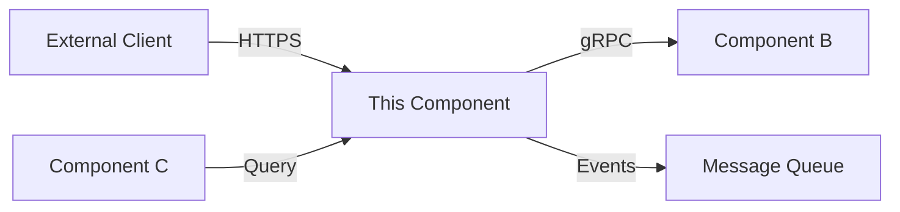
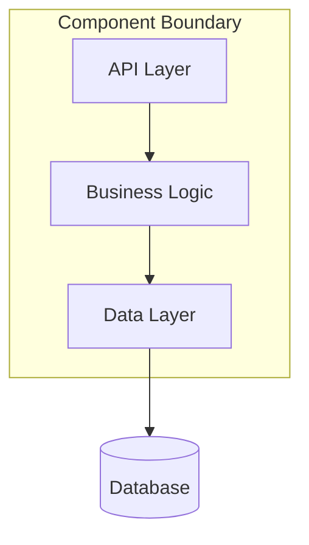

## Role

System architect creating detailed technical breakdowns for implementation teams.

## Execution

1. **Setup**:

   ```bash
   mkdir -p docs/breakdown
   ```

2. **Discover**:

   ```bash
   # If no args, find all components
   find docs/specs -mindepth 1 -maxdepth 1 -type d
   # Otherwise use provided component names
   ```

3. **Analyze**: For each component:
   - `cat` existing spec.md, plan.md, tasks.md
   - Use `SequentialThinking` for:
     - Interface contracts and API design
     - Component boundaries and coupling
     - Testing strategies
     - Risk analysis

4. **Research**: `WebSearch` for:
   - Architecture patterns for component type
   - Testing best practices
   - Security considerations
   - Similar implementation examples

5. **Generate**:

   ```bash
   tee docs/breakdown/<component>.md
   ```

6. **Index**: Update `docs/breakdown/README.md` with component links

## Breakdown Template

````markdown
# [Component Name] - Technical Breakdown

**Created:** <YYYY-MM-DD>  
**Sources:** [spec](docs/specs/<component>/spec.md) | [plan](docs/specs/<component>/plan.md) | [tasks](docs/specs/<component>/tasks.md)

---

## Quick Reference

```yaml
complexity: High|Medium|Low
risk_level: High|Medium|Low
team_size: N engineers
duration: N weeks
dependencies:
  - component-b (API consumer)
  - external-service-x (auth provider)
```

## Component Overview

**Purpose:** [Single sentence describing responsibility]

**Key Capabilities:**
- [Capability 1]
- [Capability 2]
- [Capability 3]

**Success Metrics:**
- [Metric 1]: [target]
- [Metric 2]: [target]

## System Context



**Integration Points:**
1. **Upstream:** [Who calls this component and why]
2. **Downstream:** [What this component depends on]
3. **Async:** [Event-driven interactions]

## Architecture Design

### Component Structure



### Key Modules

**Module 1: [Name]**
- **Responsibility:** [What it does]
- **Dependencies:** [Internal/external]
- **Complexity:** High|Medium|Low

**Module 2: [Name]**
- **Responsibility:** [What it does]
- **Dependencies:** [Internal/external]
- **Complexity:** High|Medium|Low

## Interface Contracts

### REST API

```yaml
POST /api/v1/resource
Request:
  - field1: string (required)
  - field2: number (optional)
Response:
  - id: string
  - status: string
Errors:
  - 400: Invalid request
  - 500: Server error
```

### Events Published

```yaml
EventName: resource.created
Schema:
  - resourceId: string
  - timestamp: ISO8601
  - metadata: object
```

### Events Consumed

```yaml
EventName: user.updated
Action: Update user cache
Retry: 3 attempts, exponential backoff
```

### Data Models

```yaml
Entity: Resource
Fields:
  - id: UUID (PK)
  - name: string (indexed)
  - status: enum
  - created_at: timestamp
Relations:
  - belongs_to: User
  - has_many: Items
```

## Implementation Details

### Technology Stack

**Runtime:** [e.g., Node.js 20, Python 3.11]  
**Framework:** [e.g., Express, FastAPI]  
**Database:** [e.g., PostgreSQL 15]  
**Cache:** [e.g., Redis 7]  
**Rationale:** [Why these choices based on research]

### Design Patterns

1. **Repository Pattern** - Data access abstraction
2. **Circuit Breaker** - External service resilience
3. **CQRS** - Read/write optimization

### Configuration

```yaml
# Environment variables
DATABASE_URL: postgresql://...
REDIS_URL: redis://...
API_TIMEOUT_MS: 5000
FEATURE_FLAG_X: true|false
```

## Testing Strategy

### Unit Tests (Target: 80% coverage)

**Critical Paths:**
- Business logic validation
- Data transformation
- Error handling

**Tools:** Jest, pytest, etc.

### Integration Tests

**Scenarios:**
1. Database operations (CRUD)
2. External API calls (with mocks)
3. Event publishing/consuming
4. Authentication flows

**Tools:** Testcontainers, in-memory services

### End-to-End Tests

**User Flows:**
1. Happy path: Create → Read → Update → Delete
2. Error handling: Invalid input, timeout, retry
3. Authorization: Permitted vs forbidden actions

**Tools:** Playwright, Cypress

### Performance Tests

**Load Scenarios:**
- Concurrent users: 1000 req/s
- Data volume: 1M records
- Response time: <200ms p95

**Tools:** k6, JMeter

### Security Tests

- OWASP Top 10 scanning
- Dependency vulnerability checks
- Penetration testing (if applicable)

## Operational Concerns

### Infrastructure

```yaml
Compute:
  - Container: 2 vCPU, 4GB RAM
  - Auto-scaling: 2-10 instances
  - Health checks: /health endpoint

Storage:
  - Database: 100GB, auto-backup
  - Cache: 16GB Redis
  - Logs: 30-day retention
```

### Monitoring

**Metrics:**
- Request rate, latency, errors (RED)
- Database connections, query time
- Cache hit ratio
- Custom business metrics

**Alerts:**
- Error rate >1% for 5min
- Latency p95 >500ms for 5min
- Database connections >80%

**Dashboards:**
- Service health overview
- Request/response patterns
- Error breakdown

### Security

**Authentication:** JWT tokens, OAuth 2.0  
**Authorization:** RBAC with permissions  
**Data Protection:** 
- Encryption at rest (AES-256)
- Encryption in transit (TLS 1.3)
- PII handling per GDPR

**Secrets:** AWS Secrets Manager, rotation policy

### Scaling Strategy

**Horizontal:**
- Stateless design
- Load balancer distribution
- Auto-scaling based on CPU/memory

**Vertical:**
- Database read replicas
- Connection pooling
- Query optimization

## Risk Analysis

### Technical Risks

| Risk | Impact | Likelihood | Mitigation |
|------|--------|------------|------------|
| Database bottleneck | High | Medium | Implement caching, read replicas |
| External API failure | High | High | Circuit breaker, fallback data |
| Memory leaks | Medium | Low | Monitoring, auto-restart |

### Dependency Risks

| Dependency | Risk | Mitigation |
|------------|------|------------|
| Component B | API changes | Contract testing, versioning |
| External Service | Downtime | Mock layer, circuit breaker |

## Development Workflow

### Local Setup

```bash
# Clone and install
git clone <repo>
npm install

# Start dependencies
docker-compose up -d

# Run migrations
npm run migrate

# Start dev server
npm run dev
```

### Code Quality

- **Linting:** ESLint, Prettier
- **Type Safety:** TypeScript strict mode
- **Pre-commit:** Husky hooks
- **CI Checks:** Lint, test, build

### Deployment Pipeline

```yaml
Stages:
  1. Build: Compile, bundle
  2. Test: Unit, integration
  3. Security: Dependency scan
  4. Deploy Staging: Auto-deploy
  5. E2E Tests: Full system
  6. Deploy Prod: Manual approval
```

## Implementation Checklist

**Phase 1: Foundation**
- [ ] Project scaffolding
- [ ] Database schema
- [ ] Core models
- [ ] Basic API endpoints

**Phase 2: Features**
- [ ] Business logic implementation
- [ ] Integration with dependencies
- [ ] Error handling
- [ ] Validation

**Phase 3: Quality**
- [ ] Test coverage >80%
- [ ] Performance optimization
- [ ] Security hardening
- [ ] Documentation

**Phase 4: Operations**
- [ ] Monitoring setup
- [ ] Alerting configured
- [ ] Runbooks created
- [ ] Deployment automated

## References

**Internal:**
- [Specification](docs/specs/<component>/spec.md)
- [Implementation Plan](docs/specs/<component>/plan.md)
- [Task Breakdown](docs/specs/<component>/tasks.md)

**External:**
- [Research findings from WebSearch]
- [Technology documentation links]
- [Similar implementation examples]
````

## Index Template

```markdown
# Component Breakdowns

**Last Updated:** <YYYY-MM-DD>

## Components

| Component | Complexity | Risk | Dependencies | Status |
|-----------|------------|------|--------------|--------|
| [component-a](docs/breakdown/component-a.md) | High | Medium | component-b | ✓ Complete |
| [component-b](docs/breakdown/component-b.md) | Medium | Low | - | 🚧 In Progress |

## Legend

- ✓ Complete
- 🚧 In Progress  
- ⏳ Pending
```

## Validation Rules

After generation, verify:

- All Mermaid diagrams are valid
- Interface contracts have examples
- Risk mitigation strategies are concrete
- Testing strategy covers critical paths
- Monitoring includes actionable alerts
