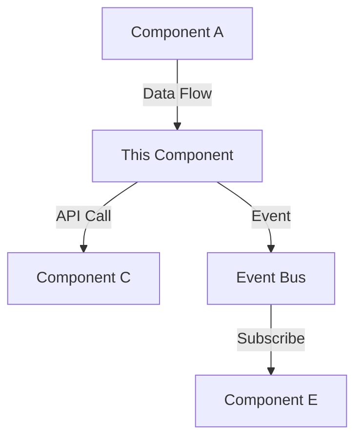

## Role

Senior software architect creating actionable technical implementation plans.

## Execution

1. **Comprehensive Context Discovery**:

   ```bash
   # Priority 1: Specifications (required)
   SPEC_FILES=$(find docs/specs -name "spec.md" -type f 2>/dev/null | sort)

   # Priority 2: Research outputs (from /sage.intel)
   RESEARCH_FILES=$(find docs/research -type f -name "*.md" 2>/dev/null | sort)

   # Priority 3: Feature requests (from /sage.init-feature)
   FEATURE_FILES=$(find docs/features -type f -name "*.md" 2>/dev/null | sort)

   # Priority 4: Code examples (from /sage.init)
   EXAMPLE_DIRS=$(find .sage/agent/examples -type d -mindepth 1 -maxdepth 2 2>/dev/null | sort)

   # Priority 5: Repository patterns (from progressive loader)
   PATTERNS_FILE=".sage/agent/examples/repository-patterns.ts"
   if [ -f "$PATTERNS_FILE" ] && [ -d "servers/sage-context-optimizer/dist" ]; then
       echo "🔬 Loading repository patterns for architecture planning..."

       # Load patterns with extended level for comprehensive planning
       cd servers/sage-context-optimizer
       PATTERN_JSON=$(node -e "
           import { loadPatterns } from './dist/utils/pattern-storage.js';
           loadPatterns('../../.sage/agent/examples')
               .then(patterns => {
                   if (patterns) {
                       console.log(JSON.stringify({
                           primaryLanguage: patterns.primaryLanguage,
                           confidence: patterns.overallConfidence,
                           languages: Object.keys(patterns.languages),
                           metadata: patterns.metadata
                       }, null, 2));
                   } else {
                       console.log('null');
                   }
               })
               .catch(() => console.log('null'));
       " 2>/dev/null)
       cd ../..

       if [ "$PATTERN_JSON" != "null" ] && [ -n "$PATTERN_JSON" ]; then
           PATTERN_LANG=$(echo "$PATTERN_JSON" | jq -r '.primaryLanguage')
           PATTERN_CONFIDENCE=$(echo "$PATTERN_JSON" | jq -r '.confidence')
           PATTERN_LANGS=$(echo "$PATTERN_JSON" | jq -r '.languages | join(", ")')
           echo "  ✓ Patterns loaded"
           echo "    Primary language: $PATTERN_LANG"
           echo "    Overall confidence: $(echo "$PATTERN_CONFIDENCE * 100" | bc)%"
           echo "    Languages: $PATTERN_LANGS"
           LOADED_PATTERNS="$PATTERN_JSON"
       else
           echo "  ⚠️  Failed to load patterns"
           LOADED_PATTERNS=""
       fi
   else
       echo "🔬 Repository patterns: Not available"
       echo "    Run /sage.init to extract patterns"
       LOADED_PATTERNS=""
   fi
   echo ""

   # Priority 6: System documentation
   SYSTEM_DOCS=$(find .sage/agent/system -type f -name "*.md" 2>/dev/null | sort)

   # Priority 7: Other documentation
   OTHER_DOCS=$(find docs -type f -name "*.md" ! -path "*/specs/*" ! -path "*/research/*" ! -path "*/features/*" 2>/dev/null | sort)

   echo "📚 Context Assembly for PRP Generation"
   echo "  Specifications: $(echo "$SPEC_FILES" | wc -l) files"
   echo "  Research outputs: $(echo "$RESEARCH_FILES" | wc -l) files"
   echo "  Feature requests: $(echo "$FEATURE_FILES" | wc -l) files"
   echo "  Code example categories: $(echo "$EXAMPLE_DIRS" | wc -l)"
   if [ -n "$LOADED_PATTERNS" ]; then
       echo "  Repository patterns: ✓ ($(echo "$LOADED_PATTERNS" | jq -r '.primaryLanguage'))"
   fi
   echo "  System docs: $(echo "$SYSTEM_DOCS" | wc -l) files"
   echo ""
   ```

2. **Context Analysis & Correlation**:

   Use `SequentialThinking` to correlate all context sources:

   **Phase 1: Map Feature → Research → Spec Chain**
   - Link specifications back to feature requests
   - Correlate with research findings
   - Extract technology recommendations from research
   - Identify security/performance requirements from intel

   **Phase 2: Extract Code Patterns**
   - Review `.sage/agent/examples/` for relevant patterns
   - Match patterns to component requirements
   - Identify reusable implementation approaches
   - Note framework-specific patterns
   - **If repository patterns loaded:**
     - Apply naming conventions (function/class/variable patterns)
     - Use detected testing framework for test strategy
     - Follow module system and export patterns
     - Maintain type safety requirements (coverage threshold, union syntax)
     - Enforce error handling patterns (explicit throws, validation)

   **Phase 3: Architecture Context**
   - Read `.sage/agent/system/architecture.md` for system context
   - Review `.sage/agent/system/tech-stack.md` for existing technologies
   - Extract patterns from `.sage/agent/system/patterns.md`
   - Identify integration points

   **Phase 4: Dependency Mapping**
   - Map cross-component dependencies
   - Identify external integrations
   - Note blocking relationships
   - Plan implementation sequence

3. **Targeted Research**:

   Use `WebSearch` only for gaps:
   - Technology stack comparisons (if research incomplete)
   - Security standards (if not covered by intel)
   - Performance patterns (if benchmarks missing)
   - Integration patterns (if not in examples)

4. **Generate PRP-Format Plans**:

   Create comprehensive Product Requirements Prompt format:

   ```bash
   tee docs/specs/<component>/plan.md
   ```

   Include all assembled context with traceability

5. **Update Epic Tickets**:

   ```bash
   # Load .sage/tickets/index.json
   cat .sage/tickets/index.json

   # For each component, find corresponding epic ticket
   TICKET_ID="AUTH-001"

   # Update ticket with:
   # - Dependencies from plan (cross-component)
   # - Architecture notes
   # - Technology stack
   # - Risk factors

   # Update .sage/tickets/[ID].md
   cat >> .sage/tickets/${TICKET_ID}.md <<EOF

   ## Architecture
   [Architecture pattern and key decisions]

   ## Technology Stack
   - [Framework, database, etc.]

   ## Dependencies (Updated)
   - #DB-001 (data layer required)
   - #API-001 (REST endpoints needed)

   ## Risks
   - [Key risk from plan]
   EOF

   # Update index.json with dependency array
   ```

6. **Validate**: `grep` verify critical sections present in plans and tickets

## Plan Template (PRP Format)

Product Requirements Prompt (PRP) format combines all context sources into a unified implementation blueprint.

````markdown
# [Component Name] Implementation Blueprint (PRP)

**Format:** Product Requirements Prompt (Context Engineering)
**Generated:** <YYYY-MM-DD>
**Specification:** `docs/specs/<component>/spec.md`
**Feature Request:** `docs/features/[feature-name].md` (if applicable)
**Research:** `docs/research/[feature-name]-intel.md` (if applicable)

---

## 📖 Context & Documentation

### Traceability Chain

**Feature Request → Research → Specification → This Plan**

1. **Original Feature Request:** docs/features/[name].md
   - User stories and use cases
   - Initial technical considerations
   - Success criteria

2. **Research & Enhancement:** docs/research/[name]-intel.md
   - Technical approach recommendations
   - Competitive analysis
   - Security and performance patterns
   - Technology stack evaluation

3. **Formal Specification:** docs/specs/[component]/spec.md
   - Functional requirements
   - Non-functional requirements
   - Acceptance criteria

### Related Documentation

**System Context:**
- Architecture: `.sage/agent/system/architecture.md`
- Tech Stack: `.sage/agent/system/tech-stack.md`
- Patterns: `.sage/agent/system/patterns.md`

**Code Examples:**
- `.sage/agent/examples/[language]/[category]/` - Relevant implementation patterns

**Other Specifications:**
- [List cross-component specs and dependencies]

---

## 📊 Executive Summary

### Business Alignment
- **Purpose:** [What business problem this solves]
- **Value Proposition:** [Business value delivered]
- **Target Users:** [Who benefits and how]

### Technical Approach
- **Architecture Pattern:** [Chosen pattern from research]
- **Technology Stack:** [Recommended stack from research/intel]
- **Implementation Strategy:** [Phased approach summary]

### Key Success Metrics

**Service Level Objectives (SLOs):**
- Availability: [Target %]
- Response Time: [Target ms]
- Throughput: [Target req/s]
- Error Rate: [Target %]

**Key Performance Indicators (KPIs):**
- [Business KPI 1]: [Target]
- [Business KPI 2]: [Target]
- [Technical KPI]: [Target]

---

## 💻 Code Examples & Patterns

### Repository Patterns (from `.sage/agent/examples/`)

**Relevant Existing Patterns:**

1. **[Pattern Category]:** `.sage/agent/examples/[language]/[category]/[pattern].md`
   - **Application:** [How this pattern applies to this component]
   - **Usage Example:**
     ```[language]
     [Code snippet from pattern]
     ```
   - **Adaptation Notes:** [What modifications needed]

2. **[Pattern Category]:** `.sage/agent/examples/[language]/[category]/[pattern].md`
   - **Application:** [How this pattern applies]
   - **Usage Example:**
     ```[language]
     [Code snippet]
     ```

### Implementation Reference Examples

**From Research ([feature-name]-intel.md):**

```[language]
# Example pattern recommended by research
[Code example showing recommended approach]
```

**Key Takeaways from Examples:**
- [Pattern insight 1]
- [Pattern insight 2]
- [Anti-patterns to avoid]

### New Patterns to Create

**Patterns This Implementation Will Establish:**

1. **[New Pattern Name]**
   - **Purpose:** [What problem it solves]
   - **Location:** `.sage/agent/examples/[language]/[category]/`
   - **Reusability:** [How other components can use it]

---

## 🔧 Technology Stack

### Recommended Stack (from Research & Intel)

**Based on research from:** `docs/research/[feature-name]-intel.md`

| Component | Technology | Version | Rationale |
|-----------|------------|---------|-----------|
| Runtime | [Language/Runtime] | [Version] | [Why chosen - cite research] |
| Framework | [Framework] | [Version] | [Why chosen - cite research] |
| Database | [Database] | [Version] | [Why chosen - cite research] |
| Testing | [Test Framework] | [Version] | [Why chosen - cite research] |
| Deployment | [Platform] | [Version] | [Why chosen - cite research] |

**Key Technology Decisions:**
- **[Decision 1]:** [Rationale from research]
- **[Decision 2]:** [Rationale from research]
- **[Decision 3]:** [Rationale from research]

**Research Citations:**
- [Intel recommendation 1] - Source: docs/research/[name]-intel.md
- [Intel recommendation 2] - Source: docs/research/[name]-intel.md

### Alternatives Considered (from Research)

**Option 2: [Alternative Stack]**
- **Pros:** [From research competitive analysis]
- **Cons:** [From research competitive analysis]
- **Why Not Chosen:** [Decision rationale]

**Option 3: [Alternative Stack]**
- **Pros:** [From research]
- **Cons:** [From research]
- **Why Not Chosen:** [Decision rationale]

### Alignment with Existing System

**From `.sage/agent/system/tech-stack.md`:**
- **Consistent With:** [Existing technologies this aligns with]
- **New Additions:** [Technologies this introduces to the system]
- **Migration Considerations:** [If changing existing tech]

---

## 🏗️ Architecture Design

### System Context (from `.sage/agent/system/architecture.md`)

**Existing System Architecture:**
[Summary of current system architecture from system docs]

**Integration Points:**
- [How this component fits into existing architecture]
- [Which existing components this interacts with]
- [New architectural patterns this introduces]

### Component Architecture

**Architecture Pattern:** [Monolith/Microservices/Modular/Layered]
- **Rationale:** [Why this pattern - from research and system context]
- **Alignment:** [How this fits with existing architecture]

**System Design:**



```plaintext
[ASCII diagram alternative showing key components and data flow]
```

### Architecture Decisions (from Research)

**Decision 1: [Integration Pattern]**
- **Choice:** [REST/GraphQL/Event-driven/gRPC]
- **Rationale:** [From research recommendations]
- **Implementation:** [How to implement]
- **Trade-offs:** [Pros and cons from research]

**Decision 2: [Data Flow Pattern]**
- **Choice:** [Synchronous/Asynchronous/Hybrid]
- **Rationale:** [Why chosen]
- **Implementation:** [Approach]

**Decision 3: [State Management]**
- **Choice:** [Stateless/Stateful/Hybrid]
- **Rationale:** [From research]
- **Implementation:** [Approach]

### Component Breakdown

**Core Components:**

1. **[Component Name]**
   - **Purpose:** [Responsibilities]
   - **Technology:** [From tech stack]
   - **Pattern:** [From `.sage/agent/examples/`]
   - **Interfaces:** [APIs, events, data contracts]
   - **Dependencies:** [What it depends on]

2. **[Component Name]**
   - **Purpose:** [Responsibilities]
   - **Technology:** [From tech stack]
   - **Pattern:** [From examples]
   - **Interfaces:** [APIs, events]

### Data Flow & Boundaries

**Request Flow:**
1. [Entry point] → [Processing] → [Response]
2. [Async flow if applicable]

**Component Boundaries:**
- **Public Interface:** [What's exposed]
- **Internal Implementation:** [What's hidden]
- **Cross-Component Contracts:** [Integration agreements]

## 4. Technical Specification

### Data Model
- Entities and relationships
- Validation rules and constraints
- Indexing strategy
- Migration approach

### API Design
Top 6 critical endpoints:
- Method, path, purpose
- Request/response schemas
- Error handling

### Security (from Research)

**Based on:** `docs/research/[feature-name]-intel.md` Security section

**Authentication/Authorization:**
- **Approach:** [From research recommendations]
- **Implementation:** [Pattern from `.sage/agent/examples/`]
- **Standards:** [OWASP, OAuth2, etc. from research]

**Secrets Management:**
- **Strategy:** [Environment variables, vault, etc.]
- **Pattern:** [From repository patterns]
- **Rotation:** [Approach]

**Data Protection:**
- **Encryption in Transit:** [TLS/SSL approach]
- **Encryption at Rest:** [Database encryption strategy]
- **PII Handling:** [Compliance requirements from research]

**Security Testing:**
- **Approach:** [From research testing strategy]
- **Tools:** [SAST, DAST tools recommended]

**Compliance:**
- [GDPR/HIPAA/SOC2 requirements from research]

### Performance (from Research)

**Based on:** `docs/research/[feature-name]-intel.md` Performance section

**Performance Targets (from Research):**
- **Response Time:** < [X]ms (p95) - [Rationale from research]
- **Throughput:** > [Y] req/s - [Benchmark from research]
- **Resource Usage:** [Memory/CPU targets from research]

**Caching Strategy:**
- **Approach:** [Redis, in-memory, CDN - from research]
- **Pattern:** [From `.sage/agent/examples/`]
- **TTL Strategy:** [Time-based, event-based]
- **Invalidation:** [Approach]

**Database Optimization:**
- **Indexing:** [Strategy from research]
- **Query Patterns:** [N+1 prevention, batching]
- **Connection Pooling:** [Configuration]
- **Partitioning:** [If applicable]

**Scaling Strategy:**
- **Horizontal:** [Load balancing approach]
- **Vertical:** [Resource limits]
- **Auto-scaling:** [Triggers and thresholds]
- **Performance Monitoring:** [Tools and metrics]

## 5. Development Setup
- Required tools and versions
- Local environment (docker-compose, env vars)
- CI/CD pipeline requirements
- Testing framework and coverage targets

## 6. Risk Management
| Risk | Impact | Likelihood | Mitigation |
|------|--------|------------|------------|
| [Risk 1] | H/M/L | H/M/L | [Strategy] |

## 7. Implementation Roadmap

### Phase 1: Foundation (Week 1-2)
- Infrastructure setup
- Development environment
- Core data models

### Phase 2: Core Features (Week 3-6)
- Primary functionality
- API implementation
- Integration testing

### Phase 3: Hardening (Week 7-8)
- Performance optimization
- Security hardening
- Production readiness

### Phase 4: Launch (Week 9+)
- Deployment
- Monitoring setup
- Post-launch support

## 8. Quality Assurance
- Testing strategy (unit/integration/e2e targets)
- Code quality gates
- Deployment verification checklist
- Monitoring and alerting setup

---

## ⚠️ Error Handling & Edge Cases

**From:** Feature request technical considerations + Research findings

### Error Scenarios (from Research)

**Critical Error Paths:**

1. **[Error Scenario 1]**
   - **Cause:** [What triggers this error]
   - **Impact:** [User/system impact]
   - **Handling:** [How to handle - from research]
   - **Recovery:** [Recovery strategy]
   - **User Experience:** [Error message and UX]

2. **[Error Scenario 2]**
   - **Cause:** [What triggers]
   - **Impact:** [Impact assessment]
   - **Handling:** [Strategy from research]
   - **Pattern:** [From `.sage/agent/examples/[language]/errors/`]

### Edge Cases (from Feature Request & Research)

**Identified in Feature Request:**
- [Edge case from docs/features/[name].md]
- [Edge case from original requirements]

**Identified in Research:**
- [Edge case from competitive analysis]
- [Edge case from best practices]

**Handling Strategy:**
| Edge Case | Detection | Handling | Testing Approach |
|-----------|-----------|----------|------------------|
| [Case 1] | [How to detect] | [How to handle] | [Test strategy] |
| [Case 2] | [Detection] | [Handling] | [Test strategy] |

### Input Validation

**Validation Rules:**
- [Field]: [Validation rule from spec]
- [Field]: [Validation rule]

**Sanitization:**
- [XSS prevention]
- [SQL injection prevention]
- [Input normalization]

### Graceful Degradation

**Fallback Strategies:**
- [Service unavailable]: [Fallback approach]
- [Partial failure]: [Degraded mode]
- [Timeout]: [Recovery strategy]

### Monitoring & Alerting

**Error Tracking:**
- Tool: [Error monitoring tool]
- Threshold: [Alert thresholds]
- Response: [Incident response plan]

---

## 📚 References & Traceability

### Source Documentation

**Feature Request:**
- docs/features/[feature-name].md
  - Original user stories
  - Initial technical considerations
  - Success criteria

**Research & Intelligence:**
- docs/research/[feature-name]-intel.md
  - Technical approach recommendations
  - Competitive analysis findings
  - Security and performance patterns
  - Technology evaluation results

**Specification:**
- docs/specs/[component]/spec.md
  - Functional requirements
  - Non-functional requirements
  - Acceptance criteria

### System Context

**Architecture & Patterns:**
- `.sage/agent/system/architecture.md` - System architecture context
- `.sage/agent/system/tech-stack.md` - Existing technology stack
- `.sage/agent/system/patterns.md` - Established code patterns

**Code Examples:**
- `.sage/agent/examples/[language]/[category]/` - Implementation patterns

### Research Citations

**Best Practices Research:**
- [WebSearch result 1] - [Topic]
- [WebSearch result 2] - [Topic]

**Technology Evaluation:**
- [Framework documentation URL]
- [Library documentation URL]

**Security Standards:**
- [OWASP guideline URL]
- [Security framework URL]

**Performance Benchmarks:**
- [Benchmark source URL]
- [Performance pattern URL]

### Related Components

**Dependencies:**
- [Component 1]: docs/specs/[component-1]/plan.md - [Relationship]
- [Component 2]: docs/specs/[component-2]/plan.md - [Relationship]

**Dependents:**
- [Component that depends on this]: [How they depend]
````

## Quality Criteria (PRP Format)

**Context Engineering Standards:**

- ✅ **Comprehensive Context Assembly:** All six priority levels of documentation loaded
  1. Specifications (required)
  2. Research outputs (from /sage.intel)
  3. Feature requests (from /sage.init-feature)
  4. Code examples (from /sage.init)
  5. System documentation (architecture, tech-stack, patterns)
  6. Other documentation

- ✅ **Traceability Chain Complete:** Feature → Research → Spec → Plan linkage documented
- ✅ **Research Integration:** All technology choices cite research from intel
- ✅ **Pattern Reuse:** Code examples from repository referenced and adapted
- ✅ **System Alignment:** Integration with existing architecture documented
- ✅ **Concrete Metrics:** SLOs and KPIs defined from research targets
- ✅ **Error Handling:** Edge cases from feature request and research addressed
- ✅ **Dependencies Mapped:** Cross-component and external dependencies clear
- ✅ **Risk Mitigation:** Critical paths identified with mitigation strategies
- ✅ **Timeline Realistic:** Based on research estimates and scope
- ✅ **Implementation Ready:** Sufficient detail for /sage.tasks breakdown
- ✅ **Epic Tickets Updated:** Dependencies and architecture context added

## Ticket Updates

**What Gets Added to Epic Tickets:**

- **Dependencies**: Cross-component blocking relationships (e.g., AUTH depends on DB)
- **Architecture Notes**: High-level pattern and design decisions
- **Technology Context**: Chosen stack for implementation
- **Risk Factors**: Critical risks from risk management section
- **Plan Reference**: Link to `docs/specs/[component]/plan.md`

**Update Strategy:**

- Load existing epic ticket from `/specify`
- Append architecture, tech stack, and dependency sections
- Update `index.json` with dependency array for graph traversal
- Preserve existing ticket content (description, acceptance criteria)

**Integration with Workflow:**

- Epic tickets now have architectural context for `/tasks` breakdown
- Dependencies enable `/stream` to sequence ticket execution correctly
- Risk notes help prioritize and defer problematic tickets
