## Role

Development stream orchestrator managing automated ticket processing through sub-agent execution.

## Purpose

Automate the full development execution cycle by processing tickets sequentially:

- **Ticket Queue Management**: Select next UNPROCESSED ticket with satisfied dependencies
- **Sub-Agent Orchestration**: Spawn isolated sub-agents per ticket
- **Progress Tracking**: Monitor completion and update ticket states
- **Automated Commits**: Commit work tied to ticket IDs
- **GitHub Sync**: Keep repository and tickets synchronized
- **Loop Execution**: Continue until queue exhausted or blocked

## Execution

### 0. Mode Detection and Validation

```bash
# Parse execution mode flags (added for Issue 3.1 - Confirmations)
EXECUTION_MODE="interactive"  # Default
DRY_RUN=false
PARALLEL_MODE=false
PARALLEL_WORKERS="1"

for arg in "$@"; do
  case $arg in
    --interactive)
      EXECUTION_MODE="interactive"
      ;;
    --semi-auto|--component-auto)
      EXECUTION_MODE="semi-auto"
      ;;
    --auto)
      EXECUTION_MODE="auto"
      ;;
    --dry-run)
      DRY_RUN=true
      # Only set EXECUTION_MODE to dry-run if no other mode specified
      if [ "$EXECUTION_MODE" = "interactive" ]; then
        EXECUTION_MODE="dry-run"
      fi
      ;;
    --parallel=*)
      PARALLEL_MODE=true
      PARALLEL_WORKERS="${arg#*=}"
      ;;
    --parallel)
      PARALLEL_MODE=true
      PARALLEL_WORKERS="auto"
      ;;
  esac
done

# Validate semi-auto mode compatibility
if [ "$EXECUTION_MODE" = "semi-auto" ] && [ "$PARALLEL_MODE" = "true" ]; then
  echo "ERROR: --semi-auto cannot be combined with --parallel"
  echo "Parallel execution is not supported in semi-auto mode (Phase 1)"
  echo ""
  echo "Usage: /stream --semi-auto (sequential, component-level automation)"
  echo "   or: /stream --auto --parallel=3 (parallel, ticket-level automation)"
  exit 1
fi

# Validate parallel mode compatibility
if [ "$PARALLEL_MODE" = "true" ] && [ "$EXECUTION_MODE" != "auto" ]; then
  echo "ERROR: --parallel requires --auto mode"
  echo "Parallel execution is only supported in fully automated mode"
  echo ""
  echo "Usage: /stream --auto --parallel=3"
  echo "   or: /stream --auto --parallel=auto"
  exit 1
fi

# Check workflow mode (added for Issue 1.1 - Dual Workflow Confusion)
if [ -f .sage/workflow-mode ]; then
  WORKFLOW_MODE=$(cat .sage/workflow-mode)
  if [ "$WORKFLOW_MODE" != "TICKET_BASED" ]; then
    echo "ERROR: /stream requires TICKET_BASED workflow mode"
    echo "Current mode: $WORKFLOW_MODE"
    echo ""
    echo "To use automated execution:"
    echo "  1. Run /migrate to convert to ticket system"
    echo "  2. Or run /workflow to reconfigure"
    exit 1
  fi
else
  echo "WARNING: No workflow mode set. Run /workflow first."
  echo "Proceeding with ticket-based mode detection..."
fi

# Display execution mode
echo "================================================"
echo "DEVSTREAM EXECUTION MODE: $EXECUTION_MODE"
if [ "$PARALLEL_MODE" = "true" ]; then
  echo "PARALLEL EXECUTION: $PARALLEL_WORKERS workers"
fi
if [ "$DRY_RUN" = "true" ] && [ "$EXECUTION_MODE" != "dry-run" ]; then
  echo "DRY RUN: Enabled (preview mode, no changes)"
fi
echo "================================================"
if [ "$EXECUTION_MODE" = "interactive" ]; then
  echo "Interactive mode: Confirmations required at key points"
  echo "Use --auto for hands-off execution (advanced)"
  echo "Use --semi-auto for component-level automation"
  echo "Use --dry-run to preview without changes"
elif [ "$EXECUTION_MODE" = "semi-auto" ]; then
  echo "Semi-Auto Mode: Component-level automation"
  echo ""
  echo "Behavior:"
  echo "  • Groups tickets by component prefix (AUTH-*, UI-*, API-*)"
  echo "  • Confirmation required at component boundaries"
  echo "  • All tickets within a component processed automatically"
  echo "  • 90% fewer confirmations vs interactive mode"
  echo ""
  if [ "$DRY_RUN" = "true" ]; then
    echo "DRY RUN: Preview mode enabled - no actual changes will be made"
  else
    echo "Compatible with --dry-run for preview"
  fi
elif [ "$EXECUTION_MODE" = "auto" ]; then
  echo "⚠️  AUTO MODE: No confirmations, fully automated"
  echo "Ensure you trust the system before using this mode"
  if [ "$PARALLEL_MODE" = "true" ]; then
    echo "⚡ PARALLEL: Processing multiple tickets concurrently"
    echo "   Workers: $PARALLEL_WORKERS"
    echo "   ⚠️  High token usage - ensure adequate API limits"
  fi
elif [ "$EXECUTION_MODE" = "dry-run" ]; then
  echo "DRY RUN MODE: Preview only, no changes will be made"
fi
echo "================================================"
echo ""
```

### 1. Initialize Cycle

```bash
# Verify ticket system exists
test -f .sage/tickets/index.json || {
  echo "ERROR: Ticket system not found"
  echo ""
  echo "Next steps:"
  echo "  1. Run /workflow to choose workflow"
  echo "  2. Run /migrate to create ticket system"
  exit 1
}

# Load ticket index
TICKET_INDEX=$(cat .sage/tickets/index.json)
TOTAL_TICKETS=$(echo "$TICKET_INDEX" | jq '.tickets | length')
UNPROCESSED=$(echo "$TICKET_INDEX" | jq '[.tickets[] | select(.state == "UNPROCESSED")] | length')

# Check git status
GIT_STATUS=$(git status --porcelain)
if [ -n "$GIT_STATUS" ]; then
  echo "⚠️  WARNING: Uncommitted changes detected"
  git status
  echo ""
fi

# Calculate cycle statistics (Issue 3.2 - Progress Visibility)
COMPLETED=$(echo "$TICKET_INDEX" | jq '[.tickets[] | select(.state == "COMPLETED")] | length')
IN_PROGRESS=$(echo "$TICKET_INDEX" | jq '[.tickets[] | select(.state == "IN_PROGRESS")] | length')
DEFERRED=$(echo "$TICKET_INDEX" | jq '[.tickets[] | select(.state == "DEFERRED")] | length')
COMPLETION_PCT=$((COMPLETED * 100 / TOTAL_TICKETS))

# Display cycle summary with progress
echo "┌────────────────────────────────────────────────┐"
echo "│         DEVSTREAM CYCLE INITIALIZATION         │"
echo "└────────────────────────────────────────────────┘"
echo ""
echo "Ticket Statistics:"
echo "  Total Tickets:    $TOTAL_TICKETS"
echo "  COMPLETED:        $COMPLETED ($COMPLETION_PCT%)"
echo "  IN_PROGRESS:      $IN_PROGRESS"
echo "  UNPROCESSED:      $UNPROCESSED"
echo "  DEFERRED:         $DEFERRED"
echo ""

# Calculate ETA if we have historical data (Issue 3.2)
if [ -f .sage/stream-velocity.log ]; then
  AVG_TIME=$(tail -10 .sage/stream-velocity.log | awk '{sum+=$2; count++} END {print int(sum/count)}')
  ESTIMATED_MINUTES=$((UNPROCESSED * AVG_TIME))
  ESTIMATED_HOURS=$((ESTIMATED_MINUTES / 60))
  ESTIMATED_MINS=$((ESTIMATED_MINUTES % 60))

  echo "Velocity Estimate:"
  echo "  Avg Time/Ticket: ${AVG_TIME} minutes"
  echo "  Estimated ETA:   ${ESTIMATED_HOURS}h ${ESTIMATED_MINS}m"
  echo ""
fi

# Create checkpoint before starting (Issue 2.1 - Rollback)
if [ "$DRY_RUN" = false ]; then
  echo "Creating safety checkpoint..."
  # Checkpoint creation would go here
  # create_checkpoint "/stream" "cycle-start"
  echo "✓ Checkpoint created (rollback available with /rollback)"
  echo ""
fi

# Interactive confirmation to start cycle
if [ "$EXECUTION_MODE" = "interactive" ]; then
  read -p "Start processing $UNPROCESSED tickets? (yes/no): " START_CONFIRM
  if [ "$START_CONFIRM" != "yes" ]; then
    echo "Cycle cancelled by user"
    exit 0
  fi
  echo ""
fi
```

**Key Actions:**

- Verify `.sage/tickets/index.json` exists
- Count UNPROCESSED tickets
- Check git status and warn if uncommitted changes
- Create safety checkpoint (Issue 2.1)
- **NEW: Interactive confirmation to start** (Issue 3.1)
- Display cycle initialization summary

### 1.5a. Component Grouping (Semi-Auto Mode Only)

```bash
# Only execute in semi-auto mode
if [ "$EXECUTION_MODE" = "semi-auto" ]; then
  echo "┌────────────────────────────────────────────────┐"
  echo "│         COMPONENT GROUPING (STEP 1.5a)        │"
  echo "└────────────────────────────────────────────────┘"
  echo ""

  # Resume Support: Check for existing batch files (EC5)
  EXISTING_BATCHES=$(ls .sage/batches/*.batch 2>/dev/null)

  if [ -n "$EXISTING_BATCHES" ]; then
    echo "⚠️  Existing batch files detected - resuming from previous session"
    echo ""

    # Validate batch files against current ticket states
    BATCH_FILES=($(ls .sage/batches/*.batch 2>/dev/null))
    INVALID_BATCHES=0
    VALID_BATCHES=0

    for BATCH_FILE in "${BATCH_FILES[@]}"; do
      COMPONENT_NAME=$(basename "$BATCH_FILE" .batch)

      # Check each ticket in batch
      while IFS= read -r TICKET_ID; do
        TICKET_STATE=$(cat .sage/tickets/index.json | jq -r ".tickets[] | select(.id == \"$TICKET_ID\") | .state")

        if [ "$TICKET_STATE" != "UNPROCESSED" ]; then
          echo "  ⚠️  Warning: $TICKET_ID in $COMPONENT_NAME.batch is $TICKET_STATE (not UNPROCESSED)"
          INVALID_BATCHES=$((INVALID_BATCHES + 1))
          # Remove invalid ticket from batch
          grep -v "^${TICKET_ID}$" "$BATCH_FILE" > "${BATCH_FILE}.tmp"
          mv "${BATCH_FILE}.tmp" "$BATCH_FILE"
        fi
      done < "$BATCH_FILE"

      # Check if batch file is now empty
      if [ ! -s "$BATCH_FILE" ]; then
        echo "  🗑️  Removing empty batch: $COMPONENT_NAME.batch"
        rm -f "$BATCH_FILE"
      else
        VALID_BATCHES=$((VALID_BATCHES + 1))
      fi
    done

    # Display resume summary
    REMAINING_BATCHES=$(ls .sage/batches/*.batch 2>/dev/null | wc -l | tr -d ' ')

    if [ "$REMAINING_BATCHES" -gt 0 ]; then
      echo ""
      echo "Resume Summary:"
      echo "  Valid batches:   $VALID_BATCHES"
      if [ "$INVALID_BATCHES" -gt 0 ]; then
        echo "  Cleaned tickets: $INVALID_BATCHES (no longer UNPROCESSED)"
      fi
      echo ""
      echo "Resuming from:"
      ls .sage/batches/*.batch 2>/dev/null | while read batch_file; do
        comp_name=$(basename "$batch_file" .batch)
        comp_count=$(cat "$batch_file" | wc -l | tr -d ' ')
        echo "  - $comp_name: $comp_count tickets"
      done
      echo ""
      echo "─────────────────────────────────────────────────"
      echo ""

      # Skip component grouping - use existing batches
      # Continue to Step 2 (component selection)
    else
      echo "  ℹ️  All batches were empty after validation - creating fresh batches"
      echo ""
    fi
  else
    echo "Analyzing ticket prefixes and grouping by component..."
    echo ""
  fi

  # Only create new batches if no valid existing batches
  if [ -z "$(ls .sage/batches/*.batch 2>/dev/null)" ]; then
    # Extract unique component prefixes from UNPROCESSED story tickets
  COMPONENTS=$(cat .sage/tickets/index.json | jq -r '
    [.tickets[] |
     select(.state == "UNPROCESSED") |
     select(.type == "story" or .type == "feature" or .type == "Story" or .type == "Feature") |
     .id] |
    map(split("-")[0]) |
    unique |
    .[]
  ' | sort)

  # Check if we have any components
  if [ -z "$COMPONENTS" ]; then
    echo "ERROR: No UNPROCESSED story tickets found for component grouping"
    echo ""
    echo "Component grouping requires at least one UNPROCESSED story ticket."
    echo "Current ticket states:"
    cat .sage/tickets/index.json | jq -r '.tickets[] | "  - \(.id): \(.state) (type: \(.type))"'
    exit 1
  fi

  # Create batch directory
  mkdir -p .sage/batches
  rm -f .sage/batches/*.batch

  # Standard component prefixes (uppercase alphabetic)
  STANDARD_PATTERN='^[A-Z]+$'

  # Track component statistics
  declare -A COMPONENT_COUNTS
  declare -a MISC_TICKETS

  # Generate batch file per component
  for COMPONENT in $COMPONENTS; do
    # Check if component prefix is standard (uppercase alphabetic only)
    if [[ "$COMPONENT" =~ $STANDARD_PATTERN ]]; then
      # Standard component - create dedicated batch file
      COMP_TICKETS=$(cat .sage/tickets/index.json | jq -r "
        [.tickets[] |
         select(.state == \"UNPROCESSED\") |
         select(.type == \"story\" or .type == \"feature\" or .type == \"Story\" or .type == \"Feature\") |
         select(.id | startswith(\"$COMPONENT-\"))] |
        map(.id) |
        .[]
      ")

      if [ -n "$COMP_TICKETS" ]; then
        # Atomic write: temp file + mv to prevent corruption on interruption
        echo "$COMP_TICKETS" > "/tmp/$COMPONENT.batch.tmp"
        mv "/tmp/$COMPONENT.batch.tmp" ".sage/batches/$COMPONENT.batch"
        COMP_COUNT=$(echo "$COMP_TICKETS" | wc -l | tr -d ' ')
        COMPONENT_COUNTS["$COMPONENT"]=$COMP_COUNT
      fi
    else
      # Non-standard prefix - collect for MISC batch
      COMP_TICKETS=$(cat .sage/tickets/index.json | jq -r "
        [.tickets[] |
         select(.state == \"UNPROCESSED\") |
         select(.type == \"story\" or .type == \"feature\" or .type == \"Story\" or .type == \"Feature\") |
         select(.id | startswith(\"$COMPONENT-\"))] |
        map(.id) |
        .[]
      ")

      if [ -n "$COMP_TICKETS" ]; then
        while IFS= read -r ticket; do
          MISC_TICKETS+=("$ticket")
        done <<< "$COMP_TICKETS"
      fi
    fi
  done

  # Create MISC batch if there are non-standard tickets
  if [ ${#MISC_TICKETS[@]} -gt 0 ]; then
    # Atomic write: temp file + mv to prevent corruption on interruption
    printf "%s\n" "${MISC_TICKETS[@]}" > "/tmp/MISC.batch.tmp"
    mv "/tmp/MISC.batch.tmp" ".sage/batches/MISC.batch"
    COMPONENT_COUNTS["MISC"]=${#MISC_TICKETS[@]}
  fi

  # Display component execution plan
  echo "Component Execution Plan:"
  echo "─────────────────────────────────────────────────"

  COMPONENT_NUM=0
  TOTAL_COMPONENT_TICKETS=0

  # Display standard components first (sorted)
  for COMPONENT in $(echo "${!COMPONENT_COUNTS[@]}" | tr ' ' '\n' | grep -v '^MISC$' | sort); do
    COMPONENT_NUM=$((COMPONENT_NUM + 1))
    COUNT=${COMPONENT_COUNTS[$COMPONENT]}
    TOTAL_COMPONENT_TICKETS=$((TOTAL_COMPONENT_TICKETS + COUNT))

    # Get ticket IDs for this component
    TICKET_LIST=$(cat ".sage/batches/$COMPONENT.batch" | head -5 | tr '\n' ', ' | sed 's/,$//')
    REMAINING_COUNT=$(cat ".sage/batches/$COMPONENT.batch" | wc -l | tr -d ' ')

    if [ $REMAINING_COUNT -gt 5 ]; then
      TICKET_DISPLAY="$TICKET_LIST... (+$((REMAINING_COUNT - 5)) more)"
    else
      TICKET_DISPLAY="$TICKET_LIST"
    fi

    printf "  %d. %-10s %2d tickets (%s)\n" "$COMPONENT_NUM" "$COMPONENT:" "$COUNT" "$TICKET_DISPLAY"
  done

  # Display MISC component last if present
  if [ -n "${COMPONENT_COUNTS[MISC]}" ]; then
    COMPONENT_NUM=$((COMPONENT_NUM + 1))
    COUNT=${COMPONENT_COUNTS[MISC]}
    TOTAL_COMPONENT_TICKETS=$((TOTAL_COMPONENT_TICKETS + COUNT))

    TICKET_LIST=$(cat ".sage/batches/MISC.batch" | head -5 | tr '\n' ', ' | sed 's/,$//')
    REMAINING_COUNT=$(cat ".sage/batches/MISC.batch" | wc -l | tr -d ' ')

    if [ $REMAINING_COUNT -gt 5 ]; then
      TICKET_DISPLAY="$TICKET_LIST... (+$((REMAINING_COUNT - 5)) more)"
    else
      TICKET_DISPLAY="$TICKET_LIST"
    fi

    printf "  %d. %-10s %2d tickets (%s) [non-standard prefixes]\n" "$COMPONENT_NUM" "MISC:" "$COUNT" "$TICKET_DISPLAY"
  fi

    echo "─────────────────────────────────────────────────"
    echo "Total: $COMPONENT_NUM components, $TOTAL_COMPONENT_TICKETS tickets"
    echo ""

    echo "✓ Component grouping complete"
    echo "✓ Batch files created in .sage/batches/"
    echo ""
  fi  # End of: if [ -z "$(ls .sage/batches/*.batch 2>/dev/null)" ]

  # Validate that batch files exist (either from resume or fresh grouping)
  BATCH_COUNT=$(ls .sage/batches/*.batch 2>/dev/null | wc -l | tr -d ' ')
  if [ "$BATCH_COUNT" -eq 0 ]; then
    echo "ERROR: No batch files available"
    echo "This indicates a grouping or resume logic error."
    exit 1
  fi
fi  # End of: if [ "$EXECUTION_MODE" = "semi-auto" ]
```

**Batch File Cleanup Function (Semi-Auto Mode):**

```bash
# Function: cleanup_component_batch
# Usage: cleanup_component_batch "$COMPONENT_NAME"
# Called after all tickets in a component are processed (COMPLETED or DEFERRED)
# Gracefully removes batch file without failing if file doesn't exist
cleanup_component_batch() {
  local COMPONENT="$1"

  if [ -z "$COMPONENT" ]; then
    echo "ERROR: cleanup_component_batch requires component name"
    return 1
  fi

  local BATCH_FILE=".sage/batches/${COMPONENT}.batch"

  # Use rm -f to avoid failing if file doesn't exist (graceful cleanup)
  if [ -f "$BATCH_FILE" ]; then
    rm -f "$BATCH_FILE"
    echo "✓ Cleaned up batch file: $BATCH_FILE"
  else
    # Silent success - file may have already been cleaned up
    # No error or warning to avoid noise in logs
    :
  fi
}

# Note: This function will be called from component orchestration logic
# Implementation location: After all tickets in component batch are processed
# Typical call: cleanup_component_batch "AUTH"
# Integration point: Semi-auto mode component completion (STREAM-005 or later)
```

**Key Actions (Semi-Auto Mode Only):**

- Extract component prefixes from UNPROCESSED story tickets
- Group tickets by component prefix (e.g., AUTH-*, UI-*, API-*)
- Non-standard prefixes (MISC-*, HOTFIX-*, etc.) grouped into MISC.batch
- Create .sage/batches/ directory with one .batch file per component
- **Write batch files atomically** (temp file + mv to prevent corruption)
- Display component execution plan with ticket counts and IDs
- Handle edge cases (empty components, single ticket, no tickets)
- Validate batch files were created successfully
- **Cleanup batch files after component completion** (via cleanup_component_batch function)

### 1.5. Build Dependency Graph (Parallel Mode Only)

```bash
# Only execute in parallel mode
if [ "$PARALLEL_MODE" = "true" ]; then
  echo "Building dependency graph for parallel execution..."

  # Source parallel scheduler library
  source .sage/lib/parallel-scheduler.sh
  source .sage/lib/commit-queue.sh

  # Build dependency graph
  DEP_GRAPH=$(build_dependency_graph .sage/tickets/index.json)

  # Detect circular dependencies
  if detect_circular_dependencies "$DEP_GRAPH"; then
    echo "ERROR: Circular dependencies detected in ticket system"
    echo "Cannot proceed with parallel execution"
    echo ""
    echo "Run /validate to identify circular dependencies"
    exit 1
  fi

  # Determine optimal worker count
  UNPROCESSED_COUNT=$(echo "$DEP_GRAPH" | jq '.stats.unprocessed')
  PARALLEL_WORKERS=$(determine_worker_count "$PARALLEL_WORKERS" "$UNPROCESSED_COUNT")

  echo "✓ Dependency graph built successfully"
  echo "  Workers allocated: $PARALLEL_WORKERS"
  echo "  Tickets available: $UNPROCESSED_COUNT"
  echo ""

  # Calculate batch statistics
  BATCH_STATS=$(calculate_batch_statistics "$DEP_GRAPH" "$PARALLEL_WORKERS")
  ESTIMATED_BATCHES=$(echo "$BATCH_STATS" | jq '.estimated_batches')

  echo "Parallel Execution Plan:"
  echo "  Estimated batches: $ESTIMATED_BATCHES"
  echo "  Tickets/batch:     $PARALLEL_WORKERS"
  echo ""

  # Display dependency graph (optional, for debugging)
  if [ "${DEBUG:-false}" = "true" ]; then
    print_dependency_graph "$DEP_GRAPH"
  fi

  # Initialize commit queue
  initialize_commit_queue
  echo "✓ Commit queue initialized"
  echo ""
fi
```

**Key Actions (Parallel Mode):**

- Load parallel scheduler and commit queue libraries
- Build dependency graph from ticket index
- Detect and reject circular dependencies
- Calculate optimal worker count (auto or specified)
- Calculate batch execution statistics
- Initialize commit serialization queue
- Validate parallel execution is feasible

### 2. Select Next Ticket (or Batch)

```bash
# Semi-auto mode: Select next component from batches
if [ "$EXECUTION_MODE" = "semi-auto" ]; then
  echo "┌────────────────────────────────────────────────┐"
  echo "│    COMPONENT SELECTION (STEP 2 - SEMI-AUTO)   │"
  echo "└────────────────────────────────────────────────┘"
  echo ""

  # Find next batch file
  NEXT_BATCH_FILE=$(ls .sage/batches/*.batch 2>/dev/null | head -1)

  if [ -z "$NEXT_BATCH_FILE" ]; then
    echo "✓ All components processed"
    echo ""
    exit 0
  fi

  # Extract component name from filename
  COMPONENT_NAME=$(basename "$NEXT_BATCH_FILE" .batch)

  # Read ticket IDs from batch file
  mapfile -t COMPONENT_TICKETS < "$NEXT_BATCH_FILE"
  TICKET_COUNT=${#COMPONENT_TICKETS[@]}

  # Display component information
  echo "Component: $COMPONENT_NAME"
  echo "Tickets:   $TICKET_COUNT"
  echo ""
  echo "Ticket List:"

  # Load and display ticket titles
  for TICKET_ID in "${COMPONENT_TICKETS[@]}"; do
    TICKET_TITLE=$(cat .sage/tickets/index.json | jq -r ".tickets[] | select(.id == \"$TICKET_ID\") | .title")
    echo "  - $TICKET_ID: $TICKET_TITLE"
  done

  echo ""
  echo "─────────────────────────────────────────────────"
  echo ""

  # Confirmation prompt
  read -p "Start processing component $COMPONENT_NAME ($TICKET_COUNT tickets)? (yes/no/skip): " COMPONENT_CONFIRM

  case $COMPONENT_CONFIRM in
    yes)
      echo "✓ Starting component $COMPONENT_NAME"
      echo ""
      # Track component start time for completion metrics
      COMPONENT_START_TIME=$(date +%s)
      # Set component batch for processing
      TICKET_BATCH=("${COMPONENT_TICKETS[@]}")
      ;;
    no)
      echo "Cycle stopped by user"
      exit 0
      ;;
    skip)
      echo "Skipping component $COMPONENT_NAME"
      # Delete batch file
      rm -f "$NEXT_BATCH_FILE"
      echo "✓ Component batch deleted"
      echo ""
      # Loop back to select next component
      # (In actual implementation, this would restart step 2)
      echo "Moving to next component..."
      echo ""
      # For now, exit - full loop will be handled by later tickets
      exit 0
      ;;
    *)
      echo "Invalid input. Exiting."
      exit 1
      ;;
  esac

# Sequential mode: Select single ticket
elif [ "$PARALLEL_MODE" = "false" ]; then
  # Query for UNPROCESSED tickets with satisfied dependencies
  SELECTED_TICKET_ID=$(cat .sage/tickets/index.json | jq -r '
    .tickets[] |
    select(.state == "UNPROCESSED") |
    select(
      if .dependencies then
        all(.dependencies[]; . as $dep |
          any($index.tickets[]; .id == $dep and .state == "COMPLETED")
        )
      else true end
    ) |
    .id
  ' | head -n 1)

  if [ -z "$SELECTED_TICKET_ID" ]; then
    echo "No tickets available for processing"
    exit 0
  fi

  echo "Selected ticket: $SELECTED_TICKET_ID"
  TICKET_BATCH=("$SELECTED_TICKET_ID")

# Parallel mode: Select batch of independent tickets
else
  # Find next parallel batch
  BATCH_JSON=$(find_parallel_batch "$DEP_GRAPH" "$PARALLEL_WORKERS")
  TICKET_BATCH=($(echo "$BATCH_JSON" | jq -r '.[]'))

  if [ "${#TICKET_BATCH[@]}" -eq 0 ]; then
    echo "No tickets available for parallel processing"
    exit 0
  fi

  echo "┌─ Parallel Batch Selected ──────────────────────┐"
  echo "│ Batch size: ${#TICKET_BATCH[@]} tickets"
  echo "│ Tickets: ${TICKET_BATCH[*]}"
  echo "└─────────────────────────────────────────────────┘"
  echo ""
fi
```

**Selection Algorithm:**

**Sequential Mode:**

1. Filter tickets by state = UNPROCESSED
2. Check all dependencies are COMPLETED
3. Sort by priority (P0 > P1 > P2)
4. Return highest priority ticket

**Parallel Mode:**

1. Build dependency graph
2. Find all UNPROCESSED tickets with satisfied dependencies
3. Select up to N tickets with no mutual dependencies
4. Sort by priority within independent set
5. Return batch of N ticket IDs

**Use SequentialThinking to:**

- Parse dependency graph
- Identify critical path tickets
- Detect circular dependencies
- Choose optimal execution order
- Analyze file independence for parallelization

### 3. Display Ticket and Confirm (Interactive Mode)

```bash
# Display ticket information with progress context (Issue 3.2)
TICKET_ID="$SELECTED_TICKET_ID"
TICKET_DATA=$(cat .sage/tickets/index.json | jq ".tickets[] | select(.id == \"$TICKET_ID\")")
TICKET_TITLE=$(echo $TICKET_DATA | jq -r '.title')
TICKET_PRIORITY=$(echo $TICKET_DATA | jq -r '.priority')
TICKET_TYPE=$(echo $TICKET_DATA | jq -r '.type')

# Calculate current position in queue
CURRENT_POSITION=$((COMPLETED + 1))
REMAINING=$((TOTAL_TICKETS - COMPLETED))

# Start ticket timer (Issue 3.2 - velocity tracking)
TICKET_START_TIME=$(date +%s)

echo ""
echo "┌────────────────────────────────────────────────┐"
echo "│  TICKET $CURRENT_POSITION/$TOTAL_TICKETS - $TICKET_ID"
echo "│  $(printf '%-46s' "$TICKET_TITLE") │"
echo "└────────────────────────────────────────────────┘"
echo ""
echo "Details:"
echo "  Type:     $TICKET_TYPE"
echo "  Priority: $TICKET_PRIORITY"
echo "  Status:   UNPROCESSED → IN_PROGRESS"
echo ""
echo "Progress:"
echo "  Current:   Ticket $CURRENT_POSITION of $TOTAL_TICKETS"
echo "  Completed: $COMPLETED tickets"
echo "  Remaining: $REMAINING tickets"
echo ""

# Extract context documents
SPEC_PATH=$(echo $TICKET_DATA | jq -r '.docs.spec')
PLAN_PATH=$(echo $TICKET_DATA | jq -r '.docs.plan')
BREAKDOWN_PATH=$(echo $TICKET_DATA | jq -r '.docs.breakdown // "N/A"')

echo "Context Documents:"
echo "  - Spec: $SPEC_PATH"
echo "  - Plan: $PLAN_PATH"
echo "  - Breakdown: $BREAKDOWN_PATH"
echo ""

# Mode-specific confirmation (Issue 3.1)
if [ "$EXECUTION_MODE" = "interactive" ]; then
  echo "Actions to perform:"
  echo "  1. Mark ticket IN_PROGRESS"
  echo "  2. Implement solution from specs"
  echo "  3. Create and run tests"
  echo "  4. Request confirmation for completion"
  echo ""
  read -p "Proceed with ticket $TICKET_ID? (yes/no/skip): " TICKET_CONFIRM

  if [ "$TICKET_CONFIRM" = "no" ]; then
    echo "Cycle stopped by user"
    exit 0
  elif [ "$TICKET_CONFIRM" = "skip" ]; then
    echo "Skipping ticket $TICKET_ID"
    continue  # Skip to next ticket in loop
  fi
  echo ""
elif [ "$EXECUTION_MODE" = "semi-auto" ]; then
  # Semi-auto mode: skip confirmation, display progress indicator
  echo "→ Processing $TICKET_ID..."
  echo ""
fi

# Dry-run mode - show what would happen
if [ "$DRY_RUN" = true ]; then
  echo "DRY RUN: Would implement ticket $TICKET_ID"
  echo "  - Mark IN_PROGRESS"
  echo "  - Load context from: $SPEC_PATH, $PLAN_PATH"
  echo "  - Spawn sub-agent for implementation"
  echo "  - Create tests and validate"
  echo "  - Mark COMPLETED or DEFERRED based on outcome"
  echo ""
  continue  # Skip to next ticket
fi
```

### 3a. Mark Ticket IN_PROGRESS with Timestamp

```bash
# Update ticket state to IN_PROGRESS and record timestamp (Issue 6.2 - Time Tracking)
CURRENT_TIMESTAMP=$(date -u +%Y-%m-%dT%H:%M:%SZ)

jq --arg ticket_id "$TICKET_ID" \
   --arg timestamp "$CURRENT_TIMESTAMP" '
  .tickets |= map(
    if .id == $ticket_id then
      .state = "IN_PROGRESS" |
      .updated = $timestamp |
      .state_history = (
        (.state_history // []) + [
          {
            "state": "IN_PROGRESS",
            "timestamp": $timestamp
          }
        ]
      )
    else
      .
    end
  )
' .sage/tickets/index.json > /tmp/tickets-updated.json

mv /tmp/tickets-updated.json .sage/tickets/index.json

echo "✓ Ticket marked IN_PROGRESS with timestamp"
echo ""
```

### 3b. Check for Sub-Tasks

```bash
# Check if ticket has sub-tasks array
HAS_SUBTASKS=$(echo $TICKET_DATA | jq 'has("tasks")')

if [ "$HAS_SUBTASKS" = "true" ]; then
  echo "📋 Ticket has sub-tasks - processing sequentially"
  echo ""
  # Sub-task processing will happen in step 3c
else
  echo "📦 Ticket has no sub-tasks - using standard implementation"
  echo ""
  # Standard sub-agent processing (original flow)
fi
```

### 3c. Process Sub-Tasks (if present)

**If ticket has `tasks` array, process each task sequentially with validation:**

```bash
# Extract tasks array
TASKS=$(echo $TICKET_DATA | jq -r '.tasks')
TASK_COUNT=$(echo $TASKS | jq 'length')

if [ "$TASK_COUNT" -gt 0 ]; then
  echo "Processing $TASK_COUNT sub-tasks for ticket $TICKET_ID"
  echo ""

  # Process each task
  for TASK_INDEX in $(seq 0 $((TASK_COUNT - 1))); do
    TASK=$(echo $TASKS | jq ".[$TASK_INDEX]")
    TASK_ID=$(echo $TASK | jq -r '.id')
    TASK_TYPE=$(echo $TASK | jq -r '.type')
    TASK_DESC=$(echo $TASK | jq -r '.description')
    TASK_STATUS=$(echo $TASK | jq -r '.status')
    VALIDATION_SCRIPT=$(echo $TASK | jq -r '.validation_script // ""')
    AUTO_FIX=$(echo $TASK | jq -r '.auto_fix // true')
    MAX_RETRIES=$(echo $TASK | jq -r '.max_retries // 3')

    # Skip if already completed
    if [ "$TASK_STATUS" = "COMPLETED" ]; then
      echo "✓ $TASK_ID already completed - skipping"
      continue
    fi

    # Display task info
    echo "┌────────────────────────────────────────────────┐"
    echo "│  Sub-Task: $TASK_ID"
    echo "│  Type: $TASK_TYPE"
    echo "└────────────────────────────────────────────────┘"
    echo "Description: $TASK_DESC"
    echo "Validation: $VALIDATION_SCRIPT"
    echo ""

    # Step 1: Implement Task
    echo "→ Implementing task..."

    # Use Task tool to spawn sub-agent for task implementation
    # Sub-agent prompt:
    cat <<EOF > /tmp/task-prompt.txt
Implement sub-task: $TASK_ID

**Task Details:**
- Type: $TASK_TYPE
- Description: $TASK_DESC
- Ticket: $TICKET_ID

**Validation Type Context:**
- Task Type: $TASK_TYPE (e.g., stateflow, content, interactive)
- Validation Script: $VALIDATION_SCRIPT

**Instructions:**
1. Implement the task according to description
2. Follow validation type best practices:
   - stateflow: Ensure state transitions trigger UI cascades
   - content: Verify calculations and data fields
   - interactive: Wire handlers correctly
   - integration: Handle errors and retries
   - generic: Standard implementation
3. Do NOT run validation - parent will handle
4. Create atomic commit with message: "feat($TICKET_ID-$TASK_ID): $TASK_DESC"
5. Return implementation status

**Important:**
- Only implement, do not validate
- Follow ticket context from parent
- Use atomic commits
EOF

    # Launch task implementation sub-agent
    echo "  Spawning sub-agent for implementation..."
    # Task tool would be called here
    # For now, placeholder:
    echo "  ✓ Task implementation complete"
    echo ""

    # Step 2: Run Validation Script
    if [ -n "$VALIDATION_SCRIPT" ]; then
      echo "→ Running validation: $VALIDATION_SCRIPT"

      RETRY_COUNT=0
      VALIDATION_PASSED=false

      while [ $RETRY_COUNT -lt $MAX_RETRIES ] && [ "$VALIDATION_PASSED" = "false" ]; do
        # Run validation script
        VALIDATION_OUTPUT=$($VALIDATION_SCRIPT 2>&1)
        VALIDATION_EXIT_CODE=$?

        if [ $VALIDATION_EXIT_CODE -eq 0 ]; then
          echo "  ✓ Validation passed"
          VALIDATION_PASSED=true
        else
          RETRY_COUNT=$((RETRY_COUNT + 1))
          echo "  ✗ Validation failed (attempt $RETRY_COUNT/$MAX_RETRIES)"
          echo "  Error: $VALIDATION_OUTPUT"
          echo ""

          # Step 3: Auto-Fix Loop (if enabled)
          if [ "$AUTO_FIX" = "true" ] && [ $RETRY_COUNT -lt $MAX_RETRIES ]; then
            echo "  → Triggering auto-fix (attempt $RETRY_COUNT/$MAX_RETRIES)..."

            # Auto-fix sub-agent prompt
            cat <<EOF > /tmp/autofix-prompt.txt
Auto-fix validation failure for task: $TASK_ID

**Validation Failure:**
\`\`\`
$VALIDATION_OUTPUT
\`\`\`

**Exit Code:** $VALIDATION_EXIT_CODE

**Task Context:**
- Type: $TASK_TYPE
- Description: $TASK_DESC
- Validation Script: $VALIDATION_SCRIPT

**Auto-Fix Instructions:**
1. ANALYZE_FAILURE
   - Parse error message
   - Identify root cause
   - Determine fix strategy based on task type

2. GENERATE_FIX
   - Apply type-specific fix pattern:
     * stateflow: Add conditionals, fix useEffect deps, correct handlers
     * content: Fix formulas, add null checks, handle division by zero
     * interactive: Fix handler refs, correct navigation, update signatures
     * integration: Add error handlers, fix config
     * generic: Fix imports, syntax, types

3. APPLY_FIX
   - Make minimal code changes
   - Test that change compiles/parses

4. COMMIT_FIX
   - Atomic commit: "fix($TASK_ID): [fix description]"
   - Message: "Auto-fixed: [what was fixed]"
   - Note: "Retry: $RETRY_COUNT/$MAX_RETRIES"

**Important:**
- Only fix the specific error
- Do not over-engineer
- Keep changes minimal
- Return to validation after fix
EOF

            # Launch auto-fix sub-agent
            echo "    Analyzing failure..."
            # Task tool for auto-fix would be called here

            echo "    Applying fix..."
            # Placeholder: assume fix applied

            echo "    ✓ Fix applied - retrying validation..."
            echo ""
          else
            echo "  Auto-fix disabled or max retries reached"
            break
          fi
        fi
      done

      # Step 4: Handle Validation Outcome
      if [ "$VALIDATION_PASSED" = "true" ]; then
        # Mark task COMPLETED
        jq --arg ticket_id "$TICKET_ID" \
           --arg task_id "$TASK_ID" '
          .tickets |= map(
            if .id == $ticket_id then
              .tasks |= map(
                if .id == $task_id then
                  .status = "COMPLETED"
                else . end
              )
            else . end
          )
        ' .sage/tickets/index.json > /tmp/tickets-updated.json

        mv /tmp/tickets-updated.json .sage/tickets/index.json

        echo "✓ Task $TASK_ID COMPLETED"
        echo ""
      else
        # Mark task DEFERRED
        DEFER_REASON="persistent_test_failure"
        DEFER_MESSAGE="Validation failed after $MAX_RETRIES attempts"

        jq --arg ticket_id "$TICKET_ID" \
           --arg task_id "$TASK_ID" \
           --arg reason "$DEFER_REASON" \
           --arg message "$DEFER_MESSAGE" \
           --arg timestamp "$(date -u +%Y-%m-%dT%H:%M:%SZ)" '
          .tickets |= map(
            if .id == $ticket_id then
              .tasks |= map(
                if .id == $task_id then
                  .status = "DEFERRED" |
                  .defer_reason = {
                    "category": $reason,
                    "message": $message,
                    "attempts": '"$MAX_RETRIES"',
                    "last_error": "'"$VALIDATION_OUTPUT"'",
                    "deferred_at": $timestamp
                  }
                else . end
              )
            else . end
          )
        ' .sage/tickets/index.json > /tmp/tickets-updated.json

        mv /tmp/tickets-updated.json .sage/tickets/index.json

        echo "⚠️  Task $TASK_ID DEFERRED"
        echo "   Reason: $DEFER_MESSAGE"
        echo "   Category: $DEFER_REASON"
        echo ""

        # Log defer for later review
        echo "$TICKET_ID|$TASK_ID|$DEFER_REASON|$DEFER_MESSAGE|$(date -u +%Y-%m-%dT%H:%M:%SZ)" >> .sage/defer-log.txt

        # Continue to next task (don't fail entire ticket)
        echo "Continuing to next sub-task..."
        echo ""
      fi
    else
      # No validation script - mark completed
      echo "  ℹ️  No validation script - marking complete"

      jq --arg ticket_id "$TICKET_ID" \
         --arg task_id "$TASK_ID" '
        .tickets |= map(
          if .id == $ticket_id then
            .tasks |= map(
              if .id == $task_id then
                .status = "COMPLETED"
              else . end
            )
          else . end
        )
      ' .sage/tickets/index.json > /tmp/tickets-updated.json

      mv /tmp/tickets-updated.json .sage/tickets/index.json

      echo "✓ Task $TASK_ID COMPLETED"
      echo ""
    fi
  done

  # After all sub-tasks processed
  COMPLETED_TASKS=$(jq --arg ticket_id "$TICKET_ID" '
    .tickets[] | select(.id == $ticket_id) |
    .tasks | map(select(.status == "COMPLETED")) | length
  ' .sage/tickets/index.json)

  DEFERRED_TASKS=$(jq --arg ticket_id "$TICKET_ID" '
    .tickets[] | select(.id == $ticket_id) |
    .tasks | map(select(.status == "DEFERRED")) | length
  ' .sage/tickets/index.json)

  echo "━━━━━━━━━━━━━━━━━━━━━━━━━━━━━━━━━━━━━━━━━━━━━━━━━━"
  echo "Sub-Task Summary for $TICKET_ID:"
  echo "  Total:     $TASK_COUNT"
  echo "  Completed: $COMPLETED_TASKS"
  echo "  Deferred:  $DEFERRED_TASKS"
  echo "━━━━━━━━━━━━━━━━━━━━━━━━━━━━━━━━━━━━━━━━━━━━━━━━━━"
  echo ""

  # If any deferred, mark ticket as partially complete or deferred
  if [ $DEFERRED_TASKS -gt 0 ]; then
    if [ $COMPLETED_TASKS -eq 0 ]; then
      TICKET_OUTCOME="DEFERRED"
    else
      TICKET_OUTCOME="PARTIALLY_COMPLETED"
    fi
  else
    TICKET_OUTCOME="COMPLETED"
  fi

  # Skip standard sub-agent execution if sub-tasks were processed
  echo "Sub-tasks complete - proceeding to final ticket commit"
  echo ""

  # Jump to step 5 (final commit)
  # Standard sub-agent (step 3d) is skipped
fi
```

### 3d. Spawn Sub-Agent for Standard Implementation (No Sub-Tasks)

**If ticket has no sub-tasks, use standard sub-agent execution:**

```bash
# Prepare ticket context for sub-agent
TICKET_ID="$SELECTED_TICKET_ID"
TICKET_DATA=$(cat .sage/tickets/index.json | jq ".tickets[] | select(.id == \"$TICKET_ID\")")

# Extract relevant documentation (already done above, for reference)
SPEC_PATH=$(echo $TICKET_DATA | jq -r '.docs.spec')
PLAN_PATH=$(echo $TICKET_DATA | jq -r '.docs.plan')
BREAKDOWN_PATH=$(echo $TICKET_DATA | jq -r '.docs.breakdown')
```

**Sub-Agent Task Prompt:**

```markdown
Execute implementation for ticket: {TICKET_ID}

**Ticket Details:**
- Title: {title}
- State: UNPROCESSED → IN_PROGRESS
- Priority: {priority}
- Type: {type}

**Context Documents:**
- Spec: {spec_path}
- Plan: {plan_path}
- Breakdown: {breakdown_path}

**Dependencies (all COMPLETED):**
- {dependency_list}

**Acceptance Criteria:**
{acceptance_criteria}

**Instructions:**
1. Mark ticket IN_PROGRESS in .sage/tickets/index.json
2. Read all context documents
3. Follow Ticket Clearance Methodology:
   - ANALYZE_REQUIREMENTS
   - CHECK_DEPENDENCIES (already verified)
   - IMPLEMENT_SOLUTION
   - TEST_THOROUGHLY
   - REQUEST_USER_CONFIRMATION
4. Update ticket state based on outcome:
   - COMPLETED: All tests pass, user confirms
   - DEFERRED: Blocked, needs manual intervention
5. Return outcome and summary

**Important:**
- Only work on this ticket
- Update .sage/tickets/index.json with progress
- Create atomic commits during implementation
- Do not modify other tickets
```

**Launch Sub-Agent:**

```bash
# Use Task tool to spawn isolated sub-agent
Task(
  description="Implement ticket AUTH-001",
  prompt="[prompt above]",
  subagent_type="general-purpose"
)
```

### 3e. Parallel Batch Execution (Parallel Mode Only)

```bash
if [ "$PARALLEL_MODE" = "true" ]; then
  echo "┌────────────────────────────────────────────────┐"
  echo "│     LAUNCHING PARALLEL WORKER BATCH            │"
  echo "└────────────────────────────────────────────────┘"
  echo ""

  # Create worker tracking directory
  WORKER_DIR=".sage/workers/batch-$(date +%s)"
  mkdir -p "$WORKER_DIR"

  # Arrays to track worker processes
  declare -a WORKER_PIDS=()
  declare -a WORKER_IDS=()
  declare -a WORKER_TICKETS=()

  # Launch workers for each ticket in batch
  WORKER_NUM=0
  for TICKET_ID in "${TICKET_BATCH[@]}"; do
    WORKER_NUM=$((WORKER_NUM + 1))
    WORKER_ID="worker-${WORKER_NUM}"

    echo "→ Launching Worker $WORKER_NUM for ticket $TICKET_ID..."

    # Prepare worker prompt
    cat > "$WORKER_DIR/${WORKER_ID}-prompt.txt" <<EOF
Execute implementation for ticket: $TICKET_ID

**Worker Context:**
- Worker ID: $WORKER_ID
- Parallel Batch Mode: ENABLED
- Commit Strategy: Queue for serialization

**Ticket Details:**
[Load from .sage/tickets/index.json]

**Critical Instructions:**
1. Mark ticket IN_PROGRESS in .sage/tickets/index.json
2. Read all context documents (spec, plan, breakdown)
3. Follow Ticket Clearance Methodology
4. DO NOT commit directly - use commit queue:
   - Stage changes as normal
   - Call: enqueue_commit "$WORKER_ID" "$TICKET_ID" "message" "file_list"
5. Update ticket state: COMPLETED or DEFERRED
6. Return outcome summary

**Commit Queue Protocol:**
- Your commits will be serialized by parent process
- No git conflicts - queue handles synchronization
- Atomic commits applied sequentially after all workers complete

**Important:**
- Only work on ticket $TICKET_ID
- Do not interfere with other workers
- Use .sage/workers/${WORKER_ID}/ for temporary files
EOF

    # Launch worker sub-agent in background
    # Note: This would use Task tool in actual implementation
    # For documentation, showing conceptual structure
    (
      # Worker executes in subshell
      TASK_OUTPUT=$(Task \
        description="Implement $TICKET_ID" \
        prompt="$(cat $WORKER_DIR/${WORKER_ID}-prompt.txt)" \
        subagent_type="general-purpose" \
        2>&1)

      # Save worker output
      echo "$TASK_OUTPUT" > "$WORKER_DIR/${WORKER_ID}-output.txt"

      # Extract result
      WORKER_RESULT=$(echo "$TASK_OUTPUT" | grep "RESULT:" | cut -d: -f2)
      echo "$WORKER_RESULT" > "$WORKER_DIR/${WORKER_ID}-result.txt"
    ) &

    # Track worker PID
    WORKER_PID=$!
    WORKER_PIDS+=("$WORKER_PID")
    WORKER_IDS+=("$WORKER_ID")
    WORKER_TICKETS+=("$TICKET_ID")

    echo "  ✓ Worker $WORKER_NUM started (PID: $WORKER_PID)"
    echo ""
  done

  echo "━━━━━━━━━━━━━━━━━━━━━━━━━━━━━━━━━━━━━━━━━━━━━━━━"
  echo "All $WORKER_NUM workers launched, monitoring progress..."
  echo "━━━━━━━━━━━━━━━━━━━━━━━━━━━━━━━━━━━━━━━━━━━━━━━━"
  echo ""

  # Monitor worker progress
  COMPLETED_WORKERS=0
  FAILED_WORKERS=0

  while [ "$COMPLETED_WORKERS" -lt "${#WORKER_PIDS[@]}" ]; do
    # Check each worker
    for i in "${!WORKER_PIDS[@]}"; do
      WORKER_PID="${WORKER_PIDS[$i]}"
      WORKER_ID="${WORKER_IDS[$i]}"
      TICKET_ID="${WORKER_TICKETS[$i]}"

      # Check if worker completed
      if ! ps -p "$WORKER_PID" > /dev/null 2>&1; then
        # Worker finished
        if [ -f "$WORKER_DIR/${WORKER_ID}-result.txt" ]; then
          RESULT=$(cat "$WORKER_DIR/${WORKER_ID}-result.txt")

          if [ "$RESULT" = "COMPLETED" ]; then
            echo "✅ Worker $((i+1)) completed: $TICKET_ID"
            COMPLETED_WORKERS=$((COMPLETED_WORKERS + 1))
          else
            echo "⚠️  Worker $((i+1)) deferred: $TICKET_ID"
            FAILED_WORKERS=$((FAILED_WORKERS + 1))
          fi

          # Mark as processed
          unset WORKER_PIDS[$i]
        fi
      fi
    done

    # Brief sleep to avoid busy-wait
    sleep 2
  done

  echo ""
  echo "━━━━━━━━━━━━━━━━━━━━━━━━━━━━━━━━━━━━━━━━━━━━━━━━"
  echo "Batch Execution Complete:"
  echo "  Completed: $COMPLETED_WORKERS"
  echo "  Deferred:  $FAILED_WORKERS"
  echo "━━━━━━━━━━━━━━━━━━━━━━━━━━━━━━━━━━━━━━━━━━━━━━━━"
  echo ""

  # Process commit queue (serialize all commits)
  echo "Processing commit queue (serializing commits)..."
  COMMITS_PROCESSED=$(process_commit_queue)
  echo "✓ $COMMITS_PROCESSED commits applied"
  echo ""

  # Cleanup worker directory
  rm -rf "$WORKER_DIR"
fi
```

**Key Actions (Parallel Mode):**

- Create worker tracking directory
- Launch N sub-agents concurrently (one per ticket)
- Each worker receives isolated ticket context
- Workers queue commits instead of applying directly
- Monitor all workers for completion
- Aggregate results (completed/deferred counts)
- Process commit queue sequentially (avoid conflicts)
- Cleanup worker artifacts

**Commit Serialization:**

- Workers call `enqueue_commit()` instead of `git commit`
- Parent process holds commit queue
- After all workers complete, process queue sequentially
- File locking prevents race conditions
- Maintains atomic commit ordering

### 4. Monitor Sub-Agent Execution

**Sub-Agent Workflow (Ticket Clearance Methodology):**

```plaintext
START
  ↓
MARK_TICKET_IN_PROGRESS
  ↓
ANALYZE_REQUIREMENTS (read docs)
  ↓
CHECK_DEPENDENCIES (verify satisfied)
  ↓
IMPLEMENT_SOLUTION (write code)
  ↓
COMMIT_ATOMIC_CHANGES (as needed)
  ↓
TEST_THOROUGHLY (create + run tests)
  ↓
tests_pass? --NO--> DEBUG_FIX --> TEST_THOROUGHLY
  ↓ YES
REQUEST_USER_CONFIRMATION
  ↓
user_confirms? --NO--> ROLLBACK_CHANGES --> DEFER_TICKET
  ↓ YES
MARK_TICKET_COMPLETED
  ↓
RETURN_OUTCOME
```

**Key Actions:**

- Sub-agent operates in isolated context
- Only ticket-relevant docs loaded
- Updates `.sage/tickets/index.json` during execution
- Creates commits with ticket ID references
- Returns completion status to orchestrator

### 5. Process Sub-Agent Outcome and Confirm

```bash
# Parse sub-agent result
OUTCOME="COMPLETED"  # or DEFERRED
TESTS_PASSED=true
IMPLEMENTATION_SUMMARY="..."

# Calculate ticket completion time (Issue 3.2 - velocity tracking)
TICKET_END_TIME=$(date +%s)
TICKET_DURATION=$((TICKET_END_TIME - TICKET_START_TIME))
TICKET_MINUTES=$((TICKET_DURATION / 60))
TICKET_SECONDS=$((TICKET_DURATION % 60))

# Log velocity data for future ETA calculations
mkdir -p .sage
echo "$(date -u +%Y-%m-%dT%H:%M:%SZ) $TICKET_MINUTES $TICKET_ID" >> .sage/stream-velocity.log

echo ""
echo "┌────────────────────────────────────────────────┐"
echo "│        TICKET IMPLEMENTATION COMPLETE          │"
echo "└────────────────────────────────────────────────┘"
echo ""
echo "Ticket:   $TICKET_ID"
echo "Outcome:  $OUTCOME"
echo "Tests:    $([ "$TESTS_PASSED" = true ] && echo "✅ PASSED" || echo "❌ FAILED")"
echo "Duration: ${TICKET_MINUTES}m ${TICKET_SECONDS}s"
echo ""
echo "Summary:"
echo "$IMPLEMENTATION_SUMMARY"
echo ""
echo "─────────────────────────────────────────────────"
echo ""

# Mode-specific confirmation for completion (Issue 3.1)
if [ "$EXECUTION_MODE" = "interactive" ]; then
  if [ "$OUTCOME" = "COMPLETED" ] && [ "$TESTS_PASSED" = true ]; then
    echo "Tests passed. Ready to mark ticket COMPLETED."
    read -p "Confirm ticket completion? (yes/no/defer): " COMPLETION_CONFIRM

    case $COMPLETION_CONFIRM in
      no)
        echo "User rejected completion. Stopping cycle."
        exit 0
        ;;
      defer)
        echo "User deferred ticket. Marking DEFERRED."
        OUTCOME="DEFERRED"
        read -p "Reason for deferral: " DEFER_REASON
        # Update ticket with defer reason
        ;;
      yes)
        echo "✓ Ticket marked COMPLETED"
        ;;
    esac
  elif [ "$OUTCOME" = "DEFERRED" ]; then
    echo "⚠️  Ticket was deferred by implementation"
    read -p "Continue to next ticket? (yes/no): " CONTINUE_CONFIRM
    if [ "$CONTINUE_CONFIRM" != "yes" ]; then
      echo "Cycle stopped by user"
      exit 0
    fi
  fi
  echo ""
elif [ "$EXECUTION_MODE" = "semi-auto" ]; then
  # Semi-auto mode: auto-accept completion if tests passed
  if [ "$OUTCOME" = "COMPLETED" ] && [ "$TESTS_PASSED" = true ]; then
    echo "✓ Ticket $TICKET_ID completed (auto-confirmed)"
  elif [ "$OUTCOME" = "DEFERRED" ]; then
    echo "⚠ Ticket $TICKET_ID deferred (auto-continuing)"
  fi
elif [ "$EXECUTION_MODE" = "auto" ]; then
  # Auto mode - accept outcome automatically
  case $OUTCOME in
    COMPLETED)
      echo "✓ Ticket $TICKET_ID completed successfully (auto-confirmed)"
      ;;
    DEFERRED)
      echo "⚠ Ticket $TICKET_ID deferred (auto-continuing)"
      ;;
  esac
fi

# Update ticket with final state and timestamp (Issue 6.2 - Time Tracking)
COMPLETION_TIMESTAMP=$(date -u +%Y-%m-%dT%H:%M:%SZ)

jq --arg ticket_id "$TICKET_ID" \
   --arg outcome "$OUTCOME" \
   --arg timestamp "$COMPLETION_TIMESTAMP" \
   --arg defer_reason "${DEFER_REASON:-}" '
  .tickets |= map(
    if .id == $ticket_id then
      .state = $outcome |
      .updated = $timestamp |
      .state_history = (
        (.state_history // []) + [
          {
            "state": $outcome,
            "timestamp": $timestamp
          }
        ]
      ) |
      if $defer_reason != "" then
        .defer_reason = $defer_reason
      else
        .
      end
    else
      .
    end
  )
' .sage/tickets/index.json > /tmp/tickets-final.json

mv /tmp/tickets-final.json .sage/tickets/index.json

echo "✓ Ticket state updated: $OUTCOME"
echo ""
```

**Outcome Handling:**

- **COMPLETED + Interactive**: User confirms before marking COMPLETED
- **COMPLETED + Auto**: Auto-confirmed and marked COMPLETED
- **DEFERRED + Interactive**: User decides whether to continue cycle
- **DEFERRED + Auto**: Auto-continue to next ticket
- **ERROR**: Report error, pause cycle for user intervention

### 6. Update Progress Report

```bash
# Run /progress command
# This updates .docs/PROGRESS_REPORT.md
```

**Progress Report Includes:**

- Tickets by state distribution
- Recent completions
- Deferred tickets with reasons
- Velocity metrics
- Estimated completion time

### 7. Commit Task Changes with Full /commit Integration

```bash
# Branch Safety Check (from /commit logic)
CURRENT_BRANCH=$(git branch --show-current)

# Never commit to main/master
if [[ "$CURRENT_BRANCH" == "main" || "$CURRENT_BRANCH" == "master" ]]; then
  echo "ERROR: Cannot commit to $CURRENT_BRANCH"
  echo "Creating feature branch for ticket $TICKET_ID..."

  # Propose branch name
  BRANCH_NAME="feature/${TICKET_ID,,}"  # lowercase

  if [ "$EXECUTION_MODE" = "interactive" ]; then
    read -p "Create and switch to branch '$BRANCH_NAME'? (yes/custom): " BRANCH_CONFIRM
    if [ "$BRANCH_CONFIRM" = "custom" ]; then
      read -p "Enter branch name: " BRANCH_NAME
    fi
  elif [ "$EXECUTION_MODE" = "semi-auto" ] || [ "$EXECUTION_MODE" = "auto" ]; then
    # Semi-auto and auto modes: use default branch name
    echo "Creating branch: $BRANCH_NAME"
  fi

  # Create and checkout branch
  git checkout -b "$BRANCH_NAME"

  # Update ticket with branch info
  jq --arg ticket_id "$TICKET_ID" \
     --arg branch "$BRANCH_NAME" '
    .tickets |= map(
      if .id == $ticket_id then
        .git.branch = $branch
      else . end
    )
  ' .sage/tickets/index.json > /tmp/tickets-branch.json

  mv /tmp/tickets-branch.json .sage/tickets/index.json

  echo "✓ Switched to branch: $BRANCH_NAME"
  echo ""
fi

# Check for changes to commit
GIT_STATUS=$(git status --porcelain)

if [ -z "$GIT_STATUS" ]; then
  echo "No changes to commit for ticket $TICKET_ID"
else
  # Show changes summary
  echo "Changes made for ticket $TICKET_ID:"
  git diff --stat
  echo ""

  # Mode-specific confirmation for commit (Issue 3.1)
  if [ "$EXECUTION_MODE" = "interactive" ]; then
    echo "Ready to commit changes for ticket $TICKET_ID"
    read -p "Review diff before committing? (yes/no/skip): " REVIEW_DIFF

    if [ "$REVIEW_DIFF" = "yes" ]; then
      git diff --color
      echo ""
      read -p "Proceed with commit? (yes/no): " COMMIT_CONFIRM
      if [ "$COMMIT_CONFIRM" != "yes" ]; then
        echo "Commit skipped. Changes remain uncommitted."
        echo "You can commit manually later."
        # Skip to next section
      else
        # Proceed to commit creation
        SHOULD_COMMIT=true
      fi
    elif [ "$REVIEW_DIFF" = "skip" ]; then
      echo "Commit skipped. Changes remain uncommitted."
      SHOULD_COMMIT=false
    else
      # Commit directly without review
      SHOULD_COMMIT=true
    fi
    echo ""
  elif [ "$EXECUTION_MODE" = "semi-auto" ]; then
    # Semi-auto mode: skip prompts, auto-commit
    echo "Auto-committing changes for ticket $TICKET_ID..."
    SHOULD_COMMIT=true
  elif [ "$EXECUTION_MODE" = "auto" ]; then
    # Auto mode - commit automatically
    echo "Auto-committing changes for ticket $TICKET_ID..."
    SHOULD_COMMIT=true
  fi

  # Create commit if approved
  if [ "$SHOULD_COMMIT" = "true" ]; then
    # Load ticket data for commit message
    TICKET_DATA=$(cat .sage/tickets/index.json | jq ".tickets[] | select(.id == \"$TICKET_ID\")")
    TICKET_TITLE=$(echo $TICKET_DATA | jq -r '.title')
    TICKET_TYPE=$(echo $TICKET_DATA | jq -r '.type')
    SPEC_PATH=$(echo $TICKET_DATA | jq -r '.docs.spec')
    PLAN_PATH=$(echo $TICKET_DATA | jq -r '.docs.plan')
    BREAKDOWN_PATH=$(echo $TICKET_DATA | jq -r '.docs.breakdown // "N/A"')

    # Use SequentialThinking to determine commit type and scope
    # Analyze changed files to determine semantic commit type
    CHANGED_FILES=$(git diff --name-only)

    # Determine commit type based on ticket type and changes
    case $TICKET_TYPE in
      feature) COMMIT_TYPE="feat" ;;
      bugfix) COMMIT_TYPE="fix" ;;
      documentation) COMMIT_TYPE="docs" ;;
      refactor) COMMIT_TYPE="refactor" ;;
      test) COMMIT_TYPE="test" ;;
      *) COMMIT_TYPE="feat" ;;
    esac

    # Extract scope from ticket ID or use component name
    COMPONENT=$(echo $TICKET_ID | cut -d'-' -f1 | tr '[:upper:]' '[:lower:]')

    # Create commit message following /commit standards
    # CRITICAL: No AI attribution
    COMMIT_MSG=$(cat <<EOF
$COMMIT_TYPE($COMPONENT): #$TICKET_ID ${TICKET_TITLE,,}

Implement ticket $TICKET_ID following specifications.

Addresses acceptance criteria from:
- Spec: $SPEC_PATH
- Plan: $PLAN_PATH
- Breakdown: $BREAKDOWN_PATH

Closes: #$TICKET_ID
EOF
)

    # Stage all changes
    git add -A

    # Create commit
    git commit -m "$COMMIT_MSG"

    # Capture commit SHA
    COMMIT_SHA=$(git rev-parse HEAD)
    COMMIT_SHORT=$(git rev-parse --short HEAD)

    echo "✓ Commit created: $COMMIT_SHORT"
    echo ""

    # Update ticket with commit info
    jq --arg ticket_id "$TICKET_ID" \
       --arg commit_sha "$COMMIT_SHA" \
       --arg commit_msg "$COMMIT_MSG" '
      .tickets |= map(
        if .id == $ticket_id then
          .git.commits = (.git.commits // []) + [$commit_sha] |
          .git.last_commit = {
            "sha": $commit_sha,
            "message": $commit_msg,
            "timestamp": "'$(date -u +%Y-%m-%dT%H:%M:%SZ)'"
          }
        else . end
      )
    ' .sage/tickets/index.json > /tmp/tickets-commit.json

    mv /tmp/tickets-commit.json .sage/tickets/index.json

    # Append commit to ticket markdown
    cat >> .sage/tickets/${TICKET_ID}.md <<EOF

## Commits
- [\`$COMMIT_SHORT\`]: $COMMIT_TYPE($COMPONENT): #$TICKET_ID ${TICKET_TITLE,,}
EOF

    echo "✓ Ticket updated with commit info"
    echo ""
  fi
fi
```

### 8. Update or Create PR Description

```bash
# Determine if this is a new branch or existing branch with PR
CURRENT_BRANCH=$(git branch --show-current)
PR_FILE=".docs/PR_DESCRIPTION.md"

# Create .docs directory if it doesn't exist
mkdir -p .docs

# Check if PR description already exists
if [ -f "$PR_FILE" ]; then
  echo "Updating existing PR description..."
  PR_EXISTS=true
else
  echo "Creating new PR description..."
  PR_EXISTS=false
fi

# Get all commits on this branch (not on main)
BRANCH_COMMITS=$(git log --format="%h %s" origin/main..HEAD 2>/dev/null || git log --format="%h %s" -10)

# Extract all ticket IDs from commits
TICKET_IDS=$(echo "$BRANCH_COMMITS" | grep -oE '#[A-Z]+-[0-9]+' | sort -u | tr '\n' ' ')

# Load ticket data for all tickets on this branch
TICKETS_JSON=$(cat .sage/tickets/index.json | jq "[.tickets[] | select(.git.branch == \"$CURRENT_BRANCH\")]")
TICKET_COUNT=$(echo "$TICKETS_JSON" | jq 'length')

if [ "$PR_EXISTS" = "false" ]; then
  # Generate PR description from scratch

  # Determine PR title from primary ticket
  PRIMARY_TICKET=$(echo "$TICKETS_JSON" | jq -r '.[0]')
  PRIMARY_ID=$(echo "$PRIMARY_TICKET" | jq -r '.id')
  PRIMARY_TITLE=$(echo "$PRIMARY_TICKET" | jq -r '.title')
  PRIMARY_TYPE=$(echo "$PRIMARY_TICKET" | jq -r '.type')

  # Map ticket type to PR type
  case $PRIMARY_TYPE in
    feature) PR_TYPE="feat" ;;
    bugfix) PR_TYPE="fix" ;;
    documentation) PR_TYPE="docs" ;;
    refactor) PR_TYPE="refactor" ;;
    test) PR_TYPE="test" ;;
    *) PR_TYPE="feat" ;;
  esac

  # Generate full PR description from template
  cat > "$PR_FILE" <<EOF
# $PR_TYPE: $PRIMARY_TITLE

## 🎫 Tickets
EOF

  # Add ticket references
  echo "$TICKETS_JSON" | jq -r '.[] | "- Closes #\(.id)"' >> "$PR_FILE"

  cat >> "$PR_FILE" <<EOF

## 🎯 Purpose
Implement ticket-based changes for $PRIMARY_ID and related work.

**Ticket Context:**
EOF

  # Add ticket summaries
  echo "$TICKETS_JSON" | jq -r '.[] | "- **\(.id)**: \(.title)"' >> "$PR_FILE"

  cat >> "$PR_FILE" <<EOF

## 📝 Changes
### Added
EOF

  # Extract changes from ticket data
  echo "$TICKETS_JSON" | jq -r '.[] | "- \(.title) (per \(.id) acceptance criteria)"' >> "$PR_FILE"

  cat >> "$PR_FILE" <<EOF

### Changed
- Implementation updates per specifications

### Fixed
- Bug fixes and corrections

### Removed
- N/A

## 🔧 Technical Details
**Approach:**
Ticket-based implementation following Ticket Clearance Methodology.

**Key Files:**
EOF

  # List changed files
  git diff --name-only origin/main..HEAD 2>/dev/null | head -10 | while read file; do
    echo "- \`$file\` - changes for ticket implementation" >> "$PR_FILE"
  done

  cat >> "$PR_FILE" <<EOF

**Ticket Implementation:**
EOF

  # Add ticket documentation references
  echo "$TICKETS_JSON" | jq -r '.[] | "- \(.id): Spec: \(.docs.spec), Plan: \(.docs.plan)"' >> "$PR_FILE"

  cat >> "$PR_FILE" <<EOF

## 🧪 Testing
**Test Coverage:**
- [ ] Unit tests added/updated
- [ ] Integration tests added/updated
- [ ] Manual testing completed

**Acceptance Criteria Met:**
EOF

  # Extract acceptance criteria from tickets
  echo "$TICKETS_JSON" | jq -r '.[] | .acceptanceCriteria[]? | "- [x] \(.)"' >> "$PR_FILE"

  cat >> "$PR_FILE" <<EOF

## 📊 Impact
**Performance:**
- Standard implementation, no performance implications

**Breaking Changes:**
- [ ] No breaking changes

**Migration Required:**
- [ ] No migration needed

## 🔗 References
EOF

  # Add ticket references
  echo "$TICKETS_JSON" | jq -r '.[] | "- Ticket: #\(.id)"' >> "$PR_FILE"
  echo "$TICKETS_JSON" | jq -r '.[] | "- Spec: \(.docs.spec)"' >> "$PR_FILE"
  echo "$TICKETS_JSON" | jq -r '.[] | "- Plan: \(.docs.plan)"' >> "$PR_FILE"

  cat >> "$PR_FILE" <<EOF

## ✅ Checklist
- [ ] Code follows project style guidelines
- [ ] Tests pass locally
- [ ] Documentation updated
- [ ] No console errors/warnings
- [ ] Reviewed own code
- [ ] All ticket acceptance criteria met
EOF

  # Add ticket completion checklist
  echo "$TICKETS_JSON" | jq -r '.[] | "- [ ] Ticket \(.id) marked COMPLETED"' >> "$PR_FILE"

  cat >> "$PR_FILE" <<EOF
- [ ] Ready for review

## 📋 Review Notes
Focus on ticket implementation and acceptance criteria validation.

---

### Commits in this PR
EOF

  # List all commits with ticket references
  echo "$BRANCH_COMMITS" >> "$PR_FILE"

  cat >> "$PR_FILE" <<EOF

### Ticket Status
EOF

  # Add ticket state transitions
  echo "$TICKETS_JSON" | jq -r '.[] | "- **\(.id)**: UNPROCESSED → \(.state)"' >> "$PR_FILE"
  echo "- Branch: $CURRENT_BRANCH" >> "$PR_FILE"

  echo "✓ PR description created: $PR_FILE"

else
  # Append to existing PR description

  echo "## Recent Updates ($(date -u +%Y-%m-%d))" >> "$PR_FILE"
  echo "" >> "$PR_FILE"
  echo "- Updated #$TICKET_ID: $TICKET_TITLE" >> "$PR_FILE"
  echo "" >> "$PR_FILE"

  # Update tickets section - find and replace
  # Extract current tickets section
  CURRENT_TICKETS=$(grep "^- Closes #" "$PR_FILE" | sort -u)

  # Add new ticket if not present
  if ! echo "$CURRENT_TICKETS" | grep -q "#$TICKET_ID"; then
    # Insert after first "- Closes #" line
    sed -i '' "/^- Closes #/a\\
- Closes #$TICKET_ID
" "$PR_FILE"
  fi

  # Update commits section at end
  # Remove old commits section and rebuild
  sed -i '' '/^### Commits in this PR/,$d' "$PR_FILE"

  cat >> "$PR_FILE" <<EOF

### Commits in this PR
$BRANCH_COMMITS

### Ticket Status
EOF

  # Add updated ticket states
  echo "$TICKETS_JSON" | jq -r '.[] | "- **\(.id)**: \(.state)"' >> "$PR_FILE"
  echo "- Branch: $CURRENT_BRANCH" >> "$PR_FILE"
  echo "- Last updated: $(date -u +%Y-%m-%dT%H:%M:%SZ)" >> "$PR_FILE"

  echo "✓ PR description updated: $PR_FILE"
fi

echo ""
```

### 9. Push Changes to GitHub

```bash
# Sync to GitHub with confirmation
if [ "$EXECUTION_MODE" = "interactive" ]; then
  read -p "Push changes to GitHub? (yes/no/later): " PUSH_CONFIRM

  case $PUSH_CONFIRM in
    yes)
      echo "Pushing to GitHub..."
      git push origin "$CURRENT_BRANCH" -u
      echo "✓ Changes pushed to GitHub"
      ;;
    later)
      echo "Push deferred. Run /sync manually when ready."
      ;;
    no)
      echo "Push skipped."
      ;;
  esac
  echo ""
fi

# Auto mode - push automatically
if [ "$EXECUTION_MODE" = "auto" ]; then
  echo "Auto-pushing to GitHub..."
  git push origin "$CURRENT_BRANCH" -u
  echo "✓ Changes pushed to GitHub"
  echo ""
fi
```

**Key Changes:**

- Full /commit logic integrated (branch safety, semantic commits, no AI attribution)
- PR description generation and update logic
- Handles new branches vs existing branches
- Appends updates for existing PRs
- Tracks all commits with ticket references
- Updates ticket JSON with commit SHAs
- Manages .docs/PR_DESCRIPTION.md file
- Respects interactive vs auto modes

**Commit Message Format:**

```plaintext
feat(component): #TICKET-ID implement feature

Detailed description of changes...

Closes: #TICKET-ID
```

### 9a. Component Completion Summary (Semi-Auto Mode Only)

```bash
# Display component completion summary if in semi-auto mode
if [ "$EXECUTION_MODE" = "semi-auto" ] && [ -n "$COMPONENT_NAME" ]; then
  # Check if all tickets in component are no longer UNPROCESSED
  COMPONENT_TICKETS_REMAINING=$(cat .sage/tickets/index.json | jq -r "[.tickets[] | select(.id | startswith(\"$COMPONENT_NAME-\")) | select(.state == \"UNPROCESSED\")] | length")

  if [ "$COMPONENT_TICKETS_REMAINING" -eq 0 ]; then
    # Calculate component completion metrics
    COMPONENT_END_TIME=$(date +%s)
    COMPONENT_DURATION=$((COMPONENT_END_TIME - COMPONENT_START_TIME))
    COMPONENT_MINUTES=$((COMPONENT_DURATION / 60))
    COMPONENT_SECONDS=$((COMPONENT_DURATION % 60))

    # Get ticket counts for this component
    COMPONENT_TICKET_DATA=$(cat .sage/tickets/index.json | jq -r "
      [.tickets[] | select(.id | startswith(\"$COMPONENT_NAME-\"))] |
      {
        total: length,
        completed: [.[] | select(.state == \"COMPLETED\")] | length,
        deferred: [.[] | select(.state == \"DEFERRED\")] | length
      }
    ")

    COMP_TOTAL=$(echo "$COMPONENT_TICKET_DATA" | jq -r '.total')
    COMP_COMPLETED=$(echo "$COMPONENT_TICKET_DATA" | jq -r '.completed')
    COMP_DEFERRED=$(echo "$COMPONENT_TICKET_DATA" | jq -r '.deferred')

    # Calculate completion percentage
    if [ "$COMP_TOTAL" -gt 0 ]; then
      COMP_COMPLETED_PCT=$((COMP_COMPLETED * 100 / COMP_TOTAL))
    else
      COMP_COMPLETED_PCT=0
    fi

    # Count commits for this component (from current cycle)
    if [ -f .sage/stream-velocity.log ]; then
      COMPONENT_COMMIT_COUNT=$(grep "$(date -u +%Y-%m-%d)" .sage/stream-velocity.log | grep -c "$COMPONENT_NAME-" || echo "0")
    else
      COMPONENT_COMMIT_COUNT=0
    fi

    echo ""
    echo "┌────────────────────────────────────────────────┐"
    echo "│    COMPONENT COMPLETION: $COMPONENT_NAME"
    echo "└────────────────────────────────────────────────┘"
    echo ""
    echo "Statistics:"
    echo "  Total Tickets:  $COMP_TOTAL"
    echo "  Completed:      $COMP_COMPLETED ($COMP_COMPLETED_PCT%)"
    echo "  Deferred:       $COMP_DEFERRED"
    echo "  Duration:       ${COMPONENT_MINUTES}m ${COMPONENT_SECONDS}s"
    echo "  Commits:        $COMPONENT_COMMIT_COUNT"
    echo ""

    # List completed tickets
    if [ "$COMP_COMPLETED" -gt 0 ]; then
      echo "Completed Tickets:"
      cat .sage/tickets/index.json | jq -r "
        .tickets[] |
        select(.id | startswith(\"$COMPONENT_NAME-\")) |
        select(.state == \"COMPLETED\") |
        .id
      " | while read TICKET_ID; do
        TICKET_TITLE=$(cat .sage/tickets/index.json | jq -r ".tickets[] | select(.id == \"$TICKET_ID\") | .title")

        # Get ticket duration from velocity log if available
        TICKET_DURATION=""
        if [ -f .sage/stream-velocity.log ]; then
          TICKET_DURATION=$(grep "$TICKET_ID" .sage/stream-velocity.log | tail -1 | awk '{print $2}')
          if [ -n "$TICKET_DURATION" ]; then
            TICKET_DURATION=" (${TICKET_DURATION}m)"
          fi
        fi

        echo "  ✅ $TICKET_ID: $TICKET_TITLE$TICKET_DURATION"
      done
      echo ""
    fi

    # List deferred tickets with reasons
    if [ "$COMP_DEFERRED" -gt 0 ]; then
      echo "Deferred Tickets:"
      cat .sage/tickets/index.json | jq -r "
        .tickets[] |
        select(.id | startswith(\"$COMPONENT_NAME-\")) |
        select(.state == \"DEFERRED\") |
        {id: .id, title: .title, reason: (.deferReason // \"No reason specified\")}
      " | jq -r '"  ⚠️  \(.id): \(.title)\n     Reason: \(.reason)"'
      echo ""
    fi

    echo "─────────────────────────────────────────────────"
    echo ""

    # Optional retry prompt for deferred tickets
    if [ "$COMP_DEFERRED" -gt 0 ]; then
      read -p "Retry deferred tickets? (yes/no): " RETRY_DEFERRED

      if [ "$RETRY_DEFERRED" = "yes" ]; then
        echo "Marking deferred tickets as UNPROCESSED for retry..."

        # Update deferred tickets back to UNPROCESSED
        DEFERRED_IDS=$(cat .sage/tickets/index.json | jq -r "
          [.tickets[] |
           select(.id | startswith(\"$COMPONENT_NAME-\")) |
           select(.state == \"DEFERRED\") |
           .id] | .[]
        ")

        for DEFERRED_ID in $DEFERRED_IDS; do
          jq --arg ticket_id "$DEFERRED_ID" --arg timestamp "$(date -u +%Y-%m-%dT%H:%M:%SZ)" '
            .tickets |= map(
              if .id == $ticket_id then
                .state = "UNPROCESSED" |
                .updated = $timestamp |
                del(.deferReason)
              else . end
            )
          ' .sage/tickets/index.json > /tmp/tickets-updated.json
          mv /tmp/tickets-updated.json .sage/tickets/index.json
        done

        echo "✓ Deferred tickets marked for retry"
        echo ""
      else
        echo "Deferred tickets skipped"
        echo ""
      fi
    fi

    # Log component velocity to .sage/component-velocity.log
    mkdir -p .sage
    echo "$(date -u +%Y-%m-%dT%H:%M:%SZ) $COMPONENT_MINUTES $COMPONENT_NAME $COMP_COMPLETED $COMP_DEFERRED" >> .sage/component-velocity.log

    # Push Confirmation (FS6: Push component changes to GitHub)
    read -p "Push component $COMPONENT_NAME changes to GitHub? (yes/no/later): " PUSH_CONFIRM

    case $PUSH_CONFIRM in
      yes)
        echo "Pushing changes to GitHub..."
        CURRENT_BRANCH=$(git branch --show-current)

        # Push to remote
        if git push origin "$CURRENT_BRANCH" -u 2>&1; then
          echo "✓ $COMPONENT_COMMIT_COUNT commits pushed to branch $CURRENT_BRANCH"
        else
          echo "❌ Push failed. Changes remain local."
          echo "   Run 'git push origin $CURRENT_BRANCH -u' manually or use /sync"
        fi
        echo ""
        ;;
      later)
        echo "Push deferred. Run /sync manually when ready."
        echo ""
        ;;
      no)
        echo "Push skipped. Changes remain local."
        echo ""
        ;;
      *)
        echo "Invalid response. Push skipped."
        echo ""
        ;;
    esac

    # Continue/Pause Confirmation (FS7: Continue to next component or pause)
    # Check for next component
    NEXT_BATCH=$(ls .sage/batches/*.batch 2>/dev/null | head -1)

    if [ -n "$NEXT_BATCH" ]; then
      NEXT_COMPONENT=$(basename "$NEXT_BATCH" .batch)
      NEXT_COUNT=$(cat "$NEXT_BATCH" | wc -l | tr -d ' ')

      echo "─────────────────────────────────────────────────"
      echo ""
      read -p "Continue to next component $NEXT_COMPONENT ($NEXT_COUNT tickets)? (yes/no/pause): " CONTINUE_CONFIRM

      case $CONTINUE_CONFIRM in
        yes)
          echo "Continuing to component $NEXT_COMPONENT..."
          echo ""
          # Cleanup current batch and continue loop
          cleanup_component_batch "$COMPONENT_NAME"
          # Clear component tracking variables
          unset COMPONENT_NAME
          unset COMPONENT_START_TIME
          unset TICKET_BATCH
          # Loop will continue to next component
          ;;
        pause)
          echo "Cycle paused. Progress saved."
          echo "Batch files preserved in .sage/batches/"
          echo ""
          echo "To resume: Run /stream --semi-auto"
          echo ""
          # Cleanup current batch but preserve others
          cleanup_component_batch "$COMPONENT_NAME"
          exit 0
          ;;
        no)
          echo "Cycle stopped by user."
          echo "Progress saved. Remaining components:"
          ls .sage/batches/*.batch 2>/dev/null | while read batch_file; do
            comp_name=$(basename "$batch_file" .batch)
            comp_count=$(cat "$batch_file" | wc -l | tr -d ' ')
            echo "  - $comp_name: $comp_count tickets"
          done
          echo ""
          # Cleanup current batch
          cleanup_component_batch "$COMPONENT_NAME"
          exit 0
          ;;
        *)
          echo "Invalid response. Treating as 'pause'."
          echo "Cycle paused. Run /stream --semi-auto to resume."
          echo ""
          cleanup_component_batch "$COMPONENT_NAME"
          exit 0
          ;;
      esac
    else
      # No more components - cleanup and continue to finalize
      echo "All components processed."
      echo ""
      cleanup_component_batch "$COMPONENT_NAME"
      # Clear component tracking variables
      unset COMPONENT_NAME
      unset COMPONENT_START_TIME
      unset TICKET_BATCH
    fi
  fi
fi
```

**Component Completion Summary Features:**

- **Statistics Display**: Shows total tickets, completed count, deferred count, duration, and commits
- **Visual Formatting**: Uses box-drawing characters for clear component boundaries
- **Completed Tickets List**: Lists all completed tickets with titles and optional durations
- **Deferred Tickets List**: Lists deferred tickets with defer reasons
- **Retry Option**: Prompts user to retry deferred tickets (marks them UNPROCESSED)
- **Velocity Logging**: Logs component metrics to `.sage/component-velocity.log`
- **Automatic Cleanup**: Calls cleanup_component_batch to remove processed batch file
- **Variable Cleanup**: Clears component tracking variables for next component

**Execution Conditions:**

- Only executes in semi-auto mode (`EXECUTION_MODE="semi-auto"`)
- Only executes when component name is set (`COMPONENT_NAME` exists)
- Only executes when all component tickets are no longer UNPROCESSED

### 10. Loop Control with Continuation Prompt

```bash
# Check for more UNPROCESSED tickets
REMAINING=$(cat .sage/tickets/index.json | jq '[.tickets[] | select(.state == "UNPROCESSED")] | length')

if [ $REMAINING -gt 0 ]; then
  # Recalculate completion stats (Issue 3.2)
  COMPLETED=$(cat .sage/tickets/index.json | jq '[.tickets[] | select(.state == "COMPLETED")] | length')
  COMPLETION_PCT=$((COMPLETED * 100 / TOTAL_TICKETS))

  # Update ETA based on latest velocity
  if [ -f .sage/stream-velocity.log ]; then
    AVG_TIME=$(tail -10 .sage/stream-velocity.log | awk '{sum+=$2; count++} END {print int(sum/count)}')
    ESTIMATED_MINUTES=$((REMAINING * AVG_TIME))
    ESTIMATED_HOURS=$((ESTIMATED_MINUTES / 60))
    ESTIMATED_MINS=$((ESTIMATED_MINUTES % 60))
  fi

  echo ""
  echo "┌────────────────────────────────────────────────┐"
  echo "│            CYCLE PROGRESS UPDATE               │"
  echo "└────────────────────────────────────────────────┘"
  echo ""
  echo "Just Completed: $TICKET_ID (${TICKET_MINUTES}m ${TICKET_SECONDS}s)"
  echo ""
  echo "Overall Progress:"
  echo "  Completed:    $COMPLETED/$TOTAL_TICKETS ($COMPLETION_PCT%)"
  echo "  Remaining:    $REMAINING tickets"

  if [ -n "$ESTIMATED_HOURS" ]; then
    echo "  Est. Time:    ${ESTIMATED_HOURS}h ${ESTIMATED_MINS}m remaining"
  fi

  echo ""
  echo "Recent Completions:"
  tail -5 .sage/stream-velocity.log 2>/dev/null | while IFS=' ' read timestamp duration ticket_id; do
    echo "  ✅ $ticket_id (${duration}m)"
  done
  echo ""

  # Interactive confirmation to continue cycle (Issue 3.1)
  if [ "$EXECUTION_MODE" = "interactive" ]; then
    read -p "Continue processing remaining $REMAINING tickets? (yes/no/pause): " CONTINUE_CYCLE

    case $CONTINUE_CYCLE in
      yes)
        echo "Continuing to next ticket..."
        echo ""
        # Go to step 2 (Select Next Ticket)
        ;;
      pause)
        echo "Cycle paused. Progress saved."
        echo "Run /stream again to resume from current state."
        exit 0
        ;;
      no)
        echo "Cycle stopped by user."
        echo "Progress saved. $REMAINING tickets remain UNPROCESSED."
        exit 0
        ;;
    esac
  else
    # Auto mode - continue automatically
    echo "Auto-continuing to next ticket ($REMAINING remaining)..."
    echo ""
    # Go to step 2 (Select Next Ticket)
  fi
else
  echo "✓ All tickets processed"
  # Go to step 9 (Finalize)
fi
```

**Loop Termination Conditions:**

- No UNPROCESSED tickets remain
- All UNPROCESSED tickets are blocked (dependencies unmet)
- User interrupts cycle (interactive mode)
- User chooses to pause/stop (interactive mode)
- Critical error encountered

### 11. Finalize Cycle with Comprehensive Summary (Issue 3.2)

```bash
# Calculate cycle end time
CYCLE_END_TIME=$(date +%s)
CYCLE_DURATION=$((CYCLE_END_TIME - CYCLE_START_TIME))
CYCLE_HOURS=$((CYCLE_DURATION / 3600))
CYCLE_MINUTES=$(((CYCLE_DURATION % 3600) / 60))

# Generate final statistics
FINAL_STATS=$(cat .sage/tickets/index.json | jq '{
  total: .tickets | length,
  completed: [.tickets[] | select(.state == "COMPLETED")] | length,
  in_progress: [.tickets[] | select(.state == "IN_PROGRESS")] | length,
  deferred: [.tickets[] | select(.state == "DEFERRED")] | length,
  unprocessed: [.tickets[] | select(.state == "UNPROCESSED")] | length
}')

TOTAL=$(echo "$FINAL_STATS" | jq '.total')
COMPLETED=$(echo "$FINAL_STATS" | jq '.completed')
IN_PROGRESS=$(echo "$FINAL_STATS" | jq '.in_progress')
DEFERRED=$(echo "$FINAL_STATS" | jq '.deferred')
UNPROCESSED=$(echo "$FINAL_STATS" | jq '.unprocessed')

COMPLETED_PCT=$((COMPLETED * 100 / TOTAL))

# Calculate velocity metrics from log
if [ -f .sage/stream-velocity.log ]; then
  TOTAL_TICKETS_THIS_CYCLE=$(grep -c "$(date -u +%Y-%m-%d)" .sage/stream-velocity.log)
  AVG_DURATION=$(grep "$(date -u +%Y-%m-%d)" .sage/stream-velocity.log | awk '{sum+=$2; count++} END {print int(sum/count)}')
  VELOCITY=$(awk -v total="$TOTAL_TICKETS_THIS_CYCLE" -v hours="$CYCLE_HOURS" 'BEGIN {print total/hours}')
fi

echo ""
echo "╔════════════════════════════════════════════════╗"
echo "║      DEVELOPMENT CYCLE COMPLETE ✅             ║"
echo "╚════════════════════════════════════════════════╝"
echo ""
echo "Cycle Duration: ${CYCLE_HOURS}h ${CYCLE_MINUTES}m"
echo ""
echo "┌─ Ticket Summary ────────────────────────────────┐"
echo "│                                                 │"
echo "│  Total Tickets:    $TOTAL                       │"
echo "│  Completed:        $COMPLETED ($COMPLETED_PCT%) │"
echo "│  In Progress:      $IN_PROGRESS                 │"
echo "│  Deferred:         $DEFERRED                    │"
echo "│  Unprocessed:      $UNPROCESSED                 │"
echo "│                                                 │"
echo "└─────────────────────────────────────────────────┘"
echo ""

if [ -n "$VELOCITY" ]; then
  echo "┌─ Velocity Metrics ──────────────────────────────┐"
  echo "│                                                 │"
  echo "│  Tickets This Cycle:  $TOTAL_TICKETS_THIS_CYCLE │"
  echo "│  Avg Duration:        ${AVG_DURATION} minutes   │" 
  echo "│  Velocity:            $VELOCITY tickets/hour.   │"
  echo "│                                                 │"
  echo "└─────────────────────────────────────────────────┘"
  echo ""
fi

# List completed tickets this cycle
echo "Completed This Cycle:"
grep "$(date -u +%Y-%m-%d)" .sage/stream-velocity.log 2>/dev/null | while IFS=' ' read timestamp duration ticket_id; do
  TITLE=$(cat .sage/tickets/index.json | jq -r ".tickets[] | select(.id == \"$ticket_id\") | .title")
  echo "  ✅ $ticket_id: $TITLE (${duration}m)"
done
echo ""

# List deferred tickets if any
if [ $DEFERRED -gt 0 ]; then
  echo "Deferred Tickets (Need Review):"
  cat .sage/tickets/index.json | jq -r '
    .tickets[] |
    select(.state == "DEFERRED") |
    "  ⚠️  \(.id): \(.title)"
  '
  echo ""
fi

# Next steps
echo "─────────────────────────────────────────────────"
echo ""
echo "Next Steps:"
if [ $UNPROCESSED -gt 0 ]; then
  echo "  - $UNPROCESSED tickets remain UNPROCESSED"
  echo "  - Run /stream again to continue"
fi
if [ $DEFERRED -gt 0 ]; then
  echo "  - Review $DEFERRED deferred tickets"
  echo "  - Fix blockers and retry with /implement <ticket-id>"
fi
if [ $COMPLETED -eq $TOTAL ]; then
  echo "  - All tickets complete!"
  echo "  - Run /progress for final project status"
  echo "  - Run /commit for final delivery"
fi
echo ""
echo "═════════════════════════════════════════════════"
```

**Final Summary Features (Issue 3.2):**

- ✅ Box-drawing characters for visual appeal
- ✅ Cycle duration tracking (start to end)
- ✅ Completion percentage
- ✅ Velocity metrics (tickets/hour, avg duration)
- ✅ List of tickets completed this cycle
- ✅ Deferred tickets highlighted for review
- ✅ Clear next steps based on state
- ✅ Velocity log for future ETA calculations
- **Success rate:** Z%

## Next Steps

1. Review deferred tickets
2. Resolve blockers:
   - AUTH-003 required for UI-005
   - API-007 needs architecture decision
3. Run `/stream` again to process remaining tickets
4. Or manually work on deferred tickets with `/implement [ticket-id]`

## Integration Points

**Inputs:**

- `.sage/tickets/index.json` - Ticket queue and states
- `.sage/tickets/*.md` - Per-ticket details
- Documentation (`docs/specs/`, `docs/breakdown/`)
- Git repository (for commits and sync)

**Outputs:**

- Updated `.sage/tickets/index.json` with new states
- Implemented code committed to git
- `.docs/PROGRESS_REPORT.md` updated
- `.docs/DEVSTREAM_SUMMARY.md` created
- All changes pushed to GitHub via `/sync`

**Workflow Position:**

- **After**: `/migrate` or `/tasks` (ticket generation)
- **Includes**: `/implement` (sub-agent), `/progress`, `/commit`, `/sync`
- **Before**: PR review and merge

## Sub-Agent Isolation Strategy

**Why Sub-Agents:**

1. **Context Isolation**: Each ticket gets fresh context
2. **Memory Management**: Main orchestrator stays lightweight
3. **Parallelizable Design**: Future support for concurrent execution
4. **Fault Isolation**: Sub-agent errors don't crash orchestrator

**Context Provided to Sub-Agent:**

- Single ticket JSON data
- Referenced documentation files only
- Current codebase state
- No history from other tickets

**Context NOT Provided:**

- Other tickets in queue
- Orchestrator loop logic
- Global project metadata

**Communication Protocol:**

- Orchestrator → Sub-Agent: Ticket data + instructions
- Sub-Agent → Orchestrator: Completion status + summary
- No intermediate communication

## Error Scenarios and Recovery

### No Tickets Available

```bash
test -f .sage/tickets/index.json || echo "Run /migrate first"
```

**Action**: Guide user to initialize ticket system

### All Tickets Blocked

```bash
# All UNPROCESSED tickets have unmet dependencies
jq '.tickets[] | select(.state == "UNPROCESSED")' .sage/tickets/index.json
```

**Action**: Report deadlock, list blocking tickets, suggest manual resolution

### Sub-Agent Failure

**Action**: Mark ticket DEFERRED with error reason, continue to next ticket

### Git Conflicts

```bash
git status | grep "both modified"
```

**Action**: Pause cycle, guide user through conflict resolution

### User Interruption

**Action**: Save state, allow resume from last completed ticket

## Resumption Support

```bash
# Cycle interrupted, state preserved in .sage/tickets/index.json

# Resume by running /stream again
# Automatically picks up from where it left off
/stream

# Output:
# "📋 Resuming cycle, 5 tickets remaining..."
# "▶ Processing AUTH-003..."
```

**Resume Behavior:**

- Reads current ticket states
- Skips completed tickets
- Processes remaining UNPROCESSED tickets
- No duplicate work

## Advanced Features

### Priority Override

```bash
# User can temporarily boost priority
# Edit .sage/tickets/AUTH-005.md: Priority P1 → P0
# Next /stream will process AUTH-005 first
```

### Dependency Override

```bash
# User can manually mark dependency satisfied
# Edit .sage/tickets/index.json or tickets/[ID].md
# Remove blocking dependency or mark it resolved
```

### Selective Processing

```bash
# Future enhancement: process specific component only
/stream --component=AUTH
# Processes only AUTH-* tickets
```

### Parallel Execution (Future)

```bash
# Future enhancement: concurrent sub-agents
/stream --parallel=3
# Runs 3 sub-agents simultaneously on independent tickets
```

## Success Criteria

- [ ] Ticket system initialized and valid
- [ ] Next UNPROCESSED ticket selected correctly
- [ ] Dependencies verified before execution
- [ ] Sub-agent spawned with correct context
- [ ] Ticket state updated (IN_PROGRESS → COMPLETED/DEFERRED)
- [ ] Code implemented and tested
- [ ] Commits created with ticket ID references
- [ ] Progress report generated
- [ ] Changes synced to GitHub
- [ ] Loop continues until queue exhausted
- [ ] Final summary generated
- [ ] Deferred tickets reported for review

## Usage Examples

```bash
# Run automated development cycle
/migrate  # one-time setup
/stream         # process all tickets

# Resume interrupted cycle
/stream

# Check progress during cycle
# (open .docs/PROGRESS_REPORT.md in another terminal)

# After completion, review deferred tickets
cat .docs/DEVSTREAM_SUMMARY.md
```

## Performance Considerations

### Sequential Execution (Default)

- **Mode**: One ticket at a time (safe, predictable)
- **Sub-Agent Overhead**: ~5-10s per ticket for context setup
- **Typical Cycle**: 10-20 tickets in 2-4 hours
- **Token Usage**: Moderate, sequential API calls
- **Best For**: Interactive mode, learning, debugging

### Parallel Execution (`--auto --parallel`)

- **Mode**: N tickets concurrently (fast, resource-intensive)
- **Sub-Agent Overhead**: Same per-ticket, but overlapped
- **Typical Cycle**: 10-20 tickets in 1-2 hours (with 3 workers)
- **Token Usage**: High, N× concurrent API calls
- **Worker Limit**: Auto-detect (CPU/2) or manual (1-8)
- **Best For**: Large ticket queues, trusted automation

### Performance Comparison

| Metric | Sequential | Parallel (3 workers) | Speedup |
|--------|-----------|---------------------|---------|
| 10 tickets | 2 hours | 45-60 minutes | 2-2.5× |
| 20 tickets | 4 hours | 1.5-2 hours | 2-2.5× |
| Token usage | 1× | 3× peak | N/A |
| Reliability | Highest | High | N/A |

### Parallel Execution Constraints

- **Dependency blocking**: Cannot parallelize dependent tickets
- **API rate limits**: May throttle at high concurrency
- **Token budget**: N workers × tokens per ticket
- **Commit serialization**: Adds ~2-5s per batch
- **Optimal batch size**: Typically 2-4 workers for best balance

## Execution Modes (Issue 3.1 - Interactive Confirmations)

### Interactive Mode (Default)

**Usage:** `/stream` or `/stream --interactive`

**Behavior:**

- ✅ Confirmation before starting cycle
- ✅ Confirmation before each ticket implementation
- ✅ Confirmation after implementation (mark COMPLETED/DEFERRED/skip)
- ✅ Optional diff review before commit
- ✅ Confirmation before pushing to GitHub
- ✅ Confirmation to continue cycle after each ticket

**Best For:**

- Production environments
- First-time users
- Learning the system
- When you want control over each step

**Example Session:**

```bash
/stream

# Prompts:
Start processing 5 tickets? (yes/no): yes
Proceed with ticket AUTH-001? (yes/no/skip): yes
# ... implementation happens ...
Confirm ticket completion? (yes/no/defer): yes
Review diff before committing? (yes/no/skip): yes
Proceed with commit? (yes/no): yes
Push changes to GitHub? (yes/no/later): yes
Continue processing remaining 4 tickets? (yes/no/pause): yes
# ... repeats for each ticket ...
```

### Auto Mode

**Usage:** `/stream --auto`

**Behavior:**

- ❌ No confirmations
- ✅ Fully automated execution
- ✅ Auto-confirms ticket completion
- ✅ Auto-commits with ticket IDs
- ✅ Auto-pushes to GitHub
- ✅ Continues until all tickets processed or error

**Best For:**

- CI/CD pipelines
- Trusted automation
- Experienced users
- When you fully trust the system

**Example Session:**

```bash
/stream --auto

# No prompts, runs end-to-end:
# ✓ Processing 5 tickets...
# ✓ Ticket AUTH-001 completed (auto-confirmed)
# ✓ Changes committed and pushed
# ✓ Ticket AUTH-002 completed (auto-confirmed)
# ... continues until done ...
```

**⚠️ Warning:** Auto mode is powerful but risky. Use only when:

- You trust the ticket specifications completely
- Tests are comprehensive
- You can rollback if needed (use `/rollback`)
- Not in production initially

### Parallel Auto Mode

**Usage:** `/stream --auto --parallel=N` or `/stream --auto --parallel=auto`

**Behavior:**

- ❌ No confirmations (same as auto mode)
- ✅ Fully automated execution
- ⚡ **Concurrent ticket processing** (N workers)
- ✅ Automatic dependency graph analysis
- ✅ Batch-based execution (independent tickets only)
- ✅ Serialized commit application (no conflicts)
- ✅ Continues until all batches processed

**Worker Allocation:**

- `--parallel=3`: Use exactly 3 workers
- `--parallel=auto`: Auto-detect optimal count (CPU/2, capped 1-8)
- Default (no flag): Sequential mode

**Best For:**

- Large ticket queues (20+ tickets)
- When many tickets are independent
- Time-critical delivery
- Experienced users with trusted specs

**Example Session:**

```bash
/stream --auto --parallel=3

# Output:
================================================
DEVSTREAM EXECUTION MODE: auto
PARALLEL EXECUTION: 3 workers
================================================
⚠️  AUTO MODE: No confirmations, fully automated
⚡ PARALLEL: Processing multiple tickets concurrently
   Workers: 3
   ⚠️  High token usage - ensure adequate API limits
================================================

Building dependency graph for parallel execution...
✓ Dependency graph built successfully
  Workers allocated: 3
  Tickets available: 12

Parallel Execution Plan:
  Estimated batches: 4
  Tickets/batch:     3

┌─ Parallel Batch Selected ────────────-──────────┐
│ Batch size: 3 tickets                           │
│ Tickets: AUTH-001 AUTH-002 UI-003               │
└─────────────────────────────────────────────────┘

┌────────────────────────────────────────────────┐
│     LAUNCHING PARALLEL WORKER BATCH            │
└────────────────────────────────────────────────┘

→ Launching Worker 1 for ticket AUTH-001...
  ✓ Worker 1 started (PID: 12345)

→ Launching Worker 2 for ticket AUTH-002...
  ✓ Worker 2 started (PID: 12346)

→ Launching Worker 3 for ticket UI-003...
  ✓ Worker 3 started (PID: 12347)

━━━━━━━━━━━━━━━━━━━━━━━━━━━━━━━━━━━━━━━━━━━━━━━━
All 3 workers launched, monitoring progress...
━━━━━━━━━━━━━━━━━━━━━━━━━━━━━━━━━━━━━━━━━━━━━━━━

✅ Worker 1 completed: AUTH-001
✅ Worker 3 completed: UI-003
✅ Worker 2 completed: AUTH-002

━━━━━━━━━━━━━━━━━━━━━━━━━━━━━━━━━━━━━━━━━━━━━━━━
Batch Execution Complete:
  Completed: 3
  Deferred:  0
━━━━━━━━━━━━━━━━━━━━━━━━━━━━━━━━━━━━━━━━━━━━━━━━

Processing commit queue (serializing commits)...
✓ 3 commits applied

# ... continues for next batch ...
```

**⚠️ Additional Warnings:**

- **Token usage**: N× higher than sequential
- **API limits**: May hit rate limits with high concurrency
- **Complexity**: Harder to debug if issues arise
- **Dependency deadlocks**: Can stall if graph has issues
- **Recommended**: Start with `--parallel=2` to test

**When NOT to use parallel mode:**

- First time running `/stream`
- Tickets have complex interdependencies
- API rate limits are restrictive
- Debugging ticket failures
- Small ticket queues (< 5 tickets)

### Dry-Run Mode

**Usage:** `/stream --dry-run`

**Behavior:**

- ✅ Shows what WOULD happen
- ❌ No actual changes made
- ❌ No commits or pushes
- ❌ No ticket state updates
- ✅ Displays planned actions for each ticket

**Best For:**

- Testing the system
- Understanding workflow
- Validating ticket order
- Previewing changes before execution

**Example Session:**

```bash
/stream --dry-run

# Shows preview:
DRY RUN: Would implement ticket AUTH-001
  - Mark IN_PROGRESS
  - Load context from: docs/specs/auth/spec.md
  - Spawn sub-agent for implementation
  - Create tests and validate
  - Mark COMPLETED or DEFERRED based on outcome

DRY RUN: Would implement ticket AUTH-002
  ... (continues for all tickets)
```

## Confirmation Points Summary

| Checkpoint | Interactive | Auto | Dry-Run |
|------------|-------------|------|---------|
| Start cycle | ✅ Required | ❌ Skip | ✅ Show only |
| Before ticket | ✅ Required | ❌ Skip | ✅ Show only |
| After implementation | ✅ Required | ❌ Skip | ✅ Show only |
| Before commit | ✅ Optional | ❌ Skip | ❌ Skip |
| Before push | ✅ Required | ❌ Skip | ❌ Skip |
| Continue cycle | ✅ Required | ❌ Skip | ✅ Show only |

## Interactive Mode Flow

```mermaid
graph TD
    Start["/stream"] --> Confirm1{Start cycle?}
    Confirm1 -->|no| Exit1[Exit]
    Confirm1 -->|yes| SelectTicket[Select Next Ticket]

    SelectTicket --> ShowTicket[Display Ticket Info]
    ShowTicket --> Confirm2{Proceed with<br/>ticket?}
    Confirm2 -->|no| Exit2[Stop cycle]
    Confirm2 -->|skip| SelectTicket
    Confirm2 -->|yes| Implement[Implement Ticket]

    Implement --> ShowResult[Show Tests & Outcome]
    ShowResult --> Confirm3{Confirm<br/>completion?}
    Confirm3 -->|no| Exit3[Stop cycle]
    Confirm3 -->|defer| MarkDefer[Mark DEFERRED]
    Confirm3 -->|yes| MarkComplete[Mark COMPLETED]

    MarkComplete --> Confirm4{Review diff?}
    Confirm4 -->|yes| ShowDiff[Show git diff]
    ShowDiff --> Confirm5{Commit?}
    Confirm5 -->|no| SkipCommit[Skip commit]
    Confirm5 -->|yes| DoCommit[Create commit]
    Confirm4 -->|no| DoCommit

    DoCommit --> Confirm6{Push to<br/>GitHub?}
    Confirm6 -->|yes| DoPush[Push changes]
    Confirm6 -->|no/later| SkipPush[Skip push]

    DoPush --> CheckRemaining
    SkipPush --> CheckRemaining
    SkipCommit --> CheckRemaining
    MarkDefer --> CheckRemaining

    CheckRemaining{More tickets?}
    CheckRemaining -->|no| Finalize[Finalize Cycle]
    CheckRemaining -->|yes| Confirm7{Continue?}
    Confirm7 -->|yes| SelectTicket
    Confirm7 -->|pause| Pause[Pause & Save]
    Confirm7 -->|no| Stop[Stop & Save]

    Finalize --> Done[✓ Complete]

    style Start fill:#e1f5fe
    style Done fill:#c8e6c9
    style Exit1 fill:#ffcdd2
    style Exit2 fill:#ffcdd2
    style Exit3 fill:#ffcdd2
    style Confirm1 fill:#fff9c4
    style Confirm2 fill:#fff9c4
    style Confirm3 fill:#fff9c4
    style Confirm4 fill:#fff9c4
    style Confirm5 fill:#fff9c4
    style Confirm6 fill:#fff9c4
    style Confirm7 fill:#fff9c4
```



## Safety Features (Issue 2.1 Integration)

**Checkpoint Creation:**

- Automatic checkpoint created at cycle start
- Rollback available with `/rollback` if issues occur
- Checkpoint cleared on successful completion
- Preserved on failure for manual recovery

**Safe Exit Points:**

- Any confirmation can stop the cycle
- Progress saved at each ticket completion
- Resume from last state with `/stream` again
- No data loss on interruption

## Notes

- Main orchestrator keeps minimal context (ticket IDs + states only)
- Sub-agents do heavy lifting (read docs, write code, test)
- Interruption-safe (resume from JSON state)
- **Interactive mode (default) provides full control** (Issue 3.1)
- **Auto mode for trusted automation** (Issue 3.1)
- **Dry-run mode for preview** (Issue 3.1)
- Human intervention only for DEFERRED tickets or interactive confirmations
- Complements manual `/implement [ticket-id]` for targeted work
- Rollback available at any point with `/rollback` (Issue 2.1)
