## Role

Development stream orchestrator managing automated ticket processing through sub-agent execution.

## Purpose

Automate the full development execution cycle by processing tickets sequentially:

- **Ticket Queue Management**: Select next UNPROCESSED ticket with satisfied dependencies
- **Sub-Agent Orchestration**: Spawn isolated sub-agents per ticket
- **Progress Tracking**: Monitor completion and update ticket states
- **Automated Commits**: Commit work tied to ticket IDs
- **GitHub Sync**: Keep repository and tickets synchronized
- **Loop Execution**: Continue until queue exhausted or blocked

## Execution

### 0. Mode Detection and Validation

```bash
# Parse execution mode flags (added for Issue 3.1 - Confirmations)
EXECUTION_MODE="interactive"  # Default
DRY_RUN=false

for arg in "$@"; do
  case $arg in
    --interactive)
      EXECUTION_MODE="interactive"
      ;;
    --auto)
      EXECUTION_MODE="auto"
      ;;
    --dry-run)
      DRY_RUN=true
      EXECUTION_MODE="dry-run"
      ;;
  esac
done

# Check workflow mode (added for Issue 1.1 - Dual Workflow Confusion)
if [ -f .sage/workflow-mode ]; then
  WORKFLOW_MODE=$(cat .sage/workflow-mode)
  if [ "$WORKFLOW_MODE" != "TICKET_BASED" ]; then
    echo "ERROR: /stream requires TICKET_BASED workflow mode"
    echo "Current mode: $WORKFLOW_MODE"
    echo ""
    echo "To use automated execution:"
    echo "  1. Run /migrate to convert to ticket system"
    echo "  2. Or run /workflow to reconfigure"
    exit 1
  fi
else
  echo "WARNING: No workflow mode set. Run /workflow first."
  echo "Proceeding with ticket-based mode detection..."
fi

# Display execution mode
echo "================================================"
echo "DEVSTREAM EXECUTION MODE: $EXECUTION_MODE"
echo "================================================"
if [ "$EXECUTION_MODE" = "interactive" ]; then
  echo "Interactive mode: Confirmations required at key points"
  echo "Use --auto for hands-off execution (advanced)"
  echo "Use --dry-run to preview without changes"
elif [ "$EXECUTION_MODE" = "auto" ]; then
  echo "⚠️  AUTO MODE: No confirmations, fully automated"
  echo "Ensure you trust the system before using this mode"
elif [ "$EXECUTION_MODE" = "dry-run" ]; then
  echo "DRY RUN MODE: Preview only, no changes will be made"
fi
echo "================================================"
echo ""
```

### 1. Initialize Cycle

```bash
# Verify ticket system exists
test -f .sage/tickets/index.json || {
  echo "ERROR: Ticket system not found"
  echo ""
  echo "Next steps:"
  echo "  1. Run /workflow to choose workflow"
  echo "  2. Run /migrate to create ticket system"
  exit 1
}

# Load ticket index
TICKET_INDEX=$(cat .sage/tickets/index.json)
TOTAL_TICKETS=$(echo "$TICKET_INDEX" | jq '.tickets | length')
UNPROCESSED=$(echo "$TICKET_INDEX" | jq '[.tickets[] | select(.state == "UNPROCESSED")] | length')

# Check git status
GIT_STATUS=$(git status --porcelain)
if [ -n "$GIT_STATUS" ]; then
  echo "⚠️  WARNING: Uncommitted changes detected"
  git status
  echo ""
fi

# Calculate cycle statistics (Issue 3.2 - Progress Visibility)
COMPLETED=$(echo "$TICKET_INDEX" | jq '[.tickets[] | select(.state == "COMPLETED")] | length')
IN_PROGRESS=$(echo "$TICKET_INDEX" | jq '[.tickets[] | select(.state == "IN_PROGRESS")] | length')
DEFERRED=$(echo "$TICKET_INDEX" | jq '[.tickets[] | select(.state == "DEFERRED")] | length')
COMPLETION_PCT=$((COMPLETED * 100 / TOTAL_TICKETS))

# Display cycle summary with progress
echo "┌────────────────────────────────────────────────┐"
echo "│         DEVSTREAM CYCLE INITIALIZATION         │"
echo "└────────────────────────────────────────────────┘"
echo ""
echo "Ticket Statistics:"
echo "  Total Tickets:    $TOTAL_TICKETS"
echo "  COMPLETED:        $COMPLETED ($COMPLETION_PCT%)"
echo "  IN_PROGRESS:      $IN_PROGRESS"
echo "  UNPROCESSED:      $UNPROCESSED"
echo "  DEFERRED:         $DEFERRED"
echo ""

# Calculate ETA if we have historical data (Issue 3.2)
if [ -f .sage/stream-velocity.log ]; then
  AVG_TIME=$(tail -10 .sage/stream-velocity.log | awk '{sum+=$2; count++} END {print int(sum/count)}')
  ESTIMATED_MINUTES=$((UNPROCESSED * AVG_TIME))
  ESTIMATED_HOURS=$((ESTIMATED_MINUTES / 60))
  ESTIMATED_MINS=$((ESTIMATED_MINUTES % 60))

  echo "Velocity Estimate:"
  echo "  Avg Time/Ticket: ${AVG_TIME} minutes"
  echo "  Estimated ETA:   ${ESTIMATED_HOURS}h ${ESTIMATED_MINS}m"
  echo ""
fi

# Create checkpoint before starting (Issue 2.1 - Rollback)
if [ "$DRY_RUN" = false ]; then
  echo "Creating safety checkpoint..."
  # Checkpoint creation would go here
  # create_checkpoint "/stream" "cycle-start"
  echo "✓ Checkpoint created (rollback available with /rollback)"
  echo ""
fi

# Interactive confirmation to start cycle
if [ "$EXECUTION_MODE" = "interactive" ]; then
  read -p "Start processing $UNPROCESSED tickets? (yes/no): " START_CONFIRM
  if [ "$START_CONFIRM" != "yes" ]; then
    echo "Cycle cancelled by user"
    exit 0
  fi
  echo ""
fi
```

**Key Actions:**

- Verify `.sage/tickets/index.json` exists
- Count UNPROCESSED tickets
- Check git status and warn if uncommitted changes
- Create safety checkpoint (Issue 2.1)
- **NEW: Interactive confirmation to start** (Issue 3.1)
- Display cycle initialization summary

### 2. Select Next Ticket

```bash
# Query for UNPROCESSED tickets with satisfied dependencies
cat .sage/tickets/index.json | jq -r '
  .tickets[] |
  select(.state == "UNPROCESSED") |
  select(
    if .dependencies then
      all(.dependencies[]; . as $dep |
        any($index.tickets[]; .id == $dep and .state == "COMPLETED")
      )
    else true end
  ) |
  .id
' | head -n 1
```

**Selection Algorithm:**

1. Filter tickets by state = UNPROCESSED
2. Check all dependencies are COMPLETED
3. Sort by priority (P0 > P1 > P2)
4. Return highest priority ticket

**Use SequentialThinking to:**

- Parse dependency graph
- Identify critical path tickets
- Detect circular dependencies
- Choose optimal execution order

### 3. Display Ticket and Confirm (Interactive Mode)

```bash
# Display ticket information with progress context (Issue 3.2)
TICKET_ID="$SELECTED_TICKET_ID"
TICKET_DATA=$(cat .sage/tickets/index.json | jq ".tickets[] | select(.id == \"$TICKET_ID\")")
TICKET_TITLE=$(echo $TICKET_DATA | jq -r '.title')
TICKET_PRIORITY=$(echo $TICKET_DATA | jq -r '.priority')
TICKET_TYPE=$(echo $TICKET_DATA | jq -r '.type')

# Calculate current position in queue
CURRENT_POSITION=$((COMPLETED + 1))
REMAINING=$((TOTAL_TICKETS - COMPLETED))

# Start ticket timer (Issue 3.2 - velocity tracking)
TICKET_START_TIME=$(date +%s)

echo ""
echo "┌────────────────────────────────────────────────┐"
echo "│  TICKET $CURRENT_POSITION/$TOTAL_TICKETS - $TICKET_ID"
echo "│  $(printf '%-46s' "$TICKET_TITLE") │"
echo "└────────────────────────────────────────────────┘"
echo ""
echo "Details:"
echo "  Type:     $TICKET_TYPE"
echo "  Priority: $TICKET_PRIORITY"
echo "  Status:   UNPROCESSED → IN_PROGRESS"
echo ""
echo "Progress:"
echo "  Current:   Ticket $CURRENT_POSITION of $TOTAL_TICKETS"
echo "  Completed: $COMPLETED tickets"
echo "  Remaining: $REMAINING tickets"
echo ""

# Extract context documents
SPEC_PATH=$(echo $TICKET_DATA | jq -r '.docs.spec')
PLAN_PATH=$(echo $TICKET_DATA | jq -r '.docs.plan')
BREAKDOWN_PATH=$(echo $TICKET_DATA | jq -r '.docs.breakdown // "N/A"')

echo "Context Documents:"
echo "  - Spec: $SPEC_PATH"
echo "  - Plan: $PLAN_PATH"
echo "  - Breakdown: $BREAKDOWN_PATH"
echo ""

# Interactive confirmation (Issue 3.1)
if [ "$EXECUTION_MODE" = "interactive" ]; then
  echo "Actions to perform:"
  echo "  1. Mark ticket IN_PROGRESS"
  echo "  2. Implement solution from specs"
  echo "  3. Create and run tests"
  echo "  4. Request confirmation for completion"
  echo ""
  read -p "Proceed with ticket $TICKET_ID? (yes/no/skip): " TICKET_CONFIRM

  if [ "$TICKET_CONFIRM" = "no" ]; then
    echo "Cycle stopped by user"
    exit 0
  elif [ "$TICKET_CONFIRM" = "skip" ]; then
    echo "Skipping ticket $TICKET_ID"
    continue  # Skip to next ticket in loop
  fi
  echo ""
fi

# Dry-run mode - show what would happen
if [ "$DRY_RUN" = true ]; then
  echo "DRY RUN: Would implement ticket $TICKET_ID"
  echo "  - Mark IN_PROGRESS"
  echo "  - Load context from: $SPEC_PATH, $PLAN_PATH"
  echo "  - Spawn sub-agent for implementation"
  echo "  - Create tests and validate"
  echo "  - Mark COMPLETED or DEFERRED based on outcome"
  echo ""
  continue  # Skip to next ticket
fi
```

### 3a. Mark Ticket IN_PROGRESS with Timestamp

```bash
# Update ticket state to IN_PROGRESS and record timestamp (Issue 6.2 - Time Tracking)
CURRENT_TIMESTAMP=$(date -u +%Y-%m-%dT%H:%M:%SZ)

jq --arg ticket_id "$TICKET_ID" \
   --arg timestamp "$CURRENT_TIMESTAMP" '
  .tickets |= map(
    if .id == $ticket_id then
      .state = "IN_PROGRESS" |
      .updated = $timestamp |
      .state_history = (
        (.state_history // []) + [
          {
            "state": "IN_PROGRESS",
            "timestamp": $timestamp
          }
        ]
      )
    else
      .
    end
  )
' .sage/tickets/index.json > /tmp/tickets-updated.json

mv /tmp/tickets-updated.json .sage/tickets/index.json

echo "✓ Ticket marked IN_PROGRESS with timestamp"
echo ""
```

### 3b. Check for Sub-Tasks

```bash
# Check if ticket has sub-tasks array
HAS_SUBTASKS=$(echo $TICKET_DATA | jq 'has("tasks")')

if [ "$HAS_SUBTASKS" = "true" ]; then
  echo "📋 Ticket has sub-tasks - processing sequentially"
  echo ""
  # Sub-task processing will happen in step 3c
else
  echo "📦 Ticket has no sub-tasks - using standard implementation"
  echo ""
  # Standard sub-agent processing (original flow)
fi
```

### 3c. Process Sub-Tasks (if present)

**If ticket has `tasks` array, process each task sequentially with validation:**

```bash
# Extract tasks array
TASKS=$(echo $TICKET_DATA | jq -r '.tasks')
TASK_COUNT=$(echo $TASKS | jq 'length')

if [ "$TASK_COUNT" -gt 0 ]; then
  echo "Processing $TASK_COUNT sub-tasks for ticket $TICKET_ID"
  echo ""

  # Process each task
  for TASK_INDEX in $(seq 0 $((TASK_COUNT - 1))); do
    TASK=$(echo $TASKS | jq ".[$TASK_INDEX]")
    TASK_ID=$(echo $TASK | jq -r '.id')
    TASK_TYPE=$(echo $TASK | jq -r '.type')
    TASK_DESC=$(echo $TASK | jq -r '.description')
    TASK_STATUS=$(echo $TASK | jq -r '.status')
    VALIDATION_SCRIPT=$(echo $TASK | jq -r '.validation_script // ""')
    AUTO_FIX=$(echo $TASK | jq -r '.auto_fix // true')
    MAX_RETRIES=$(echo $TASK | jq -r '.max_retries // 3')

    # Skip if already completed
    if [ "$TASK_STATUS" = "COMPLETED" ]; then
      echo "✓ $TASK_ID already completed - skipping"
      continue
    fi

    # Display task info
    echo "┌────────────────────────────────────────────────┐"
    echo "│  Sub-Task: $TASK_ID"
    echo "│  Type: $TASK_TYPE"
    echo "└────────────────────────────────────────────────┘"
    echo "Description: $TASK_DESC"
    echo "Validation: $VALIDATION_SCRIPT"
    echo ""

    # Step 1: Implement Task
    echo "→ Implementing task..."

    # Use Task tool to spawn sub-agent for task implementation
    # Sub-agent prompt:
    cat <<EOF > /tmp/task-prompt.txt
Implement sub-task: $TASK_ID

**Task Details:**
- Type: $TASK_TYPE
- Description: $TASK_DESC
- Ticket: $TICKET_ID

**Validation Type Context:**
- Task Type: $TASK_TYPE (e.g., stateflow, content, interactive)
- Validation Script: $VALIDATION_SCRIPT

**Instructions:**
1. Implement the task according to description
2. Follow validation type best practices:
   - stateflow: Ensure state transitions trigger UI cascades
   - content: Verify calculations and data fields
   - interactive: Wire handlers correctly
   - integration: Handle errors and retries
   - generic: Standard implementation
3. Do NOT run validation - parent will handle
4. Create atomic commit with message: "feat($TICKET_ID-$TASK_ID): $TASK_DESC"
5. Return implementation status

**Important:**
- Only implement, do not validate
- Follow ticket context from parent
- Use atomic commits
EOF

    # Launch task implementation sub-agent
    echo "  Spawning sub-agent for implementation..."
    # Task tool would be called here
    # For now, placeholder:
    echo "  ✓ Task implementation complete"
    echo ""

    # Step 2: Run Validation Script
    if [ -n "$VALIDATION_SCRIPT" ]; then
      echo "→ Running validation: $VALIDATION_SCRIPT"

      RETRY_COUNT=0
      VALIDATION_PASSED=false

      while [ $RETRY_COUNT -lt $MAX_RETRIES ] && [ "$VALIDATION_PASSED" = "false" ]; do
        # Run validation script
        VALIDATION_OUTPUT=$($VALIDATION_SCRIPT 2>&1)
        VALIDATION_EXIT_CODE=$?

        if [ $VALIDATION_EXIT_CODE -eq 0 ]; then
          echo "  ✓ Validation passed"
          VALIDATION_PASSED=true
        else
          RETRY_COUNT=$((RETRY_COUNT + 1))
          echo "  ✗ Validation failed (attempt $RETRY_COUNT/$MAX_RETRIES)"
          echo "  Error: $VALIDATION_OUTPUT"
          echo ""

          # Step 3: Auto-Fix Loop (if enabled)
          if [ "$AUTO_FIX" = "true" ] && [ $RETRY_COUNT -lt $MAX_RETRIES ]; then
            echo "  → Triggering auto-fix (attempt $RETRY_COUNT/$MAX_RETRIES)..."

            # Auto-fix sub-agent prompt
            cat <<EOF > /tmp/autofix-prompt.txt
Auto-fix validation failure for task: $TASK_ID

**Validation Failure:**
\`\`\`
$VALIDATION_OUTPUT
\`\`\`

**Exit Code:** $VALIDATION_EXIT_CODE

**Task Context:**
- Type: $TASK_TYPE
- Description: $TASK_DESC
- Validation Script: $VALIDATION_SCRIPT

**Auto-Fix Instructions:**
1. ANALYZE_FAILURE
   - Parse error message
   - Identify root cause
   - Determine fix strategy based on task type

2. GENERATE_FIX
   - Apply type-specific fix pattern:
     * stateflow: Add conditionals, fix useEffect deps, correct handlers
     * content: Fix formulas, add null checks, handle division by zero
     * interactive: Fix handler refs, correct navigation, update signatures
     * integration: Add error handlers, fix config
     * generic: Fix imports, syntax, types

3. APPLY_FIX
   - Make minimal code changes
   - Test that change compiles/parses

4. COMMIT_FIX
   - Atomic commit: "fix($TASK_ID): [fix description]"
   - Message: "Auto-fixed: [what was fixed]"
   - Note: "Retry: $RETRY_COUNT/$MAX_RETRIES"

**Important:**
- Only fix the specific error
- Do not over-engineer
- Keep changes minimal
- Return to validation after fix
EOF

            # Launch auto-fix sub-agent
            echo "    Analyzing failure..."
            # Task tool for auto-fix would be called here

            echo "    Applying fix..."
            # Placeholder: assume fix applied

            echo "    ✓ Fix applied - retrying validation..."
            echo ""
          else
            echo "  Auto-fix disabled or max retries reached"
            break
          fi
        fi
      done

      # Step 4: Handle Validation Outcome
      if [ "$VALIDATION_PASSED" = "true" ]; then
        # Mark task COMPLETED
        jq --arg ticket_id "$TICKET_ID" \
           --arg task_id "$TASK_ID" '
          .tickets |= map(
            if .id == $ticket_id then
              .tasks |= map(
                if .id == $task_id then
                  .status = "COMPLETED"
                else . end
              )
            else . end
          )
        ' .sage/tickets/index.json > /tmp/tickets-updated.json

        mv /tmp/tickets-updated.json .sage/tickets/index.json

        echo "✓ Task $TASK_ID COMPLETED"
        echo ""
      else
        # Mark task DEFERRED
        DEFER_REASON="persistent_test_failure"
        DEFER_MESSAGE="Validation failed after $MAX_RETRIES attempts"

        jq --arg ticket_id "$TICKET_ID" \
           --arg task_id "$TASK_ID" \
           --arg reason "$DEFER_REASON" \
           --arg message "$DEFER_MESSAGE" \
           --arg timestamp "$(date -u +%Y-%m-%dT%H:%M:%SZ)" '
          .tickets |= map(
            if .id == $ticket_id then
              .tasks |= map(
                if .id == $task_id then
                  .status = "DEFERRED" |
                  .defer_reason = {
                    "category": $reason,
                    "message": $message,
                    "attempts": '"$MAX_RETRIES"',
                    "last_error": "'"$VALIDATION_OUTPUT"'",
                    "deferred_at": $timestamp
                  }
                else . end
              )
            else . end
          )
        ' .sage/tickets/index.json > /tmp/tickets-updated.json

        mv /tmp/tickets-updated.json .sage/tickets/index.json

        echo "⚠️  Task $TASK_ID DEFERRED"
        echo "   Reason: $DEFER_MESSAGE"
        echo "   Category: $DEFER_REASON"
        echo ""

        # Log defer for later review
        echo "$TICKET_ID|$TASK_ID|$DEFER_REASON|$DEFER_MESSAGE|$(date -u +%Y-%m-%dT%H:%M:%SZ)" >> .sage/defer-log.txt

        # Continue to next task (don't fail entire ticket)
        echo "Continuing to next sub-task..."
        echo ""
      fi
    else
      # No validation script - mark completed
      echo "  ℹ️  No validation script - marking complete"

      jq --arg ticket_id "$TICKET_ID" \
         --arg task_id "$TASK_ID" '
        .tickets |= map(
          if .id == $ticket_id then
            .tasks |= map(
              if .id == $task_id then
                .status = "COMPLETED"
              else . end
            )
          else . end
        )
      ' .sage/tickets/index.json > /tmp/tickets-updated.json

      mv /tmp/tickets-updated.json .sage/tickets/index.json

      echo "✓ Task $TASK_ID COMPLETED"
      echo ""
    fi
  done

  # After all sub-tasks processed
  COMPLETED_TASKS=$(jq --arg ticket_id "$TICKET_ID" '
    .tickets[] | select(.id == $ticket_id) |
    .tasks | map(select(.status == "COMPLETED")) | length
  ' .sage/tickets/index.json)

  DEFERRED_TASKS=$(jq --arg ticket_id "$TICKET_ID" '
    .tickets[] | select(.id == $ticket_id) |
    .tasks | map(select(.status == "DEFERRED")) | length
  ' .sage/tickets/index.json)

  echo "━━━━━━━━━━━━━━━━━━━━━━━━━━━━━━━━━━━━━━━━━━━━━━━━━━"
  echo "Sub-Task Summary for $TICKET_ID:"
  echo "  Total:     $TASK_COUNT"
  echo "  Completed: $COMPLETED_TASKS"
  echo "  Deferred:  $DEFERRED_TASKS"
  echo "━━━━━━━━━━━━━━━━━━━━━━━━━━━━━━━━━━━━━━━━━━━━━━━━━━"
  echo ""

  # If any deferred, mark ticket as partially complete or deferred
  if [ $DEFERRED_TASKS -gt 0 ]; then
    if [ $COMPLETED_TASKS -eq 0 ]; then
      TICKET_OUTCOME="DEFERRED"
    else
      TICKET_OUTCOME="PARTIALLY_COMPLETED"
    fi
  else
    TICKET_OUTCOME="COMPLETED"
  fi

  # Skip standard sub-agent execution if sub-tasks were processed
  echo "Sub-tasks complete - proceeding to final ticket commit"
  echo ""

  # Jump to step 5 (final commit)
  # Standard sub-agent (step 3d) is skipped
fi
```

### 3d. Spawn Sub-Agent for Standard Implementation (No Sub-Tasks)

**If ticket has no sub-tasks, use standard sub-agent execution:**

```bash
# Prepare ticket context for sub-agent
TICKET_ID="$SELECTED_TICKET_ID"
TICKET_DATA=$(cat .sage/tickets/index.json | jq ".tickets[] | select(.id == \"$TICKET_ID\")")

# Extract relevant documentation (already done above, for reference)
SPEC_PATH=$(echo $TICKET_DATA | jq -r '.docs.spec')
PLAN_PATH=$(echo $TICKET_DATA | jq -r '.docs.plan')
BREAKDOWN_PATH=$(echo $TICKET_DATA | jq -r '.docs.breakdown')
```

**Sub-Agent Task Prompt:**

```markdown
Execute implementation for ticket: {TICKET_ID}

**Ticket Details:**
- Title: {title}
- State: UNPROCESSED → IN_PROGRESS
- Priority: {priority}
- Type: {type}

**Context Documents:**
- Spec: {spec_path}
- Plan: {plan_path}
- Breakdown: {breakdown_path}

**Dependencies (all COMPLETED):**
- {dependency_list}

**Acceptance Criteria:**
{acceptance_criteria}

**Instructions:**
1. Mark ticket IN_PROGRESS in .sage/tickets/index.json
2. Read all context documents
3. Follow Ticket Clearance Methodology:
   - ANALYZE_REQUIREMENTS
   - CHECK_DEPENDENCIES (already verified)
   - IMPLEMENT_SOLUTION
   - TEST_THOROUGHLY
   - REQUEST_USER_CONFIRMATION
4. Update ticket state based on outcome:
   - COMPLETED: All tests pass, user confirms
   - DEFERRED: Blocked, needs manual intervention
5. Return outcome and summary

**Important:**
- Only work on this ticket
- Update .sage/tickets/index.json with progress
- Create atomic commits during implementation
- Do not modify other tickets
```

**Launch Sub-Agent:**

```bash
# Use Task tool to spawn isolated sub-agent
Task(
  description="Implement ticket AUTH-001",
  prompt="[prompt above]",
  subagent_type="general-purpose"
)
```

### 4. Monitor Sub-Agent Execution

**Sub-Agent Workflow (Ticket Clearance Methodology):**

```
START
  ↓
MARK_TICKET_IN_PROGRESS
  ↓
ANALYZE_REQUIREMENTS (read docs)
  ↓
CHECK_DEPENDENCIES (verify satisfied)
  ↓
IMPLEMENT_SOLUTION (write code)
  ↓
COMMIT_ATOMIC_CHANGES (as needed)
  ↓
TEST_THOROUGHLY (create + run tests)
  ↓
tests_pass? --NO--> DEBUG_FIX --> TEST_THOROUGHLY
  ↓ YES
REQUEST_USER_CONFIRMATION
  ↓
user_confirms? --NO--> ROLLBACK_CHANGES --> DEFER_TICKET
  ↓ YES
MARK_TICKET_COMPLETED
  ↓
RETURN_OUTCOME
```

**Key Actions:**

- Sub-agent operates in isolated context
- Only ticket-relevant docs loaded
- Updates `.sage/tickets/index.json` during execution
- Creates commits with ticket ID references
- Returns completion status to orchestrator

### 5. Process Sub-Agent Outcome and Confirm

```bash
# Parse sub-agent result
OUTCOME="COMPLETED"  # or DEFERRED
TESTS_PASSED=true
IMPLEMENTATION_SUMMARY="..."

# Calculate ticket completion time (Issue 3.2 - velocity tracking)
TICKET_END_TIME=$(date +%s)
TICKET_DURATION=$((TICKET_END_TIME - TICKET_START_TIME))
TICKET_MINUTES=$((TICKET_DURATION / 60))
TICKET_SECONDS=$((TICKET_DURATION % 60))

# Log velocity data for future ETA calculations
mkdir -p .sage
echo "$(date -u +%Y-%m-%dT%H:%M:%SZ) $TICKET_MINUTES $TICKET_ID" >> .sage/stream-velocity.log

echo ""
echo "┌────────────────────────────────────────────────┐"
echo "│        TICKET IMPLEMENTATION COMPLETE          │"
echo "└────────────────────────────────────────────────┘"
echo ""
echo "Ticket:   $TICKET_ID"
echo "Outcome:  $OUTCOME"
echo "Tests:    $([ "$TESTS_PASSED" = true ] && echo "✅ PASSED" || echo "❌ FAILED")"
echo "Duration: ${TICKET_MINUTES}m ${TICKET_SECONDS}s"
echo ""
echo "Summary:"
echo "$IMPLEMENTATION_SUMMARY"
echo ""
echo "─────────────────────────────────────────────────"
echo ""

# Interactive confirmation for completion (Issue 3.1)
if [ "$EXECUTION_MODE" = "interactive" ]; then
  if [ "$OUTCOME" = "COMPLETED" ] && [ "$TESTS_PASSED" = true ]; then
    echo "Tests passed. Ready to mark ticket COMPLETED."
    read -p "Confirm ticket completion? (yes/no/defer): " COMPLETION_CONFIRM

    case $COMPLETION_CONFIRM in
      no)
        echo "User rejected completion. Stopping cycle."
        exit 0
        ;;
      defer)
        echo "User deferred ticket. Marking DEFERRED."
        OUTCOME="DEFERRED"
        read -p "Reason for deferral: " DEFER_REASON
        # Update ticket with defer reason
        ;;
      yes)
        echo "✓ Ticket marked COMPLETED"
        ;;
    esac
  elif [ "$OUTCOME" = "DEFERRED" ]; then
    echo "⚠️  Ticket was deferred by implementation"
    read -p "Continue to next ticket? (yes/no): " CONTINUE_CONFIRM
    if [ "$CONTINUE_CONFIRM" != "yes" ]; then
      echo "Cycle stopped by user"
      exit 0
    fi
  fi
  echo ""
fi

# Auto mode - accept outcome automatically
if [ "$EXECUTION_MODE" = "auto" ]; then
  case $OUTCOME in
    COMPLETED)
      echo "✓ Ticket $TICKET_ID completed successfully (auto-confirmed)"
      ;;
    DEFERRED)
      echo "⚠ Ticket $TICKET_ID deferred (auto-continuing)"
      ;;
  esac
fi

# Update ticket with final state and timestamp (Issue 6.2 - Time Tracking)
COMPLETION_TIMESTAMP=$(date -u +%Y-%m-%dT%H:%M:%SZ)

jq --arg ticket_id "$TICKET_ID" \
   --arg outcome "$OUTCOME" \
   --arg timestamp "$COMPLETION_TIMESTAMP" \
   --arg defer_reason "${DEFER_REASON:-}" '
  .tickets |= map(
    if .id == $ticket_id then
      .state = $outcome |
      .updated = $timestamp |
      .state_history = (
        (.state_history // []) + [
          {
            "state": $outcome,
            "timestamp": $timestamp
          }
        ]
      ) |
      if $defer_reason != "" then
        .defer_reason = $defer_reason
      else
        .
      end
    else
      .
    end
  )
' .sage/tickets/index.json > /tmp/tickets-final.json

mv /tmp/tickets-final.json .sage/tickets/index.json

echo "✓ Ticket state updated: $OUTCOME"
echo ""
```

**Outcome Handling:**

- **COMPLETED + Interactive**: User confirms before marking COMPLETED
- **COMPLETED + Auto**: Auto-confirmed and marked COMPLETED
- **DEFERRED + Interactive**: User decides whether to continue cycle
- **DEFERRED + Auto**: Auto-continue to next ticket
- **ERROR**: Report error, pause cycle for user intervention

### 6. Update Progress Report

```bash
# Run /progress command
# This updates .docs/PROGRESS_REPORT.md
```

**Progress Report Includes:**

- Tickets by state distribution
- Recent completions
- Deferred tickets with reasons
- Velocity metrics
- Estimated completion time

### 7. Commit and Sync with Confirmation

```bash
# Show changes to be committed
echo "Changes made for ticket $TICKET_ID:"
git diff --stat
echo ""

# Interactive confirmation for commit (Issue 3.1)
if [ "$EXECUTION_MODE" = "interactive" ]; then
  echo "Ready to commit changes for ticket $TICKET_ID"
  read -p "Review diff before committing? (yes/no/skip): " REVIEW_DIFF

  if [ "$REVIEW_DIFF" = "yes" ]; then
    git diff --color
    echo ""
    read -p "Proceed with commit? (yes/no): " COMMIT_CONFIRM
    if [ "$COMMIT_CONFIRM" != "yes" ]; then
      echo "Commit skipped. Changes staged but not committed."
      echo "You can commit manually later."
      # Continue without committing
    else
      # Run /commit command
      echo "Creating commit with ticket ID..."
    fi
  elif [ "$REVIEW_DIFF" = "skip" ]; then
    echo "Commit skipped. Changes remain uncommitted."
  else
    # Run /commit command directly
    echo "Creating commit with ticket ID..."
  fi
  echo ""
fi

# Auto mode - commit automatically
if [ "$EXECUTION_MODE" = "auto" ]; then
  echo "Auto-committing changes for ticket $TICKET_ID..."
  # Run /commit command
fi

# Sync to GitHub with confirmation
if [ "$EXECUTION_MODE" = "interactive" ]; then
  read -p "Push changes to GitHub? (yes/no/later): " PUSH_CONFIRM

  case $PUSH_CONFIRM in
    yes)
      echo "Pushing to GitHub..."
      # Run /sync command
      ;;
    later)
      echo "Push deferred. Run /sync manually when ready."
      ;;
    no)
      echo "Push skipped."
      ;;
  esac
  echo ""
fi

# Auto mode - push automatically
if [ "$EXECUTION_MODE" = "auto" ]; then
  echo "Auto-pushing to GitHub..."
  # Run /sync command
fi
```

**Commit Message Format:**

```
feat(component): #TICKET-ID implement feature

Detailed description of changes...

Closes: #TICKET-ID

🤖 Generated with [Claude Code](https://claude.com/claude-code)

Co-Authored-By: Claude <noreply@anthropic.com>
```

### 8. Loop Control with Continuation Prompt

```bash
# Check for more UNPROCESSED tickets
REMAINING=$(cat .sage/tickets/index.json | jq '[.tickets[] | select(.state == "UNPROCESSED")] | length')

if [ $REMAINING -gt 0 ]; then
  # Recalculate completion stats (Issue 3.2)
  COMPLETED=$(cat .sage/tickets/index.json | jq '[.tickets[] | select(.state == "COMPLETED")] | length')
  COMPLETION_PCT=$((COMPLETED * 100 / TOTAL_TICKETS))

  # Update ETA based on latest velocity
  if [ -f .sage/stream-velocity.log ]; then
    AVG_TIME=$(tail -10 .sage/stream-velocity.log | awk '{sum+=$2; count++} END {print int(sum/count)}')
    ESTIMATED_MINUTES=$((REMAINING * AVG_TIME))
    ESTIMATED_HOURS=$((ESTIMATED_MINUTES / 60))
    ESTIMATED_MINS=$((ESTIMATED_MINUTES % 60))
  fi

  echo ""
  echo "┌────────────────────────────────────────────────┐"
  echo "│            CYCLE PROGRESS UPDATE               │"
  echo "└────────────────────────────────────────────────┘"
  echo ""
  echo "Just Completed: $TICKET_ID (${TICKET_MINUTES}m ${TICKET_SECONDS}s)"
  echo ""
  echo "Overall Progress:"
  echo "  Completed:    $COMPLETED/$TOTAL_TICKETS ($COMPLETION_PCT%)"
  echo "  Remaining:    $REMAINING tickets"

  if [ -n "$ESTIMATED_HOURS" ]; then
    echo "  Est. Time:    ${ESTIMATED_HOURS}h ${ESTIMATED_MINS}m remaining"
  fi

  echo ""
  echo "Recent Completions:"
  tail -5 .sage/stream-velocity.log 2>/dev/null | while IFS=' ' read timestamp duration ticket_id; do
    echo "  ✅ $ticket_id (${duration}m)"
  done
  echo ""

  # Interactive confirmation to continue cycle (Issue 3.1)
  if [ "$EXECUTION_MODE" = "interactive" ]; then
    read -p "Continue processing remaining $REMAINING tickets? (yes/no/pause): " CONTINUE_CYCLE

    case $CONTINUE_CYCLE in
      yes)
        echo "Continuing to next ticket..."
        echo ""
        # Go to step 2 (Select Next Ticket)
        ;;
      pause)
        echo "Cycle paused. Progress saved."
        echo "Run /stream again to resume from current state."
        exit 0
        ;;
      no)
        echo "Cycle stopped by user."
        echo "Progress saved. $REMAINING tickets remain UNPROCESSED."
        exit 0
        ;;
    esac
  else
    # Auto mode - continue automatically
    echo "Auto-continuing to next ticket ($REMAINING remaining)..."
    echo ""
    # Go to step 2 (Select Next Ticket)
  fi
else
  echo "✓ All tickets processed"
  # Go to step 9 (Finalize)
fi
```

**Loop Termination Conditions:**

- No UNPROCESSED tickets remain
- All UNPROCESSED tickets are blocked (dependencies unmet)
- User interrupts cycle (interactive mode)
- User chooses to pause/stop (interactive mode)
- Critical error encountered

### 9. Finalize Cycle with Comprehensive Summary (Issue 3.2)

```bash
# Calculate cycle end time
CYCLE_END_TIME=$(date +%s)
CYCLE_DURATION=$((CYCLE_END_TIME - CYCLE_START_TIME))
CYCLE_HOURS=$((CYCLE_DURATION / 3600))
CYCLE_MINUTES=$(((CYCLE_DURATION % 3600) / 60))

# Generate final statistics
FINAL_STATS=$(cat .sage/tickets/index.json | jq '{
  total: .tickets | length,
  completed: [.tickets[] | select(.state == "COMPLETED")] | length,
  in_progress: [.tickets[] | select(.state == "IN_PROGRESS")] | length,
  deferred: [.tickets[] | select(.state == "DEFERRED")] | length,
  unprocessed: [.tickets[] | select(.state == "UNPROCESSED")] | length
}')

TOTAL=$(echo "$FINAL_STATS" | jq '.total')
COMPLETED=$(echo "$FINAL_STATS" | jq '.completed')
IN_PROGRESS=$(echo "$FINAL_STATS" | jq '.in_progress')
DEFERRED=$(echo "$FINAL_STATS" | jq '.deferred')
UNPROCESSED=$(echo "$FINAL_STATS" | jq '.unprocessed')

COMPLETED_PCT=$((COMPLETED * 100 / TOTAL))

# Calculate velocity metrics from log
if [ -f .sage/stream-velocity.log ]; then
  TOTAL_TICKETS_THIS_CYCLE=$(grep -c "$(date -u +%Y-%m-%d)" .sage/stream-velocity.log)
  AVG_DURATION=$(grep "$(date -u +%Y-%m-%d)" .sage/stream-velocity.log | awk '{sum+=$2; count++} END {print int(sum/count)}')
  VELOCITY=$(awk -v total="$TOTAL_TICKETS_THIS_CYCLE" -v hours="$CYCLE_HOURS" 'BEGIN {print total/hours}')
fi

echo ""
echo "╔════════════════════════════════════════════════╗"
echo "║      DEVELOPMENT CYCLE COMPLETE ✅             ║"
echo "╚════════════════════════════════════════════════╝"
echo ""
echo "Cycle Duration: ${CYCLE_HOURS}h ${CYCLE_MINUTES}m"
echo ""
echo "┌─ Ticket Summary ───────────────────────────────┐"
echo "│                                                │"
echo "│  Total Tickets:    $TOTAL"
echo "│  Completed:        $COMPLETED ($COMPLETED_PCT%)"
echo "│  In Progress:      $IN_PROGRESS"
echo "│  Deferred:         $DEFERRED"
echo "│  Unprocessed:      $UNPROCESSED"
echo "│                                                │"
echo "└────────────────────────────────────────────────┘"
echo ""

if [ -n "$VELOCITY" ]; then
  echo "┌─ Velocity Metrics ─────────────────────────────┐"
  echo "│                                                │"
  echo "│  Tickets This Cycle:  $TOTAL_TICKETS_THIS_CYCLE"
  echo "│  Avg Duration:        ${AVG_DURATION} minutes"
  echo "│  Velocity:            $VELOCITY tickets/hour"
  echo "│                                                │"
  echo "└────────────────────────────────────────────────┘"
  echo ""
fi

# List completed tickets this cycle
echo "Completed This Cycle:"
grep "$(date -u +%Y-%m-%d)" .sage/stream-velocity.log 2>/dev/null | while IFS=' ' read timestamp duration ticket_id; do
  TITLE=$(cat .sage/tickets/index.json | jq -r ".tickets[] | select(.id == \"$ticket_id\") | .title")
  echo "  ✅ $ticket_id: $TITLE (${duration}m)"
done
echo ""

# List deferred tickets if any
if [ $DEFERRED -gt 0 ]; then
  echo "Deferred Tickets (Need Review):"
  cat .sage/tickets/index.json | jq -r '
    .tickets[] |
    select(.state == "DEFERRED") |
    "  ⚠️  \(.id): \(.title)"
  '
  echo ""
fi

# Next steps
echo "─────────────────────────────────────────────────"
echo ""
echo "Next Steps:"
if [ $UNPROCESSED -gt 0 ]; then
  echo "  - $UNPROCESSED tickets remain UNPROCESSED"
  echo "  - Run /stream again to continue"
fi
if [ $DEFERRED -gt 0 ]; then
  echo "  - Review $DEFERRED deferred tickets"
  echo "  - Fix blockers and retry with /implement <ticket-id>"
fi
if [ $COMPLETED -eq $TOTAL ]; then
  echo "  - All tickets complete!"
  echo "  - Run /progress for final project status"
  echo "  - Run /commit for final delivery"
fi
echo ""
echo "═════════════════════════════════════════════════"
```

**Final Summary Features (Issue 3.2):**

- ✅ Box-drawing characters for visual appeal
- ✅ Cycle duration tracking (start to end)
- ✅ Completion percentage
- ✅ Velocity metrics (tickets/hour, avg duration)
- ✅ List of tickets completed this cycle
- ✅ Deferred tickets highlighted for review
- ✅ Clear next steps based on state
- ✅ Velocity log for future ETA calculations
- **Success rate:** Z%

## Next Steps

1. Review deferred tickets
2. Resolve blockers:
   - AUTH-003 required for UI-005
   - API-007 needs architecture decision
3. Run `/stream` again to process remaining tickets
4. Or manually work on deferred tickets with `/implement [ticket-id]`
```

## Integration Points

**Inputs:**

- `.sage/tickets/index.json` - Ticket queue and states
- `.sage/tickets/*.md` - Per-ticket details
- Documentation (`docs/specs/`, `docs/breakdown/`)
- Git repository (for commits and sync)

**Outputs:**

- Updated `.sage/tickets/index.json` with new states
- Implemented code committed to git
- `.docs/PROGRESS_REPORT.md` updated
- `.docs/DEVSTREAM_SUMMARY.md` created
- All changes pushed to GitHub via `/sync`

**Workflow Position:**

- **After**: `/migrate` or `/tasks` (ticket generation)
- **Includes**: `/implement` (sub-agent), `/progress`, `/commit`, `/sync`
- **Before**: PR review and merge

## Sub-Agent Isolation Strategy

**Why Sub-Agents:**

1. **Context Isolation**: Each ticket gets fresh context
2. **Memory Management**: Main orchestrator stays lightweight
3. **Parallelizable Design**: Future support for concurrent execution
4. **Fault Isolation**: Sub-agent errors don't crash orchestrator

**Context Provided to Sub-Agent:**

- Single ticket JSON data
- Referenced documentation files only
- Current codebase state
- No history from other tickets

**Context NOT Provided:**

- Other tickets in queue
- Orchestrator loop logic
- Global project metadata

**Communication Protocol:**

- Orchestrator → Sub-Agent: Ticket data + instructions
- Sub-Agent → Orchestrator: Completion status + summary
- No intermediate communication

## Error Scenarios and Recovery

### No Tickets Available

```bash
test -f .sage/tickets/index.json || echo "Run /migrate first"
```

**Action**: Guide user to initialize ticket system

### All Tickets Blocked

```bash
# All UNPROCESSED tickets have unmet dependencies
jq '.tickets[] | select(.state == "UNPROCESSED")' .sage/tickets/index.json
```

**Action**: Report deadlock, list blocking tickets, suggest manual resolution

### Sub-Agent Failure

**Action**: Mark ticket DEFERRED with error reason, continue to next ticket

### Git Conflicts

```bash
git status | grep "both modified"
```

**Action**: Pause cycle, guide user through conflict resolution

### User Interruption

**Action**: Save state, allow resume from last completed ticket

## Resumption Support

```bash
# Cycle interrupted, state preserved in .sage/tickets/index.json

# Resume by running /stream again
# Automatically picks up from where it left off
/stream

# Output:
# "📋 Resuming cycle, 5 tickets remaining..."
# "▶ Processing AUTH-003..."
```

**Resume Behavior:**

- Reads current ticket states
- Skips completed tickets
- Processes remaining UNPROCESSED tickets
- No duplicate work

## Advanced Features

### Priority Override

```bash
# User can temporarily boost priority
# Edit .sage/tickets/AUTH-005.md: Priority P1 → P0
# Next /stream will process AUTH-005 first
```

### Dependency Override

```bash
# User can manually mark dependency satisfied
# Edit .sage/tickets/index.json or tickets/[ID].md
# Remove blocking dependency or mark it resolved
```

### Selective Processing

```bash
# Future enhancement: process specific component only
/stream --component=AUTH
# Processes only AUTH-* tickets
```

### Parallel Execution (Future)

```bash
# Future enhancement: concurrent sub-agents
/stream --parallel=3
# Runs 3 sub-agents simultaneously on independent tickets
```

## Success Criteria

- [ ] Ticket system initialized and valid
- [ ] Next UNPROCESSED ticket selected correctly
- [ ] Dependencies verified before execution
- [ ] Sub-agent spawned with correct context
- [ ] Ticket state updated (IN_PROGRESS → COMPLETED/DEFERRED)
- [ ] Code implemented and tested
- [ ] Commits created with ticket ID references
- [ ] Progress report generated
- [ ] Changes synced to GitHub
- [ ] Loop continues until queue exhausted
- [ ] Final summary generated
- [ ] Deferred tickets reported for review

## Usage Examples

```bash
# Run automated development cycle
/migrate  # one-time setup
/stream         # process all tickets

# Resume interrupted cycle
/stream

# Check progress during cycle
# (open .docs/PROGRESS_REPORT.md in another terminal)

# After completion, review deferred tickets
cat .docs/DEVSTREAM_SUMMARY.md
```

## Performance Considerations

- **Sequential Execution**: One ticket at a time (safe, predictable)
- **Sub-Agent Overhead**: ~5-10s per ticket for context setup
- **Typical Cycle**: 10-20 tickets in 2-4 hours
- **Optimization**: Future parallel execution for independent tickets

## Execution Modes (Issue 3.1 - Interactive Confirmations)

### Interactive Mode (Default)

**Usage:** `/stream` or `/stream --interactive`

**Behavior:**
- ✅ Confirmation before starting cycle
- ✅ Confirmation before each ticket implementation
- ✅ Confirmation after implementation (mark COMPLETED/DEFERRED/skip)
- ✅ Optional diff review before commit
- ✅ Confirmation before pushing to GitHub
- ✅ Confirmation to continue cycle after each ticket

**Best For:**
- Production environments
- First-time users
- Learning the system
- When you want control over each step

**Example Session:**
```bash
/stream

# Prompts:
Start processing 5 tickets? (yes/no): yes
Proceed with ticket AUTH-001? (yes/no/skip): yes
# ... implementation happens ...
Confirm ticket completion? (yes/no/defer): yes
Review diff before committing? (yes/no/skip): yes
Proceed with commit? (yes/no): yes
Push changes to GitHub? (yes/no/later): yes
Continue processing remaining 4 tickets? (yes/no/pause): yes
# ... repeats for each ticket ...
```

### Auto Mode

**Usage:** `/stream --auto`

**Behavior:**
- ❌ No confirmations
- ✅ Fully automated execution
- ✅ Auto-confirms ticket completion
- ✅ Auto-commits with ticket IDs
- ✅ Auto-pushes to GitHub
- ✅ Continues until all tickets processed or error

**Best For:**
- CI/CD pipelines
- Trusted automation
- Experienced users
- When you fully trust the system

**Example Session:**
```bash
/stream --auto

# No prompts, runs end-to-end:
# ✓ Processing 5 tickets...
# ✓ Ticket AUTH-001 completed (auto-confirmed)
# ✓ Changes committed and pushed
# ✓ Ticket AUTH-002 completed (auto-confirmed)
# ... continues until done ...
```

**⚠️ Warning:** Auto mode is powerful but risky. Use only when:
- You trust the ticket specifications completely
- Tests are comprehensive
- You can rollback if needed (use `/rollback`)
- Not in production initially

### Dry-Run Mode

**Usage:** `/stream --dry-run`

**Behavior:**
- ✅ Shows what WOULD happen
- ❌ No actual changes made
- ❌ No commits or pushes
- ❌ No ticket state updates
- ✅ Displays planned actions for each ticket

**Best For:**
- Testing the system
- Understanding workflow
- Validating ticket order
- Previewing changes before execution

**Example Session:**
```bash
/stream --dry-run

# Shows preview:
DRY RUN: Would implement ticket AUTH-001
  - Mark IN_PROGRESS
  - Load context from: docs/specs/auth/spec.md
  - Spawn sub-agent for implementation
  - Create tests and validate
  - Mark COMPLETED or DEFERRED based on outcome

DRY RUN: Would implement ticket AUTH-002
  ... (continues for all tickets)
```

## Confirmation Points Summary

| Checkpoint | Interactive | Auto | Dry-Run |
|------------|-------------|------|---------|
| Start cycle | ✅ Required | ❌ Skip | ✅ Show only |
| Before ticket | ✅ Required | ❌ Skip | ✅ Show only |
| After implementation | ✅ Required | ❌ Skip | ✅ Show only |
| Before commit | ✅ Optional | ❌ Skip | ❌ Skip |
| Before push | ✅ Required | ❌ Skip | ❌ Skip |
| Continue cycle | ✅ Required | ❌ Skip | ✅ Show only |

## Interactive Mode Flow

```mermaid
graph TD
    Start["/stream"] --> Confirm1{Start cycle?}
    Confirm1 -->|no| Exit1[Exit]
    Confirm1 -->|yes| SelectTicket[Select Next Ticket]

    SelectTicket --> ShowTicket[Display Ticket Info]
    ShowTicket --> Confirm2{Proceed with<br/>ticket?}
    Confirm2 -->|no| Exit2[Stop cycle]
    Confirm2 -->|skip| SelectTicket
    Confirm2 -->|yes| Implement[Implement Ticket]

    Implement --> ShowResult[Show Tests & Outcome]
    ShowResult --> Confirm3{Confirm<br/>completion?}
    Confirm3 -->|no| Exit3[Stop cycle]
    Confirm3 -->|defer| MarkDefer[Mark DEFERRED]
    Confirm3 -->|yes| MarkComplete[Mark COMPLETED]

    MarkComplete --> Confirm4{Review diff?}
    Confirm4 -->|yes| ShowDiff[Show git diff]
    ShowDiff --> Confirm5{Commit?}
    Confirm5 -->|no| SkipCommit[Skip commit]
    Confirm5 -->|yes| DoCommit[Create commit]
    Confirm4 -->|no| DoCommit

    DoCommit --> Confirm6{Push to<br/>GitHub?}
    Confirm6 -->|yes| DoPush[Push changes]
    Confirm6 -->|no/later| SkipPush[Skip push]

    DoPush --> CheckRemaining
    SkipPush --> CheckRemaining
    SkipCommit --> CheckRemaining
    MarkDefer --> CheckRemaining

    CheckRemaining{More tickets?}
    CheckRemaining -->|no| Finalize[Finalize Cycle]
    CheckRemaining -->|yes| Confirm7{Continue?}
    Confirm7 -->|yes| SelectTicket
    Confirm7 -->|pause| Pause[Pause & Save]
    Confirm7 -->|no| Stop[Stop & Save]

    Finalize --> Done[✓ Complete]

    style Start fill:#e1f5fe
    style Done fill:#c8e6c9
    style Exit1 fill:#ffcdd2
    style Exit2 fill:#ffcdd2
    style Exit3 fill:#ffcdd2
    style Confirm1 fill:#fff9c4
    style Confirm2 fill:#fff9c4
    style Confirm3 fill:#fff9c4
    style Confirm4 fill:#fff9c4
    style Confirm5 fill:#fff9c4
    style Confirm6 fill:#fff9c4
    style Confirm7 fill:#fff9c4
```



## Safety Features (Issue 2.1 Integration)

**Checkpoint Creation:**
- Automatic checkpoint created at cycle start
- Rollback available with `/rollback` if issues occur
- Checkpoint cleared on successful completion
- Preserved on failure for manual recovery

**Safe Exit Points:**
- Any confirmation can stop the cycle
- Progress saved at each ticket completion
- Resume from last state with `/stream` again
- No data loss on interruption

## Notes

- Main orchestrator keeps minimal context (ticket IDs + states only)
- Sub-agents do heavy lifting (read docs, write code, test)
- Interruption-safe (resume from JSON state)
- **Interactive mode (default) provides full control** (Issue 3.1)
- **Auto mode for trusted automation** (Issue 3.1)
- **Dry-run mode for preview** (Issue 3.1)
- Human intervention only for DEFERRED tickets or interactive confirmations
- Complements manual `/implement [ticket-id]` for targeted work
- Rollback available at any point with `/rollback` (Issue 2.1)
