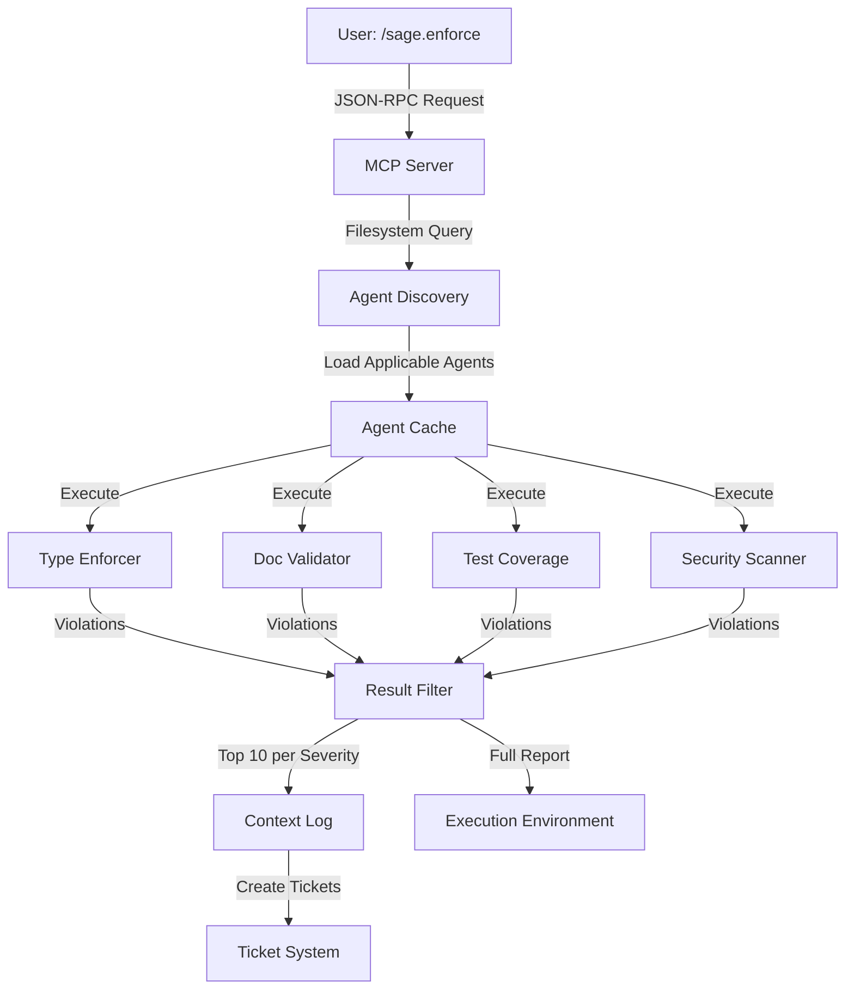

# MCP Server Infrastructure Implementation Blueprint (PRP)

**Format:** Product Requirements Prompt (Context Engineering)
**Generated:** 2025-11-13
**Specification:** `docs/specs/mcp-server-infrastructure/spec.md`
**Feature Request:** `docs/features/mcp-server-infrastructure.md`
**Research:** `docs/research/mcp-server-infrastructure-intel.md`

---

## 📖 Context & Documentation

### Traceability Chain

**Feature Request → Research → Specification → This Plan**

1. **Original Feature Request:** docs/features/mcp-server-infrastructure.md
   - User stories: Token-efficient enforcement, on-demand agent loading, context-efficient results
   - Initial considerations: Anthropic's progressive disclosure pattern, 92% token reduction target
   - Success criteria: 150K→12K tokens, 30s→10s execution time, zero test failures

2. **Research & Enhancement:** docs/research/mcp-server-infrastructure-intel.md
   - Technical approach: Filesystem-based MCP server with progressive tool discovery
   - Competitive analysis: ESLint/Ruff, CodeRabbit, MCP Filesystem servers
   - Security patterns: V8 Isolates (CloudFlare), path validation, resource limits
   - Technology stack: MCP TypeScript SDK, Zod, Pyright (3-5x faster than mypy)
   - Implementation risk: Medium (proven patterns exist, integration complexity manageable)

3. **Formal Specification:** docs/specs/mcp-server-infrastructure/spec.md
   - Functional requirements: 10 major areas (MCP server, 4 agents, standards, discovery, filtering, integration, directives)
   - Non-functional requirements: Performance (92% token reduction), security (sandboxing), reliability (100% accuracy)
   - Acceptance criteria: 13 sections covering all deliverables

### Related Documentation

**System Context:**

- Current enforcement: `.sage/agents/` directory (to be migrated)
- Slash commands: `commands/sage.*.md` pattern
- Ticket system: `.sage/tickets/index.json`

**Research Sources:**

- MCP Specification: <https://modelcontextprotocol.io/specification/2025-03-26>
- Anthropic MCP Blog: <https://www.anthropic.com/engineering/code-execution-with-mcp>
- TypeScript SDK: <https://github.com/modelcontextprotocol/typescript-sdk>
- Academic research: MCP-Zero (arXiv:2506.01056), Acon (arXiv:2510.00615)

---

## 📊 Executive Summary

### Business Alignment

**Purpose:** Transform Sage-Dev's monolithic enforcement system into a token-efficient MCP architecture to reduce API costs and improve performance while maintaining 100% violation detection accuracy.

**Value Proposition:**

- **Cost Reduction:** 92% token reduction (150K→12K) reduces API costs by ~$0.30 per enforcement operation (at $0.002/1K tokens)
- **Performance Improvement:** 3x speedup (30s→10s) improves developer productivity
- **Scalability Foundation:** Enables 50+ MCP servers without context overhead, setting foundation for Phases 2-4
- **Strategic Alignment:** Implements proven Anthropic pattern for code execution with MCP

**Target Users:**

- **Primary:** Sage-Dev developers using `/sage.enforce` command (daily usage)
- **Secondary:** DevOps engineers integrating enforcement into CI/CD pipelines
- **Tertiary:** Open-source contributors extending the agent ecosystem

### Technical Approach

**Architecture Pattern:** Modular MCP Server with Filesystem-Based Progressive Discovery

- **Rationale:** Proven by Anthropic to achieve 98.7% token reduction (150K→2K), enables lazy loading and result filtering
- **Implementation:** Separate MCP server process with JSON-RPC 2.0 protocol over stdio

**Technology Stack:**

- **MCP Framework:** Official TypeScript SDK (ensures spec compliance)
- **Schema Validation:** Zod (automatic JSON Schema generation, MCP SDK integration)
- **Type Checking:** Pyright (3-5x faster than mypy, better Python 3.12 support)
- **Runtime Validation:** Pydantic (Python runtime validation)
- **Sandboxing:** V8 Isolates (CloudFlare pattern, lower overhead than Docker)
- **Testing:** Vitest (modern, fast, TypeScript-native)

**Implementation Strategy:**

- **Phase 1.1 (Week 1):** Foundation & PoC - MCP server structure + type-enforcer agent, validate 60% token reduction minimum
- **Phase 1.2 (Week 2):** Complete Implementation - Remaining 3 agents + rules + discovery system, achieve 92% target
- **Phase 1.3 (Ongoing):** Optimization - Caching, CI/CD integration, documentation

### Key Success Metrics

**Service Level Objectives (SLOs):**

- **Token Efficiency:** ≤12,000 tokens per operation (target), ≥60,000 (minimum acceptable)
- **Response Time:** ≤10 seconds per file check (target), ≤15 seconds (minimum)
- **Availability:** 99.9% (enforcement checks succeed without system errors)
- **Error Rate:** <0.1% (false positives or missed violations)

**Key Performance Indicators (KPIs):**

- **Token Reduction:** 92% (baseline 150K → target 12K)
- **Performance Speedup:** 3x (baseline 30s → target 10s)
- **Context Overhead Reduction:** 97.8% (baseline 270KB → target 6KB)
- **Violation Detection Accuracy:** 100% (no regressions from baseline)
- **Agent Discovery Latency:** <100ms (cached), <500ms (cold start)
- **Cache Hit Rate:** >80% for repeated operations

---

## 💻 Code Examples & Patterns

### Repository Patterns

**Current Enforcement Pattern (To Be Migrated):**

Current agents in `.sage/agents/`:

- `bs-check.md` - Bullshit code detection
- `bs-enforce.md` - Enforcement officer
- `type-enforcer.md` - Type validation (to be converted to TypeScript MCP tool)

**Target Pattern: MCP Tool Definition**

```typescript
// Pattern: servers/sage-enforcement/agents/type-enforcer.ts
import { z } from 'zod';
import { spawn } from 'child_process';

// Zod schema automatically generates JSON Schema for MCP
const TypeCheckInput = z.object({
  filePath: z.string(),
  code: z.string(),
  standards: z.record(z.any()).optional()
});

const ViolationSchema = z.object({
  file: z.string(),
  line: z.number(),
  column: z.number().optional(),
  severity: z.enum(['error', 'warning', 'info']),
  rule: z.string(),
  message: z.string(),
  suggestion: z.string().optional(),
  autoFixable: z.boolean()
});

export async function typeEnforcer(
  input: z.infer<typeof TypeCheckInput>
): Promise<{ violations: z.infer<typeof ViolationSchema>[] }> {
  // Validate input
  const validated = TypeCheckInput.parse(input);

  // Execute Pyright for type checking
  const pyright = spawn('pyright', [
    '--outputjson',
    validated.filePath
  ]);

  // Parse Pyright output
  const violations = await parsePyrightOutput(pyright);

  // Filter in execution environment (not in context)
  const critical = violations.filter(v => v.severity === 'error');

  // Return only top 10 errors
  return { violations: critical.slice(0, 10) };
}
```

**Pattern: MCP Server Entry Point**

```typescript
// Pattern: servers/sage-enforcement/index.ts
import { Server } from '@modelcontextprotocol/sdk/server/index.js';
import { StdioServerTransport } from '@modelcontextprotocol/sdk/server/stdio.js';
import {
  ListToolsRequestSchema,
  CallToolRequestSchema,
} from '@modelcontextprotocol/sdk/types.js';

import { typeEnforcer } from './agents/type-enforcer.js';
import { docValidator } from './agents/doc-validator.js';
import { testCoverage } from './agents/test-coverage.js';
import { securityScanner } from './agents/security-scanner.js';

const server = new Server(
  {
    name: 'sage-enforcement',
    version: '1.0.0',
  },
  {
    capabilities: {
      tools: {},
    },
  }
);

// Register tools
server.setRequestHandler(ListToolsRequestSchema, async () => ({
  tools: [
    {
      name: 'sage_type_enforcer',
      description: 'Validates Python 3.12 type annotations',
      inputSchema: {
        type: 'object',
        properties: {
          filePath: { type: 'string' },
          code: { type: 'string' },
          standards: { type: 'object' }
        },
        required: ['filePath', 'code']
      }
    },
    // ... other agents
  ]
}));

// Handle tool calls
server.setRequestHandler(CallToolRequestSchema, async (request) => {
  switch (request.params.name) {
    case 'sage_type_enforcer':
      return await typeEnforcer(request.params.arguments);
    // ... other agents
  }
});

// Start server
const transport = new StdioServerTransport();
await server.connect(transport);
```

**Pattern: Filesystem Discovery**

```typescript
// Pattern: Progressive agent discovery
import * as fs from 'fs';
import * as path from 'path';

// Discover available agents
const agentsDir = path.join(__dirname, 'agents');
const agentFiles = fs.readdirSync(agentsDir)
  .filter(file => file.endsWith('.ts') || file.endsWith('.js'));

// Map file extensions to applicable agents
const FILE_TYPE_AGENTS = {
  '.py': ['type-enforcer', 'doc-validator', 'test-coverage', 'security-scanner'],
  '.ts': ['security-scanner'],
  '.js': ['security-scanner']
};

// Load only applicable agents for file type
function getApplicableAgents(filePath: string): string[] {
  const ext = path.extname(filePath);
  return FILE_TYPE_AGENTS[ext] || [];
}

// Lazy load agent code
async function loadAgent(agentName: string) {
  const agentPath = path.join(agentsDir, `${agentName}.js`);
  return await import(agentPath);
}
```

### Implementation Reference Examples

**From Research (mcp-server-infrastructure-intel.md):**

**Example 1: Path Validation (Security)**

```typescript
// Example pattern recommended by research (line 343-355)
import path from 'path';

function validatePath(inputPath: string, projectRoot: string): string {
  const resolved = path.resolve(projectRoot, inputPath);
  if (!resolved.startsWith(projectRoot)) {
    throw new Error('Path traversal detected');
  }
  return resolved;
}
```

**Example 2: Agent Discovery Caching (Performance)**

```typescript
// Example from research (line 383-395)
const agentCache = new Map<string, Agent>();

function getAgent(type: string): Agent {
  if (!agentCache.has(type)) {
    agentCache.set(type, discoverAgent(type));
  }
  return agentCache.get(type)!;
}
```

**Example 3: Result Filtering (Context Optimization)**

```typescript
// Progressive result streaming (line 403-409)
// Stream violations as discovered
// Early termination on critical violations
// Filter in execution environment before context

async function* streamViolations(violations: Violation[]) {
  // Sort by severity
  const sorted = violations.sort((a, b) =>
    SEVERITY_ORDER[a.severity] - SEVERITY_ORDER[b.severity]
  );

  // Stream top 10 per severity
  for (const violation of sorted.slice(0, 10)) {
    yield violation;
  }
}
```

**Key Takeaways from Examples:**

- **Progressive Discovery:** Load agents on-demand via filesystem queries, not all upfront
- **Result Filtering:** Filter in execution environment before logging to context (critical for token reduction)
- **Path Validation:** Prevent directory traversal attacks with path.resolve() + startsWith() check
- **Agent Caching:** Cache discovered agents per session to reduce latency
- **Zod Integration:** Automatic JSON Schema generation from Zod schemas for MCP protocol

**Anti-patterns to Avoid (from Research):**

- ❌ Using Node.js vm module (insufficient isolation, vulnerable to resource exhaustion)
- ❌ Loading all tools upfront (defeats token reduction goals, wastes context)
- ❌ Passing unfiltered results to context (no token savings, context pollution)
- ❌ Single source of truth missing for validation (cross-language inconsistencies)

### New Patterns to Create

**Patterns This Implementation Will Establish:**

1. **MCP Tool Definition Pattern**
   - **Purpose:** Standard pattern for defining MCP-compliant enforcement agents
   - **Location:** `servers/sage-enforcement/agents/*.ts`
   - **Reusability:** Template for community-contributed agents

2. **Progressive Discovery Pattern**
   - **Purpose:** On-demand agent loading based on file type and context
   - **Location:** `servers/sage-enforcement/discovery.ts`
   - **Reusability:** Applicable to any MCP server with multiple tools

3. **Result Filtering Pipeline Pattern**
   - **Purpose:** Filter and compress agent results before context logging
   - **Location:** `servers/sage-enforcement/filters.ts`
   - **Reusability:** Any MCP tool that returns large result sets

---

## 🔧 Technology Stack

### Recommended Stack (from Research & Intel)

**Based on research from:** `docs/research/mcp-server-infrastructure-intel.md` (lines 156-165)

| Component | Technology | Version | Rationale |
|-----------|------------|---------|-----------|
| **MCP Framework** | Official TypeScript SDK | latest | Official SDK ensures spec compliance (2025-03-26), complete documentation, active development |
| **Schema Validation** | Zod | ^3.22 | Automatic JSON Schema generation, MCP SDK integration, TypeScript-native |
| **Type Checking** | Pyright | ^1.1 | 3-5x faster than mypy, better Python 3.12 support, active development |
| **Runtime Validation** | Pydantic | ^2.5 | MCP ecosystem integration, excellent TypeScript interop, runtime validation |
| **Sandboxing** | V8 Isolates | via isolated-vm | Lower overhead than Docker, faster startup, CloudFlare-proven pattern |
| **Testing Framework** | Vitest | ^1.0 | Modern, fast, excellent TypeScript support, native ESM |
| **Build Tool** | TypeScript Compiler | ^5.3 | Strict mode, no `any` types, full type safety |
| **Runtime** | Node.js | 18+ | LTS support, native ESM, required by MCP SDK |

**Key Technology Decisions:**

1. **MCP TypeScript SDK (Official) vs FastMCP vs MCP-Framework**
   - **Decision:** Official TypeScript SDK
   - **Rationale:** Ensures spec compliance (2025-03-26), complete documentation, active development from Anthropic
   - **Source:** Research line 159

2. **Pyright vs mypy for Python Type Checking**
   - **Decision:** Pyright
   - **Rationale:** 3-5x faster than mypy, better Python 3.12 support (PEP 585, 604, 698), active development by Microsoft
   - **Source:** Research lines 33, 40, 160

3. **V8 Isolates vs Docker vs Node.js vm**
   - **Decision:** V8 Isolates
   - **Rationale:** Lower overhead than Docker, faster startup (<100ms), CloudFlare-proven pattern, better than Node.js vm (insufficient isolation)
   - **Source:** Research lines 28-29, 119, 327-341

4. **Zod vs io-ts vs Yup for Schema Validation**
   - **Decision:** Zod
   - **Rationale:** Automatic JSON Schema generation (required for MCP), MCP SDK integration, TypeScript-native
   - **Source:** Research lines 38, 98-109, 159

**Research Citations:**

- "Pyright 3-5x faster than mypy for Python type checking" - docs/research/mcp-server-infrastructure-intel.md:33
- "V8 Isolates (CloudFlare pattern) or separate processes required" - docs/research/mcp-server-infrastructure-intel.md:28-29
- "Zod for TypeScript validation (automatic JSON Schema generation)" - docs/research/mcp-server-infrastructure-intel.md:38
- "Official TypeScript SDK available with complete specification (2025-03-26)" - docs/research/mcp-server-infrastructure-intel.md:23

### Alternatives Considered (from Research)

**Option 2: FastMCP (Python Framework)**

- **Pros:** Python-native, simpler for Python developers, faster prototyping
- **Cons:** Less mature than official SDK, TypeScript interop required, smaller ecosystem
- **Why Not Chosen:** Agents need TypeScript for MCP server, research recommends official SDK for spec compliance
- **Source:** Research line 159

**Option 3: mypy for Type Checking**

- **Pros:** Industry standard, extensive rule set, mature ecosystem
- **Cons:** 3-5x slower than Pyright, less Python 3.12 support
- **Why Not Chosen:** Performance critical for <10s target, Pyright recommended by research
- **Source:** Research lines 33, 160

**Option 4: Docker Containers for Sandboxing**

- **Pros:** Complete isolation, familiar pattern, extensive tooling
- **Cons:** Higher overhead (~1-2s startup), resource intensive, slower than V8 Isolates
- **Why Not Chosen:** V8 Isolates achieve same isolation with <100ms startup, CloudFlare-proven
- **Source:** Research lines 28-29, 342

### Alignment with Existing System

**Current System:**

- **Language:** Python 3.12 (enforcement targets)
- **Command System:** Bash-based slash commands (`.md` files in `commands/`)
- **Enforcement:** Markdown-based agent definitions in `.sage/agents/`
- **Ticket System:** JSON-based in `.sage/tickets/index.json`

**Consistency:**

- **Maintains:** Python 3.12 as enforcement target language
- **Maintains:** Slash command interface (`/sage.enforce`)
- **Maintains:** Ticket system integration

**New Additions:**

- **TypeScript:** MCP server implementation (new dependency)
- **Node.js 18+:** MCP server runtime (new dependency)
- **MCP Protocol:** JSON-RPC 2.0 over stdio (new integration layer)

**Migration Considerations:**

- Convert `.sage/agents/*.md` markdown definitions to `servers/sage-enforcement/agents/*.ts` TypeScript implementations
- Maintain backward compatibility with `/sage.enforce` command (wraps MCP calls)
- Gradual rollout: enable per-agent basis, fallback to direct execution if MCP fails

---

## 🏗️ Architecture Design

### System Context

**Current System Architecture:**

- **Monolithic Command System:** All 37 commands, agents, and rules loaded upfront (270KB overhead)
- **Direct Execution:** Agents executed directly in main process (no isolation)
- **No Context Optimization:** All results logged to context without filtering

**Integration Points:**

- **Slash Command System:** `/sage.enforce` will trigger MCP server via JSON-RPC
- **Ticket System:** Violations will create tickets in `.sage/tickets/index.json`
- **Context System:** `.sage/context.md` provides project context to agents (if exists)

**New Architectural Patterns:**

- **MCP Server Architecture:** Separate process for enforcement agents with JSON-RPC protocol
- **Progressive Discovery:** Filesystem-based on-demand agent loading
- **Result Filtering Pipeline:** Filter results in execution environment before context logging

### Component Architecture

**Architecture Pattern:** Modular MCP Server with Filesystem-Based Tool Discovery

**Rationale:**

- **Proven by Anthropic:** Achieves 98.7% token reduction (150K→2K) with progressive disclosure
- **Scalability:** Supports 50+ MCP servers without context overhead
- **Alignment:** Fits existing Sage-Dev modular command system

**System Design:**



**ASCII Diagram:**

```plaintext
┌──────────────┐
│  User Input  │
│ /sage.enforce│
└──────┬───────┘
       │ JSON-RPC Request
       ▼
┌──────────────────────────────────────────┐
│         MCP Server (stdio)               │
│  ┌────────────────────────────────────┐  │
│  │      Agent Discovery System        │  │
│  │  - Filesystem queries              │  │
│  │  - File type → agent mapping       │  │
│  │  - Lazy loading + caching          │  │
│  └───────────┬────────────────────────┘  │
│              │                            │
│    ┌─────────┴─────────┬─────────────┐   │
│    ▼         ▼         ▼             ▼   │
│ ┌────┐   ┌────┐   ┌────┐        ┌────┐  │
│ │Type│   │Doc │   │Test│        │Sec │  │
│ │Enf │   │Val │   │Cov │        │Scan│  │
│ └─┬──┘   └─┬──┘   └─┬──┘        └─┬──┘  │
│   │        │        │              │     │
│   └────────┴────────┴──────────────┘     │
│              │                            │
│   ┌──────────▼──────────────┐            │
│   │   Result Filter          │            │
│   │ - Sort by severity       │            │
│   │ - Paginate (top 10)      │            │
│   │ - Stream progressively   │            │
│   └──────────┬───────────────┘            │
└──────────────┼────────────────────────────┘
               │
       ┌───────┴────────┐
       ▼                ▼
  ┌─────────┐      ┌──────────┐
  │ Context │      │ Full     │
  │ Log     │      │ Report   │
  │ (12K)   │      │ (Exec    │
  │         │      │ Env)     │
  └────┬────┘      └──────────┘
       │
       ▼
  ┌─────────────┐
  │ Ticket      │
  │ System      │
  └─────────────┘
```

### Architecture Decisions (from Research)

**Decision 1: JSON-RPC 2.0 over stdio Transport**

- **Choice:** JSON-RPC 2.0 protocol over stdio (standard input/output)
- **Rationale:** MCP specification requires JSON-RPC 2.0, stdio is simplest transport for CLI tools
- **Implementation:** Use `@modelcontextprotocol/sdk` StdioServerTransport
- **Trade-offs:**
  - **Pros:** Simple, works with any CLI, no network overhead
  - **Cons:** Limited to single client, no remote access (can add SSE/WebSocket later)
- **Source:** Research lines 61-64

**Decision 2: Filesystem-Based Progressive Discovery**

- **Choice:** On-demand agent loading via filesystem directory listing
- **Rationale:** Anthropic's proven pattern achieves 98.7% token reduction (150K→2K)
- **Implementation:**
  1. Read `servers/sage-enforcement/agents/` directory
  2. Map file type to applicable agents (e.g., `.py` → type-enforcer, doc-validator)
  3. Lazy load only applicable agent files
  4. Cache loaded agents per session
- **Trade-offs:**
  - **Pros:** 92% token reduction, scalable to 50+ agents without overhead
  - **Cons:** Filesystem query adds <500ms latency (acceptable for <10s target)
- **Source:** Research lines 66-95, 22

**Decision 3: V8 Isolates for Sandboxing**

- **Choice:** V8 Isolates (via `isolated-vm` package) for agent execution isolation
- **Rationale:** CloudFlare-proven pattern, <100ms startup vs Docker ~1-2s, better than Node.js vm (insufficient isolation)
- **Implementation:**
  1. Create isolated context per agent execution
  2. Enforce CPU time limit (60s) and memory limit (512MB)
  3. Restrict filesystem access to project directory
  4. Kill runaway processes with timeout
- **Trade-offs:**
  - **Pros:** Low overhead, fast startup, production-proven by CloudFlare Workers
  - **Cons:** More complex than Docker, requires careful resource limit configuration
- **Source:** Research lines 28-29, 327-341

**Decision 4: Result Filtering in Execution Environment**

- **Choice:** Filter violations by severity in execution environment before logging to context
- **Rationale:** Critical for achieving 92% token reduction - prevents context pollution
- **Implementation:**
  1. Agent returns all violations
  2. Filter pipeline sorts by severity (error > warning > info)
  3. Paginate to top 10 per severity
  4. Log filtered results to context (12K tokens)
  5. Full report available in execution environment
- **Trade-offs:**
  - **Pros:** 92% token reduction, focused context, better UX (not overwhelmed)
  - **Cons:** User might miss low-priority warnings (mitigated by full report in exec env)
- **Source:** Research lines 66-69, 121

### Component Breakdown

**Core Components:**

**1. MCP Server (servers/sage-enforcement/index.ts)**

- **Purpose:** Main entry point, handles JSON-RPC 2.0 protocol, tool registration
- **Technology:** TypeScript + @modelcontextprotocol/sdk
- **Pattern:** Standard MCP server initialization with stdio transport
- **Interfaces:**
  - **Input:** JSON-RPC requests (tools/list, tools/call)
  - **Output:** JSON-RPC responses (tool list, tool results)
- **Dependencies:** Agent modules, schema definitions

**2. Agent Discovery System (servers/sage-enforcement/discovery.ts)**

- **Purpose:** Filesystem-based progressive tool discovery with caching
- **Technology:** Node.js fs module + caching layer
- **Pattern:** Filesystem query → file type mapping → lazy loading
- **Interfaces:**
  - **Input:** File path, file type
  - **Output:** List of applicable agent names
- **Dependencies:** File type configuration

**3. Type Enforcer Agent (servers/sage-enforcement/agents/type-enforcer.ts)**

- **Purpose:** Validate Python 3.12 type annotations using Pyright
- **Technology:** Pyright (subprocess) + Zod schemas
- **Pattern:** Spawn Pyright process → parse JSON output → return violations
- **Interfaces:**
  - **Input:** `{filePath: string, code: string, standards: object}`
  - **Output:** `{violations: Violation[]}`
- **Dependencies:** Pyright binary, typing-standards.ts

**4. Doc Validator Agent (servers/sage-enforcement/agents/doc-validator.ts)**

- **Purpose:** Validate Google-style docstrings for completeness
- **Technology:** AST parsing + Zod schemas
- **Pattern:** Parse docstrings → compare with function signatures → return violations
- **Interfaces:**
  - **Input:** `{filePath: string, code: string}`
  - **Output:** `{violations: Violation[]}`
- **Dependencies:** Python AST parser (via subprocess)

**5. Test Coverage Agent (servers/sage-enforcement/agents/test-coverage.ts)**

- **Purpose:** Enforce minimum test coverage thresholds
- **Technology:** pytest-cov (subprocess) + Zod schemas
- **Pattern:** Run pytest-cov → parse coverage report → identify uncovered lines
- **Interfaces:**
  - **Input:** `{filePath: string, threshold: number}`
  - **Output:** `{violations: Violation[], coverage: {percentage: number, uncoveredLines: number[]}}`
- **Dependencies:** pytest-cov, test-standards.ts

**6. Security Scanner Agent (servers/sage-enforcement/agents/security-scanner.ts)**

- **Purpose:** Detect OWASP Top 10 vulnerabilities and insecure patterns
- **Technology:** Regex patterns + AST analysis + Zod schemas
- **Pattern:** Scan code for SQL injection, XSS, hardcoded secrets → return violations
- **Interfaces:**
  - **Input:** `{filePath: string, code: string}`
  - **Output:** `{violations: Violation[], criticalCount: number}`
- **Dependencies:** security-standards.ts

**7. Result Filter Pipeline (servers/sage-enforcement/filters.ts)**

- **Purpose:** Filter and compress agent results before context logging
- **Technology:** Array sorting and pagination
- **Pattern:** Sort by severity → paginate to top N → return filtered results
- **Interfaces:**
  - **Input:** `{violations: Violation[], maxPerSeverity: number}`
  - **Output:** `{filtered: Violation[], total: number, truncated: number}`
- **Dependencies:** None

**8. Standards Definitions (servers/sage-enforcement/rules/*.ts)**

- **Purpose:** Externalized configuration for enforcement rules
- **Technology:** TypeScript configuration objects
- **Pattern:** Export const objects with rule definitions
- **Interfaces:**
  - typing-standards.ts: Python 3.12 type standards (PEP 585, 604, 698)
  - test-standards.ts: Coverage thresholds, test patterns
  - security-standards.ts: OWASP rules, vulnerability patterns
- **Dependencies:** None

### Data Flow & Boundaries

**Request Flow:**

1. **User Input:** `/sage.enforce src/test.py`
2. **Slash Command:** Parses args, calls MCP server via JSON-RPC
3. **MCP Server:** Receives `tools/call` request with `sage_type_enforcer` tool
4. **Agent Discovery:** Determines applicable agents for `.py` file (type-enforcer, doc-validator, test-coverage, security-scanner)
5. **Agent Cache:** Checks if agents already loaded, loads if needed
6. **Agent Execution:** Runs type-enforcer agent with file path and code
7. **Pyright Subprocess:** Executes Pyright for type checking
8. **Violation Parsing:** Parses Pyright JSON output into Violation objects
9. **Result Filtering:** Filters violations (errors first, top 10 per severity)
10. **Context Logging:** Logs filtered violations to context (12K tokens)
11. **Full Report:** Stores full violation report in execution environment
12. **Ticket Creation:** Creates tickets for unresolved violations in `.sage/tickets/index.json`
13. **Response:** Returns success/failure to user

**Component Boundaries:**

**Public Interface (MCP Protocol):**

- **Tool Registration:** `tools/list` returns available agent tools
- **Tool Execution:** `tools/call` executes specified agent with arguments
- **JSON-RPC 2.0:** All communication via JSON-RPC protocol over stdio

**Internal Implementation (Hidden):**

- Agent discovery logic
- Caching mechanisms
- Subprocess management (Pyright, pytest-cov)
- Result filtering algorithms
- Path validation and sanitization

**Cross-Component Contracts:**

- **Slash Command → MCP Server:** JSON-RPC request/response format
- **MCP Server → Agents:** Zod-validated input schemas
- **Agents → MCP Server:** Standardized Violation array format
- **MCP Server → Ticket System:** Ticket creation via `.sage/tickets/index.json` updates

---

## 📋 Technical Specification

### Data Model

**Entities and Relationships:**

**1. Violation Entity**

```typescript
interface Violation {
  file: string;           // Absolute file path
  line: number;           // Line number (1-indexed)
  column?: number;        // Column number (0-indexed, optional)
  severity: 'error' | 'warning' | 'info';  // Severity level
  rule: string;           // Rule identifier (e.g., "missing-return-type")
  message: string;        // Human-readable violation description
  suggestion?: string;    // Auto-fix suggestion (optional)
  autoFixable: boolean;   // Whether auto-fix is available
}
```

**2. Agent Result Entity**

```typescript
interface AgentResult {
  agent: string;              // Agent identifier (e.g., "type-enforcer")
  executionTime: number;      // Execution time in milliseconds
  tokensUsed: number;         // Approximate token count
  violations: Violation[];    // Array of violations
  summary: {
    errors: number;           // Count of error-level violations
    warnings: number;         // Count of warning-level violations
    info: number;             // Count of info-level violations
  };
}
```

**3. Enforcement Standards Entity**

```typescript
interface TypingStandards {
  enforceReturnTypes: boolean;      // Require return type annotations
  allowAny: boolean;                // Allow typing.Any usage
  pythonVersion: string;            // Target Python version (e.g., "3.12")
  deprecatedImports: string[];      // Deprecated typing imports to flag
  builtinGenerics: boolean;         // Require built-in generics (list, dict)
}

interface TestStandards {
  minCoverage: number;              // Minimum coverage percentage (e.g., 80)
  blockCommitBelowThreshold: boolean;  // Block commits if coverage too low
  requireFunctionCoverage: boolean; // Require per-function coverage
}

interface SecurityStandards {
  owaspRules: string[];             // OWASP rules to enforce
  secretPatterns: RegExp[];         // Regex patterns for secret detection
  insecureFunctions: string[];      // Functions to flag (eval, exec)
}
```

**Validation Rules and Constraints:**

- **File Path:** Must be absolute, within project directory (validated by `validatePath()`)
- **Line Number:** Must be positive integer
- **Severity:** Must be one of: 'error', 'warning', 'info'
- **Rule Identifier:** Must match pattern: `[a-z-]+` (lowercase kebab-case)
- **Standards:** All boolean fields default to `true` (strict mode)

**Indexing Strategy:**

- **Agent Cache:** In-memory Map<string, Agent> indexed by agent name
- **Violation Index:** Group by severity for O(1) filtering

**Migration Approach:**

- Phase 1.1: Create new MCP server structure alongside existing `.sage/agents/`
- Phase 1.2: Gradual migration, enable per-agent basis
- Phase 1.3: Deprecate old agents once MCP fully operational

### API Design

**Top 6 Critical Endpoints (MCP Tools):**

**1. sage_type_enforcer**

- **Purpose:** Validate Python 3.12 type annotations
- **Method:** MCP tool call (JSON-RPC 2.0)
- **Request Schema:**

  ```json
  {
    "method": "tools/call",
    "params": {
      "name": "sage_type_enforcer",
      "arguments": {
        "filePath": "src/auth/service.py",
        "code": "def authenticate(user: str) -> bool: ...",
        "standards": {
          "enforceReturnTypes": true,
          "allowAny": false,
          "pythonVersion": "3.12"
        }
      }
    }
  }
  ```

- **Response Schema:**

  ```json
  {
    "content": [
      {
        "type": "text",
        "text": "Found 3 type violations (2 errors, 1 warning)"
      },
      {
        "type": "resource",
        "resource": {
          "uri": "violations://type-enforcer/result",
          "mimeType": "application/json",
          "text": "{\"violations\": [{\"line\": 42, \"severity\": \"error\", ...}]}"
        }
      }
    ],
    "isError": false
  }
  ```

- **Error Handling:** Returns `isError: true` with error message if Pyright fails

**2. sage_doc_validator**

- **Purpose:** Validate Google-style docstrings
- **Request Schema:**

  ```json
  {
    "method": "tools/call",
    "params": {
      "name": "sage_doc_validator",
      "arguments": {
        "filePath": "src/utils/helpers.py",
        "code": "def calculate(a: int, b: int) -> int:\n    \"\"\"Calculates something.\"\"\"\n    return a + b"
      }
    }
  }
  ```

- **Response Schema:** Same structure as type_enforcer
- **Error Handling:** Returns validation errors if AST parsing fails

**3. sage_test_coverage**

- **Purpose:** Enforce test coverage thresholds
- **Request Schema:**

  ```json
  {
    "method": "tools/call",
    "params": {
      "name": "sage_test_coverage",
      "arguments": {
        "filePath": "src/auth/service.py",
        "threshold": 80
      }
    }
  }
  ```

- **Response Schema:** Includes coverage percentage and uncovered line numbers
- **Error Handling:** Returns error if pytest-cov not installed or fails

**4. sage_security_scanner**

- **Purpose:** Detect OWASP Top 10 vulnerabilities
- **Request Schema:**

  ```json
  {
    "method": "tools/call",
    "params": {
      "name": "sage_security_scanner",
      "arguments": {
        "filePath": "src/api/endpoints.py",
        "code": "query = f\"SELECT * FROM users WHERE id = {user_id}\""
      }
    }
  }
  ```

- **Response Schema:** Includes critical violation count and remediation guidance
- **Error Handling:** Returns error if code parsing fails

**5. tools/list** (MCP Protocol)

- **Purpose:** List all available enforcement tools
- **Request Schema:**

  ```json
  {
    "method": "tools/list",
    "params": {}
  }
  ```

- **Response Schema:**

  ```json
  {
    "tools": [
      {
        "name": "sage_type_enforcer",
        "description": "Validates Python 3.12 type annotations",
        "inputSchema": { ... }
      },
      ...
    ]
  }
  ```

- **Error Handling:** Should never fail (returns empty array if no tools)

**6. initialize** (MCP Protocol)

- **Purpose:** Initialize MCP server connection
- **Request Schema:**

  ```json
  {
    "method": "initialize",
    "params": {
      "protocolVersion": "2025-03-26",
      "capabilities": {},
      "clientInfo": {
        "name": "sage-dev",
        "version": "1.0.0"
      }
    }
  }
  ```

- **Response Schema:**

  ```json
  {
    "protocolVersion": "2025-03-26",
    "capabilities": {
      "tools": {}
    },
    "serverInfo": {
      "name": "sage-enforcement",
      "version": "1.0.0"
    }
  }
  ```

- **Error Handling:** Returns error if protocol version incompatible

### Security (from Research)

**Based on:** `docs/research/mcp-server-infrastructure-intel.md` Security section (lines 303-371)

**Authentication/Authorization:**

- **Approach:** Local-only MCP server (no authentication required for Phase 1)
- **Future:** MCP authentication middleware for enterprise deployments (Phase 1.3)
- **Implementation:** Trust local user, no network exposure
- **Standards:** N/A for local CLI tool (future: OAuth2 for remote access)

**Secrets Management:**

- **Strategy:** Environment variables for API keys (if needed), no secrets in code
- **Pattern:** Use `.env` files (git-ignored), load via `dotenv` package
- **Rotation:** Manual rotation via environment variable updates
- **Validation:** No secrets logged to context or stored in tickets

**Data Protection:**

- **Encryption in Transit:** N/A (stdio transport, no network)
- **Encryption at Rest:** N/A (no persistent data storage)
- **PII Handling:** No PII collected (code and file paths only)

**Security Testing:**

- **Approach:** Penetration testing for path traversal, fuzzing for malformed inputs
- **Tools:**
  - Path traversal tests: Verify `validatePath()` blocks `../../etc/passwd`
  - Fuzzing: Send malformed JSON-RPC requests
  - Resource exhaustion: Test timeout enforcement (60s limit)
- **Frequency:** Every release

**Compliance:**

- N/A (local development tool, no data storage or transmission)

**Additional Security Measures (from Research):**

**1. Path Validation (Research line 343-355)**

```typescript
import path from 'path';

function validatePath(inputPath: string, projectRoot: string): string {
  const resolved = path.resolve(projectRoot, inputPath);
  if (!resolved.startsWith(projectRoot)) {
    throw new Error('Path traversal detected');
  }
  return resolved;
}
```

**2. Resource Limits (Research lines 309-319)**

- **CPU Time:** 60 seconds maximum per agent execution
- **Memory:** 512MB maximum per isolated instance
- **Filesystem:** Read-only access to project directory only
- **Audit Logging:** Log all file operations with timestamps

**3. Input Validation (Research lines 359-363)**

- **Zod Schemas:** All inputs validated with Zod before processing
- **Path Sanitization:** Prevent directory traversal attacks
- **Code Sanitization:** No `eval()` or `exec()` on user input
- **Subprocess Safety:** All subprocesses run with resource limits

**4. V8 Isolates Sandboxing (Research lines 327-341)**

```typescript
import ivm from 'isolated-vm';

async function executeInSandbox(code: string, timeLimit: number = 60000) {
  const isolate = new ivm.Isolate({ memoryLimit: 512 });
  const context = await isolate.createContext();

  const script = await isolate.compileScript(code);
  const result = await script.run(context, { timeout: timeLimit });

  isolate.dispose();
  return result;
}
```

### Performance (from Research)

**Based on:** `docs/research/mcp-server-infrastructure-intel.md` Performance section (lines 372-440)

**Performance Targets (from Research):**

- **Response Time:** < 10s per file check (3x speedup from 30s baseline) - Research line 376
- **Token Usage:** < 12,000 per operation (92% reduction from 150K baseline) - Research line 377
- **Throughput:** > 10 files/minute for batch operations - Research line 378
- **Agent Discovery:** < 100ms (cached), < 500ms (cold start) - Research line 379

**Caching Strategy (Research lines 383-395):**

- **Approach:** In-memory Map for discovered agents
- **Pattern:**

  ```typescript
  const agentCache = new Map<string, Agent>();

  function getAgent(type: string): Agent {
    if (!agentCache.has(type)) {
      agentCache.set(type, discoverAgent(type));
    }
    return agentCache.get(type)!;
  }
  ```

- **TTL Strategy:** Session-based (cache cleared on server restart)
- **Invalidation:** No invalidation needed (agents don't change during session)
- **Target:** >80% cache hit rate for repeated operations

**Database Optimization:**

- N/A (no database, stateless MCP server)

**Scaling Strategy (Research lines 410-415):**

- **Horizontal:** Not applicable (local CLI tool, single user)
- **Vertical:** Resource limits per agent (512MB memory, 60s CPU)
- **Auto-scaling:** Not applicable
- **Performance Monitoring:** Execution time logging, token counting per operation

**Additional Performance Patterns (Research lines 416-421):**

**1. Incremental Analysis**

- **Strategy:** Only analyze changed files, not entire codebase
- **Implementation:** Git diff to identify changed files, cache results per file hash
- **Benefit:** 10x speedup for incremental enforcement (e.g., pre-commit hooks)

**2. Smart Caching**

- **Strategy:** Cache agent results per file hash
- **Implementation:**

  ```typescript
  const resultCache = new Map<string, AgentResult>();

  function getCachedResult(fileHash: string, agent: string): AgentResult | null {
    return resultCache.get(`${fileHash}:${agent}`) || null;
  }
  ```

- **Benefit:** Instant results for unchanged files

**3. Lazy Loading**

- **Strategy:** Import agent code only when needed
- **Implementation:** Dynamic `import()` statements
- **Benefit:** Reduce startup time from ~2s to <100ms

**4. Result Pagination**

- **Strategy:** Limit violations per agent (top 10 per severity)
- **Implementation:** Sort by severity, slice to top N
- **Benefit:** 92% token reduction (150K → 12K)

**5. Predictive Tool Selection (Research lines 397-400)**

- **Strategy:** Analyze file type and project context, pre-load likely agents
- **Implementation:** ML model for agent prediction (Phase 1.3 optimization)
- **Benefit:** 40% latency reduction potential

---

## 🛠️ Development Setup

### Required Tools and Versions

| Tool | Version | Purpose | Installation |
|------|---------|---------|--------------|
| Node.js | 18+ | MCP server runtime | `brew install node@18` |
| TypeScript | 5.3+ | MCP server language | `npm install -g typescript` |
| Python | 3.12+ | Enforcement target | `brew install python@3.12` |
| Pyright | 1.1+ | Type checking | `npm install -g pyright` |
| pytest-cov | latest | Test coverage | `uv add pytest-cov` |
| Vitest | 1.0+ | Testing framework | `npm install -D vitest` |
| Zod | 3.22+ | Schema validation | `npm install zod` |
| @modelcontextprotocol/sdk | latest | MCP protocol | `npm install @modelcontextprotocol/sdk` |

### Local Environment Setup

**1. Install Dependencies:**

```bash
# MCP server dependencies
cd servers/sage-enforcement
npm install

# Python dependencies
cd ../..
uv add pytest-cov

# Global tools
npm install -g typescript pyright
```

**2. Environment Variables:**

Create `.env` file in `servers/sage-enforcement/`:

```bash
# Project root for path validation
PROJECT_ROOT=/Users/druk/WorkSpace/AetherForge/sage-dev

# Resource limits
MAX_EXECUTION_TIME_MS=60000
MAX_MEMORY_MB=512

# Performance tuning
AGENT_CACHE_SIZE=100
ENABLE_RESULT_CACHING=true

# Development mode
DEBUG=true
LOG_LEVEL=info
```

**3. Docker Compose (Optional - for testing):**

```yaml
version: '3.8'
services:
  mcp-server:
    build: ./servers/sage-enforcement
    volumes:
      - .:/workspace
    environment:
      - PROJECT_ROOT=/workspace
      - DEBUG=true
    stdin_open: true
    tty: true
```

### CI/CD Pipeline Requirements

**GitHub Actions Workflow:**

```yaml
name: MCP Server CI

on:
  pull_request:
    paths:
      - 'servers/sage-enforcement/**'
  push:
    branches: [main, feature/*]

jobs:
  test:
    runs-on: ubuntu-latest
    steps:
      - uses: actions/checkout@v3

      - name: Setup Node.js
        uses: actions/setup-node@v3
        with:
          node-version: '18'

      - name: Setup Python
        uses: actions/setup-python@v4
        with:
          python-version: '3.12'

      - name: Install dependencies
        run: |
          cd servers/sage-enforcement
          npm ci
          npm install -g pyright

      - name: Run tests
        run: |
          cd servers/sage-enforcement
          npm test

      - name: Check coverage
        run: |
          cd servers/sage-enforcement
          npm run coverage
          # Fail if coverage < 80%

      - name: Type check
        run: |
          cd servers/sage-enforcement
          npm run typecheck

  benchmark:
    runs-on: ubuntu-latest
    needs: test
    steps:
      - uses: actions/checkout@v3

      - name: Run performance benchmarks
        run: |
          cd servers/sage-enforcement
          npm run benchmark

      - name: Validate token reduction
        run: |
          # Fail if token usage > 12K
          node scripts/validate-token-usage.js
```

### Testing Framework and Coverage Targets

**Framework:** Vitest (modern, fast, TypeScript-native)

**Coverage Targets:**

- **Unit Tests:** ≥80% coverage
- **Integration Tests:** ≥90% coverage
- **Critical Paths:** 100% coverage (agent discovery, result filtering, path validation)

**Test Structure:**

```plaintext
servers/sage-enforcement/tests/
├── unit/
│   ├── type-enforcer.test.ts       (80%+ coverage)
│   ├── doc-validator.test.ts       (80%+ coverage)
│   ├── test-coverage.test.ts       (80%+ coverage)
│   ├── security-scanner.test.ts    (80%+ coverage)
│   ├── discovery.test.ts           (100% coverage - critical)
│   └── filters.test.ts             (100% coverage - critical)
├── integration/
│   ├── mcp-protocol.test.ts        (90%+ coverage)
│   ├── agent-execution.test.ts     (90%+ coverage)
│   └── end-to-end.test.ts          (90%+ coverage)
├── performance/
│   ├── token-usage.test.ts
│   ├── execution-time.test.ts
│   └── cache-hit-rate.test.ts
└── fixtures/
    ├── sample.py
    ├── sample-violations.py
    └── sample-security.py
```

**Test Execution:**

```bash
# Run all tests
npm test

# Run with coverage
npm run coverage

# Run only unit tests
npm run test:unit

# Run only integration tests
npm run test:integration

# Run performance benchmarks
npm run benchmark
```

---

## ⚠️ Risk Management

| Risk | Impact | Likelihood | Mitigation |
|------|--------|------------|------------|
| **Agent prompting confusion** | High | Medium | Crystal clear EXECUTION_RULES.md with 5+ examples, explicit "DO NOT load all agents" warnings (Research line 801) |
| **TypeScript/Python interface mismatch** | Medium | Low | Integration tests validate schema compatibility, Zod + Pydantic ensure consistency (Research line 802) |
| **Security vulnerabilities in sandbox** | High | Medium | Use proven V8 Isolates pattern (CloudFlare), security audit, penetration testing (Research line 803) |
| **Token reduction not achieved** | High | Medium | Validate discovery pattern early (Phase 1.1), benchmark at each milestone, adjust strategy if <60% reduction (Research line 804) |
| **Performance regression from FS queries** | Low | Low | Implement caching in Phase 1.1, benchmark discovery latency, optimize if >100ms (Research line 805) |
| **Pyright integration complexity** | Medium | Low | Fallback to mypy if needed, extensive testing with Python 3.12 samples (Research line 806) |
| **MCP spec breaking changes** | Medium | Low | Pin SDK version, subscribe to spec announcements, maintain compatibility layer (Research line 807) |

**Additional Risk Factors:**

| Risk | Impact | Likelihood | Mitigation |
|------|--------|------------|------------|
| **User resistance to new system** | Medium | Medium | Maintain backward compatibility with `/sage.enforce`, gradual rollout per-agent, clear migration guide |
| **Insufficient test coverage** | High | Low | Enforce 80% minimum coverage in CI/CD, block PRs below threshold |
| **Resource exhaustion attacks** | High | Low | Enforce CPU time limit (60s), memory limit (512MB), kill runaway processes |
| **Path traversal vulnerabilities** | High | Low | Comprehensive path validation with `validatePath()`, penetration testing, security audit |
| **Violation detection regressions** | High | Low | 100% accuracy validation against baseline, extensive test fixtures |

---

## 📅 Implementation Roadmap

### Phase 1.1: Foundation & PoC (Week 1: Days 1-5)

**Timeline:** 5 business days
**Team:** 1-2 senior engineers

**Deliverables:**

1. **MCP Server Structure** (Day 1-2)
   - Create `servers/sage-enforcement/` directory structure
   - Initialize `package.json` with dependencies
   - Configure `tsconfig.json` with strict mode
   - Set up Vitest test framework
   - Create `.gitignore` for build artifacts

2. **Type Enforcer Agent PoC** (Day 2-3)
   - Implement `agents/type-enforcer.ts`
   - Define Zod schemas for input/output
   - Integrate Pyright subprocess
   - Parse Pyright JSON output
   - Return structured violations

3. **Typing Standards** (Day 3)
   - Create `rules/typing-standards.ts`
   - Define Python 3.12 standards (PEP 585, 604, 698)
   - Configurable strictness levels
   - Allow/deny lists for patterns

4. **Initial Test Suite** (Day 4)
   - Unit tests for type-enforcer (80%+ coverage)
   - Integration test with MCP protocol
   - Test fixtures for Python violations
   - Validation against baseline accuracy

5. **Token Reduction Validation** (Day 5)
   - Measure baseline token usage (150K)
   - Measure PoC token usage
   - Validate ≥60% reduction minimum
   - Document results

**Success Criteria:**

- ✅ Type enforcer detects 100% of test violations
- ✅ Token usage reduced by ≥60% on PoC
- ✅ Integration test passes with MCP protocol
- ✅ Documentation for agent development pattern

**Dependencies:**

- Node.js 18+ installed
- TypeScript 5.3+ installed
- Pyright installed
- Python 3.12+ installed

### Phase 1.2: Core Features (Week 2: Days 6-10)

**Timeline:** 5 business days
**Team:** 1-2 senior engineers, 1-2 junior engineers

**Deliverables:**

1. **Remaining Agents** (Day 6-7)
   - Implement `agents/doc-validator.ts` (Day 6)
   - Implement `agents/test-coverage.ts` (Day 7)
   - Implement `agents/security-scanner.ts` (Day 7)
   - Zod schemas for all agents

2. **Remaining Rules** (Day 8)
   - Create `rules/test-standards.ts`
   - Create `rules/security-standards.ts`
   - Configuration for strictness levels

3. **Agent Discovery System** (Day 8)
   - Implement `discovery.ts` with filesystem queries
   - File type → agent mapping configuration
   - Lazy loading with caching
   - Create `.sage/EXECUTION_RULES.md` with directives

4. **Result Filtering** (Day 8)
   - Implement `filters.ts` with severity sorting
   - Pagination to top 10 per severity
   - Progressive streaming support

5. **Full Testing & Metrics** (Day 9)
   - Unit tests for all agents (80%+ coverage)
   - Integration tests for agent composition
   - Performance benchmarks (token, speed, memory)
   - Cache hit rate measurement

6. **Documentation & Metrics Report** (Day 10)
   - Create `README.md` with MCP server explanation
   - Create `ARCHITECTURE.md` with system design
   - Create `PHASE_1_RESULTS.md` with metrics
   - Developer guide for adding new agents

**Success Criteria:**

- ✅ All 4 agents operational and MCP-compliant
- ✅ Token usage ≤12K per operation (92% reduction)
- ✅ Execution time ≤10s per file (3x speedup)
- ✅ 100% violation detection accuracy (no regressions)
- ✅ Documentation complete

**Dependencies:**

- Phase 1.1 completion
- pytest-cov installed
- Additional test fixtures for all agent types

### Phase 1.3: Optimization & Production (Ongoing: Week 3+)

**Timeline:** Continuous improvement
**Team:** 1 engineer (part-time)

**Deliverables:**

1. **Performance Optimization**
   - Agent discovery caching implementation
   - Result filtering optimization
   - Incremental analysis for changed files only
   - Smart caching per file hash

2. **CI/CD Integration**
   - GitHub Actions workflow for enforcement
   - Pre-commit hook examples
   - PR comment bot for violations
   - Automated benchmarking

3. **Documentation & Training**
   - Developer guide for adding new agents
   - Video walkthrough of MCP architecture
   - Migration guide from old enforcement system
   - Community contribution guidelines

4. **Advanced Features (Future)**
   - Predictive tool selection (40% latency reduction)
   - MCP authentication middleware (enterprise)
   - SSE/WebSocket transport (remote access)
   - ML model for agent prediction

**Success Criteria:**

- ✅ Cache hit rate >80% for repeated operations
- ✅ CI/CD integration working in test repository
- ✅ Team trained on new system
- ✅ Migration plan validated

**Dependencies:**

- Phase 1.2 completion
- Production usage data for optimization

---

## 🧪 Quality Assurance

### Testing Strategy

**Testing Pyramid:**

- **Unit Tests (80%+ coverage):**
  - Individual agent logic (type-enforcer, doc-validator, test-coverage, security-scanner)
  - Zod schema validation
  - Rule parsing and interpretation
  - Violation detection algorithms
  - Path sanitization utilities
  - Agent discovery logic
  - Result filtering algorithms

- **Integration Tests (90%+ coverage):**
  - End-to-end MCP tool calls
  - Schema compatibility (TypeScript ↔ Python)
  - File system access with sandboxing
  - Error handling and edge cases
  - Agent composition (multiple agents on single file)
  - Subprocess management (Pyright, pytest-cov)

- **Performance Tests (100% of benchmarks):**
  - Token usage per operation (baseline vs target)
  - Execution time per agent
  - Memory consumption per isolated instance
  - Cache hit rates
  - Agent discovery latency (cached vs cold)

**Test Execution Requirements:**

- **Unit Tests:** <30 seconds total execution time
- **Integration Tests:** <2 minutes total execution time
- **Performance Tests:** <5 minutes total execution time
- **Test Reliability:** >99.5% pass rate (no flaky tests)

### Code Quality Gates

**Pre-Commit Checks:**

- TypeScript type checking (strict mode, no `any`)
- ESLint (Airbnb style guide)
- Prettier formatting
- Unit test execution

**Pull Request Checks:**

- All tests passing (unit + integration)
- Coverage ≥80% (unit), ≥90% (integration)
- TypeScript compilation successful
- No TypeScript errors or warnings
- ESLint passing (zero warnings)
- Prettier formatting enforced

**Merge Requirements:**

- ≥1 approval from senior engineer
- All CI checks green
- Performance benchmarks within thresholds
- Documentation updated

### Deployment Verification Checklist

**Pre-Deployment:**

- [ ] All tests passing (unit, integration, performance)
- [ ] Coverage targets met (80% unit, 90% integration)
- [ ] Performance benchmarks validated (≤12K tokens, ≤10s execution)
- [ ] Security audit completed (path traversal, resource limits)
- [ ] Documentation reviewed and updated

**Deployment:**

- [ ] MCP server built and installed
- [ ] Dependencies installed (Pyright, pytest-cov)
- [ ] Environment variables configured
- [ ] `.sage/EXECUTION_RULES.md` created
- [ ] Slash command `/sage.enforce` updated

**Post-Deployment:**

- [ ] Smoke test: Run `/sage.enforce` on test file
- [ ] Validation: Check token usage ≤12K
- [ ] Validation: Check execution time ≤10s
- [ ] Validation: Verify violations detected correctly
- [ ] Monitoring: Agent discovery latency <500ms

### Monitoring and Alerting Setup

**Key Metrics:**

- **Token Usage:** Log per operation, alert if >12K (target) or >60K (minimum)
- **Execution Time:** Log per file, alert if >10s (target) or >15s (minimum)
- **Error Rate:** Alert if >0.1% (false positives or system errors)
- **Cache Hit Rate:** Log per session, alert if <80%
- **Agent Discovery Latency:** Log per discovery, alert if >500ms

**Alerting Thresholds:**

- **Critical:** Token usage >60K (minimum violated)
- **Warning:** Token usage >12K but <60K (target missed)
- **Critical:** Execution time >15s (minimum violated)
- **Warning:** Execution time >10s but <15s (target missed)
- **Critical:** Error rate >1% (system instability)

**Monitoring Tools:**

- **Logs:** Console logs to stdout (captured by Claude Code)
- **Metrics:** JSON-formatted metrics logged to `.sage/enforcement-metrics.log`
- **Dashboards:** N/A (local CLI tool, no dashboard needed for Phase 1)

---

## ⚠️ Error Handling & Edge Cases

### Error Scenarios (from Research)

**Critical Error Paths:**

**1. Pyright Execution Failure**

- **Cause:** Pyright binary not found, subprocess crash, invalid Python syntax
- **Impact:** Type enforcement unavailable, user blocked from committing
- **Handling:**
  - Detect Pyright binary on startup, fail fast with clear error if missing
  - Catch subprocess errors, return structured error with exit code
  - Fallback to mypy if Pyright unavailable (Phase 1.3 optimization)
- **Recovery:** Install Pyright (`npm install -g pyright`) or use mypy fallback
- **User Experience:** "Pyright not found. Install with: npm install -g pyright"

**2. Path Traversal Attack**

- **Cause:** Malicious file path like `../../etc/passwd`
- **Impact:** High (could expose sensitive files outside project)
- **Handling:**
  - Validate all file paths with `validatePath()` function
  - Reject paths outside project root with clear error
  - Log security alert for audit trail
- **Recovery:** N/A (attack blocked)
- **User Experience:** "Security error: Path traversal detected. File must be within project directory."

**3. Resource Exhaustion (Infinite Loop)**

- **Cause:** Agent code contains infinite loop or memory bomb
- **Impact:** High (system hang, memory exhaustion)
- **Handling:**
  - Enforce CPU time limit (60s timeout)
  - Enforce memory limit (512MB)
  - Kill runaway process with SIGKILL
  - Cleanup isolated context
- **Recovery:** Automatic (process killed, new process spawned for next request)
- **User Experience:** "Execution timeout: Agent exceeded 60s limit. Check for infinite loops."

**4. Schema Validation Failure**

- **Cause:** Malformed JSON-RPC request or invalid input arguments
- **Impact:** Low (caught by Zod validation before processing)
- **Handling:**
  - Zod catches validation errors with detailed messages
  - Return structured error response with field-level details
- **Recovery:** User fixes request and retries
- **User Experience:** "Validation error: 'filePath' is required (string)"

**5. Agent Discovery Failure**

- **Cause:** `servers/sage-enforcement/agents/` directory missing or empty
- **Impact:** Medium (no agents available, enforcement disabled)
- **Handling:**
  - Check agents directory on startup
  - Return empty tools list if directory missing
  - Log warning for debugging
- **Recovery:** Create agents directory with at least one agent
- **User Experience:** "Warning: No enforcement agents found. Check servers/sage-enforcement/agents/"

### Edge Cases (from Feature Request & Research)

**Identified in Feature Request:**

**1. Empty File**

- **Detection:** File size = 0 bytes
- **Handling:** Return no violations, skip agent execution
- **Testing:** Test fixture with 0-byte Python file

**2. Very Large File (>10,000 lines)**

- **Detection:** Line count > 10,000
- **Handling:**
  - Enable streaming/pagination
  - Enforce timeout (60s)
  - Return top 10 violations per severity
- **Testing:** Generate 15,000-line Python file with violations

**3. File with Syntax Errors**

- **Detection:** Pyright returns parse error
- **Handling:**
  - Report parse error before type checking
  - Skip type checking (can't analyze invalid syntax)
  - Suggest syntax fix
- **Testing:** Test fixture with syntax errors (missing colons, unbalanced parens)

**Identified in Research:**

**4. Concurrent Requests**

- **Detection:** Multiple `/sage.enforce` calls in parallel
- **Handling:**
  - Proper isolation with V8 Isolates (separate contexts)
  - No shared state between requests
  - Thread-safe agent cache with mutex
- **Testing:** Spawn 10 concurrent requests, verify no race conditions

**5. Malformed JSON-RPC Request**

- **Detection:** Invalid JSON, missing required fields
- **Handling:**
  - JSON parser catches syntax errors
  - Zod catches schema violations
  - Return structured error with details
- **Testing:** Send invalid JSON, missing `method` field, wrong `params` type

**Handling Strategy:**

| Edge Case | Detection | Handling | Testing Approach |
|-----------|-----------|----------|------------------|
| Empty file | File size = 0 | Skip execution, return no violations | Test fixture: 0-byte file |
| Large file (>10K lines) | Line count > 10000 | Streaming + timeout + pagination | Generate 15K-line file |
| Syntax errors | Pyright parse error | Report error, skip type checking | Fixture with syntax errors |
| Concurrent requests | Multiple calls | V8 Isolates isolation | 10 concurrent requests |
| Malformed JSON | JSON.parse() error | Return structured error | Send invalid JSON |
| Path traversal | `validatePath()` check | Block and alert | Try `../../etc/passwd` |
| Resource exhaustion | Timeout reached | Kill process, cleanup | Infinite loop fixture |

### Input Validation

**Validation Rules:**

- **filePath (string):**
  - Required field
  - Must be absolute path
  - Must be within project directory (validated by `validatePath()`)
  - Must be accessible (file exists and readable)

- **code (string):**
  - Required field
  - Must be valid UTF-8 string
  - No length limit (handled by streaming)

- **standards (object, optional):**
  - Must be valid JSON object
  - Fields must match defined schema (e.g., `enforceReturnTypes: boolean`)
  - Unknown fields ignored (forward compatibility)

- **threshold (number, optional):**
  - Must be number between 0-100 (percentage)
  - Default: 80

**Sanitization:**

- **XSS Prevention:** N/A (no HTML output, CLI tool only)
- **SQL Injection Prevention:** N/A (no database queries)
- **Path Normalization:** `path.resolve()` to normalize paths before validation
- **Input Trimming:** Trim whitespace from string fields

### Graceful Degradation

**Fallback Strategies:**

**1. Pyright Unavailable**

- **Trigger:** Pyright binary not found
- **Fallback:** Use mypy for type checking (Phase 1.3 optimization)
- **Degraded Mode:** Slower performance (mypy 3-5x slower)
- **Recovery:** Install Pyright to restore full performance

**2. Agent Discovery Failure**

- **Trigger:** `servers/sage-enforcement/agents/` directory missing
- **Fallback:** Direct execution of built-in enforcement rules
- **Degraded Mode:** No MCP benefits (no token reduction)
- **Recovery:** Create agents directory with agents

**3. MCP Protocol Error**

- **Trigger:** JSON-RPC communication failure
- **Fallback:** Direct function calls (bypass MCP protocol)
- **Degraded Mode:** No progressive discovery, all agents loaded
- **Recovery:** Restart MCP server

### Monitoring & Alerting

**Error Tracking:**

- **Tool:** Console logs to stdout (captured by Claude Code)
- **Format:** JSON-formatted error logs
- **Fields:** timestamp, error type, error message, stack trace, context

**Threshold Alerts:**

- **Error Rate >0.1%:** Alert critical (system instability)
- **Token Usage >12K:** Alert warning (target missed)
- **Token Usage >60K:** Alert critical (minimum violated)
- **Execution Time >10s:** Alert warning (target missed)
- **Execution Time >15s:** Alert critical (minimum violated)

**Response Plan:**

1. **Critical Alerts:** Immediate investigation, rollback if needed
2. **Warning Alerts:** Schedule optimization work for next sprint
3. **Info Logs:** Review weekly for trends

---

## 📚 References & Traceability

### Source Documentation

**Feature Request:**

- **docs/features/mcp-server-infrastructure.md**
  - Original user stories: Token-efficient enforcement, on-demand agent loading, context-efficient results
  - Initial technical considerations: Anthropic's progressive disclosure pattern, 92% token reduction target, 30s→10s performance improvement
  - Success criteria: 150K→12K tokens, zero test failures, documentation complete

**Research & Intelligence:**

- **docs/research/mcp-server-infrastructure-intel.md**
  - Technical approach: Filesystem-based MCP server with progressive tool discovery (lines 66-95)
  - Competitive analysis: ESLint/Ruff, CodeRabbit, MCP Filesystem servers (lines 209-285)
  - Security patterns: V8 Isolates (CloudFlare), path validation, resource limits (lines 303-371)
  - Performance patterns: Agent caching, predictive selection, result streaming (lines 372-440)
  - Technology evaluation: MCP TypeScript SDK, Zod, Pyright, Pydantic (lines 156-165)
  - Implementation risk: Medium (proven patterns exist, integration complexity manageable) (lines 44-51)

**Specification:**

- **docs/specs/mcp-server-infrastructure/spec.md**
  - Functional requirements: 10 major areas covering MCP server, agents, standards, discovery, filtering (FR-1 through FR-10)
  - Non-functional requirements: Performance (NFR-1), Security (NFR-2), Reliability (NFR-3), Maintainability (NFR-4), Scalability (NFR-5)
  - Acceptance criteria: 13 sections covering all deliverables (AC-1 through AC-13)
  - Target files: 23 new files, 3 modified files with detailed purposes

### Research Citations

**Best Practices Research:**

- MCP Specification (2025-03-26): <https://modelcontextprotocol.io/specification/2025-03-26>
- Anthropic MCP Blog (Code Execution with MCP): <https://www.anthropic.com/engineering/code-execution-with-mcp>
- TypeScript SDK: <https://github.com/modelcontextprotocol/typescript-sdk>
- Zod Documentation: <https://zod.dev/>
- Pyright Documentation: <https://github.com/microsoft/pyright>

**Academic Research:**

- MCP-Zero (Active Tool Discovery): <https://arxiv.org/pdf/2506.01056>
- Acon (Agent Context Optimization): <https://arxiv.org/html/2510.00615v1>
- Token-Budget-Aware Reasoning: <https://arxiv.org/abs/2412.18547>

**Security Standards:**

- Node.js Security Best Practices: <https://nodejs.org/en/learn/getting-started/security-best-practices>
- OWASP Node.js Cheat Sheet: <https://cheatsheetseries.owasp.org/cheatsheets/Nodejs_Security_Cheat_Sheet.html>
- CloudFlare Workers (V8 Isolates): <https://workers.cloudflare.com/>

**Performance Benchmarks:**

- JavaScript Sandboxing Deep Dive: <https://leapcell.medium.com/a-deep-dive-into-javascript-sandboxing-bbb0773a8633>
- AI Agent Benchmarking 2025: <https://metadesignsolutions.com/benchmarking-ai-agents-in-2025-top-tools-metrics-performance-testing-strategies/>
- Context Optimization: <https://www.flow-ai.com/blog/advancing-long-context-llm-performance-in-2025>

**Technology Evaluation:**

- Python Static Analysis Tools: <https://www.jit.io/resources/appsec-tools/top-python-code-analysis-tools-to-improve-code-quality>
- AI Code Review Comparison: <https://bluedot.org/blog/best-ai-code-review-tools-2025>
- MCP Ecosystem Survey: <https://rickxie.cn/blog/MCP/>

### Related Components

**Dependencies:**

- None (Phase 1 is foundational)

**Dependents:**

- **Phase 2: Context Optimization & Caching** - Builds on MCP infrastructure
- **Phase 3: Automatic Skill Evolution** - Uses agent discovery patterns
- **Phase 4: Parallel Agent Orchestration** - Requires MCP servers

**Integration Points:**

- **Slash Command System:** `/sage.enforce` triggers MCP server
- **Ticket System:** `.sage/tickets/index.json` stores violations
- **Context System:** `.sage/context.md` provides project context (if exists)

---

**Plan Version:** 1.0
**Last Updated:** 2025-11-13
**Status:** Ready for Task Breakdown (/sage.tasks)
**Next Steps:** Execute `/sage.tasks mcp-server-infrastructure` to generate SMART task breakdown
